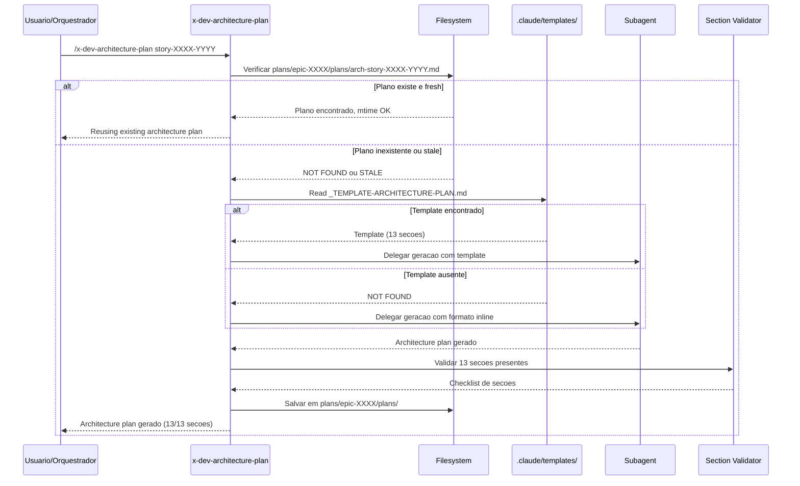

# Historia: Pre-Check e Template Reference no x-dev-architecture-plan

**ID:** story-0024-0008
**Chave Jira:** ---
**Status:** Pendente

## 1. Dependencias

| Blocked By | Blocks |
| :--- | :--- |
| story-0024-0005 | story-0024-0014 |

## 2. Regras Transversais Aplicaveis

| ID | Titulo |
| :--- | :--- |
| RULE-001 | Template obrigatorio para artefatos |
| RULE-002 | Idempotencia via staleness check |
| RULE-007 | Instrucao explicita de template |
| RULE-012 | Fallback graceful |

## 3. Descricao

Como **arquiteto**, eu quero que o x-dev-architecture-plan verifique se um architecture plan ja existe e use template padronizado, garantindo que decisoes arquiteturais sao persistidas com todas as 13 secoes obrigatorias.

Atualmente o x-dev-architecture-plan define as 13 secoes inline no SKILL.md, mas nao possui template externo. Existe uma verificacao parcial de existencia no x-dev-lifecycle (Phase 1A faz skip quando architecture plan existe), mas essa logica nao esta na skill em si -- depende do orquestrador. Quando a skill e invocada diretamente (fora do x-dev-lifecycle), sempre regenera do zero sem verificar existencia previa.

As mudancas afetam `java/src/main/resources/targets/claude/skills/core/x-dev-architecture-plan/SKILL.md`. O template `_TEMPLATE-ARCHITECTURE-PLAN.md` substitui as 13 secoes inline, centralizando a definicao do formato. A skill ganha autonomia de idempotencia: verifica existencia e staleness independente do orquestrador.

### 3.1 Pre-check de Idempotencia

- Verificar existencia de `plans/epic-XXXX/plans/arch-story-XXXX-YYYY.md`
- Comparar mtime: `mtime(story) <= mtime(arch-plan)` -> reutilizar
- Comparar mtime: `mtime(story) > mtime(arch-plan)` -> regenerar
- Logar acao: "Reusing existing architecture plan from {date}" ou "Regenerating stale architecture plan"

### 3.2 Template Reference

- Instrucao ao subagente: "Read template at `.claude/templates/_TEMPLATE-ARCHITECTURE-PLAN.md` for required output format"
- Template define 13 secoes obrigatorias (ver secao 5.3)
- Secoes condicionais: deployment diagram (quando container: true), data model (quando database != none), event schema (quando eventDriven: true)

### 3.3 Validacao de 13 Secoes Pos-geracao

- Apos geracao, verificar presenca de todas as 13 secoes obrigatorias
- Se secao condicional ausente E capability presente no projeto -> warning
- Se secao obrigatoria ausente -> warning com instrucao para completar
- Checklist de secoes logada ao final da geracao

### 3.4 Fallback para Formato Inline

- Se `.claude/templates/_TEMPLATE-ARCHITECTURE-PLAN.md` nao existir
- Logar warning: "Template not found, using inline format"
- Preservar comportamento atual (13 secoes inline no SKILL.md)
- Nenhuma interrupcao na execucao

## 3.5 Entrega de Valor

- **Valor Principal:** Architecture plans persistidos com todas as 13 secoes -- garante completude de decisoes arquiteturais (component diagrams, mini-ADRs, resilience strategy). Padrao de formato externo via template substitui definicao inline.
- **Metrica de Sucesso:** 100% dos architecture plans gerados contem todas as 13 secoes obrigatorias. Reuso de plano existente em < 5s vs. 5-10 min de regeneracao.
- **Impacto no Negocio:** Desbloqueia story-0024-0014 (auditoria de consistencia entre skills). Architecture plans completos reduzem retrabalho durante implementacao.

## 4. Definicoes de Qualidade Locais

### DoR Local

- [ ] `PlanTemplatesAssembler` funcional e `_TEMPLATE-ARCHITECTURE-PLAN.md` disponivel em `.claude/templates/` (story-0024-0005)
- [ ] SKILL.md atual do x-dev-architecture-plan analisado (13 secoes inline mapeadas)
- [ ] Padrao de mtime comparison de RULE-002 compreendido
- [ ] Secoes condicionais identificadas (deployment, data model, events)

### DoD Local

- [ ] Pre-check com mtime comparison implementado no SKILL.md
- [ ] Referencia ao template `_TEMPLATE-ARCHITECTURE-PLAN.md` incluida
- [ ] Validacao de 13 secoes pos-geracao implementada
- [ ] Secoes condicionais tratadas corretamente (deployment, data model, events)
- [ ] Fallback para formato inline funcional quando template ausente
- [ ] Pelo menos 1 teste automatizado validando o criterio de aceite principal
- [ ] Smoke test passando

### Global Definition of Done (DoD)

- **Cobertura:** >= 95% Line, >= 90% Branch
- **Testes Automatizados:** Golden tests validando SKILL.md gerado. Testes unitarios para logica de idempotencia e validacao de secoes.
- **Relatorio de Cobertura:** JaCoCo integrado ao `mvn verify`
- **Documentacao:** SKILL.md do x-dev-architecture-plan atualizado com pre-check e template reference
- **Persistencia:** Templates copiados verbatim sem renderizacao de placeholders
- **Performance:** Geracao nao deve aumentar tempo de build em mais de 5%

## 5. Contratos de Dados

### 5.1 Artefato de Architecture Plan

| Campo | Tipo | M/O | Descricao | Exemplo |
| :--- | :--- | :--- | :--- | :--- |
| `path` | `String` | M | Caminho do artefato salvo | `plans/epic-0024/plans/arch-story-0024-0008.md` |
| `story_id` | `String` | M | ID da story associada | `story-0024-0008` |
| `template` | `String` | O | Template utilizado (se disponivel) | `_TEMPLATE-ARCHITECTURE-PLAN.md` |
| `sections_found` | `int` | M | Numero de secoes detectadas | `13` |
| `sections_expected` | `int` | M | Numero de secoes esperadas | `13` |
| `conditional_skipped` | `List<String>` | O | Secoes condicionais nao aplicaveis | `["Data Model", "Event Schema"]` |

### 5.2 Staleness Check Input/Output

| Condicao | Input | Output | Log |
| :--- | :--- | :--- | :--- |
| Plano inexistente | `arch-story-XXXX-YYYY.md` not found | Gerar novo | `"Generating architecture plan for {story}"` |
| Plano stale | `mtime(story) > mtime(plan)` | Regenerar | `"Regenerating stale architecture plan for {story}"` |
| Plano fresh | `mtime(story) <= mtime(plan)` | Reutilizar | `"Reusing existing architecture plan from {date}"` |

### 5.3 Template Sections (13 obrigatorias + condicionais)

| # | Secao | Obrigatoria | Condicional |
| :--- | :--- | :--- | :--- |
| 1 | Executive Summary | Sim | -- |
| 2 | Component Diagram (Mermaid) | Sim | -- |
| 3 | Sequence Diagrams | Sim | -- |
| 4 | Package Structure | Sim | -- |
| 5 | Layer Dependency Matrix | Sim | -- |
| 6 | Method Signatures (Public API) | Sim | -- |
| 7 | Mini-ADRs | Sim | -- |
| 8 | Non-Functional Requirements | Sim | -- |
| 9 | Resilience Strategy | Sim | -- |
| 10 | Observability Strategy | Sim | -- |
| 11 | Deployment Diagram | Sim | container: true |
| 12 | Data Model | Sim | database != none |
| 13 | Event Schema | Sim | eventDriven: true |

## 6. Diagramas

### 6.1 Fluxo de Pre-check e Geracao do Architecture Plan



## 7. Criterios de Aceite (Gherkin)

```gherkin
Cenario: Nenhum architecture plan existente gera um novo do zero
  DADO que plans/epic-XXXX/plans/arch-story-XXXX-YYYY.md nao existe
  E .claude/templates/_TEMPLATE-ARCHITECTURE-PLAN.md esta disponivel
  QUANDO /x-dev-architecture-plan story-XXXX-YYYY e executado
  ENTAO um novo architecture plan e gerado seguindo o template
  E o artefato e salvo em plans/epic-XXXX/plans/arch-story-XXXX-YYYY.md
  E o log contem "Generating architecture plan for story-XXXX-YYYY"

Cenario: Architecture plan existente reutilizado quando story nao foi modificada
  DADO que plans/epic-XXXX/plans/arch-story-XXXX-YYYY.md existe
  E mtime(story-XXXX-YYYY.md) e anterior a mtime(arch-story-XXXX-YYYY.md)
  QUANDO /x-dev-architecture-plan story-XXXX-YYYY e executado
  ENTAO o architecture plan existente e reutilizado sem regeneracao
  E o log contem "Reusing existing architecture plan from {date}"
  E nenhum subagente e invocado

Cenario: Novo architecture plan contem todas as 13 secoes do template
  DADO que .claude/templates/_TEMPLATE-ARCHITECTURE-PLAN.md esta disponivel
  E define 13 secoes obrigatorias
  QUANDO um novo architecture plan e gerado para um projeto com container, database e events
  ENTAO o artefato resultante contem as 13 secoes incluindo deployment diagram, data model e event schema
  E um checklist de secoes e logado: "Architecture plan: 13/13 sections present"

Cenario: Template nao encontrado aciona fallback para formato inline
  DADO que .claude/templates/_TEMPLATE-ARCHITECTURE-PLAN.md NAO existe
  QUANDO /x-dev-architecture-plan story-XXXX-YYYY e executado
  ENTAO um warning e logado "Template not found, using inline format"
  E o architecture plan e gerado com as 13 secoes inline (comportamento atual)
  E a execucao continua normalmente sem interrupcao

Cenario: Secoes condicionais tratadas conforme capabilities do projeto
  DADO que o projeto possui container: false, database: none, eventDriven: false
  QUANDO um novo architecture plan e gerado
  ENTAO as secoes Deployment Diagram, Data Model e Event Schema sao marcadas como "N/A - capability not enabled"
  E as demais 10 secoes obrigatorias sao preenchidas normalmente
  E o checklist registra "10/10 applicable sections present, 3 conditional skipped"
```

### 7.1 Scenario Ordering (TPP)

> TPP: degenerate (plano inexistente -> gerar novo) -> happy path (plano reutilizado, 13 secoes completas) -> error (template ausente -> fallback) -> boundary (secoes condicionais conforme capabilities).

### 7.2 Mandatory Scenario Categories

- [x] Degenerate cases (nenhum architecture plan existente, gerar do zero)
- [x] Happy path (plan reutilizado, 13 secoes completas)
- [x] Error paths (template ausente, fallback inline)
- [x] Boundary values (secoes condicionais conforme capabilities do projeto)

### 7.3 TDD Implementation Notes

- **Double-Loop TDD**: O primeiro cenario (plano inexistente) e o acceptance test do outer loop. Define o walking skeleton com geracao basica referenciando template.
- Unit tests guiam logica de idempotencia: inexistente -> fresh -> stale.
- Secoes condicionais testadas com diferentes combinacoes de capabilities: (container, database, events) -> (true/false) x 3.

## 8. Sub-tarefas

- [ ] [Dev] Adicionar pre-check com mtime comparison no SKILL.md do x-dev-architecture-plan
- [ ] [Dev] Adicionar referencia a `_TEMPLATE-ARCHITECTURE-PLAN.md`
- [ ] [Dev] Implementar validacao de 13 secoes pos-geracao com checklist
- [ ] [Dev] Implementar tratamento de secoes condicionais (deployment, data model, events)
- [ ] [Dev] Implementar fallback para formato inline quando template ausente
- [ ] [Test] Unitario: Verificar logica de idempotencia (inexistente, fresh, stale)
- [ ] [Test] Unitario: Verificar validacao de 13 secoes (todas presentes vs. ausentes)
- [ ] [Test] Unitario: Verificar secoes condicionais para diferentes combinacoes de capabilities
- [ ] [Test] Smoke/E2E: Executar x-dev-architecture-plan duas vezes e verificar que segunda execucao reutiliza plano
- [ ] [Doc] Atualizar SKILL.md do x-dev-architecture-plan com documentacao de pre-check e template
