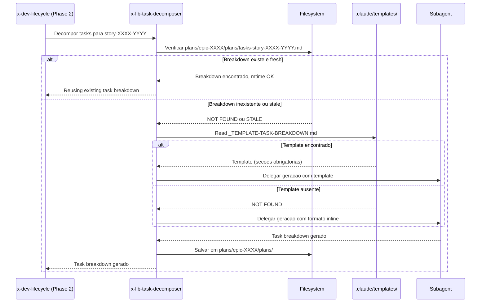

# Historia: Pre-Check e Template Reference no x-lib-task-decomposer

**ID:** story-0024-0009
**Chave Jira:** ---
**Status:** Pendente

## 1. Dependencias

| Blocked By | Blocks |
| :--- | :--- |
| story-0024-0005 | story-0024-0014 |

## 2. Regras Transversais Aplicaveis

| ID | Titulo |
| :--- | :--- |
| RULE-001 | Template obrigatorio para artefatos |
| RULE-002 | Idempotencia via staleness check |
| RULE-007 | Instrucao explicita de template |
| RULE-012 | Fallback graceful |

## 3. Descricao

Como **desenvolvedor**, eu quero que o task decomposer verifique se um task breakdown ja existe antes de regenerar e use template padronizado, garantindo que decomposicoes de task sao reutilizaveis entre sessoes.

Atualmente o x-lib-task-decomposer e uma lib interna chamada pelo x-dev-lifecycle (Phase 2). Toda vez que e invocado, gera um novo task breakdown do zero sem verificar se ja existe um artefato valido. Nao ha referencia a template externo -- o formato de output e definido inline no SKILL.md. Quando uma sessao e retomada apos interrupcao, o task breakdown anterior e perdido e tokens sao gastos na regeneracao.

As mudancas afetam `java/src/main/resources/targets/claude/skills/core/lib/x-lib-task-decomposer/SKILL.md`. O template `_TEMPLATE-TASK-BREAKDOWN.md` substitui o formato inline, centralizando a definicao do output. A skill ganha autonomia de idempotencia: verifica existencia e staleness do artefato em `plans/epic-XXXX/plans/tasks-story-XXXX-YYYY.md` independente do orquestrador.

### 3.1 Pre-check de Idempotencia

- Verificar existencia de `plans/epic-XXXX/plans/tasks-story-XXXX-YYYY.md`
- Comparar mtime: `mtime(story) <= mtime(tasks)` -> reutilizar
- Comparar mtime: `mtime(story) > mtime(tasks)` -> regenerar
- Logar acao: "Reusing existing task breakdown from {date}" ou "Regenerating stale task breakdown"

### 3.2 Template Reference

- Instrucao ao subagente: "Read template at `.claude/templates/_TEMPLATE-TASK-BREAKDOWN.md` for required output format"
- Template define secoes obrigatorias: Layer Decomposition, Sub-task Checklist, Dependency Order, Estimated Effort
- Secoes condicionais: Database Migration Tasks (quando database != none), Event Schema Tasks (quando eventDriven: true)

### 3.3 Fallback para Formato Inline

- Se `.claude/templates/_TEMPLATE-TASK-BREAKDOWN.md` nao existir
- Logar warning: "Template not found, using inline format"
- Preservar comportamento atual (formato inline no SKILL.md)
- Nenhuma interrupcao na execucao

## 3.5 Entrega de Valor

- **Valor Principal:** Task breakdowns persistidos -- reutilizaveis em retomadas de sessao sem regeneracao. Padrao de formato externo via template substitui definicao inline. Economia de tokens quando sessoes sao retomadas.
- **Metrica de Sucesso:** Segunda invocacao com story nao modificada reutiliza breakdown em < 5s vs. 2-5 min de regeneracao. 100% dos task breakdowns seguem formato padronizado do template.
- **Impacto no Negocio:** Desbloqueia story-0024-0014 (auditoria de consistencia entre skills). Task breakdowns persistidos reduzem custo de tokens em retomadas de sessao.

## 4. Definicoes de Qualidade Locais

### DoR Local

- [ ] `PlanTemplatesAssembler` funcional e `_TEMPLATE-TASK-BREAKDOWN.md` disponivel em `.claude/templates/` (story-0024-0005)
- [ ] SKILL.md atual do x-lib-task-decomposer analisado (formato inline mapeado)
- [ ] Padrao de mtime comparison de RULE-002 compreendido
- [ ] Caminho de persistencia `plans/epic-XXXX/plans/tasks-story-XXXX-YYYY.md` confirmado

### DoD Local

- [ ] Pre-check com mtime comparison implementado no SKILL.md
- [ ] Referencia ao template `_TEMPLATE-TASK-BREAKDOWN.md` incluida
- [ ] Fallback para formato inline funcional quando template ausente
- [ ] Log messages seguem padrao: "Reusing existing..." / "Regenerating stale..." / "Template not found..."
- [ ] Pelo menos 1 teste automatizado validando o criterio de aceite principal
- [ ] Smoke test passando

### Global Definition of Done (DoD)

- **Cobertura:** >= 95% Line, >= 90% Branch
- **Testes Automatizados:** Golden tests validando SKILL.md gerado. Testes unitarios para logica de idempotencia.
- **Relatorio de Cobertura:** JaCoCo integrado ao `mvn verify`
- **Documentacao:** SKILL.md do x-lib-task-decomposer atualizado com pre-check e template reference
- **Persistencia:** Templates copiados verbatim sem renderizacao de placeholders
- **Performance:** Geracao nao deve aumentar tempo de build em mais de 5%

## 5. Contratos de Dados

### 5.1 Artefato de Task Breakdown

| Campo | Tipo | M/O | Descricao | Exemplo |
| :--- | :--- | :--- | :--- | :--- |
| `path` | `String` | M | Caminho do artefato salvo | `plans/epic-0024/plans/tasks-story-0024-0009.md` |
| `story_id` | `String` | M | ID da story associada | `story-0024-0009` |
| `template` | `String` | O | Template utilizado (se disponivel) | `_TEMPLATE-TASK-BREAKDOWN.md` |
| `layers_count` | `int` | M | Numero de camadas decompostas | `5` |
| `subtasks_count` | `int` | M | Numero total de sub-tarefas | `12` |

### 5.2 Staleness Check Input/Output

| Condicao | Input | Output | Log |
| :--- | :--- | :--- | :--- |
| Breakdown inexistente | `tasks-story-XXXX-YYYY.md` not found | Gerar novo | `"Generating task breakdown for {story}"` |
| Breakdown stale | `mtime(story) > mtime(tasks)` | Regenerar | `"Regenerating stale task breakdown for {story}"` |
| Breakdown fresh | `mtime(story) <= mtime(tasks)` | Reutilizar | `"Reusing existing task breakdown from {date}"` |

### 5.3 Template Sections (obrigatorias + condicionais)

| # | Secao | Obrigatoria | Condicional |
| :--- | :--- | :--- | :--- |
| 1 | Header (Story ID, Date, Author) | Sim | -- |
| 2 | Layer Decomposition | Sim | -- |
| 3 | Sub-task Checklist | Sim | -- |
| 4 | Dependency Order | Sim | -- |
| 5 | Estimated Effort | Sim | -- |
| 6 | Database Migration Tasks | Sim | database != none |
| 7 | Event Schema Tasks | Sim | eventDriven: true |

## 6. Diagramas

### 6.1 Fluxo de Pre-check e Geracao do Task Breakdown



## 7. Criterios de Aceite (Gherkin)

```gherkin
Cenario: Nenhum task breakdown existente gera um novo do zero
  DADO que plans/epic-XXXX/plans/tasks-story-XXXX-YYYY.md nao existe
  E .claude/templates/_TEMPLATE-TASK-BREAKDOWN.md esta disponivel
  QUANDO x-lib-task-decomposer e invocado para story-XXXX-YYYY
  ENTAO um novo task breakdown e gerado seguindo o template
  E o artefato e salvo em plans/epic-XXXX/plans/tasks-story-XXXX-YYYY.md
  E o log contem "Generating task breakdown for story-XXXX-YYYY"

Cenario: Task breakdown existente reutilizado quando story nao foi modificada
  DADO que plans/epic-XXXX/plans/tasks-story-XXXX-YYYY.md existe
  E mtime(story-XXXX-YYYY.md) e anterior a mtime(tasks-story-XXXX-YYYY.md)
  QUANDO x-lib-task-decomposer e invocado para story-XXXX-YYYY
  ENTAO o task breakdown existente e reutilizado sem regeneracao
  E o log contem "Reusing existing task breakdown from {date}"
  E nenhum subagente e invocado

Cenario: Novo task breakdown segue formato do template
  DADO que .claude/templates/_TEMPLATE-TASK-BREAKDOWN.md esta disponivel
  E define secoes obrigatorias: Layer Decomposition, Sub-task Checklist, Dependency Order, Estimated Effort
  QUANDO um novo task breakdown e gerado
  ENTAO o artefato resultante contem todas as secoes obrigatorias do template
  E o header inclui Story ID, Data de geracao e Autor
  E as sub-tarefas estao organizadas por camada (domain, application, adapter)

Cenario: Template nao encontrado aciona fallback para formato inline
  DADO que .claude/templates/_TEMPLATE-TASK-BREAKDOWN.md NAO existe
  QUANDO x-lib-task-decomposer e invocado para story-XXXX-YYYY
  ENTAO um warning e logado "Template not found, using inline format"
  E o task breakdown e gerado com o formato inline (comportamento atual)
  E a execucao continua normalmente sem interrupcao
```

### 7.1 Scenario Ordering (TPP)

> TPP: degenerate (breakdown inexistente -> gerar novo) -> happy path (breakdown reutilizado, segue template) -> error (template ausente -> fallback inline).

### 7.2 Mandatory Scenario Categories

- [x] Degenerate cases (nenhum task breakdown existente, gerar do zero)
- [x] Happy path (breakdown reutilizado, formato segue template)
- [x] Error paths (template ausente, fallback inline)
- [x] Boundary values (secoes condicionais conforme capabilities do projeto -- coberto implicitamente pelo cenario de formato)

### 7.3 TDD Implementation Notes

- **Double-Loop TDD**: O primeiro cenario (breakdown inexistente) e o acceptance test do outer loop. Define o walking skeleton com geracao basica referenciando template.
- Unit tests guiam logica de idempotencia: inexistente -> fresh -> stale.
- TPP progression: nil (nenhum breakdown) -> constant (1 breakdown reutilizado) -> scalar (mtime comparison) -> conditional (fallback).

## 8. Sub-tarefas

- [ ] [Dev] Adicionar pre-check com mtime comparison no SKILL.md do x-lib-task-decomposer
- [ ] [Dev] Adicionar referencia a `_TEMPLATE-TASK-BREAKDOWN.md` na instrucao ao subagente
- [ ] [Dev] Implementar fallback para formato inline quando template ausente
- [ ] [Test] Unitario: Verificar logica de idempotencia (inexistente, fresh, stale)
- [ ] [Test] Unitario: Verificar que task breakdown segue secoes do template
- [ ] [Test] Smoke/E2E: Executar x-lib-task-decomposer duas vezes e verificar que segunda execucao reutiliza breakdown
- [ ] [Doc] Atualizar SKILL.md do x-lib-task-decomposer com documentacao de pre-check e template
