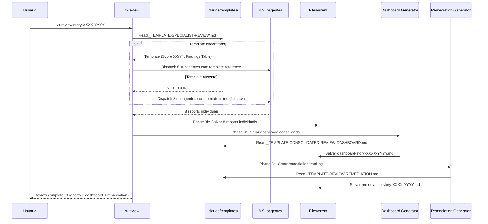

# Historia: Templates e Dashboard Consolidado no x-review

**ID:** story-0024-0010
**Chave Jira:** ---
**Status:** Pendente

## 1. Dependencias

| Blocked By | Blocks |
| :--- | :--- |
| story-0024-0005 | story-0024-0011, story-0024-0014 |

## 2. Regras Transversais Aplicaveis

| ID | Titulo |
| :--- | :--- |
| RULE-001 | Template obrigatorio para artefatos |
| RULE-005 | Score numerico parseable |
| RULE-006 | Dashboard cumulativo |
| RULE-007 | Instrucao explicita de template |
| RULE-012 | Fallback graceful |

## 3. Descricao

Como **Tech Lead**, eu quero que os reviews de especialistas sigam template padronizado e que um dashboard consolidado seja gerado apos reviews, garantindo visao agregada de qualidade e findings rastreaveis.

Atualmente o x-review lanca 8 subagentes especialistas em paralelo (Security, QA, Performance, Database, Observability, DevOps, API, Event). Cada subagente produz um report no formato definido inline no SKILL.md. Nao ha template externo padronizando o formato de cada report. Apos a consolidacao (Phase 3), um relatorio final e gerado mas nao existe dashboard agregado com scores de todos os especialistas, nem tracking de remediacao para findings com status FAILED ou PARTIAL.

As mudancas afetam `java/src/main/resources/targets/claude/skills/core/x-review/SKILL.md`. Na Phase 2 (subagent dispatch), cada prompt de subagente recebe instrucao para ler `_TEMPLATE-SPECIALIST-REVIEW.md`. Na Phase 3c (apos salvar reports individuais), um dashboard consolidado e gerado usando `_TEMPLATE-CONSOLIDATED-REVIEW-DASHBOARD.md`. Na Phase 3e (nova), um tracking de remediacao e gerado usando `_TEMPLATE-REVIEW-REMEDIATION.md`, pre-populado com todos os findings FAILED/PARTIAL.

### 3.1 Template Reference nos Subagentes (Phase 2)

- Cada um dos 8 subagentes especialistas recebe instrucao adicional no prompt:
  "Read template at `.claude/templates/_TEMPLATE-SPECIALIST-REVIEW.md` for required output format"
- Template define secoes obrigatorias: Score (XX/YY), Status, Findings Table, Recommendations
- Score DEVE ser no formato parseable `XX/YY` com status `Approved`/`Rejected`/`Partial` (RULE-005)

### 3.2 Dashboard Consolidado (Phase 3c)

- Apos salvar os 8 reports individuais, gerar `dashboard-story-XXXX-YYYY.md`
- Usar template `_TEMPLATE-CONSOLIDATED-REVIEW-DASHBOARD.md`
- Dashboard inclui: tabela de scores por especialista, score medio, status geral, historico de rounds
- Salvar em `plans/epic-XXXX/reviews/dashboard-story-XXXX-YYYY.md`

### 3.3 Tracking de Remediacao (Phase 3e -- nova)

- Gerar `remediation-story-XXXX-YYYY.md` usando `_TEMPLATE-REVIEW-REMEDIATION.md`
- Pre-popular com todos os findings com status FAILED ou PARTIAL dos 8 reports
- Cada finding inclui: especialista de origem, severidade, descricao, arquivo afetado
- Salvar em `plans/epic-XXXX/reviews/remediation-story-XXXX-YYYY.md`

### 3.4 Fallback para Formato Inline

- Se templates nao estiverem disponiveis, preservar comportamento atual (formato inline)
- Logar warning: "Template not found, using inline format"
- Dashboard e remediation nao sao gerados no fallback (funcionalidade nova)

## 3.5 Entrega de Valor

- **Valor Principal:** Visao agregada de qualidade com 8 especialistas num dashboard unico -- habilita decisao informada sobre merge readiness. Findings FAILED/PARTIAL rastreaveis em arquivo de remediacao.
- **Metrica de Sucesso:** Dashboard contem scores de todos os 8 especialistas com formato parseable XX/YY. Remediation tracking contem 100% dos findings FAILED/PARTIAL. Reports individuais seguem template padronizado.
- **Impacto no Negocio:** Desbloqueia story-0024-0011 (x-review-pr atualiza dashboard) e story-0024-0014 (auditoria de consistencia). Reduz tempo de analise de review de 8 arquivos individuais para 1 dashboard.

## 4. Definicoes de Qualidade Locais

### DoR Local

- [ ] `PlanTemplatesAssembler` funcional e templates disponiveis em `.claude/templates/` (story-0024-0005):
  - `_TEMPLATE-SPECIALIST-REVIEW.md`
  - `_TEMPLATE-CONSOLIDATED-REVIEW-DASHBOARD.md`
  - `_TEMPLATE-REVIEW-REMEDIATION.md`
- [ ] SKILL.md atual do x-review analisado (Phase 2 subagent prompts, Phase 3 consolidation)
- [ ] Formato de score parseable XX/YY compreendido (RULE-005)
- [ ] Padrao de dashboard cumulativo compreendido (RULE-006)

### DoD Local

- [ ] Phase 2: Cada subagente recebe instrucao de template reference
- [ ] Phase 3c: Dashboard consolidado gerado com scores de 8 especialistas
- [ ] Phase 3e: Remediation tracking gerado com findings FAILED/PARTIAL
- [ ] Scores no formato parseable XX/YY com status Approved/Rejected/Partial
- [ ] Fallback funcional quando templates ausentes
- [ ] Pelo menos 1 teste automatizado validando o criterio de aceite principal
- [ ] Smoke test passando

### Global Definition of Done (DoD)

- **Cobertura:** >= 95% Line, >= 90% Branch
- **Testes Automatizados:** Golden tests validando SKILL.md gerado. Testes unitarios para parsing de scores e geracao de dashboard.
- **Relatorio de Cobertura:** JaCoCo integrado ao `mvn verify`
- **Documentacao:** SKILL.md do x-review atualizado com Phases 3c e 3e
- **Persistencia:** Templates copiados verbatim sem renderizacao de placeholders
- **Performance:** Geracao nao deve aumentar tempo de build em mais de 5%

## 5. Contratos de Dados

### 5.1 Specialist Review Report (por subagente)

| Campo | Tipo | M/O | Descricao | Exemplo |
| :--- | :--- | :--- | :--- | :--- |
| `specialist` | `String` | M | Nome do especialista | `Security Engineer` |
| `score` | `String` | M | Score no formato XX/YY | `38/45` |
| `status` | `String` | M | Status do review | `Approved` / `Rejected` / `Partial` |
| `findings_count` | `int` | M | Numero total de findings | `7` |
| `failed_count` | `int` | M | Findings com status FAILED | `2` |
| `path` | `String` | M | Caminho do report salvo | `plans/epic-0024/reviews/security-story-0024-0010.md` |

### 5.2 Dashboard Consolidado

| Campo | Tipo | M/O | Descricao | Exemplo |
| :--- | :--- | :--- | :--- | :--- |
| `path` | `String` | M | Caminho do dashboard | `plans/epic-0024/reviews/dashboard-story-0024-0010.md` |
| `specialists` | `List<SpecialistScore>` | M | Scores de 8 especialistas | Ver 5.1 |
| `average_score` | `String` | M | Media dos scores | `85%` |
| `overall_status` | `String` | M | Status geral | `Partial` |
| `round` | `int` | M | Numero do round de review | `1` |
| `total_findings` | `int` | M | Total de findings de todos os especialistas | `42` |
| `total_failed` | `int` | M | Total de findings FAILED | `5` |

### 5.3 Remediation Tracking

| Campo | Tipo | M/O | Descricao | Exemplo |
| :--- | :--- | :--- | :--- | :--- |
| `path` | `String` | M | Caminho do remediation | `plans/epic-0024/reviews/remediation-story-0024-0010.md` |
| `findings` | `List<Finding>` | M | Findings FAILED/PARTIAL | Ver abaixo |
| `finding.specialist` | `String` | M | Especialista de origem | `Security Engineer` |
| `finding.severity` | `String` | M | Severidade | `HIGH` / `MEDIUM` / `LOW` |
| `finding.description` | `String` | M | Descricao do finding | `SQL injection in UserRepository` |
| `finding.file` | `String` | O | Arquivo afetado | `src/main/java/UserRepository.java` |
| `finding.status` | `String` | M | Status de remediacao | `OPEN` / `IN_PROGRESS` / `FIXED` |

## 6. Diagramas

### 6.1 Fluxo de Review com Templates e Dashboard



## 7. Criterios de Aceite (Gherkin)

```gherkin
Cenario: Templates nao disponiveis aciona fallback para formato inline
  DADO que .claude/templates/_TEMPLATE-SPECIALIST-REVIEW.md NAO existe
  QUANDO /x-review story-XXXX-YYYY e executado
  ENTAO um warning e logado "Template not found, using inline format"
  E os 8 reports de especialistas sao gerados com formato inline (comportamento atual)
  E dashboard e remediation NAO sao gerados (funcionalidade nova requer templates)

Cenario: 8 reports de especialistas seguem template padronizado
  DADO que .claude/templates/_TEMPLATE-SPECIALIST-REVIEW.md esta disponivel
  E 8 subagentes especialistas sao lancados em paralelo
  QUANDO todos os 8 subagentes completam seus reviews
  ENTAO cada report contem score no formato XX/YY
  E cada report contem status Approved, Rejected ou Partial
  E cada report contem tabela de findings com severidade e descricao
  E os 8 reports sao salvos em plans/epic-XXXX/reviews/

Cenario: Dashboard consolidado gerado com scores de todos os especialistas
  DADO que os 8 reports individuais foram salvos com sucesso
  E .claude/templates/_TEMPLATE-CONSOLIDATED-REVIEW-DASHBOARD.md esta disponivel
  QUANDO Phase 3c e executada
  ENTAO dashboard-story-XXXX-YYYY.md e gerado em plans/epic-XXXX/reviews/
  E o dashboard contem tabela com scores dos 8 especialistas
  E o dashboard contem score medio calculado
  E o dashboard contem status geral (Approved/Rejected/Partial)
  E o dashboard contem numero do round de review

Cenario: Remediation tracking pre-populado com findings FAILED e PARTIAL
  DADO que os 8 reports individuais contem findings com status FAILED e PARTIAL
  E .claude/templates/_TEMPLATE-REVIEW-REMEDIATION.md esta disponivel
  QUANDO Phase 3e e executada
  ENTAO remediation-story-XXXX-YYYY.md e gerado em plans/epic-XXXX/reviews/
  E cada finding FAILED/PARTIAL dos 8 reports aparece no remediation
  E cada finding inclui especialista de origem, severidade e descricao
  E todos os findings iniciam com status OPEN

Cenario: Template de dashboard ausente nao interrompe execucao
  DADO que .claude/templates/_TEMPLATE-CONSOLIDATED-REVIEW-DASHBOARD.md NAO existe
  E os 8 reports individuais foram gerados com sucesso
  QUANDO Phase 3c e executada
  ENTAO um warning e logado "Dashboard template not found, skipping dashboard generation"
  E os 8 reports individuais permanecem intactos
  E a execucao continua para as proximas fases

Cenario: Contagem de findings no remediation corresponde aos reports
  DADO que os 8 reports contem um total de 5 findings FAILED e 3 findings PARTIAL
  QUANDO remediation-story-XXXX-YYYY.md e gerado
  ENTAO o remediation contem exatamente 8 findings (5 FAILED + 3 PARTIAL)
  E findings com status APPROVED nao aparecem no remediation
  E o total de findings no header do remediation e "8 findings pending remediation"
```

### 7.1 Scenario Ordering (TPP)

> TPP: degenerate (templates ausentes -> fallback inline) -> happy path (8 reports seguem template, dashboard gerado, remediation pre-populado) -> error (template de dashboard ausente -> skip) -> boundary (contagem de findings corresponde aos reports).

### 7.2 Mandatory Scenario Categories

- [x] Degenerate cases (templates nao disponiveis, fallback inline)
- [x] Happy path (8 reports padronizados, dashboard consolidado, remediation tracking)
- [x] Error paths (template de dashboard ausente, skip graceful)
- [x] Boundary values (contagem de findings no remediation corresponde aos reports)

### 7.3 TDD Implementation Notes

- **Double-Loop TDD**: O primeiro cenario (fallback) e o acceptance test do outer loop. Garante que o comportamento existente nao quebra sem templates.
- Unit tests guiam parsing de scores: formato XX/YY, calculo de media, determinacao de status geral.
- Dashboard e remediation testados com fixtures de 8 reports sinteticos contendo scores e findings variados.
- TPP progression: nil (sem templates -> fallback) -> constant (1 report padronizado) -> collection (8 reports) -> composite (dashboard agrega 8) -> conditional (remediation filtra FAILED/PARTIAL).

## 8. Sub-tarefas

- [ ] [Dev] Adicionar template reference `_TEMPLATE-SPECIALIST-REVIEW.md` nos prompts dos 8 subagentes (Phase 2)
- [ ] [Dev] Implementar geracao de dashboard consolidado na Phase 3c
- [ ] [Dev] Implementar geracao de remediation tracking na Phase 3e (nova)
- [ ] [Dev] Implementar fallback para formato inline quando templates ausentes
- [ ] [Test] Unitario: Verificar parsing de score no formato XX/YY
- [ ] [Test] Unitario: Verificar calculo de score medio no dashboard
- [ ] [Test] Unitario: Verificar filtragem de findings FAILED/PARTIAL para remediation
- [ ] [Test] Smoke/E2E: Executar ciclo completo de review e verificar dashboard + remediation gerados
- [ ] [Doc] Atualizar SKILL.md do x-review com documentacao de Phases 3c e 3e
