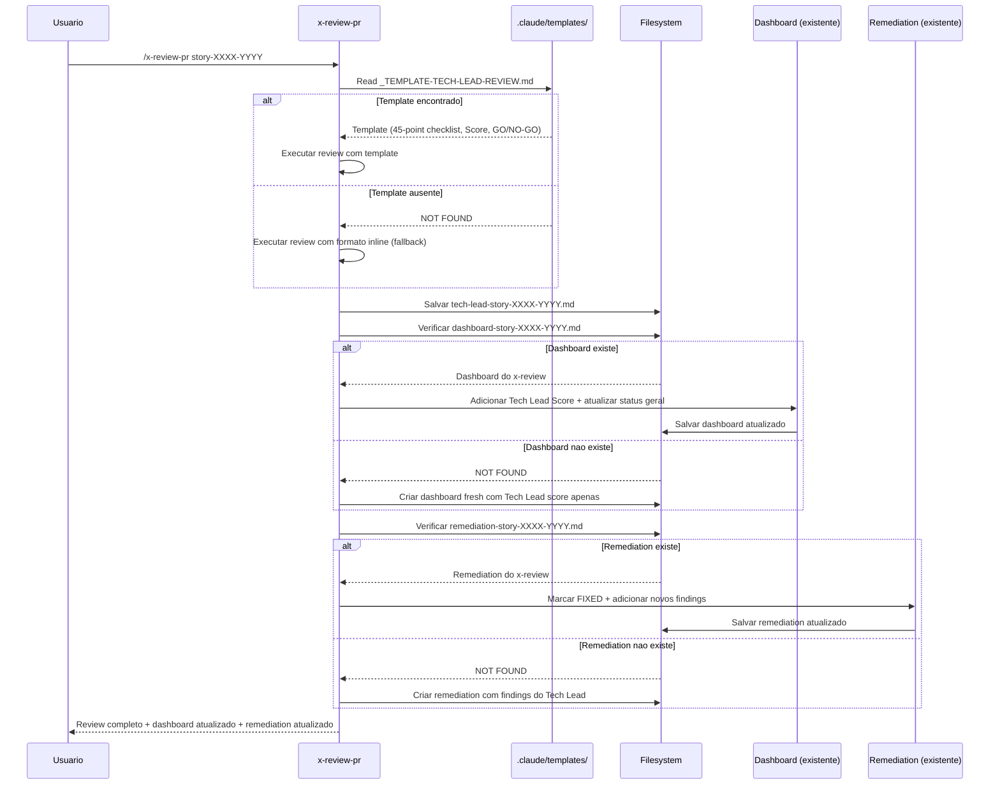

# Historia: Template e Dashboard Update no x-review-pr

**ID:** story-0024-0011
**Chave Jira:** ---
**Status:** Pendente

## 1. Dependencias

| Blocked By | Blocks |
| :--- | :--- |
| story-0024-0005, story-0024-0010 | story-0024-0014 |

## 2. Regras Transversais Aplicaveis

| ID | Titulo |
| :--- | :--- |
| RULE-001 | Template obrigatorio para artefatos |
| RULE-005 | Score numerico parseable |
| RULE-006 | Dashboard cumulativo |
| RULE-007 | Instrucao explicita de template |
| RULE-012 | Fallback graceful |

## 3. Descricao

Como **Tech Lead**, eu quero que o review do Tech Lead siga template padronizado e atualize o dashboard consolidado criado pelo x-review, garantindo visao completa de qualidade (especialistas + Tech Lead) em um unico arquivo.

O x-review-pr e executado apos o x-review no ciclo do x-dev-lifecycle. Atualmente produz um report com checklist de 45 pontos e decisao GO/NO-GO, mas o formato e definido inline no SKILL.md. Nao ha integracao com o dashboard consolidado gerado pelo x-review (story-0024-0010) -- o Tech Lead produz um arquivo separado sem atualizar a visao agregada. Alem disso, findings corrigidos entre o review dos especialistas e o review do Tech Lead nao sao atualizados no remediation tracking.

As mudancas afetam `java/src/main/resources/targets/claude/skills/core/x-review-pr/SKILL.md`. O report do Tech Lead passa a seguir `_TEMPLATE-TECH-LEAD-REVIEW.md`. Apos salvar o report, o skill atualiza `dashboard-story-XXXX-YYYY.md` adicionando o Tech Lead Score e atualizando o status geral. O `remediation-story-XXXX-YYYY.md` e atualizado marcando findings corrigidos como FIXED.

### 3.1 Template Reference para Report do Tech Lead

- Instrucao: "Read template at `.claude/templates/_TEMPLATE-TECH-LEAD-REVIEW.md` for required output format"
- Template define secoes obrigatorias: 45-Point Checklist, Score (XX/YY), GO/NO-GO Decision, Findings Table
- Score DEVE ser no formato parseable `XX/YY` com status `GO`/`NO-GO` (RULE-005)

### 3.2 Dashboard Update (apos salvar report)

- Ler `dashboard-story-XXXX-YYYY.md` existente (criado pelo x-review na story-0024-0010)
- Adicionar linha na tabela de scores: "Tech Lead" com score XX/YY e status GO/NO-GO
- Atualizar status geral do dashboard considerando Tech Lead score
- Incrementar round na tabela de Review History
- Se dashboard nao existir (x-review nao foi executado), criar dashboard fresh com apenas Tech Lead score

### 3.3 Remediation Update (apos salvar report)

- Ler `remediation-story-XXXX-YYYY.md` existente (criado pelo x-review na story-0024-0010)
- Para findings marcados como corrigidos no report do Tech Lead, atualizar status para FIXED
- Adicionar novos findings identificados pelo Tech Lead com status OPEN
- Se remediation nao existir, criar novo com findings do Tech Lead apenas

### 3.4 Fallback para Formato Inline

- Se `_TEMPLATE-TECH-LEAD-REVIEW.md` nao existir, preservar comportamento atual (formato inline)
- Logar warning: "Template not found, using inline format"
- Dashboard e remediation updates nao sao executados no fallback (dependem de artefatos criados com templates)

## 3.5 Entrega de Valor

- **Valor Principal:** Review do Tech Lead atualiza dashboard consolidado -- visao completa de qualidade (especialistas + Tech Lead) em um unico arquivo. Findings corrigidos rastreaveis no remediation tracking.
- **Metrica de Sucesso:** Dashboard contem scores de 8 especialistas + Tech Lead com formato parseable. Remediation tracking atualizado com findings FIXED apos review do Tech Lead. Report segue template padronizado.
- **Impacto no Negocio:** Desbloqueia story-0024-0014 (auditoria de consistencia). Visao completa de qualidade em 1 arquivo reduz tempo de decisao sobre merge readiness.

## 4. Definicoes de Qualidade Locais

### DoR Local

- [ ] `PlanTemplatesAssembler` funcional e `_TEMPLATE-TECH-LEAD-REVIEW.md` disponivel em `.claude/templates/` (story-0024-0005)
- [ ] story-0024-0010 concluida (x-review gera dashboard e remediation)
- [ ] SKILL.md atual do x-review-pr analisado (45-point checklist, GO/NO-GO)
- [ ] Formato de dashboard e remediation do x-review compreendido
- [ ] Padrao de dashboard cumulativo compreendido (RULE-006)

### DoD Local

- [ ] Report do Tech Lead segue template `_TEMPLATE-TECH-LEAD-REVIEW.md`
- [ ] Dashboard atualizado com Tech Lead Score apos salvar report
- [ ] Remediation atualizado com findings FIXED e novos findings do Tech Lead
- [ ] Criacao de dashboard/remediation fresh quando artefatos do x-review nao existem
- [ ] Fallback funcional quando templates ausentes
- [ ] Pelo menos 1 teste automatizado validando o criterio de aceite principal
- [ ] Smoke test passando

### Global Definition of Done (DoD)

- **Cobertura:** >= 95% Line, >= 90% Branch
- **Testes Automatizados:** Golden tests validando SKILL.md gerado. Testes unitarios para dashboard update e remediation update.
- **Relatorio de Cobertura:** JaCoCo integrado ao `mvn verify`
- **Documentacao:** SKILL.md do x-review-pr atualizado com dashboard e remediation update
- **Persistencia:** Templates copiados verbatim sem renderizacao de placeholders
- **Performance:** Geracao nao deve aumentar tempo de build em mais de 5%

## 5. Contratos de Dados

### 5.1 Tech Lead Review Report

| Campo | Tipo | M/O | Descricao | Exemplo |
| :--- | :--- | :--- | :--- | :--- |
| `path` | `String` | M | Caminho do report salvo | `plans/epic-0024/reviews/tech-lead-story-0024-0011.md` |
| `score` | `String` | M | Score no formato XX/YY | `42/45` |
| `decision` | `String` | M | Decisao GO/NO-GO | `GO` |
| `checklist_passed` | `int` | M | Itens aprovados no checklist | `42` |
| `checklist_total` | `int` | M | Total de itens no checklist | `45` |
| `findings_count` | `int` | M | Numero de findings | `3` |
| `new_findings` | `int` | M | Findings novos (nao nos reports dos especialistas) | `1` |

### 5.2 Dashboard Update (campos adicionados)

| Campo | Tipo | M/O | Descricao | Exemplo |
| :--- | :--- | :--- | :--- | :--- |
| `tech_lead_score` | `String` | M | Score do Tech Lead | `42/45` |
| `tech_lead_decision` | `String` | M | Decisao GO/NO-GO | `GO` |
| `overall_status` | `String` | M | Status geral atualizado | `GO` / `NO-GO` / `Partial` |
| `round` | `int` | M | Numero do round atualizado | `2` |
| `review_history` | `List<RoundEntry>` | M | Historico de rounds | `[{round: 1, date, status}]` |

### 5.3 Remediation Update (campos modificados)

| Operacao | Condicao | Resultado |
| :--- | :--- | :--- |
| Marcar FIXED | Finding presente no remediation e confirmado corrigido pelo Tech Lead | `status: OPEN -> FIXED` |
| Adicionar novo | Finding identificado pelo Tech Lead nao presente no remediation | Novo entry com `status: OPEN` |
| Manter OPEN | Finding presente no remediation e nao mencionado pelo Tech Lead | `status: OPEN` (sem mudanca) |

## 6. Diagramas

### 6.1 Fluxo de Review-PR com Dashboard e Remediation Update



## 7. Criterios de Aceite (Gherkin)

```gherkin
Cenario: Dashboard nao existe e review-pr cria dashboard fresh
  DADO que plans/epic-XXXX/reviews/dashboard-story-XXXX-YYYY.md NAO existe
  E .claude/templates/_TEMPLATE-TECH-LEAD-REVIEW.md esta disponivel
  QUANDO /x-review-pr story-XXXX-YYYY e executado
  ENTAO o report do Tech Lead e gerado seguindo o template
  E um dashboard fresh e criado contendo apenas o Tech Lead Score
  E o dashboard contem status geral baseado apenas na decisao do Tech Lead
  E o log contem "Dashboard not found, creating fresh dashboard"

Cenario: Report do Tech Lead segue template padronizado
  DADO que .claude/templates/_TEMPLATE-TECH-LEAD-REVIEW.md esta disponivel
  QUANDO /x-review-pr story-XXXX-YYYY e executado
  ENTAO o report contem score no formato XX/YY (ex: 42/45)
  E o report contem decisao GO ou NO-GO
  E o report contem checklist de 45 pontos com resultado individual
  E o report contem tabela de findings com severidade e descricao
  E o report e salvo em plans/epic-XXXX/reviews/tech-lead-story-XXXX-YYYY.md

Cenario: Dashboard existente atualizado com Tech Lead Score
  DADO que plans/epic-XXXX/reviews/dashboard-story-XXXX-YYYY.md existe
  E contem scores de 8 especialistas do x-review (round 1)
  E .claude/templates/_TEMPLATE-TECH-LEAD-REVIEW.md esta disponivel
  QUANDO /x-review-pr story-XXXX-YYYY e executado
  ENTAO o dashboard e atualizado com Tech Lead Score na tabela de scores
  E o status geral e recalculado considerando 8 especialistas + Tech Lead
  E a tabela de Review History adiciona um novo round
  E o dashboard preserva os scores dos especialistas do round anterior

Cenario: Template nao encontrado aciona fallback para formato inline
  DADO que .claude/templates/_TEMPLATE-TECH-LEAD-REVIEW.md NAO existe
  QUANDO /x-review-pr story-XXXX-YYYY e executado
  ENTAO um warning e logado "Template not found, using inline format"
  E o report e gerado com formato inline (comportamento atual de 45-point checklist)
  E dashboard e remediation NAO sao atualizados
  E a execucao continua normalmente sem interrupcao

Cenario: Review History acumula multiplos rounds no dashboard
  DADO que dashboard-story-XXXX-YYYY.md existe com round 1 (x-review) e round 2 (x-review-pr)
  E um segundo ciclo de review e executado (novo x-review + x-review-pr)
  QUANDO /x-review-pr e executado no segundo ciclo
  ENTAO a tabela de Review History contem rounds 1, 2, 3 e 4
  E cada round preserva data, autor (Specialist/Tech Lead) e status
  E o status geral reflete o round mais recente
```

### 7.1 Scenario Ordering (TPP)

> TPP: degenerate (dashboard nao existe -> criar fresh) -> happy path (report segue template, dashboard atualizado com Tech Lead) -> error (template ausente -> fallback inline) -> boundary (Review History acumula multiplos rounds).

### 7.2 Mandatory Scenario Categories

- [x] Degenerate cases (dashboard nao existe, criar fresh com apenas Tech Lead)
- [x] Happy path (report padronizado, dashboard atualizado com scores de especialistas + Tech Lead)
- [x] Error paths (template ausente, fallback inline)
- [x] Boundary values (Review History acumula multiplos rounds de review)

### 7.3 TDD Implementation Notes

- **Double-Loop TDD**: O primeiro cenario (dashboard nao existe) e o acceptance test do outer loop. Define o walking skeleton: review-pr cria dashboard quando ausente.
- Unit tests guiam logica de update: dashboard vazio -> dashboard com 8 especialistas -> dashboard com Tech Lead -> dashboard com multiplos rounds.
- Remediation update testado com fixtures: findings OPEN -> FIXED, novos findings adicionados.
- TPP progression: nil (dashboard inexistente -> criar) -> constant (1 score do Tech Lead) -> composite (9 scores: 8 especialistas + Tech Lead) -> collection (multiplos rounds).

## 8. Sub-tarefas

- [ ] [Dev] Adicionar template reference `_TEMPLATE-TECH-LEAD-REVIEW.md` no SKILL.md do x-review-pr
- [ ] [Dev] Implementar dashboard update: adicionar Tech Lead Score e atualizar status geral
- [ ] [Dev] Implementar criacao de dashboard fresh quando artefato do x-review nao existe
- [ ] [Dev] Implementar remediation update: marcar FIXED e adicionar novos findings
- [ ] [Dev] Implementar fallback para formato inline quando template ausente
- [ ] [Test] Unitario: Verificar dashboard acumulacao (especialistas + Tech Lead + multiplos rounds)
- [ ] [Test] Unitario: Verificar remediation update (OPEN -> FIXED, novos findings)
- [ ] [Test] Unitario: Verificar criacao de dashboard fresh sem artefatos do x-review
- [ ] [Test] Smoke/E2E: Executar ciclo completo x-review seguido de x-review-pr e verificar dashboard atualizado
- [ ] [Doc] Atualizar SKILL.md do x-review-pr com documentacao de dashboard e remediation update
