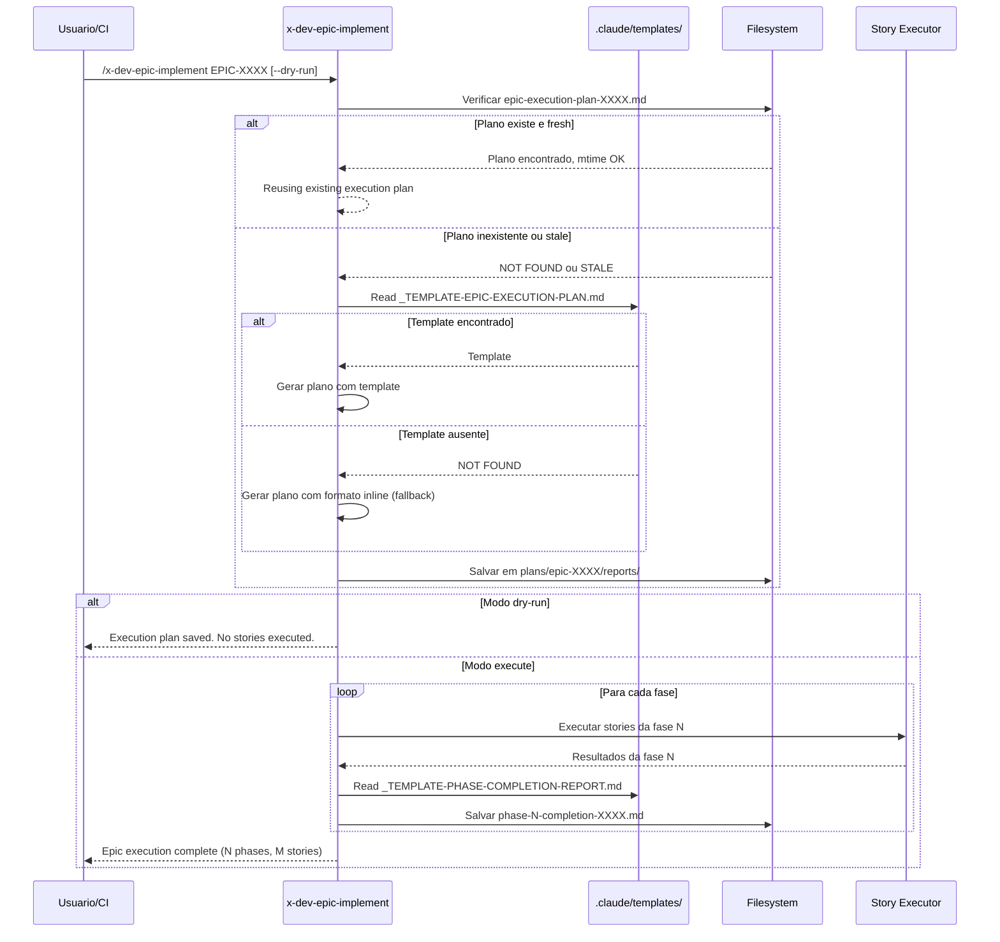

# Historia: Epic Execution Plan e Phase Reports no x-dev-epic-implement

**ID:** story-0024-0012
**Chave Jira:** ---
**Status:** Pendente

## 1. Dependencias

| Blocked By | Blocks |
| :--- | :--- |
| story-0024-0005 | story-0024-0014 |

## 2. Regras Transversais Aplicaveis

| ID | Titulo |
| :--- | :--- |
| RULE-001 | Template obrigatorio para artefatos |
| RULE-002 | Idempotencia via staleness check |
| RULE-011 | Header padronizado |
| RULE-012 | Fallback graceful |

## 3. Descricao

Como **Product Owner**, eu quero que o x-dev-epic-implement salve um plano de execucao legivel antes de iniciar e produza relatorios intermediarios ao final de cada fase, garantindo auditoria de progresso e dry-run persistido.

Atualmente o x-dev-epic-implement salva `execution-state.json` para tracking de estado interno, mas nao produz artefatos legiveis por humanos. Nao existe plano de execucao que possa ser revisado antes do inicio da execucao. Nao ha relatorios intermediarios nas fronteiras de fase -- o unico output e o estado final. Em modo dry-run, nenhum artefato e persistido, tornando impossivel revisar o plano sem executar. Isso dificulta auditoria de progresso, revisao pre-execucao, e decisao informada sobre continuacao.

As mudancas afetam `java/src/main/resources/targets/claude/skills/core/x-dev-epic-implement/SKILL.md`. Na Phase 0 (pre-execucao), um plano de execucao legivel e salvo usando `_TEMPLATE-EPIC-EXECUTION-PLAN.md`. Um diretorio `reports/` e criado ao lado de `plans/` e `reviews/`. Nos integrity gates (fronteiras de fase), um relatorio de conclusao e salvo usando `_TEMPLATE-PHASE-COMPLETION-REPORT.md`. Em modo dry-run, o plano de execucao e salvo como output principal. Pre-check verifica se plano ja existe e implementation map nao foi modificado.

### 3.1 Plano de Execucao (Phase 0)

- Antes de iniciar qualquer execucao, salvar `epic-execution-plan-XXXX.md`
- Usar template `_TEMPLATE-EPIC-EXECUTION-PLAN.md`
- Conteudo: lista de stories ordenadas por fase, dependencias, estimativas, flags de execucao
- Header padronizado com Epic ID, Data, Autor, Template Version (RULE-011)
- Salvar em `plans/epic-XXXX/reports/epic-execution-plan-XXXX.md`

### 3.2 Diretorio reports/

- Criar diretorio `plans/epic-XXXX/reports/` se nao existir
- Estrutura final: `plans/epic-XXXX/{plans/, reviews/, reports/}`
- Diretorio `reports/` contem: execution plan e phase completion reports

### 3.3 Phase Completion Reports (Integrity Gates)

- Ao final de cada fase (phase boundary), salvar `phase-N-completion-XXXX.md`
- Usar template `_TEMPLATE-PHASE-COMPLETION-REPORT.md`
- Conteudo: stories executadas, status individual, tempo de execucao, findings, bloqueios
- Header padronizado com Epic ID, Phase Number, Data, Template Version (RULE-011)
- Salvar em `plans/epic-XXXX/reports/phase-N-completion-XXXX.md`

### 3.4 Dry-Run Persistence

- Em modo dry-run (`--dry-run`), salvar o plano de execucao como output principal
- NAO executar stories em dry-run
- Plano de execucao em dry-run permite revisao humana antes da execucao real
- Logar: "Dry-run: execution plan saved to {path}. No stories executed."

### 3.5 Pre-check para Plano Existente

- Verificar existencia de `plans/epic-XXXX/reports/epic-execution-plan-XXXX.md`
- Comparar mtime: `mtime(IMPLEMENTATION-MAP.md) <= mtime(execution-plan)` -> reutilizar
- Comparar mtime: `mtime(IMPLEMENTATION-MAP.md) > mtime(execution-plan)` -> regenerar
- Logar acao: "Reusing existing execution plan from {date}" ou "Regenerating execution plan (implementation map modified)"

## 3.5 Entrega de Valor

- **Valor Principal:** Plano de execucao salvo antes do inicio e relatorios por fase -- permite auditoria de progresso e dry-run persistido para revisao antes de execucao real. Artefatos legiveis por humanos complementam o execution-state.json tecnico.
- **Metrica de Sucesso:** 100% das execucoes de epic produzem execution plan antes de iniciar. Cada fronteira de fase gera phase completion report. Dry-run produz plano sem executar stories.
- **Impacto no Negocio:** Desbloqueia story-0024-0014 (auditoria de consistencia entre skills). Product Owners podem revisar plano de execucao antes de autorizar execucao real. Relatorios de fase permitem decisao informada sobre continuacao ou interrupcao.

## 4. Definicoes de Qualidade Locais

### DoR Local

- [ ] `PlanTemplatesAssembler` funcional e templates disponiveis em `.claude/templates/` (story-0024-0005):
  - `_TEMPLATE-EPIC-EXECUTION-PLAN.md`
  - `_TEMPLATE-PHASE-COMPLETION-REPORT.md`
- [ ] SKILL.md atual do x-dev-epic-implement analisado (Phases, integrity gates, dry-run mode)
- [ ] Schema do `execution-state.json` existente compreendido (nao sera modificado)
- [ ] Padrao de mtime comparison de RULE-002 compreendido
- [ ] Padrao de header de RULE-011 compreendido

### DoD Local

- [ ] Plano de execucao salvo na Phase 0 antes de iniciar execucao
- [ ] Diretorio `reports/` criado automaticamente
- [ ] Phase completion reports salvos nos integrity gates
- [ ] Dry-run salva execution plan sem executar stories
- [ ] Pre-check reutiliza plano quando implementation map nao foi modificado
- [ ] Headers padronizados com Epic ID, Data, Autor, Template Version
- [ ] Fallback funcional quando templates ausentes
- [ ] Pelo menos 1 teste automatizado validando o criterio de aceite principal
- [ ] Smoke test passando

### Global Definition of Done (DoD)

- **Cobertura:** >= 95% Line, >= 90% Branch
- **Testes Automatizados:** Golden tests validando SKILL.md gerado. Testes unitarios para logica de pre-check e geracao de reports.
- **Relatorio de Cobertura:** JaCoCo integrado ao `mvn verify`
- **Documentacao:** SKILL.md do x-dev-epic-implement atualizado com Phase 0, reports/ e phase reports
- **Persistencia:** Templates copiados verbatim sem renderizacao de placeholders
- **Performance:** Geracao nao deve aumentar tempo de build em mais de 5%

## 5. Contratos de Dados

### 5.1 Epic Execution Plan

| Campo | Tipo | M/O | Descricao | Exemplo |
| :--- | :--- | :--- | :--- | :--- |
| `path` | `String` | M | Caminho do artefato salvo | `plans/epic-0024/reports/epic-execution-plan-0024.md` |
| `epic_id` | `String` | M | ID do epic | `EPIC-0024` |
| `template` | `String` | O | Template utilizado | `_TEMPLATE-EPIC-EXECUTION-PLAN.md` |
| `total_stories` | `int` | M | Numero total de stories | `16` |
| `total_phases` | `int` | M | Numero de fases de execucao | `5` |
| `mode` | `String` | M | Modo de execucao | `execute` / `dry-run` |
| `stories` | `List<StoryEntry>` | M | Stories ordenadas por fase | Ver 5.2 |

### 5.2 Story Entry (dentro do Execution Plan)

| Campo | Tipo | M/O | Descricao | Exemplo |
| :--- | :--- | :--- | :--- | :--- |
| `story_id` | `String` | M | ID da story | `story-0024-0009` |
| `phase` | `int` | M | Fase de execucao | `3` |
| `dependencies` | `List<String>` | M | Stories das quais depende | `["story-0024-0005"]` |
| `estimated_effort` | `String` | O | Esforco estimado | `M` (S/M/L/XL) |
| `status` | `String` | M | Status planejado | `Pendente` |

### 5.3 Phase Completion Report

| Campo | Tipo | M/O | Descricao | Exemplo |
| :--- | :--- | :--- | :--- | :--- |
| `path` | `String` | M | Caminho do report | `plans/epic-0024/reports/phase-3-completion-0024.md` |
| `epic_id` | `String` | M | ID do epic | `EPIC-0024` |
| `phase` | `int` | M | Numero da fase concluida | `3` |
| `template` | `String` | O | Template utilizado | `_TEMPLATE-PHASE-COMPLETION-REPORT.md` |
| `stories_executed` | `List<StoryResult>` | M | Resultados por story | Ver 5.4 |
| `duration` | `String` | M | Tempo total da fase | `12m 34s` |
| `blocked_stories` | `List<String>` | O | Stories bloqueadas nesta fase | `["story-0024-0013"]` |

### 5.4 Story Result (dentro do Phase Completion Report)

| Campo | Tipo | M/O | Descricao | Exemplo |
| :--- | :--- | :--- | :--- | :--- |
| `story_id` | `String` | M | ID da story executada | `story-0024-0009` |
| `status` | `String` | M | Resultado da execucao | `SUCCESS` / `FAILED` / `BLOCKED` / `SKIPPED` |
| `duration` | `String` | O | Tempo de execucao | `3m 45s` |
| `findings` | `List<String>` | O | Problemas encontrados | `["Compilation error in X"]` |

### 5.5 Staleness Check para Execution Plan

| Condicao | Input | Output | Log |
| :--- | :--- | :--- | :--- |
| Plano inexistente | `epic-execution-plan-XXXX.md` not found | Gerar novo | `"Generating execution plan for EPIC-XXXX"` |
| Plano stale | `mtime(IMPLEMENTATION-MAP.md) > mtime(plan)` | Regenerar | `"Regenerating execution plan (implementation map modified)"` |
| Plano fresh | `mtime(IMPLEMENTATION-MAP.md) <= mtime(plan)` | Reutilizar | `"Reusing existing execution plan from {date}"` |

## 6. Diagramas

### 6.1 Fluxo de Execucao com Execution Plan e Phase Reports



## 7. Criterios de Aceite (Gherkin)

```gherkin
Cenario: Nenhum execution plan existente gera um novo antes da execucao
  DADO que plans/epic-XXXX/reports/epic-execution-plan-XXXX.md nao existe
  E .claude/templates/_TEMPLATE-EPIC-EXECUTION-PLAN.md esta disponivel
  QUANDO /x-dev-epic-implement EPIC-XXXX e executado
  ENTAO um execution plan e gerado ANTES de qualquer story ser executada
  E o plano e salvo em plans/epic-XXXX/reports/epic-execution-plan-XXXX.md
  E o plano contem lista de stories ordenadas por fase com dependencias
  E o log contem "Generating execution plan for EPIC-XXXX"

Cenario: Execution plan salvo no modo dry-run sem executar stories
  DADO que .claude/templates/_TEMPLATE-EPIC-EXECUTION-PLAN.md esta disponivel
  E o epic EPIC-XXXX contem 16 stories em 5 fases
  QUANDO /x-dev-epic-implement EPIC-XXXX --dry-run e executado
  ENTAO o execution plan e salvo em plans/epic-XXXX/reports/
  E o plano contem as 16 stories ordenadas por fase
  E NENHUMA story e executada
  E o log contem "Dry-run: execution plan saved to {path}. No stories executed."

Cenario: Phase completion report gerado na fronteira de fase
  DADO que o epic EPIC-XXXX esta em execucao
  E a fase 3 continha stories story-0024-0009 e story-0024-0010
  E .claude/templates/_TEMPLATE-PHASE-COMPLETION-REPORT.md esta disponivel
  QUANDO a fase 3 e concluida (integrity gate)
  ENTAO phase-3-completion-XXXX.md e salvo em plans/epic-XXXX/reports/
  E o report contem status individual de cada story (SUCCESS/FAILED/BLOCKED)
  E o report contem tempo de execucao da fase
  E o header contem Epic ID, Phase Number e Data de geracao

Cenario: Execution plan reutilizado quando implementation map nao foi modificado
  DADO que plans/epic-XXXX/reports/epic-execution-plan-XXXX.md existe
  E mtime(IMPLEMENTATION-MAP.md) e anterior a mtime(epic-execution-plan-XXXX.md)
  QUANDO /x-dev-epic-implement EPIC-XXXX e executado
  ENTAO o execution plan existente e reutilizado sem regeneracao
  E o log contem "Reusing existing execution plan from {date}"
  E a execucao prossegue diretamente para as stories

Cenario: Template ausente aciona fallback para formato inline
  DADO que .claude/templates/_TEMPLATE-EPIC-EXECUTION-PLAN.md NAO existe
  E .claude/templates/_TEMPLATE-PHASE-COMPLETION-REPORT.md NAO existe
  QUANDO /x-dev-epic-implement EPIC-XXXX e executado
  ENTAO warnings sao logados "Template not found, using inline format" para cada template
  E o execution plan e gerado com formato inline
  E phase completion reports sao gerados com formato inline
  E a execucao continua normalmente sem interrupcao

Cenario: Diretorio reports/ criado automaticamente quando inexistente
  DADO que plans/epic-XXXX/ existe com subdiretorios plans/ e reviews/
  E o subdiretorio reports/ NAO existe
  QUANDO /x-dev-epic-implement EPIC-XXXX e executado
  ENTAO o diretorio plans/epic-XXXX/reports/ e criado automaticamente
  E o execution plan e salvo em plans/epic-XXXX/reports/
  E o log contem "Created reports/ directory for EPIC-XXXX"
```

### 7.1 Scenario Ordering (TPP)

> TPP: degenerate (plano inexistente -> gerar novo) -> happy path (dry-run salva plano, phase report na fronteira) -> happy path (plano reutilizado) -> error (templates ausentes -> fallback) -> boundary (diretorio reports/ criado automaticamente).

### 7.2 Mandatory Scenario Categories

- [x] Degenerate cases (nenhum execution plan existente, gerar antes da execucao)
- [x] Happy path (dry-run persistido, phase reports nos integrity gates, plano reutilizado)
- [x] Error paths (templates ausentes, fallback inline)
- [x] Boundary values (diretorio reports/ criado automaticamente)

### 7.3 TDD Implementation Notes

- **Double-Loop TDD**: O primeiro cenario (plano inexistente) e o acceptance test do outer loop. Define o walking skeleton: Phase 0 salva plano antes da execucao.
- Dry-run e o segundo cenario pois e uma variacao do happy path (salvar sem executar).
- Unit tests guiam logica de pre-check: inexistente -> fresh -> stale (baseado em IMPLEMENTATION-MAP.md mtime).
- Phase reports testados com fixtures de resultados de fase sinteticos.
- TPP progression: nil (plano inexistente -> gerar) -> constant (1 plano salvo) -> scalar (mtime comparison) -> collection (N phase reports) -> conditional (fallback).

## 8. Sub-tarefas

- [ ] [Dev] Implementar Phase 0: salvar execution plan antes de iniciar execucao
- [ ] [Dev] Implementar criacao automatica do diretorio `reports/`
- [ ] [Dev] Implementar phase completion reports nos integrity gates
- [ ] [Dev] Implementar dry-run persistence (salvar plano sem executar stories)
- [ ] [Dev] Implementar pre-check com mtime comparison (IMPLEMENTATION-MAP.md vs. execution plan)
- [ ] [Dev] Implementar fallback para formato inline quando templates ausentes
- [ ] [Test] Unitario: Verificar que execution plan e salvo antes de qualquer story executar
- [ ] [Test] Unitario: Verificar que dry-run produz plano sem executar stories
- [ ] [Test] Unitario: Verificar logica de pre-check (inexistente, fresh, stale)
- [ ] [Test] Unitario: Verificar phase completion report contem status individual de stories
- [ ] [Test] Smoke/E2E: Executar dry-run e verificar que execution plan e salvo e nenhuma story executada
- [ ] [Doc] Atualizar SKILL.md do x-dev-epic-implement com Phase 0, reports/ e phase reports
