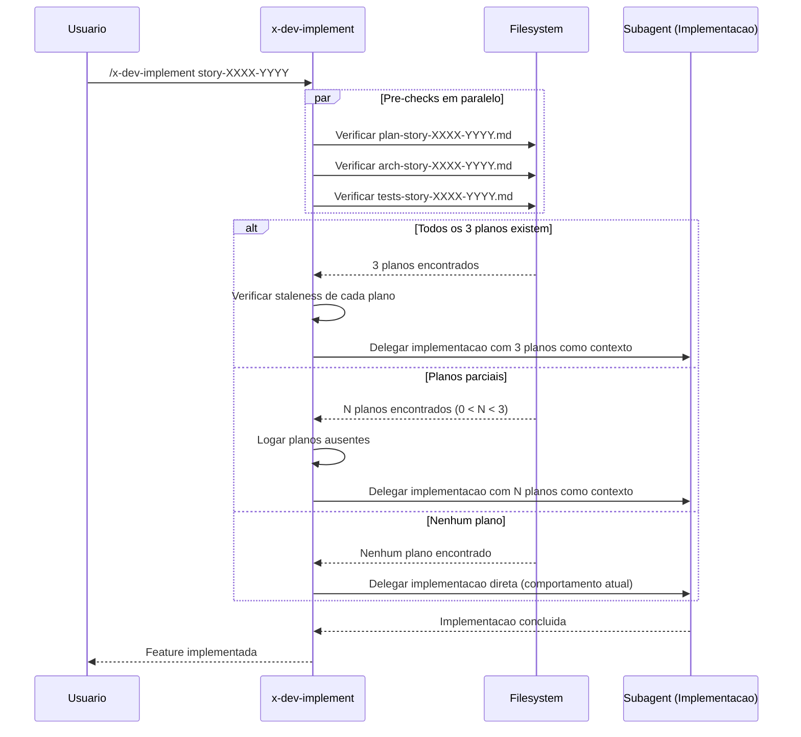

# Historia: Pre-Check e Template References no x-dev-implement

**ID:** story-0024-0013
**Chave Jira:** ---
**Status:** Concluída

## 1. Dependencias

| Blocked By | Blocks |
| :--- | :--- |
| story-0024-0006, story-0024-0007 | story-0024-0014 |

## 2. Regras Transversais Aplicaveis

| ID | Titulo |
| :--- | :--- |
| RULE-001 | Template obrigatorio para artefatos |
| RULE-002 | Idempotencia via staleness check |
| RULE-012 | Fallback graceful |

## 3. Descricao

Como **desenvolvedor**, eu quero que o x-dev-implement (implementador simplificado) verifique e reutilize planos existentes (implementation plan, test plan, architecture plan), garantindo consistencia entre x-dev-lifecycle e x-dev-implement.

O x-dev-implement e uma versao simplificada do x-dev-lifecycle, projetada para implementacao direta sem fases de review. Atualmente, a skill ja verifica existencia de test plan quando disponivel, mas NAO verifica implementation plan nem architecture plan. Quando invocada apos o x-dev-lifecycle ter gerado planos, esses planos sao ignorados -- resultando em implementacao sem contexto de decisoes arquiteturais ou estrategia de implementacao ja documentadas.

As mudancas afetam `java/src/main/resources/targets/claude/skills/core/x-dev-implement/SKILL.md`. A skill ganha pre-checks para implementation plan (`plans/epic-XXXX/plans/plan-story-XXXX-YYYY.md`) e architecture plan (`plans/epic-XXXX/plans/arch-story-XXXX-YYYY.md`). Quando planos existem, sao injetados como contexto no subagente de implementacao. Quando nao existem, o comportamento atual e preservado (implementacao direta). A skill funciona em degradacao graceful: qualquer combinacao de planos presentes/ausentes e valida.

### 3.1 Pre-check para Implementation Plan

- Verificar existencia de `plans/epic-XXXX/plans/plan-story-XXXX-YYYY.md`
- Se existir: injetar como contexto ao subagente com instrucao "Use implementation plan at {path} for class diagram, method signatures, affected layers, and TDD strategy"
- Se nao existir: logar "No implementation plan found, proceeding with direct implementation"
- NAO gerar o plano -- apenas consumir se ja existir (geracao e responsabilidade do x-dev-lifecycle)

### 3.2 Pre-check para Architecture Plan

- Verificar existencia de `plans/epic-XXXX/plans/arch-story-XXXX-YYYY.md`
- Se existir: injetar como contexto ao subagente com instrucao "Use architecture plan at {path} for component structure, dependency matrix, and mini-ADRs"
- Se nao existir: logar "No architecture plan found, proceeding without architectural context"
- NAO gerar o plano -- apenas consumir se ja existir

### 3.3 Pre-check para Test Plan (Aprimoramento)

- Manter pre-check existente para test plan
- Padronizar formato de log para consistencia com implementation plan e architecture plan
- Mensagem: "Using existing test plan at {path}" ou "No test plan found, generating test scenarios inline"

### 3.4 Uso Combinado de Planos como Contexto

- Se todos os 3 planos existirem: injetar os 3 como contexto (implementacao guiada completa)
- Se apenas parcial: injetar os disponiveis e logar quais estao ausentes
- Ordem de prioridade de contexto: implementation plan > architecture plan > test plan
- Nenhuma combinacao impede a execucao -- degradacao graceful em todos os cenarios

### 3.5 Deteccao de Planos Stale (Warning Only)

- Se plano existir e `mtime(story) > mtime(plan)`: logar warning "Plan {type} may be stale (story modified after plan generation), using as context anyway"
- NAO regenerar planos stale (responsabilidade do x-dev-lifecycle)
- Apenas notificar o usuario sobre potencial divergencia

## 3.5 Entrega de Valor

- **Valor Principal:** Implementador simplificado reutiliza planos existentes -- consistencia entre workflows completo (x-dev-lifecycle) e simplificado (x-dev-implement). Desenvolvedores que planejaram via lifecycle e implementam via implement nao perdem contexto.
- **Metrica de Sucesso:** Quando 3 planos existem, x-dev-implement injeta todos como contexto em < 5s. Implementacao guiada por planos reduz iteracoes de correcao em 30-50%.
- **Impacto no Negocio:** Desbloqueia story-0024-0014 (auditoria de consistencia). Elimina gap entre workflows que causava retrabalho.

## 4. Definicoes de Qualidade Locais

### DoR Local

- [ ] Pre-checks de implementation plan e test plan implementados no x-dev-lifecycle (story-0024-0006)
- [ ] Pre-check de test plan implementado no x-test-plan (story-0024-0007)
- [ ] SKILL.md atual do x-dev-implement analisado (pre-check existente de test plan mapeado)
- [ ] Padrao de contexto injection para subagentes compreendido
- [ ] Formato de log para pre-checks padronizado (consistente com x-dev-lifecycle)

### DoD Local

- [ ] Pre-check para implementation plan implementado no SKILL.md
- [ ] Pre-check para architecture plan implementado no SKILL.md
- [ ] Pre-check existente de test plan padronizado (formato de log consistente)
- [ ] Contexto combinado de planos injetado corretamente ao subagente
- [ ] Degradacao graceful funcional para todas as combinacoes de planos presentes/ausentes
- [ ] Warning de staleness implementado (sem regeneracao)
- [ ] Pelo menos 1 teste automatizado validando o criterio de aceite principal
- [ ] Smoke test passando

### Global Definition of Done (DoD)

- **Cobertura:** >= 95% Line, >= 90% Branch
- **Testes Automatizados:** Golden tests validando SKILL.md gerado. Testes unitarios para logica de pre-check e combinacao de contextos.
- **Relatorio de Cobertura:** JaCoCo integrado ao `mvn verify`
- **Documentacao:** SKILL.md do x-dev-implement atualizado com pre-checks e context injection
- **Persistencia:** Templates copiados verbatim sem renderizacao de placeholders
- **Performance:** Geracao nao deve aumentar tempo de build em mais de 5%

## 5. Contratos de Dados

### 5.1 Pre-check Artifacts Table

| Artifact Type | File Pattern | Produced By | Context Injection Instruction |
| :--- | :--- | :--- | :--- |
| Implementation Plan | `plans/epic-XXXX/plans/plan-story-XXXX-YYYY.md` | x-dev-lifecycle (Phase 1B) | "Use implementation plan at {path} for class diagram, method signatures, affected layers, and TDD strategy" |
| Architecture Plan | `plans/epic-XXXX/plans/arch-story-XXXX-YYYY.md` | x-dev-architecture-plan | "Use architecture plan at {path} for component structure, dependency matrix, and mini-ADRs" |
| Test Plan | `plans/epic-XXXX/plans/tests-story-XXXX-YYYY.md` | x-test-plan | "Use test plan at {path} for acceptance tests and unit test scenarios" |

### 5.2 Context Combination Matrix

| Impl Plan | Arch Plan | Test Plan | Behavior | Log |
| :--- | :--- | :--- | :--- | :--- |
| Ausente | Ausente | Ausente | Implementacao direta (comportamento atual) | "No plans found, proceeding with direct implementation" |
| Presente | Ausente | Ausente | Guiada por implementation plan | "Using implementation plan, no arch/test plans" |
| Ausente | Presente | Ausente | Guiada por architecture plan | "Using architecture plan, no impl/test plans" |
| Ausente | Ausente | Presente | Guiada por test plan (comportamento existente) | "Using test plan, no impl/arch plans" |
| Presente | Presente | Presente | Guiada completa por 3 planos | "Using all 3 plans as implementation context" |
| Presente | Presente | Ausente | Guiada por impl + arch plans | "Using implementation and architecture plans" |
| Presente | Ausente | Presente | Guiada por impl + test plans | "Using implementation and test plans" |
| Ausente | Presente | Presente | Guiada por arch + test plans | "Using architecture and test plans" |

### 5.3 Staleness Warning Format

| Condicao | Log Level | Mensagem |
| :--- | :--- | :--- |
| `mtime(story) > mtime(plan)` | WARNING | "Plan {type} may be stale (story modified after plan generation), using as context anyway" |
| `mtime(story) <= mtime(plan)` | INFO | "Using existing {type} at {path}" |

## 6. Diagramas

### 6.1 Fluxo de Pre-check e Context Injection no x-dev-implement



## 7. Criterios de Aceite (Gherkin)

```gherkin
Cenario: Nenhum plano existente resulta em implementacao direta
  DADO que o diretorio plans/epic-XXXX/plans/ nao contem nenhum plano para story-XXXX-YYYY
  QUANDO /x-dev-implement story-XXXX-YYYY e executado
  ENTAO a implementacao procede diretamente sem contexto de planos
  E o log contem "No plans found, proceeding with direct implementation"
  E o comportamento e identico ao x-dev-implement sem modificacoes

Cenario: Implementation plan existente injetado como contexto
  DADO que plans/epic-XXXX/plans/plan-story-XXXX-YYYY.md existe
  E contem class diagram, method signatures e TDD strategy
  QUANDO /x-dev-implement story-XXXX-YYYY e executado
  ENTAO o subagente de implementacao recebe o implementation plan como contexto
  E a instrucao inclui "Use implementation plan at {path} for class diagram, method signatures, affected layers, and TDD strategy"
  E o log contem "Using implementation plan"

Cenario: Architecture plan existente injetado como contexto
  DADO que plans/epic-XXXX/plans/arch-story-XXXX-YYYY.md existe
  E contem component diagram, dependency matrix e mini-ADRs
  QUANDO /x-dev-implement story-XXXX-YYYY e executado
  ENTAO o subagente de implementacao recebe o architecture plan como contexto
  E a instrucao inclui "Use architecture plan at {path} for component structure, dependency matrix, and mini-ADRs"
  E o log contem "Using architecture plan"

Cenario: Plano stale gera warning mas ainda e utilizado como contexto
  DADO que plans/epic-XXXX/plans/plan-story-XXXX-YYYY.md existe
  E mtime(story-XXXX-YYYY.md) e posterior a mtime(plan-story-XXXX-YYYY.md)
  QUANDO /x-dev-implement story-XXXX-YYYY e executado
  ENTAO um warning e logado "Plan implementation plan may be stale (story modified after plan generation), using as context anyway"
  E o implementation plan e injetado como contexto normalmente
  E nenhuma regeneracao e executada

Cenario: Planos parciais injetados com log de ausentes
  DADO que plans/epic-XXXX/plans/tests-story-XXXX-YYYY.md existe
  E plans/epic-XXXX/plans/plan-story-XXXX-YYYY.md NAO existe
  E plans/epic-XXXX/plans/arch-story-XXXX-YYYY.md NAO existe
  QUANDO /x-dev-implement story-XXXX-YYYY e executado
  ENTAO apenas o test plan e injetado como contexto
  E o log contem "Using test plan, no impl/arch plans"
  E a implementacao procede normalmente sem interrupcao

Cenario: Todos os 3 planos existentes fornecem contexto completo
  DADO que plan-story-XXXX-YYYY.md, arch-story-XXXX-YYYY.md e tests-story-XXXX-YYYY.md existem
  E nenhum esta stale
  QUANDO /x-dev-implement story-XXXX-YYYY e executado
  ENTAO os 3 planos sao injetados como contexto ao subagente
  E o log contem "Using all 3 plans as implementation context"
  E a ordem de prioridade e implementation plan > architecture plan > test plan
```

### 7.1 Scenario Ordering (TPP)

> TPP: degenerate (nenhum plano -> implementacao direta) -> happy path (implementation plan usado, architecture plan usado) -> error (plano stale -> warning sem regeneracao) -> boundary (planos parciais, todos os 3 planos combinados).

### 7.2 Mandatory Scenario Categories

- [x] Degenerate cases (nenhum plano existente, implementacao direta)
- [x] Happy path (implementation plan usado, architecture plan usado)
- [x] Error paths (plano stale, warning sem regeneracao)
- [x] Boundary values (planos parciais, combinacao completa de 3 planos)

### 7.3 TDD Implementation Notes

- **Double-Loop TDD**: O primeiro cenario (nenhum plano) e o acceptance test do outer loop. Garante que a skill continua funcional sem dependencia de planos -- backward compatibility.
- Unit tests guiam logica de pre-check: ausente -> presente -> stale. Cada combinacao da matrix (2^3 = 8) e testada.
- Context injection verificada via golden file parity (SKILL.md gerado com instrucoes de pre-check vs. expected).

## 8. Sub-tarefas

- [x] [Dev] Adicionar pre-check para implementation plan no SKILL.md do x-dev-implement
- [x] [Dev] Adicionar pre-check para architecture plan no SKILL.md do x-dev-implement
- [x] [Dev] Padronizar pre-check existente de test plan (formato de log consistente)
- [x] [Dev] Implementar context injection combinada ao subagente (prioridade: impl > arch > test)
- [x] [Dev] Implementar warning de staleness sem regeneracao
- [x] [Dev] Implementar degradacao graceful para todas as combinacoes de planos
- [x] [Test] Unitario: Verificar pre-check de cada tipo de plano (ausente vs. presente)
- [x] [Test] Unitario: Verificar combinacoes da context matrix (8 combinacoes)
- [x] [Test] Unitario: Verificar warning de staleness (mtime comparison)
- [x] [Test] Smoke/E2E: Executar x-dev-implement com planos pre-existentes e verificar context injection
- [x] [Doc] Atualizar SKILL.md do x-dev-implement com documentacao de pre-checks
