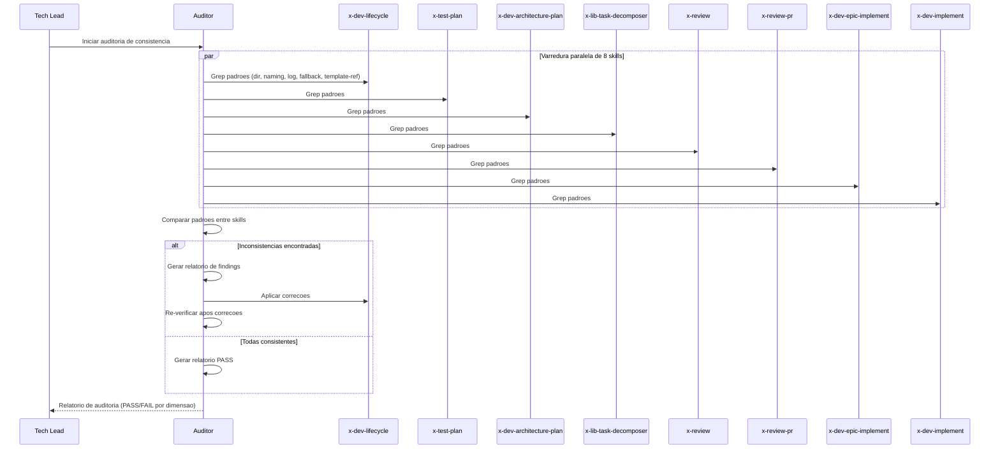

# Historia: Auditoria de Consistencia de Diretorios e Naming Conventions

**ID:** story-0024-0014
**Chave Jira:** ---
**Status:** Pendente

## 1. Dependencias

| Blocked By | Blocks |
| :--- | :--- |
| story-0024-0006, story-0024-0007, story-0024-0008, story-0024-0009, story-0024-0010, story-0024-0011, story-0024-0012, story-0024-0013 | story-0024-0016 |

## 2. Regras Transversais Aplicaveis

| ID | Titulo |
| :--- | :--- |
| RULE-001 | Template obrigatorio para artefatos |
| RULE-002 | Idempotencia via staleness check |
| RULE-004 | Dual-target copy |
| RULE-007 | Instrucao explicita de template |
| RULE-012 | Fallback graceful |

## 3. Descricao

Como **Tech Lead**, eu quero auditar todas as 8 skills modificadas para garantir que usam as mesmas convencoes de diretorio, naming, logica de pre-check e fallback, eliminando inconsistencias entre skills.

Apos a modificacao individual de 8 skills nas stories 0006 a 0013, existe risco real de inconsistencias acumuladas: uma skill pode salvar em `plans/` enquanto outra salva em `plans/plans/`, uma pode usar `plan-story-` como prefixo enquanto outra usa `impl-story-`, uma pode logar "Reusing..." enquanto outra loga "Skipping regeneration...". Essas inconsistencias sao invisiveis durante testes unitarios de cada skill isolada, mas causam confusao ao navegar artefatos manualmente ou ao retomar sessoes que combinam multiplas skills.

A auditoria e executada como uma varredura sistematica das 8 skills modificadas, comparando padroes concretos (strings de diretorio, prefixos de arquivo, formatos de log, instrucoes de template) e corrigindo qualquer divergencia encontrada. O resultado e um conjunto de skills com convencoes 100% uniformes.

### 3.1 Auditoria de Convencoes de Diretorio

- Diretorio padrao para planos: `plans/epic-XXXX/plans/`
- Diretorio padrao para reviews: `plans/epic-XXXX/plans/` (mesmo diretorio)
- Diretorio padrao para reports: `plans/epic-XXXX/reports/` (apenas x-dev-epic-implement)
- Verificar que todas as 8 skills usam `mkdir -p` antes de salvar artefatos
- Verificar que nenhuma skill usa caminhos hardcoded com epic IDs especificos

### 3.2 Auditoria de Naming Conventions

- Story-level artifacts: `{type}-story-XXXX-YYYY.md`
  - Prefixos validos: `plan-`, `arch-`, `tests-`, `tasks-`, `security-`, `compliance-`, `review-`, `review-dashboard-`, `remediation-`, `techlead-review-`
- Epic-level artifacts: `{type}-epic-XXXX.md`
  - Prefixos validos: `execution-plan-`, `phase-report-`
- Verificar que nenhuma skill usa prefixos diferentes dos listados acima
- Verificar consistencia de separadores (sempre `-`, nunca `_` ou `.`)

### 3.3 Auditoria de Logica de Pre-check

- Formato de mtime comparison: `mtime(story) <= mtime(plan)` -> reuso
- Formato de log para reuso: `"Reusing existing {type} from {date}"`
- Formato de log para regeneracao: `"Regenerating stale {type} for {story}"`
- Formato de log para geracao nova: `"Generating {type} for {story}"`
- Verificar que TODAS as 8 skills usam exatamente o mesmo formato de log

### 3.4 Auditoria de Fallback Behavior

- Quando template ausente: logar `"Template not found, using inline format"`
- Nenhuma skill deve falhar quando template nao existe
- Nenhuma skill deve silenciosamente ignorar a ausencia de template (DEVE logar warning)
- Verificar que todas as skills testam existencia de `.claude/templates/_TEMPLATE-{TYPE}.md`

### 3.5 Auditoria de Template Reference Format

- Instrucao padrao para subagentes: `"Read template at '.claude/templates/_TEMPLATE-{TYPE}.md' for required output format"`
- Verificar que aspas simples sao usadas consistentemente no path
- Verificar que "required output format" e a frase padrao (nao "expected format" ou "output structure")

## 3.5 Entrega de Valor

- **Valor Principal:** Convencoes uniformes entre 8 skills -- elimina inconsistencias que causariam confusao ao retomar sessoes ou ao navegar artefatos manualmente. Garante que desenvolvedores podem confiar em padroes previsíveis.
- **Metrica de Sucesso:** 0 inconsistencias entre as 8 skills auditadas. Todos os padroes (diretorio, naming, pre-check, fallback, template reference) identicos entre skills.
- **Impacto no Negocio:** Desbloqueia story-0024-0016 (documentacao e catalogo de artefatos). Sem auditoria, a documentacao refletiria convencoes inconsistentes.

## 4. Definicoes de Qualidade Locais

### DoR Local

- [ ] Todas as 8 skills modificadas e com testes passando (stories 0006 a 0013 concluidas)
- [ ] Lista de padroes esperados documentada (diretorios, naming, log formats, fallback)
- [ ] Acesso ao SKILL.md de cada uma das 8 skills para comparacao

### DoD Local

- [ ] Auditoria de diretorio concluida: todas as 8 skills usam `plans/epic-XXXX/plans/` e `mkdir -p`
- [ ] Auditoria de naming concluida: todos os prefixos consistentes conforme lista padronizada
- [ ] Auditoria de pre-check concluida: mesmo formato de mtime comparison e log em todas as skills
- [ ] Auditoria de fallback concluida: mesmo comportamento e mensagem de warning em todas as skills
- [ ] Auditoria de template reference concluida: mesma instrucao de subagente em todas as skills
- [ ] Inconsistencias encontradas corrigidas diretamente nas skills afetadas
- [ ] Pelo menos 1 teste automatizado validando o criterio de aceite principal
- [ ] Smoke test passando

### Global Definition of Done (DoD)

- **Cobertura:** >= 95% Line, >= 90% Branch
- **Testes Automatizados:** Teste de grep automatizado verificando padroes de diretorio, naming e log across all 8 SKILL.md files. Golden tests atualizados apos correcoes.
- **Relatorio de Cobertura:** JaCoCo integrado ao `mvn verify`
- **Documentacao:** Relatorio de auditoria com findings e correcoes aplicadas
- **Persistencia:** Templates copiados verbatim sem renderizacao de placeholders
- **Performance:** Geracao nao deve aumentar tempo de build em mais de 5%

## 5. Contratos de Dados

### 5.1 Skills Auditadas

| # | Skill | SKILL.md Path | Story de Modificacao |
| :--- | :--- | :--- | :--- |
| 1 | x-dev-lifecycle | `targets/claude/skills/core/x-dev-lifecycle/SKILL.md` | story-0024-0006 |
| 2 | x-test-plan | `targets/claude/skills/core/x-test-plan/SKILL.md` | story-0024-0007 |
| 3 | x-dev-architecture-plan | `targets/claude/skills/core/x-dev-architecture-plan/SKILL.md` | story-0024-0008 |
| 4 | x-lib-task-decomposer | `targets/claude/skills/core/x-lib-task-decomposer/SKILL.md` | story-0024-0009 |
| 5 | x-review | `targets/claude/skills/core/x-review/SKILL.md` | story-0024-0010 |
| 6 | x-review-pr | `targets/claude/skills/core/x-review-pr/SKILL.md` | story-0024-0011 |
| 7 | x-dev-epic-implement | `targets/claude/skills/core/x-dev-epic-implement/SKILL.md` | story-0024-0012 |
| 8 | x-dev-implement | `targets/claude/skills/core/x-dev-implement/SKILL.md` | story-0024-0013 |

### 5.2 Padroes Esperados (Checklist de Auditoria)

| Dimensao | Padrao Esperado | Regex de Verificacao |
| :--- | :--- | :--- |
| Diretorio de planos | `plans/epic-XXXX/plans/` | `plans/epic-[0-9]{4}/plans/` |
| Diretorio de reports | `plans/epic-XXXX/reports/` | `plans/epic-[0-9]{4}/reports/` |
| Criacao de diretorio | `mkdir -p` antes de salvar | `mkdir -p` |
| Naming story-level | `{type}-story-XXXX-YYYY.md` | `[a-z-]+-story-[0-9]{4}-[0-9]{4}\.md` |
| Naming epic-level | `{type}-epic-XXXX.md` | `[a-z-]+-epic-[0-9]{4}\.md` |
| Log de reuso | `"Reusing existing {type} from {date}"` | `Reusing existing .+ from` |
| Log de regeneracao | `"Regenerating stale {type} for {story}"` | `Regenerating stale .+ for` |
| Log de geracao | `"Generating {type} for {story}"` | `Generating .+ for` |
| Fallback warning | `"Template not found, using inline format"` | `Template not found, using inline format` |
| Template reference | `"Read template at '.claude/templates/_TEMPLATE-{TYPE}.md' for required output format"` | `Read template at .+_TEMPLATE-.+\.md.+ for required output format` |

### 5.3 Relatorio de Auditoria (Output)

| Campo | Tipo | M/O | Descricao |
| :--- | :--- | :--- | :--- |
| `skill_name` | `String` | M | Nome da skill auditada |
| `dimension` | `String` | M | Dimensao auditada (directory, naming, pre-check, fallback, template-ref) |
| `expected` | `String` | M | Padrao esperado |
| `actual` | `String` | M | Padrao encontrado |
| `status` | `Enum` | M | `PASS` ou `FAIL` |
| `fix_applied` | `boolean` | O | Se a correcao foi aplicada |

## 6. Diagramas

### 6.1 Fluxo de Auditoria de Consistencia



## 7. Criterios de Aceite (Gherkin)

```gherkin
Cenario: Nenhuma skill modificada resulta em auditoria vazia
  DADO que nenhuma das 8 skills foi modificada no escopo do EPIC-0024
  QUANDO a auditoria de consistencia e executada
  ENTAO o relatorio indica "No skills modified, nothing to audit"
  E nenhuma correcao e aplicada

Cenario: Todas as 8 skills usam a mesma convencao de diretorio
  DADO que as 8 skills foram modificadas conforme stories 0006 a 0013
  QUANDO a auditoria verifica padroes de diretorio
  ENTAO todas as 8 skills referenciam "plans/epic-XXXX/plans/" para artefatos de planejamento
  E apenas x-dev-epic-implement referencia "plans/epic-XXXX/reports/" para reports de fase
  E todas as 8 skills usam "mkdir -p" antes de salvar artefatos

Cenario: Naming convention consistente entre todas as skills
  DADO que as 8 skills foram modificadas conforme stories 0006 a 0013
  QUANDO a auditoria verifica naming conventions
  ENTAO todos os artefatos story-level seguem o padrao "{type}-story-XXXX-YYYY.md"
  E todos os artefatos epic-level seguem o padrao "{type}-epic-XXXX.md"
  E os separadores sao sempre hifen, nunca underscore ou ponto

Cenario: Skill com diretorio incorreto e corrigida durante auditoria
  DADO que uma skill referencia "plans/epic-XXXX/" sem o subdiretorio "plans/"
  QUANDO a auditoria detecta a inconsistencia
  ENTAO o relatorio marca a dimensao "directory" como FAIL para a skill
  E a correcao e aplicada diretamente no SKILL.md
  E a re-verificacao confirma que o padrao esta correto apos correcao

Cenario: Diretorio reports/ exclusivo do x-dev-epic-implement
  DADO que as 8 skills foram auditadas
  QUANDO a auditoria verifica uso do diretorio "reports/"
  ENTAO apenas x-dev-epic-implement referencia "plans/epic-XXXX/reports/"
  E as demais 7 skills NAO referenciam "reports/"
  E o relatorio confirma segregacao correta de diretorios

Cenario: Formato de log de pre-check identico entre todas as skills com pre-check
  DADO que 7 skills possuem logica de pre-check (exceto x-dev-epic-implement que e orquestrador)
  QUANDO a auditoria verifica formatos de log
  ENTAO todas usam "Reusing existing {type} from {date}" para reuso
  E todas usam "Regenerating stale {type} for {story}" para regeneracao
  E todas usam "Template not found, using inline format" para fallback
```

### 7.1 Scenario Ordering (TPP)

> TPP: degenerate (nenhuma skill modificada -> nada a auditar) -> happy path (8 skills com diretorio consistente, naming consistente) -> error (skill com diretorio incorreto -> correcao) -> boundary (reports/ exclusivo do x-dev-epic-implement, formato de log identico entre 7 skills com pre-check).

### 7.2 Mandatory Scenario Categories

- [x] Degenerate cases (nenhuma skill modificada, auditoria vazia)
- [x] Happy path (8 skills com diretorios consistentes, naming consistente)
- [x] Error paths (skill com diretorio incorreto, correcao aplicada)
- [x] Boundary values (reports/ exclusivo, formato de log em 7 skills)

### 7.3 TDD Implementation Notes

- **Double-Loop TDD**: O segundo cenario (8 skills com diretorio consistente) e o acceptance test do outer loop. Se todas estao consistentes, a auditoria passa sem correcoes.
- Unit tests usam grep para verificar padroes em SKILL.md: regex para diretorio, naming, log format.
- Cada dimensao de auditoria e testada isoladamente: directory, naming, pre-check, fallback, template-ref.

## 8. Sub-tarefas

- [ ] [Dev] Auditar convencoes de diretorio nas 8 skills (plans/, reports/, mkdir -p)
- [ ] [Dev] Auditar naming conventions nas 8 skills (prefixos, separadores, sufixos)
- [ ] [Dev] Auditar logica de pre-check nas 7 skills aplicaveis (mtime format, log messages)
- [ ] [Dev] Auditar fallback behavior nas 8 skills (template not found -> warning + inline)
- [ ] [Dev] Auditar template reference format nas 8 skills (instrucao para subagentes)
- [ ] [Dev] Corrigir inconsistencias encontradas diretamente nos SKILL.md afetados
- [ ] [Dev] Re-verificar skills corrigidas para confirmar consistencia pos-correcao
- [ ] [Test] Unitario: Grep automatizado para padroes de diretorio across 8 SKILL.md files
- [ ] [Test] Unitario: Grep automatizado para naming conventions across 8 SKILL.md files
- [ ] [Test] Unitario: Grep automatizado para log formats across 8 SKILL.md files
- [ ] [Test] Smoke/E2E: Gerar projeto completo e verificar que todas as 8 skills seguem convencoes uniformes
- [ ] [Doc] Gerar relatorio de auditoria com findings e correcoes
