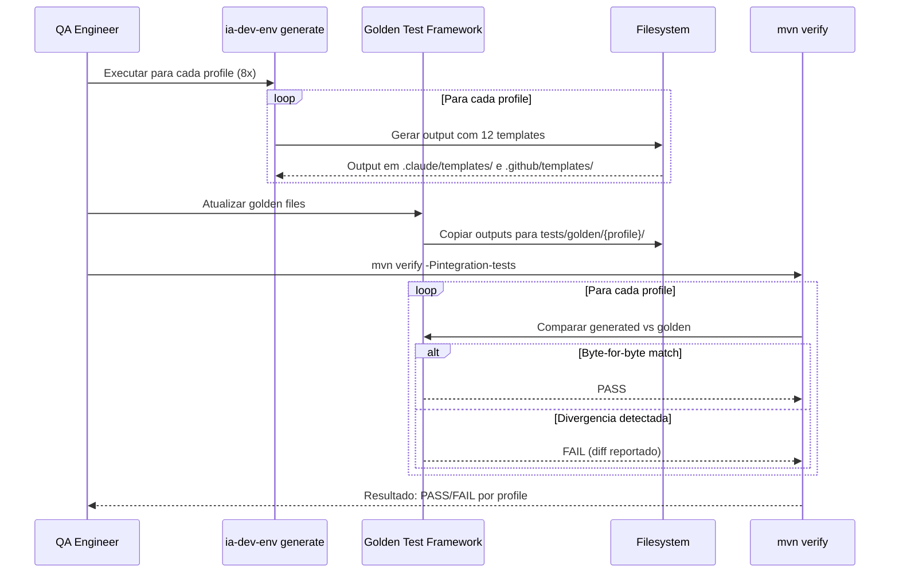

# Historia: Golden Tests para Novos Templates

**ID:** story-0024-0015
**Chave Jira:** ---
**Status:** Pendente

## 1. Dependencias

| Blocked By | Blocks |
| :--- | :--- |
| story-0024-0005 | --- |

## 2. Regras Transversais Aplicaveis

| ID | Titulo |
| :--- | :--- |
| RULE-004 | Dual-target copy |
| RULE-010 | Validacao de secoes obrigatorias |

## 3. Descricao

Como **QA Engineer**, eu quero que os golden tests incluam os 12 novos templates em todos os profiles, garantindo que a geracao nao regride e que os templates sao distribuidos corretamente.

O projeto usa golden file testing: para cada profile (java-quarkus, java-spring, go-gin, kotlin-ktor, python-click-cli, python-fastapi, rust-axum, typescript-nestjs), existe um diretorio golden com o snapshot esperado da geracao. Qualquer mudanca na geracao que diverge do golden file falha no teste automaticamente, protegendo contra regressoes. Os 12 novos templates introduzidos pelo EPIC-0024 devem aparecer nos golden files de todos os 8+ profiles, tanto em `.claude/templates/` quanto em `.github/templates/` (dual-target copy conforme RULE-004).

As tarefas incluem: (a) executar `ia-dev-env generate` para cada profile e atualizar golden files, (b) criar `PlanTemplatesAssemblerTest.java` com testes unitarios especificos para o assembler, (c) verificar que `mvn verify -Pintegration-tests` passa para todos os profiles, e (d) validar que o conteudo dos templates e byte-for-byte identico ao source.

### 3.1 Atualizacao de Golden Files

- Executar `ia-dev-env generate` para cada um dos 8 profiles
- Verificar que os 12 templates aparecem em `.claude/templates/` de cada profile
- Verificar que os 12 templates aparecem em `.github/templates/` de cada profile
- Atualizar snapshots em `tests/golden/{profile-name}/`
- Total de novos arquivos: 12 templates x 2 targets x 8 profiles = 192 golden entries

### 3.2 PlanTemplatesAssemblerTest.java

- Criar teste unitario dedicado para o `PlanTemplatesAssembler`
- Testar: copia para ambos os targets, validacao de secoes obrigatorias, fallback para template invalido
- Testar: placeholders preservados ({{LANGUAGE}}, {{FRAMEWORK}}) sem renderizacao
- Testar: templates nao existentes no source nao geram arquivos no output
- Localizar em `java/src/test/java/dev/iadev/application/assembler/PlanTemplatesAssemblerTest.java`

### 3.3 Validacao de Conteudo Byte-for-Byte

- Conteudo de cada template gerado DEVE ser byte-for-byte identico ao source em `resources/shared/templates/`
- Nenhum placeholder renderizado ({{LANGUAGE}} preservado como literal)
- Nenhuma transformacao de encoding (UTF-8 preservado)
- Nenhuma normalizacao de line endings (LF preservado)

### 3.4 Validacao por Profile

- Todos os 8 profiles devem conter exatamente os mesmos 12 templates
- Templates sao language-agnostic (RULE-003) -- mesmo conteudo para todos os profiles
- Diferenca em qualquer profile e tratada como regressao

## 3.5 Entrega de Valor

- **Valor Principal:** Templates validados em todos os profiles -- garante que geracao nao regride em nenhum stack. Qualquer mudanca acidental nos templates e detectada automaticamente.
- **Metrica de Sucesso:** `mvn verify -Pintegration-tests` passa para todos os 8 profiles. 192 golden entries validadas (12 templates x 2 targets x 8 profiles).
- **Impacto no Negocio:** Leaf story -- nao bloqueia nenhuma outra. Protege contra regressoes em todo o pipeline de geracao.

## 4. Definicoes de Qualidade Locais

### DoR Local

- [ ] `PlanTemplatesAssembler` implementado e funcional (story-0024-0005)
- [ ] 12 templates source disponiveis em `resources/shared/templates/`
- [ ] Infraestrutura de golden tests existente e compreendida
- [ ] Todos os 8 profiles de geracao configurados e executaveis

### DoD Local

- [ ] Golden files atualizados para todos os 8 profiles
- [ ] 12 templates presentes em `.claude/templates/` de cada golden profile
- [ ] 12 templates presentes em `.github/templates/` de cada golden profile
- [ ] `PlanTemplatesAssemblerTest.java` criado com testes para copy, validacao e fallback
- [ ] Conteudo byte-for-byte identico ao source verificado
- [ ] Placeholders preservados sem renderizacao
- [ ] `mvn verify -Pintegration-tests` passando para todos os profiles
- [ ] Pelo menos 1 teste automatizado validando o criterio de aceite principal
- [ ] Smoke test passando

### Global Definition of Done (DoD)

- **Cobertura:** >= 95% Line, >= 90% Branch
- **Testes Automatizados:** Golden tests para todos os profiles. Testes unitarios para PlanTemplatesAssembler. Integration tests com `mvn verify`.
- **Relatorio de Cobertura:** JaCoCo integrado ao `mvn verify`
- **Documentacao:** PlanTemplatesAssemblerTest documentado com @DisplayName descritivos
- **Persistencia:** Templates copiados verbatim sem renderizacao de placeholders
- **Performance:** Geracao nao deve aumentar tempo de build em mais de 5%

## 5. Contratos de Dados

### 5.1 Templates a Validar (12)

| # | Template | Source Path | Claude Target | GitHub Target |
| :--- | :--- | :--- | :--- | :--- |
| 1 | `_TEMPLATE-IMPLEMENTATION-PLAN.md` | `shared/templates/` | `.claude/templates/` | `.github/templates/` |
| 2 | `_TEMPLATE-TEST-PLAN.md` | `shared/templates/` | `.claude/templates/` | `.github/templates/` |
| 3 | `_TEMPLATE-ARCHITECTURE-PLAN.md` | `shared/templates/` | `.claude/templates/` | `.github/templates/` |
| 4 | `_TEMPLATE-TASK-BREAKDOWN.md` | `shared/templates/` | `.claude/templates/` | `.github/templates/` |
| 5 | `_TEMPLATE-SECURITY-ASSESSMENT.md` | `shared/templates/` | `.claude/templates/` | `.github/templates/` |
| 6 | `_TEMPLATE-COMPLIANCE-ASSESSMENT.md` | `shared/templates/` | `.claude/templates/` | `.github/templates/` |
| 7 | `_TEMPLATE-SPECIALIST-REVIEW.md` | `shared/templates/` | `.claude/templates/` | `.github/templates/` |
| 8 | `_TEMPLATE-TECH-LEAD-REVIEW.md` | `shared/templates/` | `.claude/templates/` | `.github/templates/` |
| 9 | `_TEMPLATE-CONSOLIDATED-REVIEW-DASHBOARD.md` | `shared/templates/` | `.claude/templates/` | `.github/templates/` |
| 10 | `_TEMPLATE-REVIEW-REMEDIATION.md` | `shared/templates/` | `.claude/templates/` | `.github/templates/` |
| 11 | `_TEMPLATE-EPIC-EXECUTION-PLAN.md` | `shared/templates/` | `.claude/templates/` | `.github/templates/` |
| 12 | `_TEMPLATE-PHASE-REPORT.md` | `shared/templates/` | `.claude/templates/` | `.github/templates/` |

### 5.2 Profiles a Validar (8)

| # | Profile | Golden Path |
| :--- | :--- | :--- |
| 1 | go-gin | `tests/golden/go-gin/` |
| 2 | java-quarkus | `tests/golden/java-quarkus/` |
| 3 | java-spring | `tests/golden/java-spring/` |
| 4 | kotlin-ktor | `tests/golden/kotlin-ktor/` |
| 5 | python-click-cli | `tests/golden/python-click-cli/` |
| 6 | python-fastapi | `tests/golden/python-fastapi/` |
| 7 | rust-axum | `tests/golden/rust-axum/` |
| 8 | typescript-nestjs | `tests/golden/typescript-nestjs/` |

### 5.3 Validacao por Golden Entry

| Campo | Tipo | Validacao |
| :--- | :--- | :--- |
| `exists` | `boolean` | Template presente no golden directory |
| `content_match` | `boolean` | Conteudo byte-for-byte identico ao source |
| `placeholders_preserved` | `boolean` | `{{LANGUAGE}}`, `{{FRAMEWORK}}` presentes como literal |
| `encoding` | `String` | UTF-8 |
| `line_endings` | `String` | LF (Unix) |

## 6. Diagramas

### 6.1 Fluxo de Validacao de Golden Tests



## 7. Criterios de Aceite (Gherkin)

```gherkin
Cenario: Nenhum template no source resulta em geracao vazia
  DADO que o diretorio resources/shared/templates/ nao contem nenhum dos 12 templates
  QUANDO ia-dev-env generate e executado para qualquer profile
  ENTAO o diretorio .claude/templates/ nao contem templates de plano
  E o diretorio .github/templates/ nao contem templates de plano
  E nenhum erro e reportado (graceful empty generation)

Cenario: Cada profile inclui 12 templates em .claude/templates/
  DADO que os 12 templates existem em resources/shared/templates/
  E ia-dev-env generate e executado para o profile "java-quarkus"
  QUANDO os golden tests comparam o output gerado
  ENTAO o diretorio .claude/templates/ contem exatamente os 12 templates
  E cada template esta presente com nome identico ao source

Cenario: Cada profile inclui 12 templates em .github/templates/
  DADO que os 12 templates existem em resources/shared/templates/
  E ia-dev-env generate e executado para o profile "java-quarkus"
  QUANDO os golden tests comparam o output gerado
  ENTAO o diretorio .github/templates/ contem exatamente os 12 templates
  E cada template esta presente com nome identico ao source

Cenario: Conteudo byte-for-byte identico ao source
  DADO que _TEMPLATE-IMPLEMENTATION-PLAN.md existe em resources/shared/templates/
  E contem placeholders {{LANGUAGE}} e {{FRAMEWORK}}
  QUANDO ia-dev-env generate e executado para qualquer profile
  ENTAO o template gerado em .claude/templates/ e byte-for-byte identico ao source
  E o template gerado em .github/templates/ e byte-for-byte identico ao source
  E os placeholders {{LANGUAGE}} e {{FRAMEWORK}} estao preservados como literal

Cenario: Todos os 8 profiles validados com mesmos 12 templates
  DADO que ia-dev-env generate foi executado para todos os 8 profiles
  QUANDO mvn verify -Pintegration-tests e executado
  ENTAO golden tests passam para todos os 8 profiles
  E cada profile contem exatamente 24 golden entries (12 templates x 2 targets)
  E o total de golden entries validadas e 192 (24 x 8 profiles)
```

### 7.1 Scenario Ordering (TPP)

> TPP: degenerate (nenhum template no source -> geracao vazia) -> happy path (.claude/templates/ com 12 templates, .github/templates/ com 12 templates) -> happy path (conteudo byte-for-byte identico) -> boundary (todos os 8 profiles validados).

### 7.2 Mandatory Scenario Categories

- [x] Degenerate cases (nenhum template no source, geracao vazia)
- [x] Happy path (12 templates em .claude/, 12 templates em .github/, conteudo identico)
- [x] Error paths (cobertura implicita: divergencia de golden file = FAIL no mvn verify)
- [x] Boundary values (todos os 8 profiles, 192 golden entries)

### 7.3 TDD Implementation Notes

- **Double-Loop TDD**: O segundo cenario (12 templates em .claude/) e o acceptance test do outer loop. Define a expectativa de que PlanTemplatesAssembler copia corretamente.
- Unit tests para PlanTemplatesAssembler: copy logic, section validation, fallback para template invalido.
- Integration tests via `mvn verify`: golden file comparison byte-for-byte para cada profile.
- TPP: vazio -> 1 template -> 12 templates -> 2 targets -> 8 profiles.

## 8. Sub-tarefas

- [ ] [Dev] Executar ia-dev-env generate para todos os 8 profiles
- [ ] [Dev] Atualizar golden files em tests/golden/{profile}/ com 12 novos templates
- [ ] [Dev] Criar PlanTemplatesAssemblerTest.java com testes de copy, validacao e fallback
- [ ] [Test] Unitario: Verificar copia para .claude/templates/ (12 templates)
- [ ] [Test] Unitario: Verificar copia para .github/templates/ (12 templates)
- [ ] [Test] Unitario: Verificar validacao de secoes obrigatorias por template
- [ ] [Test] Unitario: Verificar preservacao de placeholders ({{LANGUAGE}}, {{FRAMEWORK}})
- [ ] [Test] Unitario: Verificar fallback quando template source invalido ou ausente
- [ ] [Test] Integracao: mvn verify -Pintegration-tests para todos os 8 profiles
- [ ] [Test] Smoke/E2E: Gerar projeto completo e verificar 192 golden entries (12 x 2 x 8)
- [ ] [Doc] Documentar PlanTemplatesAssemblerTest com @DisplayName descritivos
