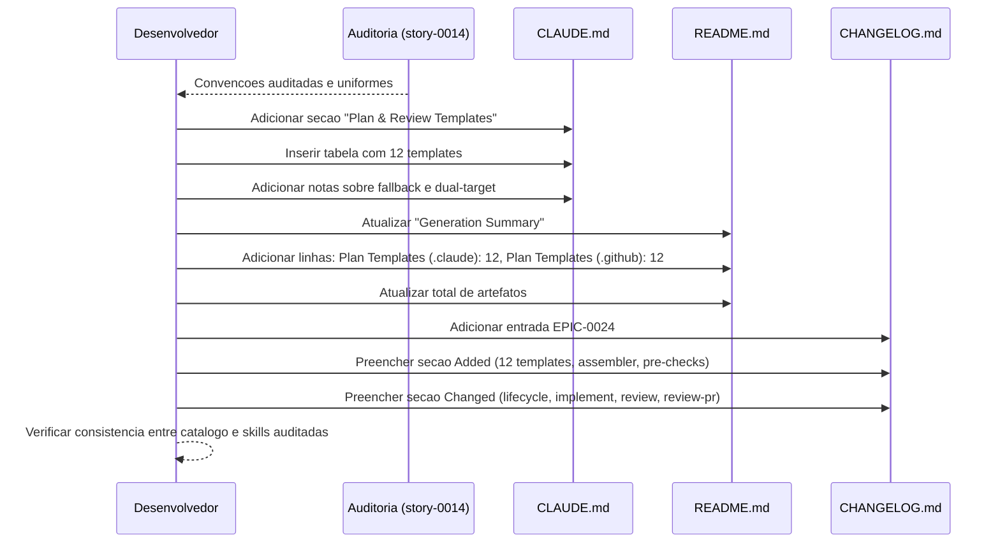

# Historia: Documentacao: Catalogo de Artefatos e CHANGELOG

**ID:** story-0024-0016
**Chave Jira:** ---
**Status:** Pendente

## 1. Dependencias

| Blocked By | Blocks |
| :--- | :--- |
| story-0024-0014 | --- |

## 2. Regras Transversais Aplicaveis

| ID | Titulo |
| :--- | :--- |
| RULE-011 | Header padronizado |

## 3. Descricao

Como **desenvolvedor do projeto**, eu quero que o CLAUDE.md, README.md e CHANGELOG.md reflitam os novos templates, convencoes e catalogo completo de artefatos, garantindo que qualquer desenvolvedor saiba quais templates existem, qual skill os produz, e onde sao salvos.

Esta e a story final do EPIC-0024, executada apos a auditoria de consistencia (story-0024-0014) confirmar que todas as 8 skills seguem convencoes uniformes. A documentacao reflete o estado final auditado -- nao o estado intermediario de cada story individual. Isso garante que a documentacao e precisa e consistente com o codigo.

As mudancas afetam 3 arquivos: (a) `CLAUDE.md` recebe uma nova secao "Plan & Review Templates" com tabela catalogo de 12 templates, (b) `README.md` recebe contagem atualizada de artefatos de geracao, e (c) `CHANGELOG.md` recebe entrada para EPIC-0024 com secoes Added e Changed.

### 3.1 CLAUDE.md: Secao "Plan & Review Templates"

- Adicionar nova secao apos "Artifact Conventions"
- Tabela com colunas: Template | Produced By (skill) | Saved To (path) | Pre-Check (sim/nao)
- 12 linhas correspondentes aos 12 templates
- Nota explicativa sobre fallback: "Templates are optional -- skills degrade gracefully without them"
- Nota sobre dual-target: "Templates are copied to both .claude/templates/ and .github/templates/"

### 3.2 README.md: Contagem Atualizada

- Atualizar secao "Generation Summary" com nova linha: "Plan Templates (.claude): 12"
- Atualizar secao "Generation Summary" com nova linha: "Plan Templates (.github): 12"
- Atualizar total de artefatos gerados

### 3.3 CHANGELOG.md: Entrada EPIC-0024

- Adicionar entrada sob "[Unreleased]" ou nova versao conforme convencao do projeto
- Secao "Added":
  - 12 novos templates de planejamento e revisao
  - PlanTemplatesAssembler para distribuicao de templates
  - Pre-checks de idempotencia em 8 skills
  - Dashboard consolidado de reviews
  - Remediation tracking
  - Epic execution plan e phase reports
- Secao "Changed":
  - x-dev-lifecycle: 6 tipos de artefato com pre-check (antes: 2)
  - x-dev-implement: consume planos existentes como contexto
  - x-review: gera dashboard consolidado com scores parseaVeis
  - x-review-pr: atualiza dashboard com round do Tech Lead

## 3.5 Entrega de Valor

- **Valor Principal:** Catalogo completo de artefatos documentado -- qualquer desenvolvedor encontra rapidamente quais templates existem, qual skill os produz, e como usa-los. Encerramento formal do epico.
- **Metrica de Sucesso:** CLAUDE.md contem tabela com exatamente 12 templates catalogados. CHANGELOG.md contem entrada EPIC-0024 com secoes Added e Changed.
- **Impacto no Negocio:** Leaf story -- encerramento do epico. Documentacao completa reduz tempo de onboarding e elimina duvidas sobre artefatos disponiveis.

## 4. Definicoes de Qualidade Locais

### DoR Local

- [ ] Auditoria de consistencia concluida (story-0024-0014) -- convencoes uniformes confirmadas
- [ ] Lista final de 12 templates com skills produtoras e paths de salvamento
- [ ] CLAUDE.md, README.md e CHANGELOG.md atuais lidos e analisados
- [ ] Formato do CHANGELOG.md (Keep a Changelog) compreendido

### DoD Local

- [ ] CLAUDE.md contem secao "Plan & Review Templates" com tabela de 12 templates
- [ ] Cada template na tabela tem: nome, skill produtora, path de salvamento, pre-check
- [ ] README.md contem contagem atualizada de artefatos (incluindo 12 + 12 templates)
- [ ] CHANGELOG.md contem entrada EPIC-0024 com secoes Added e Changed
- [ ] Documentacao consistente com estado auditado das skills (nao estado intermediario)
- [ ] Pelo menos 1 teste automatizado validando o criterio de aceite principal
- [ ] Smoke test passando

### Global Definition of Done (DoD)

- **Cobertura:** >= 95% Line, >= 90% Branch
- **Testes Automatizados:** Teste verificando que CLAUDE.md contem 12 entradas na tabela de templates. Teste verificando presenca de entrada EPIC-0024 no CHANGELOG.
- **Relatorio de Cobertura:** JaCoCo integrado ao `mvn verify`
- **Documentacao:** CLAUDE.md, README.md e CHANGELOG.md atualizados
- **Persistencia:** Templates copiados verbatim sem renderizacao de placeholders
- **Performance:** Geracao nao deve aumentar tempo de build em mais de 5%

## 5. Contratos de Dados

### 5.1 Catalogo de Templates (CLAUDE.md)

| Template | Produced By | Saved To | Pre-Check |
| :--- | :--- | :--- | :--- |
| `_TEMPLATE-IMPLEMENTATION-PLAN.md` | x-dev-lifecycle (Phase 1B) | `plans/epic-XXXX/plans/plan-story-XXXX-YYYY.md` | Sim |
| `_TEMPLATE-TEST-PLAN.md` | x-test-plan | `plans/epic-XXXX/plans/tests-story-XXXX-YYYY.md` | Sim |
| `_TEMPLATE-ARCHITECTURE-PLAN.md` | x-dev-architecture-plan | `plans/epic-XXXX/plans/arch-story-XXXX-YYYY.md` | Sim |
| `_TEMPLATE-TASK-BREAKDOWN.md` | x-lib-task-decomposer | `plans/epic-XXXX/plans/tasks-story-XXXX-YYYY.md` | Sim |
| `_TEMPLATE-SECURITY-ASSESSMENT.md` | x-dev-lifecycle (Phase 1E) | `plans/epic-XXXX/plans/security-story-XXXX-YYYY.md` | Sim |
| `_TEMPLATE-COMPLIANCE-ASSESSMENT.md` | x-dev-lifecycle (Phase 1F) | `plans/epic-XXXX/plans/compliance-story-XXXX-YYYY.md` | Sim |
| `_TEMPLATE-SPECIALIST-REVIEW.md` | x-review | `plans/epic-XXXX/plans/review-story-XXXX-YYYY.md` | Nao |
| `_TEMPLATE-TECH-LEAD-REVIEW.md` | x-review-pr | `plans/epic-XXXX/plans/techlead-review-story-XXXX-YYYY.md` | Nao |
| `_TEMPLATE-CONSOLIDATED-REVIEW-DASHBOARD.md` | x-review | `plans/epic-XXXX/plans/review-dashboard-story-XXXX-YYYY.md` | Nao |
| `_TEMPLATE-REVIEW-REMEDIATION.md` | x-dev-lifecycle (Phase 5) | `plans/epic-XXXX/plans/remediation-story-XXXX-YYYY.md` | Nao |
| `_TEMPLATE-EPIC-EXECUTION-PLAN.md` | x-dev-epic-implement | `plans/epic-XXXX/plans/execution-plan-epic-XXXX.md` | Sim |
| `_TEMPLATE-PHASE-REPORT.md` | x-dev-epic-implement | `plans/epic-XXXX/reports/phase-report-epic-XXXX.md` | Nao |

### 5.2 Generation Summary Update (README.md)

| Component | Before | After | Delta |
| :--- | :--- | :--- | :--- |
| Plan Templates (.claude) | 0 | 12 | +12 |
| Plan Templates (.github) | 0 | 12 | +12 |
| Total artifacts | N | N + 24 | +24 |

### 5.3 CHANGELOG Entry Structure

| Secao | Conteudo |
| :--- | :--- |
| Added | 12 plan/review templates, PlanTemplatesAssembler, pre-checks em 8 skills, dashboard, remediation, execution plan, phase reports |
| Changed | x-dev-lifecycle (6 pre-checks), x-dev-implement (context injection), x-review (dashboard), x-review-pr (dashboard update) |

## 6. Diagramas

### 6.1 Fluxo de Atualizacao de Documentacao



## 7. Criterios de Aceite (Gherkin)

```gherkin
Cenario: Nenhum artefato a documentar resulta em nenhuma atualizacao
  DADO que nenhum template foi criado no escopo do EPIC-0024
  E nenhuma skill foi modificada
  QUANDO a documentacao e revisada
  ENTAO CLAUDE.md nao contem secao "Plan & Review Templates"
  E README.md mantem contagens originais
  E CHANGELOG.md nao contem entrada EPIC-0024

Cenario: CLAUDE.md contem catalogo completo de artefatos
  DADO que os 12 templates foram criados e as 8 skills foram auditadas
  QUANDO a secao "Plan & Review Templates" e adicionada ao CLAUDE.md
  ENTAO a tabela contem exatamente 12 linhas (uma por template)
  E cada linha inclui: Template, Produced By, Saved To, Pre-Check
  E a nota de fallback esta presente: "Templates are optional -- skills degrade gracefully without them"
  E a nota de dual-target esta presente

Cenario: README.md contem contagem atualizada de artefatos
  DADO que os 12 templates sao distribuidos para .claude/ e .github/
  QUANDO a secao "Generation Summary" do README.md e atualizada
  ENTAO a linha "Plan Templates (.claude)" indica 12
  E a linha "Plan Templates (.github)" indica 12
  E o total de artefatos reflete o incremento de 24

Cenario: CHANGELOG.md contem entrada EPIC-0024 com Added e Changed
  DADO que todas as stories do EPIC-0024 foram concluidas
  QUANDO a entrada e adicionada ao CHANGELOG.md
  ENTAO a secao "Added" lista os 12 templates, PlanTemplatesAssembler, pre-checks, dashboard, remediation, execution plan e phase reports
  E a secao "Changed" lista x-dev-lifecycle, x-dev-implement, x-review e x-review-pr com descricao das mudancas
  E o formato segue Keep a Changelog (keepachangelog.com)

Cenario: Catalogo de templates tem exatamente 12 entradas
  DADO que a tabela de catalogo foi inserida no CLAUDE.md
  QUANDO a contagem de linhas da tabela e verificada (excluindo header)
  ENTAO existem exatamente 12 linhas de dados na tabela
  E nenhum template esta duplicado
  E todos os 12 templates do EPIC-0024 estao representados
```

### 7.1 Scenario Ordering (TPP)

> TPP: degenerate (nenhum artefato -> nenhuma atualizacao) -> happy path (CLAUDE.md com catalogo completo, README.md com contagem, CHANGELOG.md com entrada) -> boundary (catalogo tem exatamente 12 entradas, sem duplicatas).

### 7.2 Mandatory Scenario Categories

- [x] Degenerate cases (nenhum artefato a documentar, nenhuma atualizacao)
- [x] Happy path (CLAUDE.md com catalogo, README.md com contagem, CHANGELOG.md com entrada)
- [x] Error paths (cobertura implicita: catalogo incompleto detectado por contagem != 12)
- [x] Boundary values (exatamente 12 entradas, sem duplicatas)

### 7.3 TDD Implementation Notes

- **Double-Loop TDD**: O segundo cenario (CLAUDE.md com catalogo completo) e o acceptance test do outer loop. Define a expectativa de que a tabela contem 12 linhas com todas as colunas.
- Unit tests verificam: contagem de linhas na tabela (== 12), presenca de todas as colunas, ausencia de duplicatas.
- CHANGELOG validado por parsing de secoes: "Added" e "Changed" presentes sob EPIC-0024.

## 8. Sub-tarefas

- [ ] [Dev] Adicionar secao "Plan & Review Templates" ao CLAUDE.md com tabela de 12 templates
- [ ] [Dev] Adicionar notas de fallback e dual-target ao CLAUDE.md
- [ ] [Dev] Atualizar "Generation Summary" no README.md com contagem de templates
- [ ] [Dev] Atualizar total de artefatos no README.md
- [ ] [Dev] Adicionar entrada EPIC-0024 ao CHANGELOG.md com secoes Added e Changed
- [ ] [Dev] Verificar consistencia entre catalogo documentado e skills auditadas (story-0024-0014)
- [ ] [Test] Unitario: Verificar que tabela do CLAUDE.md contem exatamente 12 linhas
- [ ] [Test] Unitario: Verificar que CHANGELOG.md contem entrada EPIC-0024
- [ ] [Test] Unitario: Verificar que README.md contem contagem atualizada
- [ ] [Test] Smoke/E2E: Gerar projeto completo e verificar que documentacao renderiza corretamente
- [ ] [Doc] Revisao final de CLAUDE.md, README.md e CHANGELOG.md
