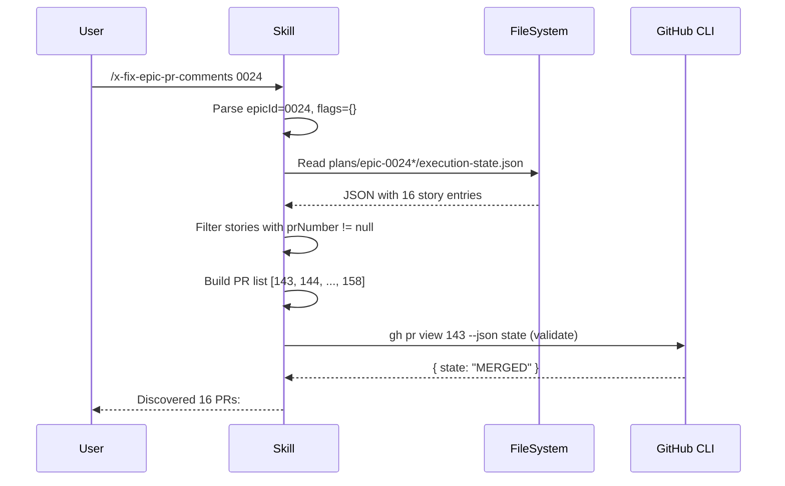

# História: SKILL.md core — input parsing, prerequisitos e PR discovery

**ID:** story-0025-0001
**Chave Jira:** —
**Status:** Pendente

## 1. Dependências

| Blocked By | Blocks |
| :--- | :--- |
| — | story-0025-0002 |

## 2. Regras Transversais Aplicáveis

| ID | Título |
| :--- | :--- |
| RULE-001 | Checkpoint como fonte de PRs |
| RULE-006 | Fallback sem execution-state.json |
| RULE-007 | Dry-run obrigatório |
| RULE-010 | Idempotência |

## 3. Descrição

Como **desenvolvedor usando ia-dev-environment**, eu quero invocar `/x-fix-epic-pr-comments 0024` e ter a skill automaticamente descobrir todos os PRs do épico, garantindo que não preciso listar PRs manualmente.

A skill define o esqueleto do workflow com 3 responsabilidades iniciais: (1) parsing do argumento posicional (epic ID) e flags opcionais, (2) validação de pré-requisitos (diretório do épico, execution-state.json ou lista explícita de PRs), e (3) descoberta de PRs a partir do checkpoint.

### 3.1 Input Parsing

- Argumento posicional obrigatório: `EPIC-ID` (4 dígitos zero-padded, ex: `0024`)
- Flags opcionais:
  - `--dry-run`: gera relatório sem aplicar correções (RULE-007)
  - `--prs 143,144,145`: lista explícita de PRs (RULE-006, fallback sem checkpoint)
  - `--skip-replies`: não responde aos comentários originais
  - `--include-suggestions`: inclui suggestions além de actionable nas correções
- Se EPIC-ID ausente: `ERROR: Epic ID is required. Usage: /x-fix-epic-pr-comments [EPIC-ID] [flags]`
- Flags `--prs` e EPIC-ID sem checkpoint: usar lista explícita
- Flags `--prs` e EPIC-ID com checkpoint: `--prs` tem precedência (override)

### 3.2 Prerequisite Checks

1. Se `--prs` NÃO fornecido:
   - Verificar existência de `plans/epic-XXXX/` (ou variante com sufixo, ex: `plans/epic-XXXX-*`)
   - Verificar existência de `execution-state.json` no diretório do épico
   - Se não encontrado: `ERROR: execution-state.json not found. Use --prs flag to provide PR list explicitly.`
2. Se `--prs` fornecido:
   - Validar que todos os números são inteiros positivos
   - Verificar que ao menos 1 PR existe via `gh pr view {N} --json state`
   - Se nenhum PR válido: `ERROR: No valid PRs found in the provided list.`

### 3.3 PR Discovery

1. Ler `execution-state.json` e extrair `prNumber` de cada story entry
2. Filtrar stories com `prNumber != null`
3. Ordenar PRs por número (crescente)
4. Output: lista de PRs `[{ prNumber, storyId, prMergeStatus }]`
5. Log: `Discovered {N} PRs from epic {epicId}: #{pr1}, #{pr2}, ...`

### 3.4 Idempotência (RULE-010)

1. Verificar se branch `fix/epic-{epicId}-pr-comments` já existe
2. Se existe: perguntar `Branch fix/epic-{epicId}-pr-comments already exists. Update existing (u) or create new (n)?`
3. Se `--dry-run`: ignorar check de idempotência (apenas gera relatório)

## 3.5 Entrega de Valor

- **Valor Principal:** Skill invocável que automatiza a descoberta de PRs de um épico completo
- **Métrica de Sucesso:** Invocar `/x-fix-epic-pr-comments 0024` retorna a lista dos 16 PRs corretamente
- **Impacto no Negócio:** Elimina etapa manual de coletar números de PR para correção de comentários

## 4. Definições de Qualidade Locais

### DoR Local (Definition of Ready)

- [ ] `execution-state.json` schema com campos `prNumber` e `prUrl` documentado
- [ ] Skill `x-fix-pr-comments` existente como referência de classificação
- [ ] Pelo menos 1 épico com PRs mergeados disponível para teste (EPIC-0024)

### DoD Local (Definition of Done)

- [ ] SKILL.md criado em `.claude/skills/x-fix-epic-pr-comments/SKILL.md`
- [ ] Input parsing cobre EPIC-ID, --dry-run, --prs, --skip-replies, --include-suggestions
- [ ] PR discovery funciona com execution-state.json
- [ ] Fallback com --prs funciona sem execution-state.json
- [ ] Pelo menos 1 teste automatizado validando PR discovery
- [ ] Smoke test passando

### Global Definition of Done (DoD)

- **Cobertura:** ≥ 95% Line, ≥ 90% Branch
- **Testes Automatizados:** Golden tests para todos os profiles
- **Relatório de Cobertura:** JaCoCo integrado ao `mvn verify`
- **Documentação:** Skill aparece no catálogo do CLAUDE.md
- **TDD Compliance:** Commits show test-first pattern

## 5. Contratos de Dados (Data Contract)

### 5.1 Input (Argumento CLI)

| Campo | Tipo | M/O | Validações | Exemplo |
| :--- | :--- | :--- | :--- | :--- |
| `epicId` | `String(4)` | M | `^\d{4}$` | `0024` |
| `--dry-run` | `boolean` | O | — | `true` |
| `--prs` | `List<Integer>` | O | cada item > 0 | `143,144,145` |
| `--skip-replies` | `boolean` | O | — | `true` |
| `--include-suggestions` | `boolean` | O | — | `true` |

### 5.2 Output (PR Discovery)

| Campo | Tipo | Sempre presente | Descrição |
| :--- | :--- | :--- | :--- |
| `prNumber` | `Integer` | Sim | Número do PR no GitHub |
| `storyId` | `String` | Sim | ID da história (ex: `story-0024-0001`) |
| `prMergeStatus` | `String` | Sim | `OPEN`, `MERGED`, `CLOSED` |

### 5.3 Error Codes Mapeados

| HTTP Status | Error Code | Condição | Mensagem |
| :--- | :--- | :--- | :--- |
| N/A | `EPIC_DIR_NOT_FOUND` | Diretório do épico não existe | `Directory plans/epic-{epicId}/ not found.` |
| N/A | `CHECKPOINT_NOT_FOUND` | execution-state.json não existe e --prs não fornecido | `execution-state.json not found. Use --prs flag.` |
| N/A | `NO_VALID_PRS` | Nenhum PR válido encontrado | `No valid PRs found.` |
| N/A | `INVALID_EPIC_ID` | EPIC-ID não é 4 dígitos | `Invalid epic ID format. Expected 4 digits.` |

## 6. Diagramas

### 6.1 Fluxo de PR Discovery



## 7. Critérios de Aceite (Gherkin)

```gherkin
Cenario: Epic ID ausente
  DADO que o usuário invoca /x-fix-epic-pr-comments sem argumentos
  QUANDO a skill processa o input
  ENTÃO exibe "ERROR: Epic ID is required"
  E a execução é abortada

Cenario: PR discovery com execution-state.json
  DADO que o épico 0024 possui execution-state.json com 16 stories
  E 16 stories possuem prNumber preenchido
  QUANDO a skill descobre os PRs
  ENTÃO retorna lista com 16 PRs ordenados por número
  E loga "Discovered 16 PRs from epic 0024"

Cenario: Fallback com --prs sem checkpoint
  DADO que o épico 0099 NÃO possui execution-state.json
  E o usuário fornece --prs 143,144,145
  QUANDO a skill processa os prerequisitos
  ENTÃO usa a lista explícita de PRs
  E NÃO exibe erro sobre checkpoint ausente

Cenario: Nenhum PR válido na lista explícita
  DADO que o usuário fornece --prs 99999
  E o PR 99999 não existe no GitHub
  QUANDO a skill valida os PRs
  ENTÃO exibe "ERROR: No valid PRs found"
  E a execução é abortada

Cenario: Stories sem PR são ignoradas
  DADO que o épico possui 16 stories
  E 2 stories possuem prNumber = null (FAILED antes de criar PR)
  QUANDO a skill descobre os PRs
  ENTÃO retorna lista com 14 PRs (ignora as 2 sem PR)

Cenario: Branch de correção já existe (idempotência)
  DADO que a branch fix/epic-0024-pr-comments já existe
  E --dry-run NÃO está ativado
  QUANDO a skill verifica idempotência
  ENTÃO pergunta ao usuário "Update existing or create new?"
```

## 8. Sub-tarefas

- [ ] [Dev] Criar `.claude/skills/x-fix-epic-pr-comments/SKILL.md` com seções Input Parsing, Prerequisites, PR Discovery
- [ ] [Dev] Implementar parsing de EPIC-ID e 4 flags opcionais
- [ ] [Dev] Implementar leitura de execution-state.json e extração de PRs
- [ ] [Dev] Implementar fallback com --prs
- [ ] [Dev] Implementar check de idempotência (branch existente)
- [ ] [Test] Unitário: parsing de argumentos (6 cenários)
- [ ] [Test] Integração: PR discovery com execution-state.json real (EPIC-0024)
- [ ] [Test] Smoke/E2E: invocação completa com --dry-run retorna lista de PRs
