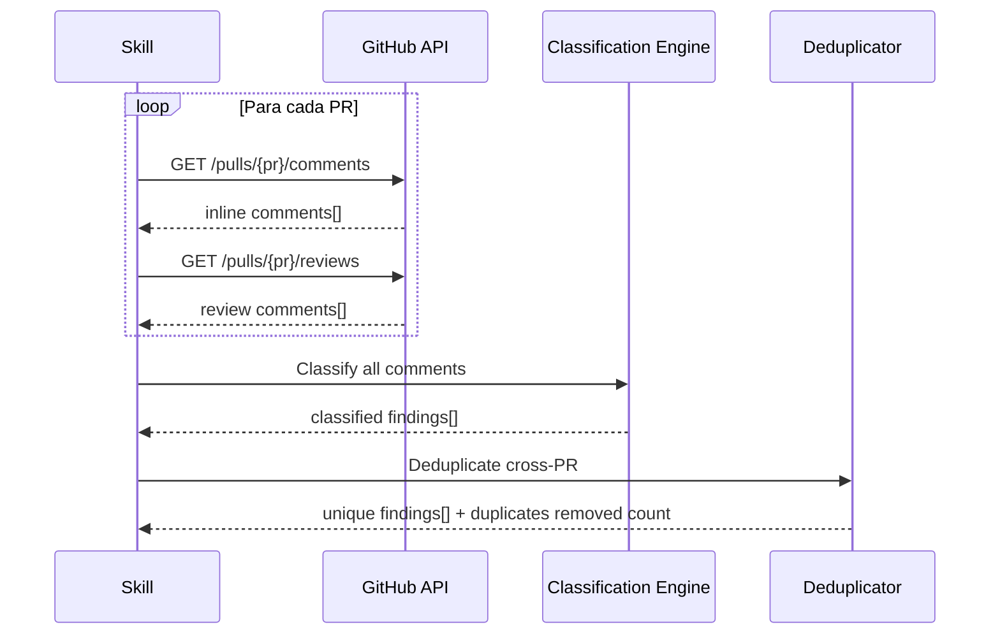

# História: Batch comment fetching e classificação cross-PR

**ID:** story-0025-0002
**Chave Jira:** —
**Status:** Pendente

## 1. Dependências

| Blocked By | Blocks |
| :--- | :--- |
| story-0025-0001 | story-0025-0003 |

## 2. Regras Transversais Aplicáveis

| ID | Título |
| :--- | :--- |
| RULE-002 | Classificação consistente com x-fix-pr-comments |
| RULE-005 | Deduplicação cross-PR |

## 3. Descrição

Como **desenvolvedor**, eu quero que todos os comentários de review de todos os PRs do épico sejam coletados e classificados de uma só vez, garantindo que não preciso abrir cada PR individualmente para triagem.

Esta história implementa o engine de coleta e classificação em batch. Para cada PR descoberto (story-0025-0001), a skill executa `gh api` para obter inline comments e review-level comments, classifica cada um usando as heurísticas do `x-fix-pr-comments`, e consolida em uma estrutura unificada com deduplicação cross-PR.

### 3.1 Comment Fetching (Batch)

Para cada PR na lista:
1. Fetch inline comments: `gh api repos/{owner}/{repo}/pulls/{prNumber}/comments`
2. Fetch review-level comments: `gh api repos/{owner}/{repo}/pulls/{prNumber}/reviews`
3. Extrair de cada inline comment: `{ id, path, line, body, createdAt, user.login }`
4. Extrair de cada review: `{ id, body, state, user.login }` (filtrar reviews com body vazio)
5. Rate limiting: respeitar GitHub API rate limits (5000 req/hora), pausar se necessário
6. Timeout: 30 segundos por PR, skip com warning se timeout

### 3.2 Classification Engine

Reutilizar as heurísticas do `x-fix-pr-comments`:

| Tipo | Heurísticas |
| :--- | :--- |
| **Actionable** | "please change", "should be", "must", "fix", "bug", "wrong", tem bloco `suggestion` |
| **Suggestion** | "consider", "maybe", "could", "suggestion", "nit" |
| **Question** | contém "?", "why", "what", "how does" |
| **Praise** | "LGTM", "nice", "good", "great" |
| **Resolved** | Thread marcada como resolved |

Prioridade de classificação (quando múltiplas heurísticas match):
1. Resolved (sempre vence — se thread resolved, ignorar conteúdo)
2. Actionable (tem bloco `suggestion` = automaticamente actionable)
3. Question (presença de "?" com intent de pergunta)
4. Suggestion
5. Praise

### 3.3 Deduplicação Cross-PR (RULE-005)

Comentários idênticos ou quase-idênticos podem aparecer em múltiplos PRs quando:
- Golden files são copiados identicamente entre profiles
- O mesmo padrão de código aparece em múltiplos PRs da mesma fase

Algoritmo de deduplicação:
1. Para cada comentário, computar fingerprint: `hash(body_normalizado + path_basename)`
2. `body_normalizado` = body com whitespace normalizado e line numbers removidos
3. Agrupar comentários com mesmo fingerprint
4. Manter apenas 1 entry no relatório, com campo `affectedPRs: [143, 144, ...]`
5. A correção será aplicada uma única vez (o fix afeta todos os PRs)

### 3.4 Estrutura de Dados Consolidada

```json
{
  "epicId": "0024",
  "totalPRs": 16,
  "totalComments": 59,
  "uniqueFindings": 34,
  "findings": [
    {
      "id": "F-001",
      "fingerprint": "abc123...",
      "classification": "actionable",
      "file": "path/to/file.md",
      "line": 47,
      "body": "Fix LGPD name...",
      "hasSuggestion": true,
      "suggestionCode": "### LGPD (Lei Geral de Proteção de Dados Pessoais)",
      "sourcePRs": [143],
      "affectedPRs": [143],
      "reviewer": "copilot-pull-request-reviewer[bot]",
      "theme": null
    }
  ],
  "summary": {
    "actionable": 34,
    "suggestion": 33,
    "question": 0,
    "praise": 0,
    "resolved": 0,
    "duplicatesRemoved": 25
  }
}
```

## 3.5 Entrega de Valor

- **Valor Principal:** Classificação automática de 60+ comentários em < 2 minutos, com deduplicação
- **Métrica de Sucesso:** Executar contra EPIC-0024 retorna 34 actionable + 33 suggestion (validado manualmente)
- **Impacto no Negócio:** Substitui 1-2 horas de triagem manual por coleta automatizada

## 4. Definições de Qualidade Locais

### DoR Local (Definition of Ready)

- [ ] Story-0025-0001 concluída (PR discovery funcional)
- [ ] Heurísticas de classificação do `x-fix-pr-comments` documentadas
- [ ] EPIC-0024 com 16 PRs mergeados disponível como caso de teste

### DoD Local (Definition of Done)

- [ ] Fetch de inline comments e review comments implementado
- [ ] 5 categorias de classificação implementadas com heurísticas corretas
- [ ] Deduplicação cross-PR remove comentários em golden files repetidos
- [ ] Rate limiting e timeout implementados
- [ ] Pelo menos 1 teste automatizado validando classificação
- [ ] Smoke test passando

### Global Definition of Done (DoD)

- **Cobertura:** ≥ 95% Line, ≥ 90% Branch
- **Testes Automatizados:** Golden tests para todos os profiles
- **TDD Compliance:** Commits show test-first pattern

## 5. Contratos de Dados (Data Contract)

### 5.1 Input (PR List)

| Campo | Tipo | M/O | Validações | Exemplo |
| :--- | :--- | :--- | :--- | :--- |
| `prList` | `List<PREntry>` | M | size >= 1 | `[{prNumber: 143, storyId: "story-0024-0002"}]` |
| `prNumber` | `Integer` | M | > 0 | `143` |
| `storyId` | `String` | M | pattern `story-\d{4}-\d{4}` | `story-0024-0002` |

### 5.2 Output (Classified Findings)

| Campo | Tipo | Sempre presente | Descrição |
| :--- | :--- | :--- | :--- |
| `findings` | `List<Finding>` | Sim | Lista de findings únicos classificados |
| `summary.actionable` | `Integer` | Sim | Contagem de actionable |
| `summary.suggestion` | `Integer` | Sim | Contagem de suggestions |
| `summary.duplicatesRemoved` | `Integer` | Sim | Duplicatas removidas pela deduplicação |

## 6. Diagramas

### 6.1 Fluxo de Coleta e Classificação



## 7. Critérios de Aceite (Gherkin)

```gherkin
Cenario: PR sem comentários
  DADO que o PR #158 não possui inline comments nem review comments
  QUANDO a skill coleta comentários do PR #158
  ENTÃO retorna lista vazia para esse PR
  E o PR é contabilizado no totalPRs mas contribui 0 findings

Cenario: Classificação de comentário actionable
  DADO que o PR #143 possui comentário com bloco suggestion
  E o body contém "should be" e rename suggestion
  QUANDO a skill classifica o comentário
  ENTÃO classifica como "actionable"
  E preserva o suggestionCode do bloco suggestion

Cenario: Classificação de comentário suggestion
  DADO que o PR #144 possui comentário com "consider" no body
  E NÃO possui bloco suggestion
  QUANDO a skill classifica o comentário
  ENTÃO classifica como "suggestion"

Cenario: Deduplicação de comentários em golden files
  DADO que os PRs #148, #150, #151, #152 possuem comentário idêntico
  E o comentário refere-se ao mesmo basename de arquivo
  QUANDO a skill deduplica os findings
  ENTÃO retorna 1 finding único com affectedPRs: [148, 150, 151, 152]
  E summary.duplicatesRemoved inclui 3 duplicatas removidas

Cenario: Rate limiting do GitHub API
  DADO que a skill está processando 20 PRs
  E o rate limit do GitHub API é atingido
  QUANDO a skill detecta HTTP 429
  ENTÃO pausa execução pelo tempo indicado no header Retry-After
  E retoma automaticamente

Cenario: Timeout em PR individual
  DADO que o PR #999 está demorando mais de 30 segundos
  QUANDO o timeout é atingido
  ENTÃO a skill loga warning "Timeout fetching comments for PR #999"
  E continua processando os demais PRs
```

## 8. Sub-tarefas

- [ ] [Dev] Implementar batch fetching via `gh api` para inline e review comments
- [ ] [Dev] Implementar classification engine com 5 categorias e heurísticas
- [ ] [Dev] Implementar deduplicação cross-PR com fingerprinting
- [ ] [Dev] Implementar rate limiting e timeout handling
- [ ] [Test] Unitário: classificação de cada categoria (5 cenários)
- [ ] [Test] Unitário: deduplicação com fingerprinting (3 cenários)
- [ ] [Test] Integração: batch fetch contra EPIC-0024 (16 PRs reais)
- [ ] [Test] Smoke/E2E: coleta completa retorna contagens esperadas
