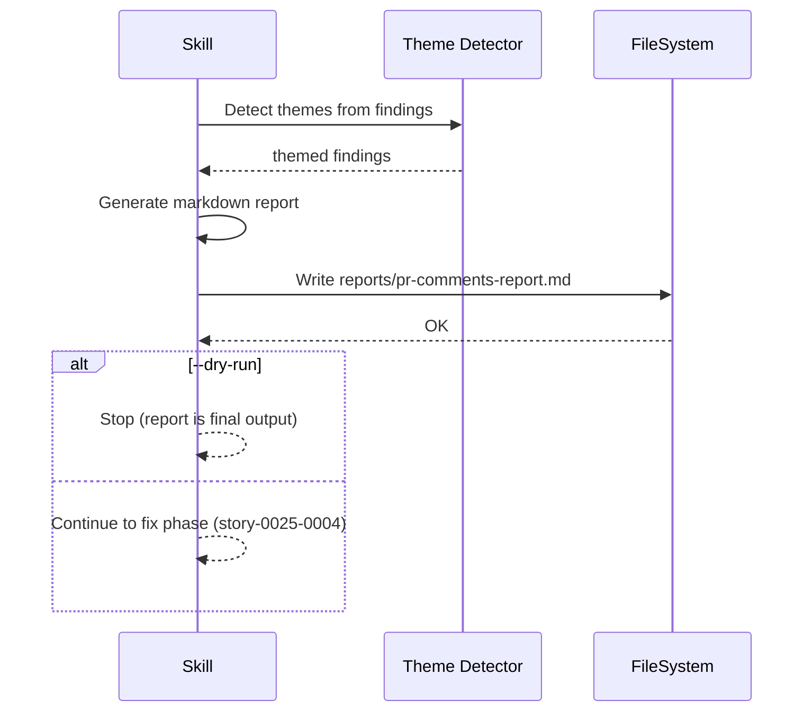

# História: Relatório consolidado de findings

**ID:** story-0025-0003
**Chave Jira:** —
**Status:** Pendente

## 1. Dependências

| Blocked By | Blocks |
| :--- | :--- |
| story-0025-0002 | story-0025-0004 |

## 2. Regras Transversais Aplicáveis

| ID | Título |
| :--- | :--- |
| RULE-004 | Relatório persistido antes das correções |
| RULE-005 | Deduplicação cross-PR |
| RULE-007 | Dry-run obrigatório |

## 3. Descrição

Como **desenvolvedor**, eu quero um relatório consolidado em markdown com todos os findings agrupados por categoria e tema, garantindo que posso revisar o que será corrigido antes de aplicar mudanças.

Esta história gera o arquivo `pr-comments-report.md` com visão agregada de todos os findings. O relatório é gerado ANTES de qualquer correção (RULE-004) e serve como artefato de auditoria. Em modo `--dry-run` (RULE-007), o relatório é o output final da skill.

### 3.1 Formato do Relatório

```markdown
# PR Review Comments — Consolidated Report

**Epic:** EPIC-{epicId}
**Date:** {date}
**PRs Analyzed:** {totalPRs}
**Total Comments:** {totalComments}
**Unique Findings:** {uniqueFindings} (after deduplication)

## Summary

| Category | Count | % |
|----------|-------|---|
| Actionable | N | X% |
| Suggestion | N | X% |
| Question | N | X% |
| Praise | N | X% |
| Resolved | N | X% |
| Duplicates Removed | N | — |

## Actionable Findings

| # | PRs | File | Line | Summary | Has Suggestion | Theme |
|---|-----|------|------|---------|----------------|-------|
| 1 | #143 | _TEMPLATE-COMPLIANCE-ASSESSMENT.md | 47 | Fix LGPD name | Yes | naming |
| 2 | #143,#154 | _TEMPLATE-COMPLIANCE-ASSESSMENT.md | 155 | Rename placeholder | Yes | placeholder |

## Suggestion Findings

| # | PRs | File | Line | Summary | Theme |
|---|-----|------|------|---------|-------|
| 1 | #144 | EpicOrchestrationTemplatesTest.java | 714 | Rename test helpers | testing |

## Questions Requiring Human Response

| # | PR | File | Line | Reviewer | Question |
|---|-----|------|------|----------|----------|
| (none) |

## Recurring Themes

| Theme | Count | Affected PRs | Description |
|-------|-------|--------------|-------------|
| naming | N | #143, #146 | Inconsistent placeholder or entity naming |
| placeholder | N | #143, #146 | Ambiguous or wrong placeholder variables |
| golden-files | N | #148-#154 | Golden file inconsistencies (auto-fixable) |

## Dry-Run Summary (when --dry-run)

Fixes NOT applied. Review the actionable findings above and re-run without --dry-run to apply corrections.
```

### 3.2 Theme Detection

Agrupar findings por tema para identificar padrões recorrentes:

| Tema | Heurística de detecção |
| :--- | :--- |
| `naming` | body contém "rename", "naming", "name", "diacritics" |
| `placeholder` | body contém "placeholder", `{{`, "ambiguous" |
| `consistency` | body contém "inconsistent", "standardize", "align" |
| `testing` | file path contém `Test.java`, `test/`, `spec` |
| `golden-files` | file path contém `golden/` |
| `security` | body contém "security", "OWASP", "injection", "XSS" |
| `other` | nenhuma heurística match |

### 3.3 Persistência (RULE-004)

1. Criar diretório `plans/epic-XXXX/reports/` se não existir
2. Salvar relatório em `plans/epic-XXXX/reports/pr-comments-report.md`
3. O relatório DEVE ser salvo ANTES de qualquer correção começar
4. Se relatório já existe (re-execução): sobrescrever com dados atualizados

## 3.5 Entrega de Valor

- **Valor Principal:** Visão unificada e auditável de todos os findings em formato legível
- **Métrica de Sucesso:** Relatório contém todas as categorias com contagens corretas
- **Impacto no Negócio:** Permite decisão informada sobre quais correções aplicar

## 4. Definições de Qualidade Locais

### DoR Local (Definition of Ready)

- [ ] Story-0025-0002 concluída (classificação funcional)
- [ ] Formato do relatório aprovado pelo tech lead

### DoD Local (Definition of Done)

- [ ] Relatório gerado em markdown com todas as seções
- [ ] Theme detection agrupa findings corretamente
- [ ] Relatório persistido em `reports/pr-comments-report.md`
- [ ] `--dry-run` para execução no relatório sem correções
- [ ] Pelo menos 1 teste automatizado validando geração do relatório
- [ ] Smoke test passando

### Global Definition of Done (DoD)

- **Cobertura:** ≥ 95% Line, ≥ 90% Branch
- **TDD Compliance:** Commits show test-first pattern

## 5. Contratos de Dados (Data Contract)

### 5.1 Input

| Campo | Tipo | M/O | Validações | Exemplo |
| :--- | :--- | :--- | :--- | :--- |
| `classifiedFindings` | `ClassifiedFindings` | M | findings.size >= 0 | output de story-0025-0002 |
| `epicId` | `String(4)` | M | `^\d{4}$` | `0024` |
| `dryRun` | `boolean` | O | — | `true` |

### 5.2 Output

| Campo | Tipo | Sempre presente | Descrição |
| :--- | :--- | :--- | :--- |
| `reportPath` | `String` | Sim | Path do relatório gerado |
| `actionableCount` | `Integer` | Sim | Total de actionable findings |
| `suggestionCount` | `Integer` | Sim | Total de suggestion findings |
| `themes` | `List<Theme>` | Sim | Temas detectados com contagens |

## 6. Diagramas

### 6.1 Fluxo de Geração do Relatório



## 7. Critérios de Aceite (Gherkin)

```gherkin
Cenario: Relatório vazio (sem comentários)
  DADO que nenhum PR possui comentários
  QUANDO a skill gera o relatório
  ENTÃO o relatório contém "Total Comments: 0"
  E as tabelas de findings estão vazias
  E o arquivo é salvo em reports/pr-comments-report.md

Cenario: Relatório com findings de múltiplas categorias
  DADO que existem 34 actionable e 33 suggestion findings
  QUANDO a skill gera o relatório
  ENTÃO a seção Summary mostra contagens corretas
  E a seção Actionable Findings lista 34 entries
  E a seção Suggestion Findings lista 33 entries

Cenario: Theme detection agrupa findings
  DADO que existem 5 findings sobre placeholder naming
  E 3 findings sobre golden files
  QUANDO a skill detecta temas
  ENTÃO a seção Recurring Themes lista "placeholder" com count=5
  E lista "golden-files" com count=3

Cenario: Dry-run para no relatório
  DADO que o usuário passou --dry-run
  QUANDO o relatório é gerado
  ENTÃO a seção "Dry-Run Summary" é incluída
  E a skill NÃO avança para a fase de correção

Cenario: Relatório persistido antes das correções
  DADO que existem findings actionable a corrigir
  QUANDO a skill inicia o processo
  ENTÃO o relatório é salvo ANTES de qualquer correção
  E o timestamp do arquivo é anterior ao primeiro commit de fix

Cenario: Re-execução sobrescreve relatório anterior
  DADO que já existe reports/pr-comments-report.md de execução anterior
  QUANDO a skill é executada novamente
  ENTÃO o relatório anterior é sobrescrito com dados atualizados
```

## 8. Sub-tarefas

- [ ] [Dev] Implementar geração do relatório em markdown com todas as seções
- [ ] [Dev] Implementar theme detection com 7 categorias de tema
- [ ] [Dev] Implementar persistência em `reports/pr-comments-report.md`
- [ ] [Dev] Integrar `--dry-run` flag (parar após relatório)
- [ ] [Test] Unitário: geração de relatório com dados variados (4 cenários)
- [ ] [Test] Unitário: theme detection com heurísticas (3 cenários)
- [ ] [Test] Smoke/E2E: dry-run completo gera relatório correto
