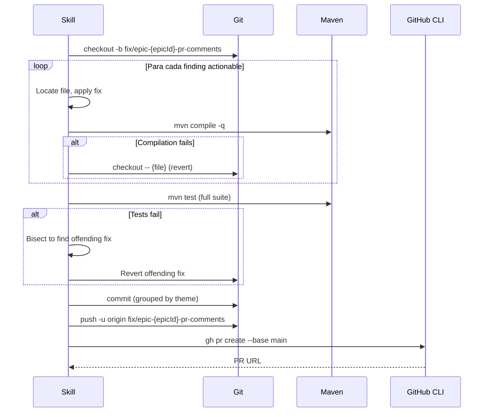

# História: Fix orchestration e criação de PR único

**ID:** story-0025-0004
**Chave Jira:** —
**Status:** Pendente

## 1. Dependências

| Blocked By | Blocks |
| :--- | :--- |
| story-0025-0003 | story-0025-0005 |

## 2. Regras Transversais Aplicáveis

| ID | Título |
| :--- | :--- |
| RULE-003 | PR único para todas as correções |
| RULE-005 | Deduplicação cross-PR |
| RULE-009 | Verificação pós-correção |
| RULE-010 | Idempotência |

## 3. Descrição

Como **desenvolvedor**, eu quero que todos os findings actionable sejam corrigidos automaticamente e consolidados em um único PR, garantindo que o ciclo de feedback é fechado com mínimo esforço manual.

Esta história implementa o motor de correção: cria uma branch, aplica fixes para cada finding actionable (e opcionalmente suggestions com `--include-suggestions`), verifica compilação e testes após cada fix, reverte fixes que causam regressão, e cria um PR único com todas as correções bem-sucedidas.

### 3.1 Branch e Setup

1. Criar branch: `git checkout -b fix/epic-{epicId}-pr-comments`
2. Se branch já existe (RULE-010): atualizar conforme decisão do usuário em story-0025-0001
3. Ponto de partida: `main` (latest)

### 3.2 Fix Application Loop

Para cada finding actionable (ordenado por file path para minimizar context switches):

1. **Localizar arquivo**: verificar que o file path existe no working tree atual
   - Se arquivo não existe (deletado/renomeado): skip com warning `"File not found: {path}"`
2. **Aplicar correção**:
   - Se finding tem `suggestionCode`: aplicar o suggestion code diretamente
   - Se finding não tem suggestion: usar o contexto do comentário para inferir a correção
   - Para golden files: aplicar correção no source template e regenerar golden files
3. **Verificar compilação**: `mvn compile -q` após cada fix
   - Se falha: `git checkout -- {files}` (revert) e marcar finding como `"fix_failed: compilation"`
4. **Verificar testes**: `mvn test` após o batch completo de fixes (não após cada individual)
   - Se falha: identificar qual fix causou a regressão via bisect simplificado
   - Reverter apenas o fix problemático
5. **Commit atômico por tema**: agrupar fixes do mesmo tema em um commit
   - Format: `fix(epic-{epicId}): {theme description}`
   - Exemplo: `fix(epic-0024): correct placeholder naming in compliance template`

### 3.3 Golden File Handling

Quando um fix afeta source templates que geram golden files:
1. Aplicar fix no source file (ex: `java/src/main/resources/shared/templates/...`)
2. Identificar se existe regeneração automática (ex: `GoldenFileRegenerator`)
3. Executar regeneração para propagar o fix para todos os profiles
4. Se regeneração não disponível: aplicar fix manualmente nos golden files afetados

### 3.4 PR Creation (RULE-003)

Após todos os fixes aplicados e verificados:

1. Stage all changes: `git add -A`
2. Final commit (se não commitado por tema): `fix(epic-{epicId}): address PR review comments from #N, #M, ...`
3. Push: `git push -u origin fix/epic-{epicId}-pr-comments`
4. Criar PR:
   ```
   gh pr create --base main \
     --title "fix(epic-{epicId}): address PR review comments" \
     --body "## Summary\n\nFixes {fixedCount} actionable findings from {prCount} PRs.\n\nFixes comments from #{pr1}, #{pr2}, ...\n\n## Findings Fixed\n\n{findings table}\n\n## Findings Skipped\n\n{skipped table}"
   ```
5. O PR body DEVE listar cada PR de origem para traceability

### 3.5 Resultado da Fase

```json
{
  "fixBranch": "fix/epic-0024-pr-comments",
  "prUrl": "https://github.com/.../pull/159",
  "prNumber": 159,
  "fixesApplied": 8,
  "fixesFailed": 0,
  "fixesSkipped": 2,
  "testsPass": true,
  "commitCount": 3
}
```

## 3.5 Entrega de Valor

- **Valor Principal:** Correções aplicadas e verificadas automaticamente em minutos ao invés de horas
- **Métrica de Sucesso:** 100% dos fixes aplicáveis são implementados sem regressão
- **Impacto no Negócio:** Reduz ciclo de feedback de reviewer de horas para minutos

## 4. Definições de Qualidade Locais

### DoR Local (Definition of Ready)

- [ ] Story-0025-0003 concluída (relatório disponível)
- [ ] Lógica de classificação diferencia findings com e sem `suggestionCode`
- [ ] Golden file regeneration mechanism identificado

### DoD Local (Definition of Done)

- [ ] Branch criada corretamente com naming convention
- [ ] Fixes aplicados para todos os findings actionable
- [ ] Compilação e testes verificados pós-fix
- [ ] Fixes que causam regressão são revertidos individualmente
- [ ] PR criado com lista de PRs de origem no body
- [ ] Pelo menos 1 teste automatizado validando fix loop
- [ ] Smoke test passando

### Global Definition of Done (DoD)

- **Cobertura:** ≥ 95% Line, ≥ 90% Branch
- **TDD Compliance:** Commits show test-first pattern

## 5. Contratos de Dados (Data Contract)

### 5.1 Input

| Campo | Tipo | M/O | Validações | Exemplo |
| :--- | :--- | :--- | :--- | :--- |
| `actionableFindings` | `List<Finding>` | M | size >= 1 | findings com classification=actionable |
| `epicId` | `String(4)` | M | `^\d{4}$` | `0024` |
| `includeSuggestions` | `boolean` | O | — | `false` |

### 5.2 Output

| Campo | Tipo | Sempre presente | Descrição |
| :--- | :--- | :--- | :--- |
| `prUrl` | `String` | Sim | URL do PR de correção |
| `prNumber` | `Integer` | Sim | Número do PR |
| `fixesApplied` | `Integer` | Sim | Quantidade de fixes bem-sucedidos |
| `fixesFailed` | `Integer` | Sim | Quantidade de fixes que falharam |
| `fixesSkipped` | `Integer` | Sim | Quantidade de fixes ignorados (file not found, etc.) |

## 6. Diagramas

### 6.1 Fluxo de Fix e PR



## 7. Critérios de Aceite (Gherkin)

```gherkin
Cenario: Nenhum finding actionable
  DADO que o relatório contém 0 findings actionable
  QUANDO a skill tenta aplicar fixes
  ENTÃO loga "No actionable findings to fix"
  E NÃO cria branch nem PR

Cenario: Fix com suggestion code aplicado com sucesso
  DADO que um finding possui suggestionCode com rename de placeholder
  E o arquivo referenciado existe no working tree
  QUANDO a skill aplica o fix
  ENTÃO o placeholder é renomeado no arquivo
  E a compilação passa

Cenario: Fix causa falha de compilação
  DADO que um finding é aplicado
  E a compilação falha após o fix
  QUANDO a skill verifica compilação
  ENTÃO reverte o fix com git checkout
  E marca o finding como "fix_failed: compilation"
  E continua com o próximo finding

Cenario: Fix causa falha de teste
  DADO que 5 fixes foram aplicados
  E o teste falha após o batch
  QUANDO a skill executa bisect simplificado
  ENTÃO identifica o fix causador da regressão
  E reverte apenas esse fix
  E os outros 4 fixes permanecem

Cenario: PR criado com referência aos PRs de origem
  DADO que fixes foram aplicados de PRs #143, #146, #155
  QUANDO a skill cria o PR
  ENTÃO o PR body contém "Fixes comments from #143, #146, #155"
  E lista cada finding corrigido em tabela

Cenario: Golden files regenerados após fix em source template
  DADO que um fix altera _TEMPLATE-COMPLIANCE-ASSESSMENT.md (source)
  E golden files em 17 profiles referenciam esse template
  QUANDO a skill aplica o fix
  ENTÃO regenera golden files para todos os profiles
  E os golden tests passam
```

## 8. Sub-tarefas

- [ ] [Dev] Implementar branch creation com naming convention e idempotência
- [ ] [Dev] Implementar fix application loop com suggestion code support
- [ ] [Dev] Implementar compile verification após cada fix com revert on failure
- [ ] [Dev] Implementar test verification com bisect simplificado
- [ ] [Dev] Implementar golden file regeneration após fix em source templates
- [ ] [Dev] Implementar PR creation com body referenciando PRs de origem
- [ ] [Test] Unitário: fix with suggestion code (2 cenários)
- [ ] [Test] Unitário: revert on compilation failure (2 cenários)
- [ ] [Test] Smoke/E2E: fix completo contra EPIC-0024 cria PR válido
