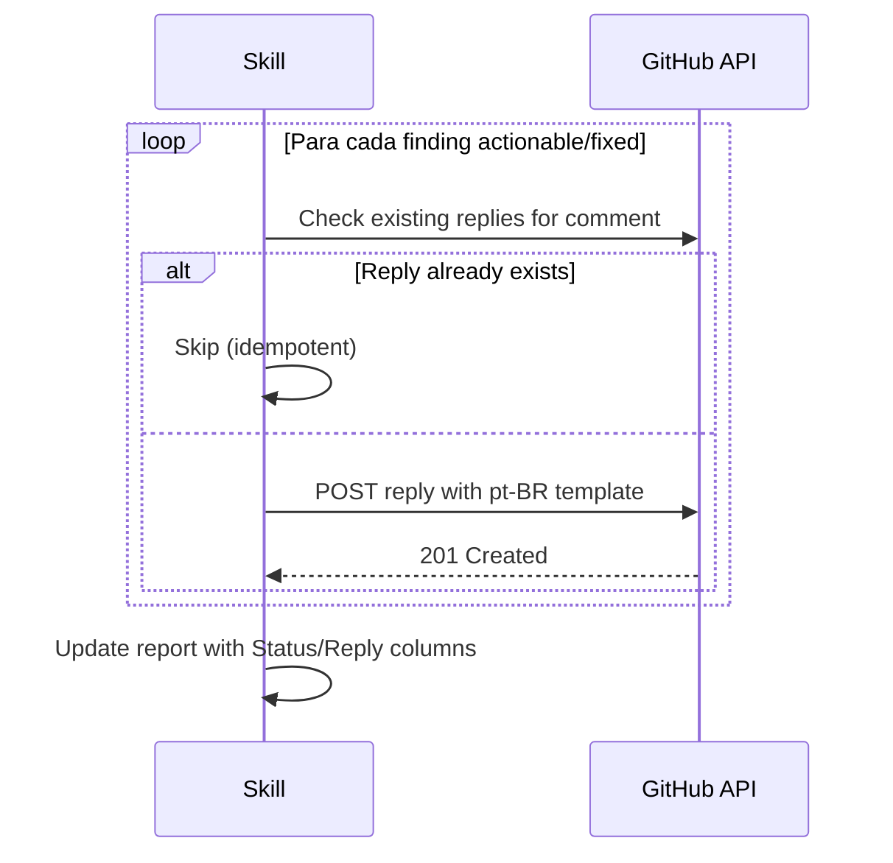

# História: Reply engine e status tracking

**ID:** story-0025-0005
**Chave Jira:** —
**Status:** Pendente

## 1. Dependências

| Blocked By | Blocks |
| :--- | :--- |
| story-0025-0004 | story-0025-0007 |

## 2. Regras Transversais Aplicáveis

| ID | Título |
| :--- | :--- |
| RULE-008 | Respostas em pt-BR |
| RULE-010 | Idempotência |

## 3. Descrição

Como **reviewer**, eu quero que cada comentário de PR receba uma resposta automática informando se foi corrigido, aceito como sugestão, ou ignorado, garantindo que o loop de feedback é fechado sem intervenção manual.

Esta história implementa o reply engine que responde a cada comentário nos PRs originais via GitHub API, usando templates em pt-BR (RULE-008), e inclui o commit SHA quando a correção foi aplicada.

### 3.1 Reply Templates (RULE-008)

| Classificação | Ação | Template de Resposta |
| :--- | :--- | :--- |
| Actionable (fixed) | Corrigido | `Corrigido no PR #{fixPR}. {descricao}. Commit: {shortSha}` |
| Actionable (failed) | Falha | `Tentei corrigir, mas causou falha de compilacao/testes. Necessita intervencao manual.` |
| Actionable (skipped) | Ignorado | `Arquivo nao encontrado no working tree atual. Possivelmente renomeado/deletado.` |
| Suggestion (accepted) | Aceito | `Sugestao aceita no PR #{fixPR}. {descricao}. Commit: {shortSha}` |
| Suggestion (not included) | N/A | (sem resposta — suggestions não corrigidas não recebem reply) |
| Question | N/A | (sem resposta — requer resposta humana) |
| Praise | N/A | (sem resposta) |

### 3.2 Reply Mechanism

Para cada finding com reply pendente:
1. Obter `commentId` do finding original
2. Postar reply via: `gh api repos/{owner}/{repo}/pulls/{prNumber}/comments/{commentId}/replies -f body="{reply}"`
3. Para review-level comments: `gh api repos/{owner}/{repo}/pulls/{prNumber}/reviews/{reviewId}/comments -f body="{reply}"`
4. Rate limiting: max 30 replies/minuto (GitHub API secondary rate limit)
5. Se `--skip-replies` flag: pular toda a fase de reply

### 3.3 Status Tracking

Atualizar o relatório `pr-comments-report.md` com coluna de status:

| # | PRs | File | Type | Status | Reply |
|---|-----|------|------|--------|-------|
| 1 | #143 | template.md | Actionable | Fixed | Replied |
| 2 | #146 | template.md | Actionable | Failed | Replied |
| 3 | #144 | test.java | Suggestion | Skipped | — |

### 3.4 Idempotência de Replies (RULE-010)

1. Antes de postar reply, verificar se já existe reply do bot nessa thread
2. Verificar via: `gh api repos/{owner}/{repo}/pulls/{prNumber}/comments/{commentId}/replies`
3. Se reply já existe com pattern `"Corrigido no PR #"`: skip
4. Log: `"Reply already posted for comment {commentId}, skipping"`

## 3.5 Entrega de Valor

- **Valor Principal:** Loop de feedback fechado automaticamente para todos os comentários
- **Métrica de Sucesso:** 100% dos findings actionable recebem reply com status
- **Impacto no Negócio:** Reviewers veem respostas sem esperar intervenção manual

## 4. Definições de Qualidade Locais

### DoR Local (Definition of Ready)

- [ ] Story-0025-0004 concluída (PR de correção criado)
- [ ] GitHub API endpoints para reply a PR comments validados
- [ ] Templates de resposta em pt-BR aprovados

### DoD Local (Definition of Done)

- [ ] Reply engine posta respostas para findings actionable corrigidos
- [ ] Respostas seguem templates em pt-BR
- [ ] `--skip-replies` flag funciona
- [ ] Idempotência: replies duplicados são detectados e ignorados
- [ ] Relatório atualizado com coluna Status e Reply
- [ ] Pelo menos 1 teste automatizado validando reply logic
- [ ] Smoke test passando

### Global Definition of Done (DoD)

- **Cobertura:** ≥ 95% Line, ≥ 90% Branch
- **TDD Compliance:** Commits show test-first pattern

## 5. Contratos de Dados (Data Contract)

### 5.1 Input

| Campo | Tipo | M/O | Validações | Exemplo |
| :--- | :--- | :--- | :--- | :--- |
| `findings` | `List<Finding>` | M | size >= 0 | findings com fixStatus preenchido |
| `fixPrNumber` | `Integer` | M | > 0 | `159` |
| `fixCommitSha` | `String` | M | hex 40 chars | `801a271b...` |
| `skipReplies` | `boolean` | O | — | `false` |

### 5.2 Output

| Campo | Tipo | Sempre presente | Descrição |
| :--- | :--- | :--- | :--- |
| `repliesSent` | `Integer` | Sim | Quantidade de replies postados |
| `repliesSkipped` | `Integer` | Sim | Replies pulados (duplicata, question, praise) |
| `repliesFailed` | `Integer` | Sim | Replies que falharam (API error) |

## 6. Diagramas

### 6.1 Fluxo de Reply



## 7. Critérios de Aceite (Gherkin)

```gherkin
Cenario: Reply para finding corrigido
  DADO que um finding actionable foi corrigido com commit abc123
  QUANDO a skill posta o reply
  ENTÃO o reply contém "Corrigido no PR #159"
  E contém "Commit: abc123"
  E está em pt-BR

Cenario: Skip reply para suggestion não corrigida
  DADO que um finding suggestion NÃO foi incluído nas correções
  QUANDO a skill processa replies
  ENTÃO NÃO posta reply para esse finding

Cenario: Skip reply para question
  DADO que um finding é classificado como question
  QUANDO a skill processa replies
  ENTÃO NÃO posta reply (requer resposta humana)

Cenario: --skip-replies ignora toda a fase
  DADO que o usuário passou --skip-replies
  QUANDO a skill chega na fase de reply
  ENTÃO loga "Reply phase skipped (--skip-replies)"
  E retorna repliesSent=0

Cenario: Reply duplicado é detectado (idempotência)
  DADO que já existe reply "Corrigido no PR #159" para o comment
  QUANDO a skill tenta postar reply novamente
  ENTÃO detecta reply existente
  E loga "Reply already posted, skipping"

Cenario: Rate limiting de replies
  DADO que a skill precisa postar 50 replies
  QUANDO atinge 30 replies/minuto
  ENTÃO pausa por 60 segundos
  E retoma automaticamente
```

## 8. Sub-tarefas

- [ ] [Dev] Implementar reply posting via GitHub API
- [ ] [Dev] Implementar templates de resposta em pt-BR
- [ ] [Dev] Implementar `--skip-replies` flag
- [ ] [Dev] Implementar idempotência de replies (check existing)
- [ ] [Dev] Implementar rate limiting (30 replies/min)
- [ ] [Dev] Atualizar relatório com colunas Status e Reply
- [ ] [Test] Unitário: reply template rendering (4 cenários)
- [ ] [Test] Unitário: idempotência de reply (2 cenários)
- [ ] [Test] Smoke/E2E: reply completo contra PR real
