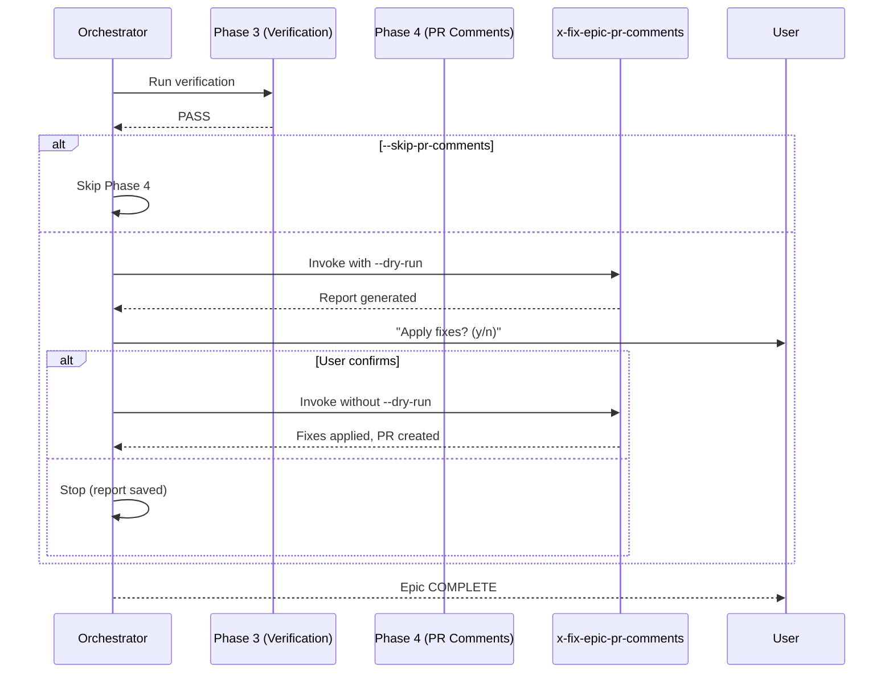

# História: Hook no x-dev-epic-implement como fase pós-execução

**ID:** story-0025-0007
**Chave Jira:** —
**Status:** Pendente

## 1. Dependências

| Blocked By | Blocks |
| :--- | :--- |
| story-0025-0005, story-0025-0006 | — |

## 2. Regras Transversais Aplicáveis

| ID | Título |
| :--- | :--- |
| RULE-003 | PR único para todas as correções |
| RULE-007 | Dry-run obrigatório |

## 3. Descrição

Como **desenvolvedor executando um épico completo**, eu quero que a correção de comentários de PR seja oferecida automaticamente após a Phase 3 (Verification) do `x-dev-epic-implement`, garantindo que o feedback de reviewers é endereçado sem etapa manual separada.

Esta história adiciona uma fase opcional (Phase 4 — PR Comment Remediation) ao `x-dev-epic-implement` que invoca `/x-fix-epic-pr-comments` automaticamente após a verificação final do épico.

### 3.1 Nova Fase no x-dev-epic-implement

Adicionar **Phase 4 — PR Comment Remediation** após Phase 3 (Verification):

```
Phase 3 — Verification (existing)
  ↓
Phase 4 — PR Comment Remediation (NEW, optional)
  4.1 Check if PR comments exist across story PRs
  4.2 If comments found: invoke /x-fix-epic-pr-comments {epicId}
  4.3 If no comments: skip with log "No PR comments to remediate"
```

### 3.2 Ativação

- **Default:** Ativado (executa automaticamente)
- **Desativar:** Flag `--skip-pr-comments` no `x-dev-epic-implement`
- **Modo:** `--dry-run` por default na primeira execução (mostra relatório)
  - Perguntar ao usuário: `PR comment report generated. Apply fixes? (y/n)`
  - Se `y`: executar sem `--dry-run`
  - Se `n`: parar (relatório fica salvo para revisão)
- **Com `--auto-merge`:** Executar sem confirmação (apply fixes diretamente)

### 3.3 Modificações no SKILL.md do x-dev-epic-implement

1. Adicionar flag `--skip-pr-comments` na tabela de flags opcionais
2. Adicionar seção "Phase 4 — PR Comment Remediation" após Phase 3
3. Atualizar Completion Output para incluir PR comment remediation status
4. Atualizar Integration Notes com referência a `x-fix-epic-pr-comments`

### 3.4 Atualização do Completion Output

```
Epic: EPIC-{epicId} — {title}
Status: COMPLETE
...
PR Comment Remediation: {fixPR} ({fixCount} fixes applied)
```

### 3.5 Checkpoint Update

Adicionar campo ao `execution-state.json`:

```json
{
  "prCommentRemediation": {
    "status": "COMPLETE" | "SKIPPED" | "DRY_RUN",
    "fixPrUrl": "https://github.com/.../pull/159",
    "fixPrNumber": 159,
    "fixesApplied": 8,
    "reportPath": "plans/epic-XXXX/reports/pr-comments-report.md"
  }
}
```

## 3.5 Entrega de Valor

- **Valor Principal:** Zero intervenção manual para correção de PR comments pós-épico
- **Métrica de Sucesso:** Épico completo com feedback de reviewers endereçado em um único fluxo
- **Impacto no Negócio:** Ciclo completo de épico (implementação + review + correção) sem pausa

## 4. Definições de Qualidade Locais

### DoR Local (Definition of Ready)

- [ ] Stories 0025-0005 e 0025-0006 concluídas (skill funcional e distribuída)
- [ ] x-dev-epic-implement SKILL.md lido e compreendido
- [ ] Padrão de extensão de fases do épico orchestrator documentado

### DoD Local (Definition of Done)

- [ ] Flag `--skip-pr-comments` adicionada ao x-dev-epic-implement
- [ ] Phase 4 implementada com dry-run + confirmação por default
- [ ] Completion Output atualizado com status de remediation
- [ ] Checkpoint atualizado com campo prCommentRemediation
- [ ] Golden files regenerados
- [ ] Pelo menos 1 teste automatizado validando Phase 4
- [ ] Smoke test passando

### Global Definition of Done (DoD)

- **Cobertura:** ≥ 95% Line, ≥ 90% Branch
- **TDD Compliance:** Commits show test-first pattern

## 5. Contratos de Dados (Data Contract)

### 5.1 Checkpoint Extension

| Campo | Tipo | M/O | Validações | Exemplo |
| :--- | :--- | :--- | :--- | :--- |
| `prCommentRemediation.status` | `String` | M | enum: COMPLETE, SKIPPED, DRY_RUN | `COMPLETE` |
| `prCommentRemediation.fixPrUrl` | `String` | O | valid URL | `https://github.com/.../pull/159` |
| `prCommentRemediation.fixPrNumber` | `Integer` | O | > 0 | `159` |
| `prCommentRemediation.fixesApplied` | `Integer` | M | >= 0 | `8` |
| `prCommentRemediation.reportPath` | `String` | M | valid path | `plans/epic-XXXX/reports/pr-comments-report.md` |

## 6. Diagramas

### 6.1 Fluxo no x-dev-epic-implement



## 7. Critérios de Aceite (Gherkin)

```gherkin
Cenario: Phase 4 executa por default após verificação
  DADO que Phase 3 (Verification) completou com PASS
  E --skip-pr-comments NÃO foi passado
  QUANDO o orchestrator avança para Phase 4
  ENTÃO invoca x-fix-epic-pr-comments com --dry-run
  E apresenta relatório ao usuário

Cenario: --skip-pr-comments pula Phase 4
  DADO que o usuário passou --skip-pr-comments
  QUANDO Phase 3 completa
  ENTÃO loga "PR comment remediation skipped (--skip-pr-comments)"
  E checkpoint registra prCommentRemediation.status = "SKIPPED"

Cenario: Sem comentários de PR encontrados
  DADO que nenhum PR do épico possui review comments
  QUANDO Phase 4 executa
  ENTÃO loga "No PR comments to remediate"
  E checkpoint registra prCommentRemediation.status = "SKIPPED"

Cenario: Usuário confirma aplicação de fixes
  DADO que o dry-run gerou relatório com 8 actionable findings
  E o usuário responde "y" à confirmação
  QUANDO a skill executa sem dry-run
  ENTÃO aplica os 8 fixes e cria PR
  E checkpoint registra prCommentRemediation.status = "COMPLETE"

Cenario: --auto-merge bypassa confirmação
  DADO que --auto-merge está ativado no x-dev-epic-implement
  QUANDO Phase 4 executa
  ENTÃO aplica fixes diretamente sem confirmação
  E cria PR automaticamente

Cenario: Checkpoint atualizado com resultado da remediation
  DADO que Phase 4 completou com 8 fixes
  QUANDO o checkpoint é atualizado
  ENTÃO prCommentRemediation.fixesApplied = 8
  E prCommentRemediation.fixPrUrl contém URL do PR
```

## 8. Sub-tarefas

- [ ] [Dev] Adicionar flag `--skip-pr-comments` ao x-dev-epic-implement
- [ ] [Dev] Implementar Phase 4 com dry-run + confirmação
- [ ] [Dev] Implementar bypass de confirmação com --auto-merge
- [ ] [Dev] Atualizar Completion Output com remediation status
- [ ] [Dev] Atualizar checkpoint schema com prCommentRemediation
- [ ] [Dev] Regenerar golden files para todos os profiles
- [ ] [Test] Unitário: Phase 4 activation logic (3 cenários)
- [ ] [Test] Unitário: checkpoint extension (2 cenários)
- [ ] [Test] Smoke/E2E: épico completo com Phase 4 integrada
