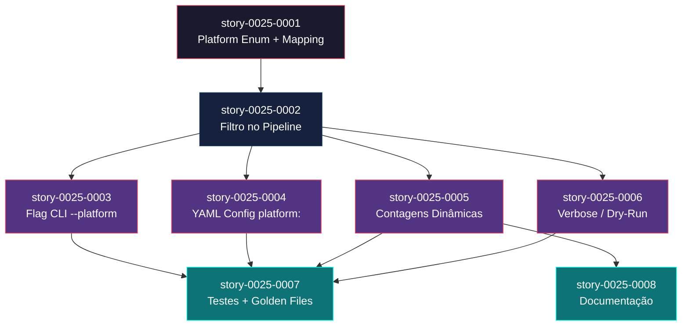

# Mapa de Implementação — Platform Target Filter

**Gerado a partir das dependências BlockedBy/Blocks de cada história do epic-0025.**

---

## 1. Matriz de Dependências

| Story | Título | Chave Jira | Blocked By | Blocks | Status |
| :--- | :--- | :--- | :--- | :--- | :--- |
| story-0025-0001 | Platform Enum e Mapeamento de Assemblers | — | — | story-0025-0002 | Pendente |
| story-0025-0002 | Filtro de Assemblers no Pipeline | — | story-0025-0001 | story-0025-0003, story-0025-0004, story-0025-0005, story-0025-0006 | Pendente |
| story-0025-0003 | Flag CLI `--platform` | — | story-0025-0002 | story-0025-0007 | Pendente |
| story-0025-0004 | Suporte `platform:` no YAML Config | — | story-0025-0002 | story-0025-0007 | Pendente |
| story-0025-0005 | Contagem Dinâmica de Artefatos no README e CLAUDE.md | — | story-0025-0002 | story-0025-0007, story-0025-0008 | Pendente |
| story-0025-0006 | Verbose e Dry-Run com Awareness de Plataforma | — | story-0025-0002 | story-0025-0007 | Pendente |
| story-0025-0007 | Atualização de Testes e Golden Files | — | story-0025-0003, story-0025-0004, story-0025-0005, story-0025-0006 | — | Pendente |
| story-0025-0008 | Documentação e Help Text | — | story-0025-0005 | — | Pendente |

> **Nota:** story-0025-0002 é o gargalo central — bloqueia 4 histórias downstream. story-0025-0007 é a história de convergência que depende de todas as features para consolidar testes.

---

## 2. Fases de Implementação

> As histórias são agrupadas em fases. Dentro de cada fase, as histórias podem ser implementadas **em paralelo**. Uma fase só pode iniciar quando todas as dependências das fases anteriores estiverem concluídas.

```
╔══════════════════════════════════════════════════════════════════════════╗
║                   FASE 0 — Foundation (1 story)                        ║
║                                                                        ║
║   ┌──────────────────────────────────────────────────���──────┐          ║
║   │  story-0025-0001                                        │          ║
║   │  Platform Enum e Mapeamento de Assemblers               │          ║
║   └────────────────────────────┬────────────────────────────┘          ║
╚════════════════════════════════╪═══════════════════════════════════════╝
                                 │
                                 ▼
╔══════════════════════════════════════════════════════════════════════════╗
║                   FASE 1 — Core (1 story)                              ║
║                                                                        ║
║   ┌─────────────────────────────────────────────────────────┐          ║
║   │  story-0025-0002                                        │          ║
║   │  Filtro de Assemblers no Pipeline                       │          ║
║   │  (← story-0025-0001)                                    │          ║
║   └──────┬──────────┬──────────┬──────────┬─────────────────┘          ║
╚══════════╪══════════╪══════════╪══════════╪════════════════════════════╝
           │          │          │          │
           ▼          ▼          ▼          ▼
╔══════════════════════════════════════════════════════════════════════════╗
║                   FASE 2 — Extensions (paralelo, 4 stories)            ║
║                                                                        ║
║   ┌──────────────┐ ┌──────────────┐ ┌──────────────┐ ┌──────────────┐ ║
║   │ story-0025-  │ │ story-0025-  │ │ story-0025-  │ │ story-0025-  │ ║
║   │ 0003         │ │ 0004         │ │ 0005         │ │ 0006         │ ║
║   │ Flag CLI     │ │ YAML Config  │ │ Contagens    │ │ Verbose/     │ ║
║   │ --platform   │ │ platform:    │ │ Dinâmicas    │ │ Dry-Run      │ ║
║   └──────┬───────┘ └──────┬───────┘ └───┬──────┬───┘ └──────┬───────┘ ║
╚══════════╪════════════════╪═════════════╪══════╪════════════╪═════════╝
           │                │             │      │            │
           └────────┬───────┘             │      │            │
                    │       ┌─────────────┘      │            │
                    │       │    ┌───────────────┘            │
                    │       │    │    ┌────────────────────────┘
                    ▼       ▼    ▼    ▼
╔══════════════════════════════════════════════════════════════════════════╗
║                   FASE 3 — Quality & Docs (paralelo, 2 stories)        ║
║                                                                        ║
║   ┌────────────────────────────��────┐  ┌────────────────────────────┐  ║
║   │  story-0025-0007                │  │  story-0025-0008           │  ║
║   │  Testes e Golden Files          │  │  Documentação e Help Text  │  ║
║   │  (← 0003, 0004, 0005, 0006)    │  │  (← 0005)                 │  ║
║   └─────────────────────────────────┘  └────────────────────────────┘  ║
╚══════════════════════════════════════════════════════════════════════════╝
```

---

## 3. Caminho Crítico

> O caminho crítico (a sequência mais longa de dependências) determina o tempo mínimo de implementação do projeto.

```
story-0025-0001 ──→ story-0025-0002 ──→ story-0025-0003 ──→ story-0025-0007
                                    ──→ story-0025-0004 ──→ story-0025-0007
                                    ──→ story-0025-0005 ──→ story-0025-0007
                                    ──→ story-0025-0006 ──→ story-0025-0007
   Fase 0              Fase 1              Fase 2              Fase 3
```

**4 fases no caminho crítico, 4 histórias na cadeia mais longa (story-0025-0001 → story-0025-0002 → story-0025-{0003|0004|0005|0006} → story-0025-0007).**

O caminho crítico passa obrigatoriamente por story-0025-0002 (filtro no pipeline), que é o gargalo único do épico. Qualquer atraso nesta história propaga diretamente para a Fase 2 inteira e para a Fase 3. As 4 histórias da Fase 2 são independentes entre si e podem ser implementadas em paralelo, absorvendo variação de tempo sem impactar o caminho crítico — desde que TODAS completem antes da Fase 3.

---

## 4. Grafo de Dependências (Mermaid)



---

## 5. Resumo por Fase

| Fase | Histórias | Camada | Paralelismo | Pré-requisito |
| :--- | :--- | :--- | :--- | :--- |
| 0 | story-0025-0001 | Foundation (Domain Model) | 1 | — |
| 1 | story-0025-0002 | Core (Application/Pipeline) | 1 | Fase 0 concluída |
| 2 | story-0025-0003, story-0025-0004, story-0025-0005, story-0025-0006 | Extensions (CLI, Config, Templates, Display) | 4 paralelas | Fase 1 concluída |
| 3 | story-0025-0007, story-0025-0008 | Cross-Cutting (Testes, Documentação) | 2 paralelas | Fase 2 concluída (0007 depende de todas; 0008 depende de 0005) |

**Total: 8 histórias em 4 fases.**

> **Nota:** A Fase 2 oferece máximo paralelismo (4 histórias independentes). story-0025-0008 poderia iniciar assim que story-0025-0005 completar, sem esperar as demais da Fase 2 — porém, para simplicidade de gestão, está agrupada na Fase 3.

---

## 6. Detalhamento por Fase

### Fase 0 — Foundation

| Story | Escopo Principal | Artefatos Chave |
| :--- | :--- | :--- |
| story-0025-0001 | Enum Platform + mapeamento assembler→platform | `Platform.java`, `AssemblerDescriptor.java` (atualizado), `AssemblerFactory.java` (atualizado) |

**Entregas da Fase 0:**

- Enum `Platform` com 4 valores e métodos de conversão
- `AssemblerDescriptor` estendido com `Set<Platform>`
- Todos os 33 assemblers mapeados para suas plataformas na factory
- Zero alteração no comportamento — apenas metadata adicionada

### Fase 1 — Core

| Story | Escopo Principal | Artefatos Chave |
| :--- | :--- | :--- |
| story-0025-0002 | Lógica de filtragem por plataforma no pipeline | `PipelineOptions.java` (atualizado), `PlatformFilter.java` (novo) ou lógica na factory |

**Entregas da Fase 1:**

- `PipelineOptions` com campo `Set<Platform> platforms`
- Lógica de filtragem: dado um set de plataformas, retorna apenas assemblers aplicáveis + SHARED
- Pipeline opera normalmente com lista filtrada — transparente para `AssemblerPipeline`
- **Marco de Validação Arquitetural**: esta história valida que a filtragem funciona corretamente sem quebrar o pipeline existente

### Fase 2 — Extensions

| Story | Escopo Principal | Artefatos Chave |
| :--- | :--- | :--- |
| story-0025-0003 | Flag CLI `--platform` / `-p` com Picocli | `PlatformConverter.java` (novo), `GenerateCommand.java` (atualizado) |
| story-0025-0004 | Seção `platform:` no YAML config | `ProjectConfig.java` (atualizado), `ProjectConfigFactory.java` (atualizado), `StackValidator.java` (atualizado), 14 profile templates |
| story-0025-0005 | Contagens dinâmicas no README/CLAUDE.md | `ContextBuilder.java` (atualizado), templates Nunjucks (atualizados) |
| story-0025-0006 | Verbose e dry-run com awareness de plataforma | `VerbosePipelineRunner.java` (atualizado), `CliDisplay.java` (atualizado), `AssemblerPipeline.java` (atualizado) |

**Entregas da Fase 2:**

- Usuário pode selecionar plataforma via CLI (`--platform`) ou YAML (`platform:`)
- Documentação gerada reflete apenas plataformas ativas
- Verbose e dry-run mostram transparência sobre filtragem
- 14 profiles atualizados com `platform: all`

### Fase 3 — Quality & Documentation

| Story | Escopo Principal | Artefatos Chave |
| :--- | :--- | :--- |
| story-0025-0007 | Testes unitários, integração, smoke, golden files | Golden files `platform-claude-code/`, testes Java |
| story-0025-0008 | README, CHANGELOG, help text | `README.md` template (atualizado), `CHANGELOG.md` |

**Entregas da Fase 3:**

- ≥ 95% line coverage, ≥ 90% branch coverage mantidos
- Golden files para java-spring e go-gin com `--platform claude-code`
- Smoke tests validam presença E ausência de diretórios
- README com seção "Platform Selection"
- CHANGELOG com entrada para a feature

---

## 7. Observações Estratégicas

### Gargalo Principal

**story-0025-0002 (Filtro de Assemblers no Pipeline)** é o gargalo único — bloqueia 4 histórias downstream e indiretamente todas as demais. Investir revisão extra nesta história compensa: se o design da filtragem for sólido, as 4 extensões da Fase 2 se implementam de forma direta. Se a interface de filtragem mudar durante a Fase 2, todas as 4 histórias sofrem retrabalho.

**Recomendação:** Alocar senior developer para story-0025-0002 e garantir code review completo antes de iniciar Fase 2.

### Histórias Folha (sem dependentes)

- **story-0025-0007** (Testes) — folha terminal, depende de toda Fase 2
- **story-0025-0008** (Documentação) — folha terminal, depende apenas de story-0025-0005

Ambas podem absorver atrasos sem impactar nenhuma outra história. Se o prazo apertar, story-0025-0008 pode ser simplificada (README mínimo) sem afetar funcionalidade.

### Otimização de Tempo

- **Fase 2 é o ponto de máximo paralelismo** — 4 histórias independentes que podem ser atribuídas a 4 desenvolvedores simultaneamente
- **story-0025-0008 pode iniciar antes da Fase 3** — depende apenas de story-0025-0005, não das demais da Fase 2. Um desenvolvedor focado em docs pode começar assim que as contagens dinâmicas estiverem prontas
- **Fases 0 e 1 são sequenciais e single-threaded** — investir em qualidade aqui evita retrabalho cascata

### Dependências Cruzadas

story-0025-0007 é o ponto de convergência: depende de todas as 4 histórias da Fase 2. Isso significa que o início dos testes consolidados só ocorre quando TODAS as features estão implementadas. Risco: se uma história da Fase 2 atrasar, os testes consolidados atrasam proporcionalmente.

**Mitigação:** Cada história da Fase 2 já inclui seus próprios testes unitários e de integração (DoD local). story-0025-0007 adiciona testes cross-feature, golden files e validação de cobertura — mas não é o único ponto de teste.

### Marco de Validação Arquitetural

**story-0025-0002** serve como checkpoint arquitetural. Ao completá-la, validamos que:
1. O mecanismo de filtragem funciona sem quebrar o pipeline existente
2. A interface `Set<Platform>` no `PipelineOptions` é suficiente
3. SHARED é corretamente isolado como "sempre incluído"
4. A retrocompatibilidade está garantida (sem filtro = comportamento anterior)

Se esta história revelar problemas de design, é o momento de ajustar antes de multiplicar o esforço em 4 stories paralelas.
