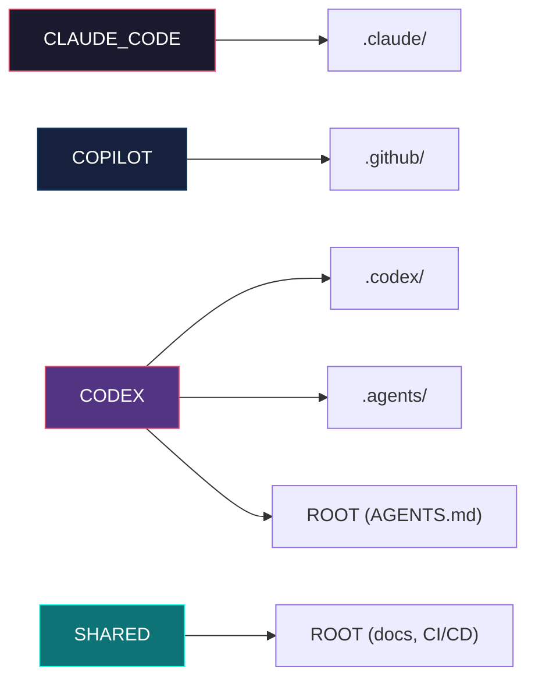

# História: Platform Enum e Mapeamento de Assemblers

**ID:** story-0025-0001
**Chave Jira:** —
**Status:** Pendente

## 1. Dependências

| Blocked By | Blocks |
| :--- | :--- |
| — | story-0025-0002 |

## 2. Regras Transversais Aplicáveis

| ID | Título |
| :--- | :--- |
| RULE-002 | Ordem de Assemblers Preservada |
| RULE-003 | Shared é Sempre Incluído |
| RULE-010 | Enum Extensível |

## 3. Descrição

Como **desenvolvedor do ia-dev-env**, eu quero que cada assembler tenha metadata indicando a qual plataforma de IA pertence, garantindo que o pipeline possa filtrar assemblers por plataforma sem alterar a lógica de execução existente.

Atualmente, `AssemblerDescriptor` contém apenas `name`, `target` e `assembler`. Não há conceito de "plataforma" — todos os 33 assemblers executam incondicionalmente. Esta história introduz o enum `Platform` no domain model e estende `AssemblerDescriptor` com um campo `Set<Platform> platforms`, permitindo que cada assembler declare a(s) plataforma(s) a que pertence.

O mapeamento segue a tabela da especificação: 8 assemblers são `CLAUDE_CODE`, 7 são `COPILOT`, 5 são `CODEX`, e 13 são `SHARED`. A atribuição ocorre na `AssemblerFactory` no momento da construção de cada descriptor.

### 3.1 Enum Platform

- Pacote: `dev.iadev.domain.model`
- Valores: `CLAUDE_CODE`, `COPILOT`, `CODEX`, `SHARED`
- Cada valor tem um `cliName` (kebab-case): `"claude-code"`, `"copilot"`, `"codex"`, `"shared"`
- Método estático `fromCliName(String)` que retorna `Optional<Platform>` para conversão segura
- Método estático `allUserSelectable()` retorna `EnumSet` excluindo `SHARED` (SHARED não é selecionável pelo usuário)
- `SHARED` não é selecionável via CLI — é incluído automaticamente (RULE-003)

### 3.2 AssemblerDescriptor Estendido

- Record atualizado: `AssemblerDescriptor(String name, AssemblerTarget target, Set<Platform> platforms, Assembler assembler)`
- O campo `platforms` é um `Set<Platform>` imutável (via `Set.copyOf()` ou `EnumSet.copyOf()`)
- Cada assembler tem pelo menos uma plataforma atribuída
- Assemblers `SHARED` podem ter APENAS `Platform.SHARED` — não combinam com plataformas específicas

### 3.3 Mapeamento na AssemblerFactory

- `buildClaudeRulesAssemblers()` e `buildClaudeConfigAssemblers()` atribuem `Set.of(CLAUDE_CODE)`
- `buildGithubInputAssemblers()` e `buildGithubOutputAssemblers()` atribuem `Set.of(COPILOT)`
- `buildCodexAssemblers()` atribuem `Set.of(CODEX)`
- `buildConstitutionAssemblers()`, `buildDocsAssemblers()`, `buildCicdAssemblers()` atribuem `Set.of(SHARED)`
- `ReadmeAssembler` atribui `Set.of(CLAUDE_CODE)` (target CLAUDE)

### 3.4 Sem Alteração no Comportamento

- Nesta história, nenhuma filtragem é implementada — apenas metadata é adicionada
- Todos os 33 assemblers continuam executando como antes
- A adição do campo `platforms` é backward-compatible no record

## 3.5 Entrega de Valor

- **Valor Principal:** Cada assembler categorizado por plataforma de IA, habilitando filtragem seletiva nas próximas histórias — desbloqueia story-0025-0002
- **Métrica de Sucesso:** Todos os 33 assemblers possuem `Set<Platform>` não-vazio e o mapeamento corresponde exatamente à tabela da especificação
- **Impacto no Negócio:** Base técnica que viabiliza a geração seletiva, reduzindo tempo e complexidade para o usuário final

## 4. Definições de Qualidade Locais

### DoR Local (Definition of Ready)

- [ ] Tabela de mapeamento assembler → plataforma revisada e confirmada
- [ ] Decisão sobre incluir `SHARED` como valor do enum ou como flag separada tomada
- [ ] `AssemblerDescriptor` e `AssemblerFactory` lidos e compreendidos

### DoD Local (Definition of Done)

- [ ] Enum `Platform` com 4 valores e métodos `fromCliName()` e `allUserSelectable()`
- [ ] `AssemblerDescriptor` estendido com `Set<Platform> platforms`
- [ ] `AssemblerFactory` atribui plataformas corretas a todos os 33 assemblers
- [ ] Todos os testes existentes passam sem modificação (backward-compatible)
- [ ] Pelo menos 1 teste automatizado validando o mapeamento completo dos 33 assemblers
- [ ] Smoke test passando

### Global Definition of Done (DoD)

- **Cobertura:** ≥ 95% Line, ≥ 90% Branch
- **Testes Automatizados:** Unitários para enum, factory, descriptor
- **Relatório de Cobertura:** JaCoCo
- **Documentação:** Javadoc no enum `Platform`
- **Persistência:** N/A
- **Performance:** N/A

## 5. Contratos de Dados (Data Contract)

### 5.1 Platform Enum

| Valor | CLI Name | Selecionável | Assemblers |
| :--- | :--- | :--- | :--- |
| `CLAUDE_CODE` | `claude-code` | Sim | RulesAssembler, SkillsAssembler, AgentsAssembler, PatternsAssembler, ProtocolsAssembler, HooksAssembler, SettingsAssembler, ReadmeAssembler |
| `COPILOT` | `copilot` | Sim | GithubInstructionsAssembler, GithubMcpAssembler, GithubSkillsAssembler, GithubAgentsAssembler, GithubHooksAssembler, GithubPromptsAssembler, PrIssueTemplateAssembler |
| `CODEX` | `codex` | Sim | CodexAgentsMdAssembler, CodexConfigAssembler, CodexSkillsAssembler, CodexRequirementsAssembler, CodexOverrideAssembler |
| `SHARED` | `shared` | Não | ConstitutionAssembler, DocsAssembler, GrpcDocsAssembler, RunbookAssembler, IncidentTemplatesAssembler, ReleaseChecklistAssembler, OperationalRunbookAssembler, SloSliTemplateAssembler, DocsContributingAssembler, DataMigrationPlanAssembler, CicdAssembler, EpicReportAssembler, DocsAdrAssembler |

### 5.2 AssemblerDescriptor (atualizado)

| Campo | Tipo | M/O | Descrição |
| :--- | :--- | :--- | :--- |
| `name` | `String` | M | Nome do assembler para display |
| `target` | `AssemblerTarget` | M | Diretório de saída (ROOT, CLAUDE, GITHUB, CODEX, CODEX_AGENTS) |
| `platforms` | `Set<Platform>` | M | Plataformas a que o assembler pertence (≥ 1 elemento) |
| `assembler` | `Assembler` | M | Implementação do assembler |

## 6. Diagramas

### 6.1 Relação Platform → AssemblerTarget



## 7. Critérios de Aceite (Gherkin)

```gherkin
Cenario: Platform enum tem exatamente 4 valores
  DADO que o enum Platform existe no pacote domain.model
  QUANDO listo todos os valores do enum
  ENTÃO obtenho exatamente 4 valores: CLAUDE_CODE, COPILOT, CODEX, SHARED

Cenario: Conversão de CLI name para Platform com valor válido
  DADO que o método fromCliName existe no enum Platform
  QUANDO chamo fromCliName com "claude-code"
  ENTÃO recebo Optional contendo CLAUDE_CODE

Cenario: Conversão de CLI name para Platform com valor inválido
  DADO que o método fromCliName existe no enum Platform
  QUANDO chamo fromCliName com "invalid-platform"
  ENTÃO recebo Optional.empty()

Cenario: SHARED não é selecionável pelo usuário
  DADO que o método allUserSelectable existe no enum Platform
  QUANDO listo as plataformas selecionáveis
  ENTÃO obtenho 3 valores: CLAUDE_CODE, COPILOT, CODEX
  E SHARED não está presente

Cenario: Cada assembler tem pelo menos uma plataforma atribuída
  DADO que a AssemblerFactory constrói os 33 assemblers
  QUANDO verifico o campo platforms de cada AssemblerDescriptor
  ENTÃO todos têm Set<Platform> não-vazio

Cenario: Assemblers Claude têm platform CLAUDE_CODE
  DADO que a AssemblerFactory constrói os assemblers
  QUANDO filtro descriptors com platform CLAUDE_CODE
  ENTÃO obtenho exatamente 8 assemblers: Rules, Skills, Agents, Patterns, Protocols, Hooks, Settings, Readme

Cenario: Assemblers GitHub têm platform COPILOT
  DADO que a AssemblerFactory constrói os assemblers
  QUANDO filtro descriptors com platform COPILOT
  ENTÃO obtenho exatamente 7 assemblers: GithubInstructions, GithubMcp, GithubSkills, GithubAgents, GithubHooks, GithubPrompts, PrIssueTemplate

Cenario: Assemblers Codex têm platform CODEX
  DADO que a AssemblerFactory constrói os assemblers
  QUANDO filtro descriptors com platform CODEX
  ENTÃO obtenho exatamente 5 assemblers: CodexAgentsMd, CodexConfig, CodexSkills, CodexRequirements, CodexOverride

Cenario: Assemblers shared têm platform SHARED
  DADO que a AssemblerFactory constrói os assemblers
  QUANDO filtro descriptors com platform SHARED
  ENTÃO obtenho exatamente 13 assemblers de documentação e CI/CD

Cenario: Total de assemblers permanece 33
  DADO que a AssemblerFactory constrói os assemblers com PipelineOptions default
  QUANDO conto o total de descriptors
  ENTÃO obtenho 33
  E a soma por plataforma (8 + 7 + 5 + 13) é 33
```

## 8. Sub-tarefas

- [ ] [Dev] Criar enum `Platform` com 4 valores, `cliName`, `fromCliName()`, `allUserSelectable()`
- [ ] [Dev] Atualizar record `AssemblerDescriptor` com campo `Set<Platform> platforms`
- [ ] [Dev] Atualizar `AssemblerFactory` para atribuir plataformas a cada assembler
- [ ] [Dev] Atualizar todas as chamadas existentes ao construtor de `AssemblerDescriptor`
- [ ] [Test] Unitário: enum Platform (valores, conversão, selecionáveis)
- [ ] [Test] Unitário: AssemblerFactory mapeamento completo (33 assemblers, contagem por plataforma)
- [ ] [Test] Smoke/E2E: Pipeline completo gera mesmos artefatos que antes (retrocompatibilidade)
- [ ] [Doc] Javadoc no enum Platform e no campo platforms do AssemblerDescriptor
