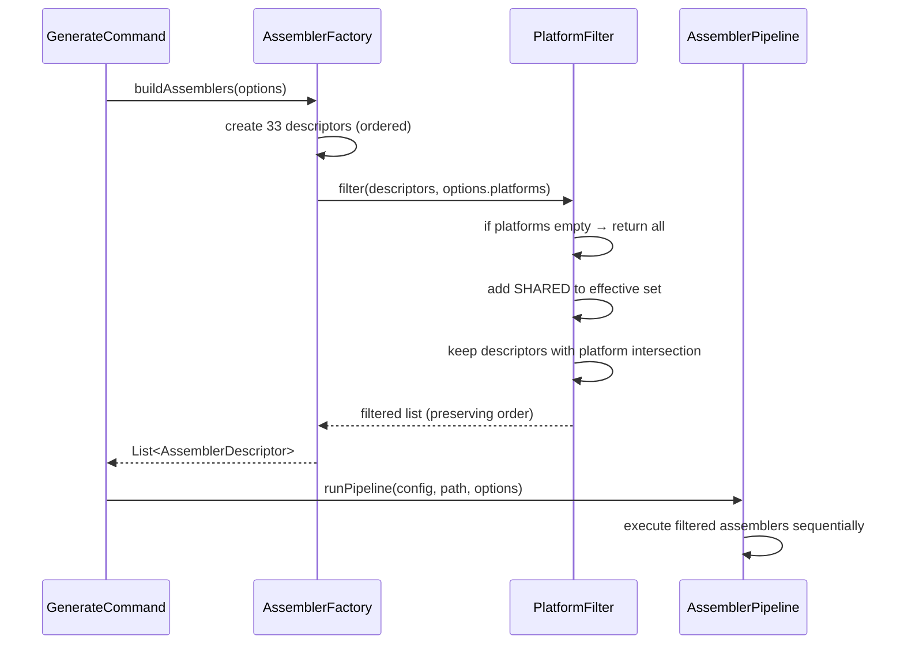

# História: Filtro de Assemblers no Pipeline

**ID:** story-0025-0002
**Chave Jira:** —
**Status:** Pendente

## 1. Dependências

| Blocked By | Blocks |
| :--- | :--- |
| story-0025-0001 | story-0025-0003, story-0025-0004, story-0025-0005, story-0025-0006 |

## 2. Regras Transversais Aplicáveis

| ID | Título |
| :--- | :--- |
| RULE-001 | Retrocompatibilidade Total |
| RULE-002 | Ordem de Assemblers Preservada |
| RULE-003 | Shared é Sempre Incluído |
| RULE-009 | Composição de Plataformas |

## 3. Descrição

Como **desenvolvedor do ia-dev-env**, eu quero que o pipeline de assemblers aceite um conjunto de plataformas e execute apenas os assemblers relevantes, garantindo que a geração produza somente os artefatos necessários para a(s) plataforma(s) selecionada(s).

Esta é a história central do épico — o mecanismo de filtragem que todas as demais histórias consomem. O filtro opera na `AssemblerFactory` após a construção da lista ordenada de descriptors. Dado um `Set<Platform>` em `PipelineOptions`, o factory remove descriptors cujas plataformas não tenham interseção com o conjunto solicitado. Assemblers `SHARED` são sempre mantidos (RULE-003). A ordem original é preservada (RULE-002).

Quando o conjunto de plataformas está vazio ou contém todas as plataformas (`CLAUDE_CODE`, `COPILOT`, `CODEX`), nenhum filtro é aplicado — retrocompatibilidade total (RULE-001).

### 3.1 PipelineOptions Estendido

- Novo campo: `Set<Platform> platforms` (imutável)
- Default: `Set.of()` (vazio = sem filtro = all)
- Factory method ou builder atualizado para aceitar o novo campo
- Todos os call sites existentes atualizados para passar `Set.of()` (sem filtro)

### 3.2 Lógica de Filtragem

- Localização: método em `AssemblerFactory` ou nova classe `PlatformFilter`
- Input: `List<AssemblerDescriptor>` ordenada + `Set<Platform>` do options
- Algoritmo:
  1. Se `platforms` está vazio → retorna lista sem filtro
  2. Adiciona `SHARED` ao conjunto de plataformas efetivo
  3. Para cada descriptor, verifica: `!Collections.disjoint(descriptor.platforms(), effectivePlatforms)`
  4. Mantém apenas descriptors com interseção não-vazia
  5. Retorna lista filtrada preservando a ordem original

### 3.3 Integração no Pipeline

- `AssemblerPipeline` recebe a lista já filtrada — não precisa saber sobre plataformas
- A filtragem ocorre em `AssemblerFactory.buildAssemblers()` ou imediatamente após
- `runPipelinePerAssembler()` (verbose mode) também recebe a lista filtrada

## 3.5 Entrega de Valor

- **Valor Principal:** Pipeline executa apenas assemblers da plataforma selecionada, reduzindo tempo de geração e eliminando artefatos desnecessários — desbloqueia story-0025-0003 a story-0025-0006
- **Métrica de Sucesso:** Com `platforms = {CLAUDE_CODE}`, pipeline executa 21 assemblers (8 Claude + 13 shared) em vez de 33; artefatos `.github/` e `.codex/` não são gerados
- **Impacto no Negócio:** Fundamento técnico que viabiliza geração seletiva, impactando diretamente a experiência do usuário

## 4. Definições de Qualidade Locais

### DoR Local (Definition of Ready)

- [ ] story-0025-0001 concluída (enum Platform e mapeamento nos descriptors)
- [ ] Decisão sobre localização da lógica de filtragem (factory vs. filtro separado) tomada
- [ ] Comportamento de `Set.of()` como "sem filtro" confirmado

### DoD Local (Definition of Done)

- [ ] `PipelineOptions` com campo `Set<Platform> platforms`
- [ ] Lógica de filtragem implementada e unitariamente testada
- [ ] SHARED sempre incluído independente da seleção
- [ ] Sem filtro quando platforms vazio ou contém todas
- [ ] Ordem de assemblers preservada após filtragem
- [ ] Pelo menos 1 teste automatizado validando filtragem por plataforma única
- [ ] Smoke test passando (pipeline completo sem filtro = retrocompatibilidade)

### Global Definition of Done (DoD)

- **Cobertura:** ≥ 95% Line, ≥ 90% Branch
- **Testes Automatizados:** Unitários para filtragem, integração para pipeline
- **Relatório de Cobertura:** JaCoCo
- **Documentação:** Javadoc na lógica de filtragem
- **Persistência:** N/A
- **Performance:** N/A

## 5. Contratos de Dados (Data Contract)

### 5.1 PipelineOptions (atualizado)

| Campo | Tipo | M/O | Default | Descrição |
| :--- | :--- | :--- | :--- | :--- |
| `dryRun` | `boolean` | M | `false` | Simular sem escrever |
| `force` | `boolean` | M | `false` | Sobrescrever existentes |
| `verbose` | `boolean` | M | `false` | Output detalhado |
| `overwriteConstitution` | `boolean` | M | `false` | Regenerar CONSTITUTION.md |
| `resourcesDir` | `Path` | O | `null` | Diretório de templates custom |
| `platforms` | `Set<Platform>` | M | `Set.of()` | Plataformas selecionadas (vazio = all) |

### 5.2 Lógica de Filtragem — Tabela de Decisão

| Input platforms | Effective filter | Assemblers executados |
| :--- | :--- | :--- |
| `Set.of()` (vazio) | Sem filtro | 33 (all) |
| `{CLAUDE_CODE}` | CLAUDE_CODE ∪ SHARED | 21 (8 + 13) |
| `{COPILOT}` | COPILOT ∪ SHARED | 20 (7 + 13) |
| `{CODEX}` | CODEX ∪ SHARED | 18 (5 + 13) |
| `{CLAUDE_CODE, COPILOT}` | CLAUDE_CODE ∪ COPILOT ∪ SHARED | 28 (8 + 7 + 13) |
| `{CLAUDE_CODE, COPILOT, CODEX}` | Sem filtro (= all) | 33 |

## 6. Diagramas

### 6.1 Fluxo de Filtragem



## 7. Critérios de Aceite (Gherkin)

```gherkin
Cenario: Sem filtro quando platforms vazio
  DADO que PipelineOptions tem platforms = Set vazio
  QUANDO a factory constrói os assemblers
  ENTÃO retorna todos os 33 assemblers
  E a ordem é idêntica à ordem original

Cenario: Filtro com plataforma única CLAUDE_CODE
  DADO que PipelineOptions tem platforms = {CLAUDE_CODE}
  QUANDO a factory constrói os assemblers
  ENTÃO retorna 21 assemblers
  E todos têm platform CLAUDE_CODE ou SHARED
  E nenhum tem platform COPILOT ou CODEX exclusivamente

Cenario: Filtro com plataforma única COPILOT
  DADO que PipelineOptions tem platforms = {COPILOT}
  QUANDO a factory constrói os assemblers
  ENTÃO retorna 20 assemblers
  E todos têm platform COPILOT ou SHARED

Cenario: Filtro com plataforma única CODEX
  DADO que PipelineOptions tem platforms = {CODEX}
  QUANDO a factory constrói os assemblers
  ENTÃO retorna 18 assemblers
  E todos têm platform CODEX ou SHARED

Cenario: Composição de duas plataformas
  DADO que PipelineOptions tem platforms = {CLAUDE_CODE, COPILOT}
  QUANDO a factory constrói os assemblers
  ENTÃO retorna 28 assemblers
  E inclui assemblers de ambas as plataformas mais SHARED

Cenario: Todas as plataformas equivale a sem filtro
  DADO que PipelineOptions tem platforms = {CLAUDE_CODE, COPILOT, CODEX}
  QUANDO a factory constrói os assemblers
  ENTÃO retorna todos os 33 assemblers

Cenario: SHARED sempre presente independente da seleção
  DADO que PipelineOptions tem platforms = {CLAUDE_CODE}
  QUANDO a factory constrói os assemblers
  ENTÃO os 13 assemblers SHARED estão presentes
  E ConstitutionAssembler está na lista

Cenario: Ordem preservada após filtragem
  DADO que PipelineOptions tem platforms = {COPILOT}
  QUANDO a factory constrói os assemblers
  ENTÃO os assemblers estão na mesma ordem relativa que teriam sem filtro
  E ConstitutionAssembler vem antes de GithubInstructionsAssembler
  E GithubInstructionsAssembler vem antes de CicdAssembler

Cenario: Pipeline executa normalmente com lista filtrada
  DADO que o pipeline recebe 21 assemblers (CLAUDE_CODE + SHARED)
  QUANDO executo o pipeline com um ProjectConfig válido
  ENTÃO os artefatos gerados estão apenas em ROOT e .claude/
  E nenhum arquivo é gerado em .github/ ou .codex/

Cenario: Retrocompatibilidade total sem flag
  DADO que PipelineOptions tem platforms = Set vazio (default)
  QUANDO executo o pipeline completo
  ENTÃO o resultado é idêntico ao comportamento anterior
  E os mesmos 33 assemblers executam na mesma ordem
```

## 8. Sub-tarefas

- [ ] [Dev] Adicionar campo `Set<Platform> platforms` ao record `PipelineOptions`
- [ ] [Dev] Atualizar todos os call sites de `PipelineOptions` para incluir `platforms`
- [ ] [Dev] Implementar lógica de filtragem (PlatformFilter ou dentro da factory)
- [ ] [Dev] Integrar filtragem no `buildAssemblers()` da AssemblerFactory
- [ ] [Test] Unitário: filtragem por plataforma única (CLAUDE_CODE, COPILOT, CODEX)
- [ ] [Test] Unitário: composição de plataformas, vazio = all, todas = all
- [ ] [Test] Unitário: SHARED sempre presente, ordem preservada
- [ ] [Test] Integração: pipeline com lista filtrada gera apenas artefatos esperados
- [ ] [Test] Smoke/E2E: pipeline sem filtro produz resultado idêntico ao anterior
- [ ] [Doc] Javadoc no PlatformFilter/lógica de filtragem
