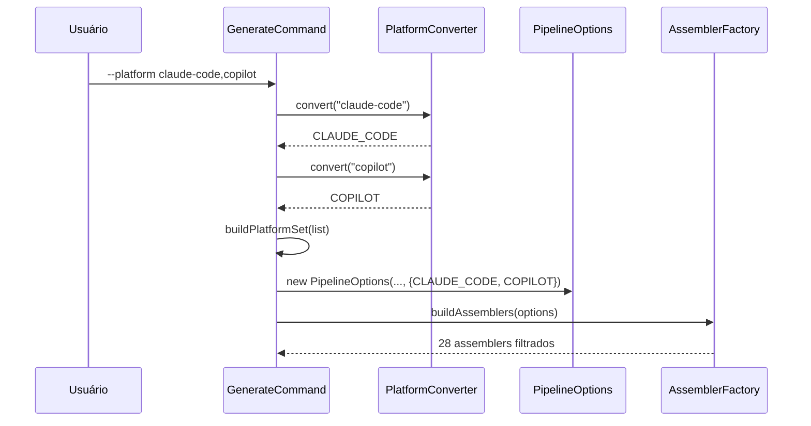

# História: Flag CLI `--platform`

**ID:** story-0025-0003
**Chave Jira:** —
**Status:** Pendente

## 1. Dependências

| Blocked By | Blocks |
| :--- | :--- |
| story-0025-0002 | story-0025-0007 |

## 2. Regras Transversais Aplicáveis

| ID | Título |
| :--- | :--- |
| RULE-001 | Retrocompatibilidade Total |
| RULE-004 | CLI Tem Precedência sobre YAML |
| RULE-005 | Validação de Valores |
| RULE-009 | Composição de Plataformas |

## 3. Descrição

Como **usuário do ia-dev-env**, eu quero selecionar a plataforma de IA via flag `--platform` na linha de comando, garantindo que apenas os artefatos da plataforma escolhida sejam gerados.

Esta história conecta o mecanismo de filtragem (story-0025-0002) à interface do usuário via Picocli. A flag `--platform` (short: `-p`) aceita valores `claude-code`, `copilot`, `codex` e `all`, com suporte a múltiplos valores separados por vírgula. Um `ITypeConverter<Platform>` customizado converte strings kebab-case para o enum `Platform`. Sem a flag, o comportamento é `all` (retrocompatibilidade — RULE-001).

A validação ocorre no Picocli antes da execução do pipeline. Valores inválidos produzem mensagem de erro clara com os valores aceitos (RULE-005). Quando `all` é especificado, o `Set<Platform>` passado ao `PipelineOptions` é vazio (convenção = sem filtro).

### 3.1 Flag Picocli

- Anotação: `@Option(names = {"--platform", "-p"}, description = "...", split = ",")`
- Tipo: `List<Platform>` (Picocli split por vírgula)
- Converter: `PlatformConverter implements ITypeConverter<Platform>`
- Default: `null` (sem flag = all)
- `all` como valor especial: converte para `Set.of()` (vazio = sem filtro)
- Validação: converter lança `TypeConversionException` com mensagem clara para valores inválidos

### 3.2 PlatformConverter

- Pacote: `dev.iadev.cli`
- Converte string kebab-case para `Platform` via `Platform.fromCliName()`
- Trata `"all"` como caso especial (retorna indicador de "sem filtro")
- Mensagem de erro: `"Invalid platform: '<value>'. Valid values: claude-code, copilot, codex, all"`

### 3.3 Integração no GenerateCommand

- Após parsing, converte `List<Platform>` para `Set<Platform>`
- Se lista contém `all` ou é null → passa `Set.of()` ao PipelineOptions
- Se lista contém plataformas específicas → passa `EnumSet.copyOf(list)`
- Precedência sobre YAML (RULE-004): se `--platform` presente na CLI, ignora `platform:` do YAML

### 3.4 Help Text

- Description da flag: `"Target AI platform(s) for artifact generation. Values: claude-code, copilot, codex, all. Multiple values separated by comma. Default: all (generate for all platforms)."`

## 3.5 Entrega de Valor

- **Valor Principal:** Usuário seleciona a plataforma de IA desejada via linha de comando, recebendo apenas os artefatos relevantes
- **Métrica de Sucesso:** `ia-dev-env generate --platform claude-code` produz apenas `.claude/` + docs (sem `.github/`, `.codex/`, `.agents/`)
- **Impacto no Negócio:** Experiência de uso simplificada — repositório limpo com apenas os diretórios da ferramenta que o usuário realmente usa

## 4. Definições de Qualidade Locais

### DoR Local (Definition of Ready)

- [ ] story-0025-0002 concluída (filtragem funcional no pipeline)
- [ ] Formato da flag CLI e short option confirmados (`--platform`, `-p`)
- [ ] Comportamento de `all` como "sem filtro" confirmado

### DoD Local (Definition of Done)

- [ ] Flag `--platform` / `-p` funcional no `GenerateCommand`
- [ ] `PlatformConverter` converte valores válidos e rejeita inválidos
- [ ] `--help` documenta a flag com descrição e valores aceitos
- [ ] Retrocompatibilidade: sem flag = gera tudo
- [ ] Múltiplos valores: `--platform claude-code,copilot` funciona
- [ ] Pelo menos 1 teste automatizado validando geração filtrada via CLI
- [ ] Smoke test passando

### Global Definition of Done (DoD)

- **Cobertura:** ≥ 95% Line, ≥ 90% Branch
- **Testes Automatizados:** Unitários para converter, integração para CLI
- **Relatório de Cobertura:** JaCoCo
- **Documentação:** Help text da flag
- **Persistência:** N/A
- **Performance:** N/A

## 5. Contratos de Dados (Data Contract)

### 5.1 CLI Flag

| Flag | Short | Tipo | Default | Split | Valores Aceitos |
| :--- | :--- | :--- | :--- | :--- | :--- |
| `--platform` | `-p` | `List<Platform>` | `null` (= all) | `,` | `claude-code`, `copilot`, `codex`, `all` |

### 5.2 Validação — Tabela de Decisão

| Input | Set<Platform> resultante | Comportamento |
| :--- | :--- | :--- |
| (sem flag) | `Set.of()` | Gera tudo (33 assemblers) |
| `--platform all` | `Set.of()` | Gera tudo (33 assemblers) |
| `--platform claude-code` | `{CLAUDE_CODE}` | 21 assemblers |
| `--platform copilot` | `{COPILOT}` | 20 assemblers |
| `--platform codex` | `{CODEX}` | 18 assemblers |
| `-p claude-code,copilot` | `{CLAUDE_CODE, COPILOT}` | 28 assemblers |
| `--platform invalid` | — | Erro: mensagem com valores aceitos |
| `-p claude-code,all` | `Set.of()` | `all` prevalece, gera tudo |

### 5.3 Error Codes

| Exit Code | Condição | Mensagem |
| :--- | :--- | :--- |
| 2 | Valor inválido para `--platform` | `Invalid platform: '<value>'. Valid values: claude-code, copilot, codex, all` |

## 6. Diagramas

### 6.1 Fluxo de Parsing da Flag



## 7. Critérios de Aceite (Gherkin)

```gherkin
Cenario: Sem flag gera todos os artefatos
  DADO que o usuário executa "ia-dev-env generate" sem flag --platform
  QUANDO a geração completa
  ENTÃO todos os 33 assemblers executam
  E os diretórios .claude/, .github/, .codex/ são gerados

Cenario: Flag com plataforma única válida
  DADO que o usuário executa "ia-dev-env generate --platform claude-code"
  QUANDO a geração completa
  ENTÃO apenas artefatos .claude/ e ROOT são gerados
  E nenhum artefato .github/ ou .codex/ existe

Cenario: Flag all equivale a sem flag
  DADO que o usuário executa "ia-dev-env generate --platform all"
  QUANDO a geração completa
  ENTÃO todos os 33 assemblers executam
  E o resultado é idêntico a executar sem flag

Cenario: Múltiplos valores separados por vírgula
  DADO que o usuário executa "ia-dev-env generate -p claude-code,copilot"
  QUANDO a geração completa
  ENTÃO artefatos .claude/ e .github/ são gerados
  E nenhum artefato .codex/ existe

Cenario: Valor inválido produz erro claro
  DADO que o usuário executa "ia-dev-env generate --platform invalid"
  QUANDO o Picocli processa a flag
  ENTÃO o exit code é 2
  E a mensagem contém "Invalid platform: 'invalid'"
  E a mensagem lista os valores aceitos: claude-code, copilot, codex, all

Cenario: Short option funciona igual
  DADO que o usuário executa "ia-dev-env generate -p codex"
  QUANDO a geração completa
  ENTÃO apenas artefatos .codex/, .agents/ e ROOT são gerados

Cenario: Help text documenta a flag
  DADO que o usuário executa "ia-dev-env generate --help"
  QUANDO o help é exibido
  ENTÃO contém "--platform" e "-p"
  E contém os valores aceitos: claude-code, copilot, codex, all
  E contém descrição do comportamento default

Cenario: Valor all misturado com plataforma específica resulta em all
  DADO que o usuário executa "ia-dev-env generate -p claude-code,all"
  QUANDO a geração completa
  ENTÃO todos os 33 assemblers executam
```

## 8. Sub-tarefas

- [ ] [Dev] Criar `PlatformConverter implements ITypeConverter<Platform>`
- [ ] [Dev] Adicionar flag `--platform` / `-p` ao `GenerateCommand` com `split = ","`
- [ ] [Dev] Implementar lógica de conversão `List<Platform>` → `Set<Platform>` no GenerateCommand
- [ ] [Dev] Integrar com `PipelineOptions.platforms` e precedência sobre YAML (RULE-004)
- [ ] [Test] Unitário: PlatformConverter (valores válidos, inválidos, all)
- [ ] [Test] Unitário: conversão list→set (all, duplicatas, mixto com all)
- [ ] [Test] Integração: CLI end-to-end com cada plataforma isolada
- [ ] [Test] Smoke/E2E: `--platform claude-code` não gera `.github/`, `--platform copilot` não gera `.claude/`
- [ ] [Doc] Help text da flag --platform
