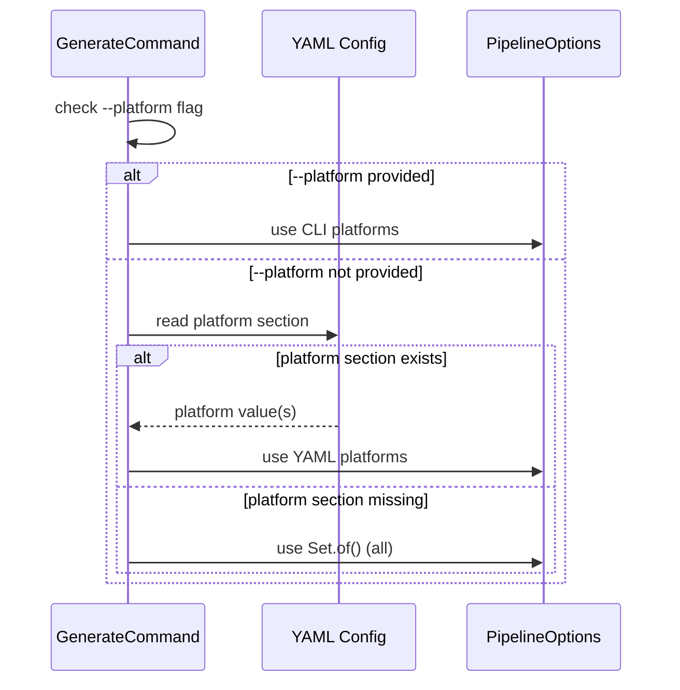

# História: Suporte `platform:` no YAML Config

**ID:** story-0025-0004
**Chave Jira:** —
**Status:** Pendente

## 1. Dependências

| Blocked By | Blocks |
| :--- | :--- |
| story-0025-0002 | story-0025-0007 |

## 2. Regras Transversais Aplicáveis

| ID | Título |
| :--- | :--- |
| RULE-001 | Retrocompatibilidade Total |
| RULE-004 | CLI Tem Precedência sobre YAML |
| RULE-005 | Validação de Valores |

## 3. Descrição

Como **usuário do ia-dev-env**, eu quero definir a plataforma de IA default no arquivo YAML de configuração, garantindo que não precise repetir a flag `--platform` a cada execução.

Atualmente, o YAML config contém 18 seções (project, architecture, interfaces, etc.) mas nenhuma seção `platform:`. Esta história adiciona suporte a `platform:` no YAML, que pode ser um valor único (`platform: claude-code`) ou uma lista (`platform: [claude-code, copilot]`). O valor do YAML é a fonte default; a flag CLI `--platform` tem precedência (RULE-004).

Os 14 profile templates existentes serão atualizados para incluir `platform: all` como default explícito, documentando a opção sem alterar o comportamento.

### 3.1 Seção YAML `platform:`

- Chave: `platform`
- Tipo: `String` ou `List<String>` (SnakeYAML deserializa ambos)
- Valores aceitos: `claude-code`, `copilot`, `codex`, `all`
- Ausência da chave = `all` (retrocompatibilidade — RULE-001)
- Validação: mesmos valores que a flag CLI

### 3.2 PlatformConfig

- Novo value object ou campo em `ProjectConfig`
- Parse: `ProjectConfigFactory` extrai `platform` do mapa YAML
- Se string: converte para lista unitária
- Se lista: converte para `Set<Platform>`
- Se ausente: `Set.of()` (sem filtro = all)

### 3.3 Resolução de Precedência

- Em `GenerateCommand`, após parsing:
  1. Se `--platform` foi fornecido na CLI → usa CLI
  2. Senão, se `platform:` existe no YAML → usa YAML
  3. Senão → `Set.of()` (all)
- A resolução ocorre ANTES de criar `PipelineOptions`

### 3.4 Validação no StackValidator

- Valores inválidos em `platform:` devem ser reportados na validação
- Mensagem: `"Invalid platform value: '<value>' in YAML config. Valid values: claude-code, copilot, codex, all"`
- Falha na validação impede execução do pipeline

### 3.5 Profile Templates

- Todos os 14 profile templates em `resources/shared/config-templates/` atualizados
- Adição de `platform: all` com comentário explicativo
- Posição: após a seção `project:` e antes de `architecture:`

## 3.5 Entrega de Valor

- **Valor Principal:** Plataforma default configurável no YAML, eliminando necessidade de flag repetitiva no CLI
- **Métrica de Sucesso:** YAML com `platform: claude-code` gera apenas `.claude/` + docs sem necessidade de flag CLI
- **Impacto no Negócio:** Configuração one-time para equipes que usam uma única ferramenta de IA

## 4. Definições de Qualidade Locais

### DoR Local (Definition of Ready)

- [ ] story-0025-0002 concluída (filtragem funcional)
- [ ] Formato da seção YAML decidido (string vs. lista vs. ambos)
- [ ] Ordem de precedência CLI > YAML > default confirmada

### DoD Local (Definition of Done)

- [ ] Seção `platform:` parseada corretamente (string, lista, ausente)
- [ ] Validação no StackValidator com mensagem clara
- [ ] Precedência CLI > YAML > default implementada
- [ ] 14 profile templates atualizados com `platform: all`
- [ ] Pelo menos 1 teste automatizado validando parsing e precedência
- [ ] Smoke test passando

### Global Definition of Done (DoD)

- **Cobertura:** ≥ 95% Line, ≥ 90% Branch
- **Testes Automatizados:** Unitários para parsing, integração para precedência
- **Relatório de Cobertura:** JaCoCo
- **Documentação:** Comentário no YAML template explicando a seção
- **Persistência:** N/A
- **Performance:** N/A

## 5. Contratos de Dados (Data Contract)

### 5.1 Seção YAML — Formatos Aceitos

| Formato | Exemplo | Set<Platform> resultante |
| :--- | :--- | :--- |
| String única | `platform: claude-code` | `{CLAUDE_CODE}` |
| Lista | `platform: [claude-code, copilot]` | `{CLAUDE_CODE, COPILOT}` |
| Valor `all` | `platform: all` | `Set.of()` (sem filtro) |
| Ausente | (sem seção `platform:`) | `Set.of()` (sem filtro) |

### 5.2 Precedência — Tabela de Decisão

| CLI `--platform` | YAML `platform:` | Set<Platform> efetivo |
| :--- | :--- | :--- |
| Ausente | Ausente | `Set.of()` (all) |
| Ausente | `claude-code` | `{CLAUDE_CODE}` |
| `copilot` | `claude-code` | `{COPILOT}` (CLI prevalece) |
| `all` | `claude-code` | `Set.of()` (CLI prevalece) |
| `claude-code,copilot` | `codex` | `{CLAUDE_CODE, COPILOT}` (CLI prevalece) |

### 5.3 Error Codes

| Condição | Mensagem |
| :--- | :--- |
| Valor inválido no YAML | `Invalid platform value: '<value>' in YAML config. Valid values: claude-code, copilot, codex, all` |

## 6. Diagramas

### 6.1 Resolução de Precedência



## 7. Critérios de Aceite (Gherkin)

```gherkin
Cenario: YAML sem seção platform gera tudo
  DADO que o YAML config não contém seção "platform"
  E nenhuma flag --platform é fornecida
  QUANDO a geração completa
  ENTÃO todos os 33 assemblers executam

Cenario: YAML com platform string única
  DADO que o YAML config contém "platform: claude-code"
  E nenhuma flag --platform é fornecida
  QUANDO a geração completa
  ENTÃO apenas artefatos .claude/ e ROOT são gerados

Cenario: YAML com platform lista
  DADO que o YAML config contém "platform: [claude-code, copilot]"
  E nenhuma flag --platform é fornecida
  QUANDO a geração completa
  ENTÃO artefatos .claude/ e .github/ são gerados
  E nenhum artefato .codex/ existe

Cenario: CLI prevalece sobre YAML
  DADO que o YAML config contém "platform: claude-code"
  E o usuário fornece "--platform copilot"
  QUANDO a geração completa
  ENTÃO apenas artefatos .github/ e ROOT são gerados
  E nenhum artefato .claude/ existe

Cenario: YAML com valor inválido falha na validação
  DADO que o YAML config contém "platform: invalid-value"
  QUANDO o StackValidator valida o config
  ENTÃO a validação falha
  E a mensagem contém "Invalid platform value: 'invalid-value'"
  E a mensagem lista os valores aceitos

Cenario: YAML com platform all gera tudo
  DADO que o YAML config contém "platform: all"
  QUANDO a geração completa
  ENTÃO todos os 33 assemblers executam

Cenario: Profile templates contêm seção platform
  DADO que os 14 profile templates existem em config-templates/
  QUANDO leio cada template
  ENTÃO cada um contém "platform: all"

Cenario: CLI --platform all sobrescreve YAML específico
  DADO que o YAML config contém "platform: claude-code"
  E o usuário fornece "--platform all"
  QUANDO a geração completa
  ENTÃO todos os 33 assemblers executam
```

## 8. Sub-tarefas

- [ ] [Dev] Adicionar parsing de `platform:` no `ProjectConfigFactory` (string e lista)
- [ ] [Dev] Criar value object ou campo em `ProjectConfig` para plataformas
- [ ] [Dev] Adicionar validação de `platform:` no `StackValidator`
- [ ] [Dev] Implementar resolução de precedência CLI > YAML no `GenerateCommand`
- [ ] [Dev] Atualizar os 14 profile templates com `platform: all`
- [ ] [Test] Unitário: parsing YAML (string, lista, ausente, inválido)
- [ ] [Test] Unitário: validação no StackValidator
- [ ] [Test] Integração: precedência CLI > YAML > default
- [ ] [Test] Smoke/E2E: YAML `platform: claude-code` gera apenas `.claude/`
- [ ] [Doc] Comentário no YAML template explicando a seção platform
