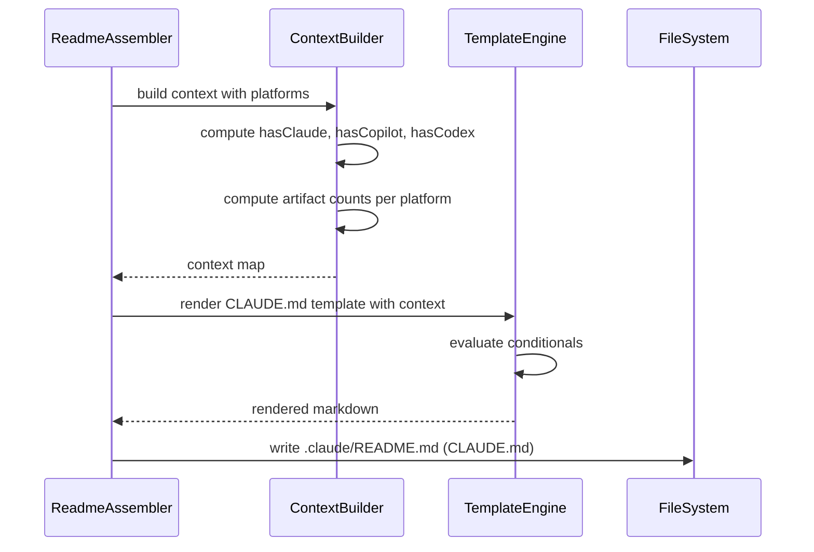

# História: Contagem Dinâmica de Artefatos no README e CLAUDE.md

**ID:** story-0025-0005
**Chave Jira:** —
**Status:** Pendente

## 1. Dependências

| Blocked By | Blocks |
| :--- | :--- |
| story-0025-0002 | story-0025-0007, story-0025-0008 |

## 2. Regras Transversais Aplicáveis

| ID | Título |
| :--- | :--- |
| RULE-006 | Contagens Dinâmicas |
| RULE-001 | Retrocompatibilidade Total |

## 3. Descrição

Como **usuário do ia-dev-env**, eu quero que o README.md e CLAUDE.md gerados reflitam apenas os artefatos da plataforma que selecionei, garantindo que a documentação não contenha informações sobre plataformas que não uso.

Atualmente, o `ReadmeAssembler` e os templates de CLAUDE.md geram contagens fixas para todas as plataformas (ex: "Rules (.claude): 6, Instructions (.github): 5, Config (.codex): 2"). Quando o usuário seleciona apenas `--platform claude-code`, as contagens de `.github/` e `.codex/` não devem aparecer. A seção "Generation Summary" e a tabela de mapeamento cross-platform devem ser condicionais.

### 3.1 CLAUDE.md Condicional

- A seção "Generation Summary" lista apenas componentes da plataforma ativa
- A seção "Structure" mostra apenas diretórios da plataforma ativa
- A tabela de mapeamento `.claude/ ↔ .github/ ↔ .codex/` só aparece se ≥ 2 plataformas ou `all`
- Template Nunjucks com condicionais baseados nas plataformas selecionadas

### 3.2 README.md Condicional

- A seção "Technology Stack" inclui `Platform: <plataforma(s)>` na identidade do projeto
- A seção "Quick Start" mostra exemplos relevantes para a plataforma ativa
- Contagens de artefatos são dinâmicas e refletem apenas o gerado

### 3.3 Context Builder

- `ContextBuilder` passa `Set<Platform>` ao contexto do template engine
- Templates acessam via `{{ platforms }}` ou ``
- Contagens calculadas dinamicamente com base nos assemblers que executaram

### 3.4 Contagens por Plataforma

- `CLAUDE_CODE`: Rules, Skills, Knowledge Packs, Agents, Hooks, Settings
- `COPILOT`: Instructions, Skills, Agents, Prompts, Hooks, MCP
- `CODEX`: config.toml, requirements.toml, agents, skills
- `SHARED`: sempre contado (docs, CI/CD, constitution)

## 3.5 Entrega de Valor

- **Valor Principal:** Documentação gerada reflete apenas artefatos da plataforma ativa, eliminando ruído e confusão
- **Métrica de Sucesso:** CLAUDE.md gerado com `--platform claude-code` não menciona `.github/` nem `.codex/`; contagens são precisas
- **Impacto no Negócio:** Documentação limpa e relevante facilita onboarding de novos membros da equipe

## 4. Definições de Qualidade Locais

### DoR Local (Definition of Ready)

- [ ] story-0025-0002 concluída (filtragem funcional)
- [ ] Templates Nunjucks do README e CLAUDE.md identificados e lidos
- [ ] Formato das contagens atuais compreendido

### DoD Local (Definition of Done)

- [ ] CLAUDE.md condicional (seções, tabelas, contagens)
- [ ] README.md com Platform na identidade e contagens dinâmicas
- [ ] ContextBuilder passa plataformas ao template engine
- [ ] Golden files atualizados para pelo menos 2 profiles
- [ ] Pelo menos 1 teste automatizado validando contagens condicionais
- [ ] Smoke test passando

### Global Definition of Done (DoD)

- **Cobertura:** ≥ 95% Line, ≥ 90% Branch
- **Testes Automatizados:** Unitários para contagens, snapshot para templates
- **Relatório de Cobertura:** JaCoCo
- **Documentação:** Templates auto-documentados
- **Persistência:** N/A
- **Performance:** N/A

## 5. Contratos de Dados (Data Contract)

### 5.1 Context Variables — Template Engine

| Variável | Tipo | Descrição |
| :--- | :--- | :--- |
| `platforms` | `List<String>` | Plataformas ativas (kebab-case) |
| `hasClaude` | `boolean` | `true` se CLAUDE_CODE está ativo |
| `hasCopilot` | `boolean` | `true` se COPILOT está ativo |
| `hasCodex` | `boolean` | `true` se CODEX está ativo |
| `isMultiPlatform` | `boolean` | `true` se ≥ 2 plataformas ativas |
| `claudeArtifactCounts` | `Map<String, Integer>` | Contagens para Claude (rules, skills, etc.) |
| `copilotArtifactCounts` | `Map<String, Integer>` | Contagens para Copilot (instructions, etc.) |
| `codexArtifactCounts` | `Map<String, Integer>` | Contagens para Codex (config, skills, etc.) |

### 5.2 Seção Generation Summary — Formato por Plataforma

| Plataforma | Linhas exibidas |
| :--- | :--- |
| `claude-code` only | Rules (.claude), Skills (.claude), Knowledge Packs (.claude), Agents (.claude), Hooks (.claude), Settings (.claude) |
| `copilot` only | Instructions (.github), Skills (.github), Agents (.github), Prompts (.github), Hooks (.github), MCP (.github) |
| `codex` only | Config (.codex), Requirements (.codex), Agents (.codex), Skills (.codex) |
| `all` | Todas as linhas de todas as plataformas |

## 6. Diagramas

### 6.1 Fluxo de Geração do CLAUDE.md



## 7. Critérios de Aceite (Gherkin)

```gherkin
Cenario: CLAUDE.md com platform all mostra todas as contagens
  DADO que a geração executa com platforms = all
  QUANDO o CLAUDE.md é gerado
  ENTÃO contém seção "Generation Summary" com contagens de .claude/, .github/ e .codex/
  E contém tabela de mapeamento cross-platform

Cenario: CLAUDE.md com platform claude-code omite outras plataformas
  DADO que a geração executa com platforms = {CLAUDE_CODE}
  QUANDO o CLAUDE.md é gerado
  ENTÃO contém contagens apenas de .claude/ (Rules, Skills, Agents, etc.)
  E NÃO contém menções a ".github/" ou ".codex/"
  E NÃO contém tabela de mapeamento cross-platform

Cenario: CLAUDE.md com duas plataformas mostra tabela de mapeamento
  DADO que a geração executa com platforms = {CLAUDE_CODE, COPILOT}
  QUANDO o CLAUDE.md é gerado
  ENTÃO contém contagens de .claude/ e .github/
  E contém tabela de mapeamento .claude/ ↔ .github/
  E NÃO contém contagens de .codex/

Cenario: README mostra plataforma na identidade do projeto
  DADO que a geração executa com platforms = {CLAUDE_CODE}
  QUANDO o README.md é gerado
  ENTÃO contém "Platform: claude-code" na seção de identidade

Cenario: Contagens numéricas são precisas para claude-code
  DADO que a geração executa com platforms = {CLAUDE_CODE} para profile java-spring
  QUANDO o CLAUDE.md é gerado
  ENTÃO a contagem de Rules (.claude) corresponde ao número real de arquivos em .claude/rules/
  E a contagem de Skills (.claude) corresponde ao número real de diretórios em .claude/skills/

Cenario: Contagens numéricas são precisas para copilot
  DADO que a geração executa com platforms = {COPILOT} para profile java-spring
  QUANDO o CLAUDE.md é gerado
  ENTÃO NÃO há seção Generation Summary com contagens .claude/
  E há contagens para .github/ que correspondem aos arquivos reais

Cenario: Golden files validam output por plataforma
  DADO que golden files existem para platform claude-code e platform all
  QUANDO comparo o output gerado com o golden file
  ENTÃO o output corresponde exatamente ao golden file esperado
```

## 8. Sub-tarefas

- [ ] [Dev] Adicionar variáveis de plataforma ao `ContextBuilder` (`hasClaude`, `hasCopilot`, etc.)
- [ ] [Dev] Implementar cálculo de contagens dinâmicas por plataforma
- [ ] [Dev] Atualizar template Nunjucks do CLAUDE.md com condicionais por plataforma
- [ ] [Dev] Atualizar template do README.md com Platform na identidade
- [ ] [Dev] Condicionar tabela de mapeamento cross-platform a `isMultiPlatform`
- [ ] [Test] Unitário: ContextBuilder gera variáveis corretas para cada combinação
- [ ] [Test] Snapshot: CLAUDE.md gerado para claude-code, copilot, codex, all
- [ ] [Test] Smoke/E2E: CLAUDE.md com `--platform claude-code` não contém `.github/`
- [ ] [Doc] Atualizar golden files para pelo menos 2 profiles (java-spring, go-gin)
