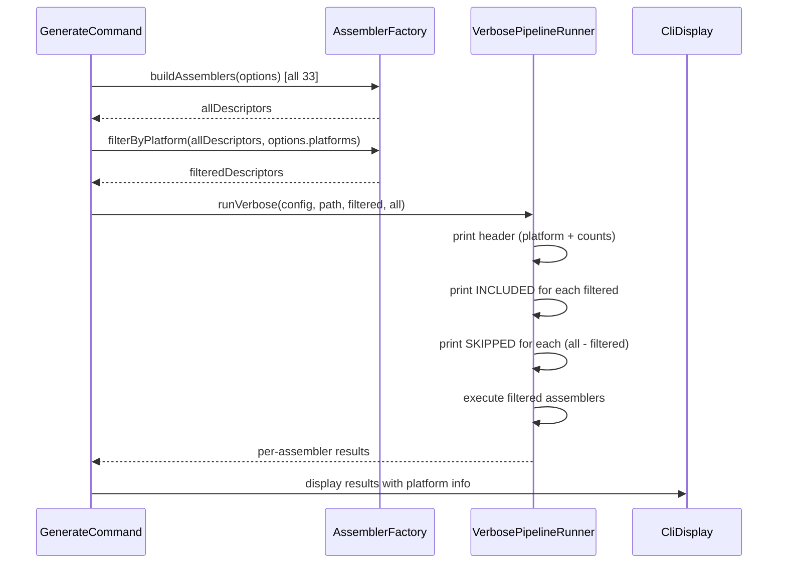

# História: Verbose e Dry-Run com Awareness de Plataforma

**ID:** story-0025-0006
**Chave Jira:** —
**Status:** Pendente

## 1. Dependências

| Blocked By | Blocks |
| :--- | :--- |
| story-0025-0002 | story-0025-0007 |

## 2. Regras Transversais Aplicáveis

| ID | Título |
| :--- | :--- |
| RULE-007 | Dry-Run Respeita Filtro |
| RULE-008 | Verbose Respeita Filtro |

## 3. Descrição

Como **usuário do ia-dev-env**, eu quero que os modos `--verbose` e `--dry-run` exibam informações sobre o filtro de plataforma ativo, garantindo que eu saiba exatamente quais assemblers executam e quais são filtrados.

Atualmente, `--verbose` lista todos os 33 assemblers com seus resultados, e `--dry-run` simula a execução completa. Com a introdução do filtro de plataforma, ambos os modos devem refletir a filtragem: verbose deve mostrar assemblers incluídos e excluídos (com a razão), e dry-run deve listar apenas os artefatos que seriam gerados para a plataforma selecionada.

### 3.1 Verbose com Awareness de Plataforma

- Header: `"Platform filter: claude-code → 21 assemblers (8 platform + 13 shared)"`
- Para cada assembler incluído: `"  INCLUDED: RulesAssembler (platform: claude-code)"`
- Para cada assembler excluído: `"  SKIPPED: GithubSkillsAssembler (platform: copilot)"`
- Formato tabulado para fácil leitura
- Quando sem filtro (all): `"Platform filter: all → 33 assemblers (no filter applied)"`

### 3.2 Dry-Run com Filtro

- Lista apenas os arquivos que seriam gerados pelos assemblers filtrados
- Contagem total reflete apenas assemblers da plataforma selecionada
- Warning message: `"Dry run — no files written. Platform: claude-code (21 assemblers)"`

### 3.3 Componentes Afetados

- `VerbosePipelineRunner`: exibe informações por assembler (recebe lista filtrada + lista completa para comparação)
- `CliDisplay`: exibe resumo final com informações de plataforma
- `AssemblerPipeline.runDry()`: opera sobre lista filtrada

### 3.4 Informações Adicionais no Resultado

- `PipelineResult` pode incluir metadata sobre plataformas e assemblers filtrados
- Ou o `GenerateCommand` calcula a diferença entre lista completa e filtrada para display

## 3.5 Entrega de Valor

- **Valor Principal:** Usuário visualiza exatamente quais assemblers executam e quais são filtrados, com transparência total sobre o efeito da flag `--platform`
- **Métrica de Sucesso:** `--verbose --platform claude-code` exibe 21 INCLUDED e 12 SKIPPED com razão; `--dry-run --platform codex` lista apenas artefatos codex + shared
- **Impacto no Negócio:** Debugging e troubleshooting facilitados — usuário entende exatamente o que a ferramenta faz

## 4. Definições de Qualidade Locais

### DoR Local (Definition of Ready)

- [ ] story-0025-0002 concluída (filtragem funcional)
- [ ] `VerbosePipelineRunner` e `CliDisplay` lidos e compreendidos
- [ ] Formato de output verbose atual compreendido

### DoD Local (Definition of Done)

- [ ] Verbose exibe header com contagem filtrada
- [ ] Verbose lista assemblers INCLUDED e SKIPPED com razão
- [ ] Dry-run lista apenas artefatos da plataforma selecionada
- [ ] Sem filtro: verbose mostra "no filter applied"
- [ ] Pelo menos 1 teste automatizado validando output verbose filtrado
- [ ] Smoke test passando

### Global Definition of Done (DoD)

- **Cobertura:** ≥ 95% Line, ≥ 90% Branch
- **Testes Automatizados:** Unitários para formatação, integração para output
- **Relatório de Cobertura:** JaCoCo
- **Documentação:** N/A
- **Persistência:** N/A
- **Performance:** N/A

## 5. Contratos de Dados (Data Contract)

### 5.1 Verbose Output — Formato

| Seção | Formato | Exemplo |
| :--- | :--- | :--- |
| Header | `Platform filter: <platforms> → <N> assemblers (<N> platform + <N> shared)` | `Platform filter: claude-code → 21 assemblers (8 platform + 13 shared)` |
| Included | `  INCLUDED: <Name> (platform: <platform>)` | `  INCLUDED: RulesAssembler (platform: claude-code)` |
| Skipped | `  SKIPPED: <Name> (platform: <platform>)` | `  SKIPPED: GithubSkillsAssembler (platform: copilot)` |
| No filter | `Platform filter: all → 33 assemblers (no filter applied)` | — |

### 5.2 Dry-Run Output — Formato

| Seção | Formato |
| :--- | :--- |
| Warning | `Dry run — no files written. Platform: <platforms> (<N> assemblers)` |
| File list | Lista de caminhos relativos que seriam gerados |
| Summary | `Would generate <N> files for platform <platforms>` |

## 6. Diagramas

### 6.1 Fluxo Verbose com Filtro



## 7. Critérios de Aceite (Gherkin)

```gherkin
Cenario: Verbose sem filtro mostra "no filter applied"
  DADO que o usuário executa com "--verbose" sem "--platform"
  QUANDO o output verbose é gerado
  ENTÃO contém "Platform filter: all → 33 assemblers (no filter applied)"
  E nenhum assembler é listado como SKIPPED

Cenario: Verbose com claude-code mostra assemblers filtrados
  DADO que o usuário executa com "--verbose --platform claude-code"
  QUANDO o output verbose é gerado
  ENTÃO contém "Platform filter: claude-code → 21 assemblers (8 platform + 13 shared)"
  E lista 21 assemblers como INCLUDED
  E lista 12 assemblers como SKIPPED

Cenario: Verbose SKIPPED inclui razão da plataforma
  DADO que o usuário executa com "--verbose --platform claude-code"
  QUANDO o output verbose é gerado
  ENTÃO cada assembler SKIPPED inclui "(platform: copilot)" ou "(platform: codex)"
  E GithubSkillsAssembler aparece como "SKIPPED: GithubSkillsAssembler (platform: copilot)"

Cenario: Dry-run com filtro lista apenas artefatos esperados
  DADO que o usuário executa com "--dry-run --platform codex"
  QUANDO o output dry-run é gerado
  ENTÃO contém "Dry run — no files written. Platform: codex (18 assemblers)"
  E a lista de arquivos contém apenas caminhos em .codex/, .agents/ e ROOT
  E nenhum caminho contém ".claude/" ou ".github/"

Cenario: Dry-run sem filtro lista todos os artefatos
  DADO que o usuário executa com "--dry-run" sem "--platform"
  QUANDO o output dry-run é gerado
  ENTÃO contém artefatos de todas as plataformas
  E a contagem total é idêntica ao comportamento anterior

Cenario: Verbose com múltiplas plataformas
  DADO que o usuário executa com "--verbose -p claude-code,copilot"
  QUANDO o output verbose é gerado
  ENTÃO contém "Platform filter: claude-code, copilot → 28 assemblers"
  E lista 5 assemblers Codex como SKIPPED
```

## 8. Sub-tarefas

- [ ] [Dev] Atualizar `VerbosePipelineRunner` para receber lista completa e filtrada
- [ ] [Dev] Implementar output de header com contagem de plataforma
- [ ] [Dev] Implementar listagem de INCLUDED/SKIPPED com razão
- [ ] [Dev] Atualizar `CliDisplay` com informações de plataforma no resumo
- [ ] [Dev] Atualizar `AssemblerPipeline.runDry()` para mensagem com plataforma
- [ ] [Test] Unitário: formatação de header, INCLUDED, SKIPPED
- [ ] [Test] Integração: verbose output com cada plataforma isolada
- [ ] [Test] Smoke/E2E: `--dry-run --platform claude-code` não lista artefatos `.github/`
- [ ] [Doc] N/A (output é auto-documentado)
