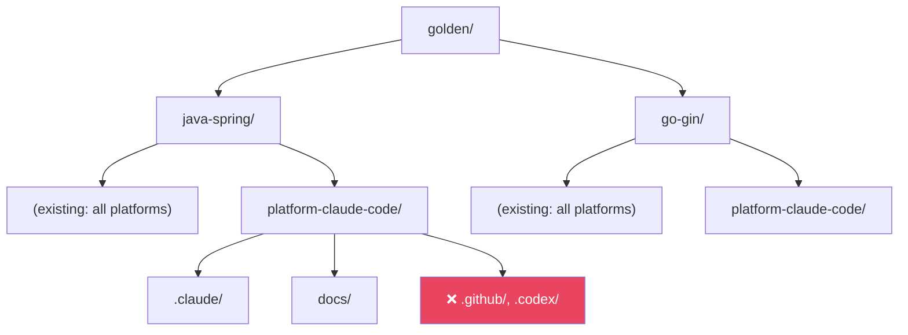

# História: Atualização de Testes e Golden Files

**ID:** story-0025-0007
**Chave Jira:** —
**Status:** Pendente

## 1. Dependências

| Blocked By | Blocks |
| :--- | :--- |
| story-0025-0003, story-0025-0004, story-0025-0005, story-0025-0006 | — |

## 2. Regras Transversais Aplicáveis

| ID | Título |
| :--- | :--- |
| RULE-001 | Retrocompatibilidade Total |
| RULE-003 | Shared é Sempre Incluído |

## 3. Descrição

Como **desenvolvedor do ia-dev-env**, eu quero que o test suite cubra todos os cenários de filtragem por plataforma com testes unitários, de integração e smoke tests, garantindo que a feature não introduza regressões e que cada combinação de plataforma produza exatamente os artefatos esperados.

Esta história é a guardrail de qualidade do épico. Todos os cenários implementados nas stories 0001-0006 precisam de cobertura de teste consolidada. Os golden files existentes (que representam `--platform all`) devem permanecer intactos (RULE-001). Novos golden files são adicionados para pelo menos 2 profiles representativos com plataformas individuais.

Os smoke tests são particularmente críticos: devem verificar não apenas que os diretórios esperados EXISTEM, mas que os diretórios NÃO-esperados NÃO EXISTEM. Exemplo: `--platform claude-code` deve gerar `.claude/` mas NÃO `.github/`.

### 3.1 Testes Unitários Novos

- `PlatformTest`: enum values, `fromCliName()`, `allUserSelectable()`
- `PlatformConverterTest`: conversão válida, inválida, `all`, case-sensitivity
- `PlatformFilterTest` (ou equivalente): filtragem por cada plataforma, composição, vazio = all
- `AssemblerDescriptorTest`: mapeamento completo dos 33 assemblers

### 3.2 Testes de Integração Novos

- Pipeline filtrado com `CLAUDE_CODE` → verifica artefatos gerados e ausentes
- Pipeline filtrado com `COPILOT` → idem
- Pipeline filtrado com `CODEX` → idem
- Pipeline filtrado com `CLAUDE_CODE, COPILOT` → idem
- Pipeline sem filtro → resultado idêntico ao anterior (regressão)
- Precedência CLI > YAML → YAML diz `claude-code`, CLI diz `copilot`, resultado é `copilot`

### 3.3 Smoke Tests Atualizados

- `ProfileArtifacts` e `ExpectedArtifacts` atualizados para aceitar plataforma
- Para cada plataforma isolada:
  - Verificar que diretórios esperados existem
  - Verificar que diretórios NÃO-esperados NÃO existem
  - Verificar contagem de arquivos por diretório

### 3.4 Golden Files

- Golden files existentes em `src/test/resources/golden/` permanecem inalterados (representam `all`)
- Novos golden files para pelo menos `java-spring` e `go-gin` com `--platform claude-code`
- Estrutura: `golden/{profile}/platform-{platform}/` ou similar
- Testes de snapshot comparam output gerado vs. golden files

### 3.5 Profile Integrity Tests

- Testes existentes de integridade de profiles atualizados para incluir a nova seção `platform:`
- Validação de que cada profile template contém `platform: all`

## 3.5 Entrega de Valor

- **Valor Principal:** Cobertura ≥ 95% mantida com testes específicos para cada plataforma, garantindo que a filtragem não introduz regressões
- **Métrica de Sucesso:** Todos os testes passam para cada plataforma isolada e combinação; zero regressões nos testes existentes; smoke tests validam presença E ausência de diretórios
- **Impacto no Negócio:** Confiança para release — feature validada com cobertura completa de cenários

## 4. Definições de Qualidade Locais

### DoR Local (Definition of Ready)

- [ ] Stories 0003, 0004, 0005, 0006 concluídas (toda funcionalidade implementada)
- [ ] Estrutura de golden files por plataforma decidida
- [ ] Profiles representativos para golden files escolhidos

### DoD Local (Definition of Done)

- [ ] ≥ 95% line coverage, ≥ 90% branch coverage (verificado via JaCoCo)
- [ ] Zero testes existentes quebrados
- [ ] Testes unitários para Platform, PlatformConverter, filtragem
- [ ] Testes de integração para cada plataforma isolada e combinações
- [ ] Smoke tests validam presença E ausência de diretórios
- [ ] Golden files para `java-spring` e `go-gin` com `--platform claude-code`
- [ ] Profile integrity tests atualizados
- [ ] Pelo menos 1 teste E2E validando pipeline completo com filtro

### Global Definition of Done (DoD)

- **Cobertura:** ≥ 95% Line, ≥ 90% Branch
- **Testes Automatizados:** Unitários, integração, smoke, snapshot
- **Relatório de Cobertura:** JaCoCo com thresholds
- **Documentação:** N/A
- **Persistência:** N/A
- **Performance:** N/A

## 5. Contratos de Dados (Data Contract)

### 5.1 Matriz de Testes por Cenário

| Cenário | Tipo | Verifica |
| :--- | :--- | :--- |
| Enum Platform valores | Unitário | 4 valores, cliName, fromCliName, allUserSelectable |
| PlatformConverter válido | Unitário | `"claude-code"` → `CLAUDE_CODE` |
| PlatformConverter inválido | Unitário | `"invalid"` → TypeConversionException |
| Filtro CLAUDE_CODE | Unitário | 21 assemblers, ordem preservada |
| Filtro COPILOT | Unitário | 20 assemblers |
| Filtro CODEX | Unitário | 18 assemblers |
| Filtro composição | Unitário | 28 assemblers para CLAUDE_CODE + COPILOT |
| Filtro vazio = all | Unitário | 33 assemblers |
| Pipeline CLAUDE_CODE | Integração | `.claude/` presente, `.github/` ausente |
| Pipeline COPILOT | Integração | `.github/` presente, `.claude/` ausente |
| Pipeline CODEX | Integração | `.codex/` presente, `.claude/` ausente |
| Pipeline all | Integração | Resultado idêntico ao anterior |
| Precedência CLI > YAML | Integração | CLI `copilot` > YAML `claude-code` |
| YAML parsing | Integração | String, lista, ausente, inválido |
| Smoke claude-code | Smoke | Diretórios `.claude/`, `docs/` presentes; `.github/`, `.codex/` ausentes |
| Smoke copilot | Smoke | Diretório `.github/` presente; `.claude/` ausente |
| Golden java-spring claude | Snapshot | Output = golden file |
| Golden go-gin claude | Snapshot | Output = golden file |
| Profile integrity | Integração | Todos os 14 profiles contêm `platform: all` |

### 5.2 Diretórios Esperados por Plataforma

| Plataforma | Presentes | Ausentes |
| :--- | :--- | :--- |
| `claude-code` | `.claude/`, `docs/`, `adr/`, `specs/`, `results/` | `.github/`, `.codex/`, `.agents/` |
| `copilot` | `.github/`, `docs/`, `adr/`, `specs/`, `results/` | `.claude/`, `.codex/`, `.agents/` |
| `codex` | `.codex/`, `.agents/`, `docs/`, `adr/`, `specs/`, `results/` | `.claude/`, `.github/` |
| `all` | Todos | Nenhum |

## 6. Diagramas

### 6.1 Estrutura de Golden Files



## 7. Critérios de Aceite (Gherkin)

```gherkin
Cenario: Nenhum teste existente quebra
  DADO que o test suite atual tem N testes passando
  QUANDO executo todos os testes após as mudanças
  ENTÃO todos os N testes existentes continuam passando
  E zero testes foram removidos ou desabilitados

Cenario: Cobertura mantém thresholds
  DADO que o threshold é ≥ 95% line e ≥ 90% branch
  QUANDO o JaCoCo gera o relatório
  ENTÃO line coverage é ≥ 95%
  E branch coverage é ≥ 90%

Cenario: Smoke test valida ausência de diretórios
  DADO que a geração executa com --platform claude-code
  QUANDO verifico o diretório de saída
  ENTÃO .claude/ existe e contém rules/, skills/, agents/
  E .github/ NÃO existe
  E .codex/ NÃO existe
  E .agents/ NÃO existe

Cenario: Smoke test copilot valida ausência de diretórios
  DADO que a geração executa com --platform copilot
  QUANDO verifico o diretório de saída
  ENTÃO .github/ existe e contém instructions/, skills/, agents/
  E .claude/ NÃO existe

Cenario: Golden files para platform claude-code correspondem
  DADO que golden files existem para java-spring com platform claude-code
  QUANDO gero artefatos com --platform claude-code para java-spring
  E comparo com o golden file
  ENTÃO os conteúdos são idênticos byte-a-byte

Cenario: Testes de integração cobrem todas as plataformas isoladas
  DADO que existem testes de integração para cada plataforma
  QUANDO executo o pipeline com {CLAUDE_CODE}, {COPILOT}, {CODEX}
  ENTÃO cada execução produz apenas os artefatos da plataforma
  E nenhum artefato de outra plataforma é gerado

Cenario: Profile integrity tests incluem seção platform
  DADO que os 14 profile templates existem
  QUANDO verifico cada template
  ENTÃO cada um contém a chave "platform: all"
```

## 8. Sub-tarefas

- [ ] [Dev] Criar golden files `platform-claude-code/` para `java-spring` e `go-gin`
- [ ] [Dev] Atualizar `ProfileArtifacts` e `ExpectedArtifacts` para suportar plataforma
- [ ] [Test] Unitário: PlatformTest (enum, fromCliName, allUserSelectable)
- [ ] [Test] Unitário: PlatformConverterTest (válido, inválido, all, case)
- [ ] [Test] Unitário: PlatformFilterTest (cada plataforma, composição, vazio, ordem)
- [ ] [Test] Integração: Pipeline filtrado para cada plataforma isolada
- [ ] [Test] Integração: Precedência CLI > YAML
- [ ] [Test] Integração: Profile integrity com seção platform
- [ ] [Test] Smoke/E2E: Ausência de diretórios para cada plataforma
- [ ] [Test] Snapshot: Golden files por plataforma (java-spring, go-gin)
- [ ] [Doc] N/A
