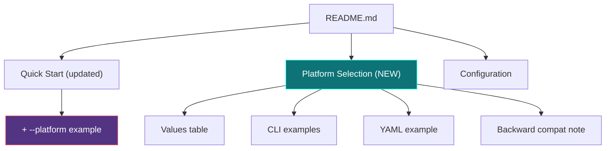

# História: Documentação e Help Text

**ID:** story-0025-0008
**Chave Jira:** —
**Status:** Concluída

## 1. Dependências

| Blocked By | Blocks |
| :--- | :--- |
| story-0025-0005 | — |

## 2. Regras Transversais Aplicáveis

| ID | Título |
| :--- | :--- |
| RULE-006 | Contagens Dinâmicas |
| RULE-001 | Retrocompatibilidade Total |

## 3. Descrição

Como **usuário do ia-dev-env**, eu quero que o README.md do projeto, o `--help` do CLI e o CHANGELOG documentem a nova flag `--platform` com exemplos claros, garantindo que eu descubra e entenda a funcionalidade sem precisar ler o código.

Esta história atualiza toda a documentação user-facing do projeto. O README.md principal recebe uma nova seção "Platform Selection" com exemplos de uso para cada plataforma. O `--help` já é atualizado na story-0025-0003 (via Picocli annotation), mas esta história garante que a descrição é completa e inclui exemplos. O CHANGELOG recebe a entrada para a nova feature seguindo o formato Keep a Changelog.

### 3.1 README.md — Seção "Platform Selection"

- Nova seção após "Quick Start" e antes de "Configuration"
- Título: `## Platform Selection`
- Conteúdo:
  - Explicação da flag `--platform`
  - Tabela com valores aceitos e o que cada um gera
  - Exemplos de uso (CLI e YAML)
  - Nota sobre retrocompatibilidade (default = all)

### 3.2 README.md — Atualização de "Quick Start"

- Adicionar menção à flag `--platform` no exemplo principal
- Exemplo: `ia-dev-env generate --config my-config.yaml --platform claude-code`

### 3.3 CHANGELOG.md

- Nova entrada em `## [Unreleased]` → seção `### Added`
- Formato: `- **Platform filter**: Add \`--platform\` flag to \`generate\` command for targeted AI platform generation (claude-code, copilot, codex, all)`

### 3.4 CLAUDE.md do Projeto (root)

- Atualizar se necessário para refletir que a geração é condicional
- A tabela de mapeamento cross-platform deve mencionar que é condicional à plataforma

### 3.5 Tabela de Mapeamento Cross-Platform

- A tabela `.claude/ ↔ .github/ ↔ .codex/` recebe nota explicativa: "Generated only when the corresponding platform is selected via `--platform`"

## 3.5 Entrega de Valor

- **Valor Principal:** Usuário descobre e entende a flag `--platform` via documentação, sem precisar explorar código ou pedir suporte
- **Métrica de Sucesso:** README contém seção "Platform Selection" com pelo menos 4 exemplos de uso; CHANGELOG documenta a feature; `--help` é auto-suficiente
- **Impacto no Negócio:** Adoção facilitada da feature — menor barreira de entrada para novos usuários e equipes

## 4. Definições de Qualidade Locais

### DoR Local (Definition of Ready)

- [ ] story-0025-0005 concluída (contagens dinâmicas no README/CLAUDE.md)
- [ ] Formato final do output por plataforma confirmado
- [ ] CHANGELOG.md existente lido e formato compreendido

### DoD Local (Definition of Done)

- [ ] README.md com seção "Platform Selection" e exemplos
- [ ] README.md "Quick Start" atualizado com menção à flag
- [ ] CHANGELOG.md com entrada para a feature
- [ ] CLAUDE.md root atualizado se necessário
- [ ] Tabela cross-platform com nota sobre condicionalidade
- [ ] Pelo menos 1 teste automatizado validando que README contém seção Platform Selection
- [ ] Smoke test passando

### Global Definition of Done (DoD)

- **Cobertura:** ≥ 95% Line, ≥ 90% Branch
- **Testes Automatizados:** Snapshot para README gerado
- **Relatório de Cobertura:** JaCoCo
- **Documentação:** Própria história é a documentação
- **Persistência:** N/A
- **Performance:** N/A

## 5. Contratos de Dados (Data Contract)

### 5.1 README.md — Seção Platform Selection

| Sub-seção | Conteúdo |
| :--- | :--- |
| Introdução | Parágrafo explicando que a flag `--platform` permite gerar artefatos para uma plataforma específica |
| Tabela de valores | `claude-code` (default), `copilot`, `codex`, `all` — com descrição de cada |
| Exemplo CLI | `ia-dev-env generate --platform claude-code` |
| Exemplo multi | `ia-dev-env generate -p claude-code,copilot` |
| Exemplo YAML | `platform: claude-code` no arquivo de configuração |
| Retrocompatibilidade | Nota: sem flag ou `--platform all` gera para todas as plataformas |

### 5.2 CHANGELOG.md — Entrada

| Seção | Conteúdo |
| :--- | :--- |
| `## [Unreleased]` | — |
| `### Added` | `- **Platform filter**: Add \`--platform\` flag to \`generate\` command for targeted AI platform generation (claude-code, copilot, codex, all). Supports YAML config via \`platform:\` section. Default: all (backward-compatible).` |

### 5.3 Valores da Flag para Documentação

| Valor | Descrição | Diretórios Gerados |
| :--- | :--- | :--- |
| `claude-code` | Anthropic Claude Code | `.claude/` + docs |
| `copilot` | GitHub Copilot | `.github/` + docs |
| `codex` | OpenAI Codex | `.codex/`, `.agents/` + docs |
| `all` | Todas as plataformas (default) | `.claude/`, `.github/`, `.codex/`, `.agents/` + docs |

## 6. Diagramas

### 6.1 Seções do README Afetadas



## 7. Critérios de Aceite (Gherkin)

```gherkin
Cenario: README contém seção Platform Selection
  DADO que o README.md do projeto existe
  QUANDO leio o conteúdo
  ENTÃO contém header "## Platform Selection"
  E contém tabela com valores claude-code, copilot, codex, all

Cenario: README Quick Start menciona --platform
  DADO que o README.md do projeto existe
  QUANDO leio a seção Quick Start
  ENTÃO contém pelo menos um exemplo com "--platform"

Cenario: README inclui exemplo de múltiplas plataformas
  DADO que o README.md contém seção Platform Selection
  QUANDO leio os exemplos
  ENTÃO contém exemplo com "-p claude-code,copilot" ou equivalente

Cenario: README inclui exemplo YAML
  DADO que o README.md contém seção Platform Selection
  QUANDO leio os exemplos
  ENTÃO contém exemplo de `platform: claude-code` no YAML

Cenario: CHANGELOG documenta a feature
  DADO que o CHANGELOG.md existe
  QUANDO leio a seção Unreleased
  ENTÃO contém entrada sobre "--platform" na seção Added
  E menciona os valores aceitos

Cenario: Nota de retrocompatibilidade presente
  DADO que o README.md contém seção Platform Selection
  QUANDO leio a seção
  ENTÃO contém nota explicando que sem flag ou com "all" gera para todas as plataformas
  E menciona que é backward-compatible

Cenario: Tabela cross-platform tem nota condicional
  DADO que o CLAUDE.md root contém tabela de mapeamento
  QUANDO leio a tabela
  ENTÃO contém nota explicando que colunas são condicionais à plataforma selecionada
```

## 8. Sub-tarefas

- [ ] [Dev] Adicionar seção "Platform Selection" ao template do README.md
- [ ] [Dev] Atualizar seção "Quick Start" do README.md com exemplo `--platform`
- [ ] [Dev] Adicionar entrada ao CHANGELOG.md (seção Unreleased → Added)
- [ ] [Dev] Atualizar CLAUDE.md root com nota sobre condicionalidade da tabela
- [ ] [Test] Snapshot: README gerado contém seção Platform Selection
- [ ] [Test] Smoke/E2E: README gerado com `--platform claude-code` menciona apenas Claude Code
- [ ] [Doc] Revisar todos os textos para clareza e completude
