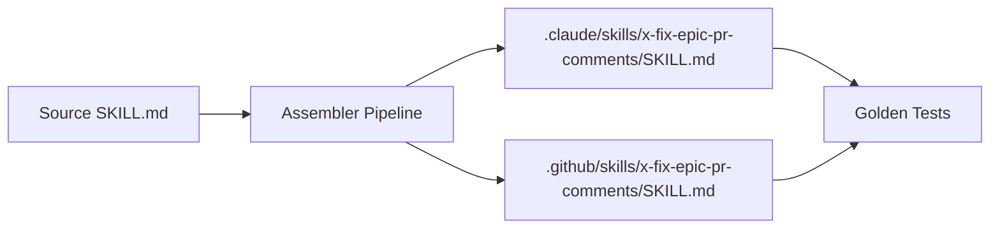

# História: Source template Java, assembler e golden tests

**ID:** story-0026-0006
**Chave Jira:** —
**Status:** Pendente

## 1. Dependências

| Blocked By | Blocks |
| :--- | :--- |
| story-0026-0004 | story-0026-0007 |

## 2. Regras Transversais Aplicáveis

| ID | Título |
| :--- | :--- |
| RULE-003 | PR único para todas as correções |

## 3. Descrição

Como **mantenedor do ia-dev-environment**, eu quero que a nova skill `/x-fix-epic-pr-comments` seja distribuída automaticamente para projetos gerados, garantindo que qualquer projeto que use ia-dev-environment tenha acesso à skill.

Esta história cria os artefatos Java necessários para distribuição: (1) source template do SKILL.md em `java/src/main/resources/targets/`, (2) registro no assembler pipeline existente, e (3) golden tests validando que a skill é gerada corretamente em todos os profiles.

### 3.1 Source Template

Criar o SKILL.md como resource em:
- `java/src/main/resources/targets/claude/skills/core/x-fix-epic-pr-comments/SKILL.md`
- `java/src/main/resources/targets/github-copilot/skills/dev/x-fix-epic-pr-comments.md`

O conteúdo é o SKILL.md consolidado das stories 0001-0005, adaptado para o formato de source template (com `{{PLACEHOLDER}}` markers onde necessário).

### 3.2 Assembler Registration

1. Localizar o assembler responsável por skills (provavelmente `SkillAssembler` ou similar)
2. Registrar a nova skill no pipeline de geração
3. A skill deve ser copiada para `.claude/skills/x-fix-epic-pr-comments/SKILL.md` no output
4. A skill deve ser copiada para `.github/skills/x-fix-epic-pr-comments/SKILL.md` no output (dual-target)

### 3.3 Golden Tests

1. Regenerar golden files para todos os 17 profiles (ou 8, conforme existentes)
2. Verificar que a nova skill aparece em cada profile:
   - `.claude/skills/x-fix-epic-pr-comments/SKILL.md`
   - `.github/skills/x-fix-epic-pr-comments/SKILL.md` (se applicable)
3. Adicionar testes unitários verificando:
   - Skill presente no output gerado
   - Conteúdo do SKILL.md contém seções obrigatórias (Input Parsing, Prerequisites, etc.)
   - Skill registrada no catálogo (CLAUDE.md gerado)

### 3.4 README e CLAUDE.md Updates

1. Atualizar contagem de skills no CLAUDE.md do source template
2. Adicionar entry na tabela de skills com nome, path e descrição
3. Atualizar README.md se referencia contagem de skills

## 3.5 Entrega de Valor

- **Valor Principal:** Skill disponível automaticamente em todos os projetos gerados
- **Métrica de Sucesso:** `ia-dev-env generate` produz a skill em todos os profiles
- **Impacto no Negócio:** Zero configuração manual para usar a skill em novos projetos

## 4. Definições de Qualidade Locais

### DoR Local (Definition of Ready)

- [ ] SKILL.md consolidado das stories 0001-0005 finalizado
- [ ] Padrão de assembler registration documentado (referência: PlanTemplatesAssembler)
- [ ] Pipeline de geração e golden test mechanism compreendidos

### DoD Local (Definition of Done)

- [ ] Source templates criados para Claude e GitHub Copilot targets
- [ ] Skill registrada no assembler pipeline
- [ ] Golden tests regenerados e passando para todos os profiles
- [ ] CLAUDE.md e README.md atualizados com contagem de skills
- [ ] Pelo menos 1 teste automatizado validando presença da skill no output
- [ ] Smoke test passando

### Global Definition of Done (DoD)

- **Cobertura:** ≥ 95% Line, ≥ 90% Branch
- **TDD Compliance:** Commits show test-first pattern

## 5. Contratos de Dados (Data Contract)

### 5.1 Source Template

| Campo | Tipo | M/O | Validações | Exemplo |
| :--- | :--- | :--- | :--- | :--- |
| `skillName` | `String` | M | kebab-case | `x-fix-epic-pr-comments` |
| `sourcePath` | `String` | M | valid path | `targets/claude/skills/core/x-fix-epic-pr-comments/SKILL.md` |
| `outputPath` | `String` | M | valid path | `.claude/skills/x-fix-epic-pr-comments/SKILL.md` |

## 6. Diagramas

### 6.1 Pipeline de Geração



## 7. Critérios de Aceite (Gherkin)

```gherkin
Cenario: Skill gerada no output Claude
  DADO que o pipeline de geração é executado
  QUANDO o assembler processa a nova skill
  ENTÃO o arquivo .claude/skills/x-fix-epic-pr-comments/SKILL.md existe no output
  E contém as seções Input Parsing, Prerequisites, PR Discovery

Cenario: Skill gerada no output GitHub Copilot
  DADO que o pipeline de geração é executado
  QUANDO o assembler processa a nova skill
  ENTÃO o arquivo .github/skills/x-fix-epic-pr-comments/SKILL.md existe no output

Cenario: Golden tests passam para todos os profiles
  DADO que golden files foram regenerados
  QUANDO mvn test é executado
  ENTÃO todos os golden tests passam
  E cada profile contém a nova skill

Cenario: CLAUDE.md gerado inclui nova skill
  DADO que o pipeline de geração é executado
  QUANDO o CLAUDE.md é gerado
  ENTÃO a tabela de skills inclui x-fix-epic-pr-comments
  E a contagem total de skills é incrementada

Cenario: Conteúdo do SKILL.md preserva placeholders
  DADO que o source template contém {{PLACEHOLDER}} markers
  QUANDO a skill é copiada pelo assembler
  ENTÃO os placeholders são preservados verbatim (não renderizados)
```

## 8. Sub-tarefas

- [ ] [Dev] Criar source SKILL.md em targets/claude/ e targets/github-copilot/
- [ ] [Dev] Registrar skill no assembler pipeline
- [ ] [Dev] Regenerar golden files para todos os profiles
- [ ] [Dev] Atualizar CLAUDE.md e README.md source templates com nova skill
- [ ] [Test] Unitário: skill presente no output gerado (2 cenários)
- [ ] [Test] Unitário: conteúdo preserva placeholders (1 cenário)
- [ ] [Test] Smoke/E2E: geração completa inclui nova skill em todos os profiles
