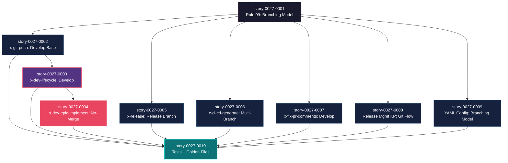

# Mapa de Implementação — Git Flow Branching Model

**Gerado a partir das dependências BlockedBy/Blocks de cada história do epic-0027.**

---

## 1. Matriz de Dependências

| Story | Título | Chave Jira | Blocked By | Blocks | Status |
| :--- | :--- | :--- | :--- | :--- | :--- |
| story-0027-0001 | Definição da Regra de Branching Model | — | — | story-0027-0002, story-0027-0005, story-0027-0006, story-0027-0007, story-0027-0008, story-0027-0009 | Concluída |
| story-0027-0002 | x-git-push — Develop como Base Default | — | story-0027-0001 | story-0027-0003, story-0027-0010 | Concluída |
| story-0027-0003 | x-dev-lifecycle — Integração com Develop | — | story-0027-0002 | story-0027-0004, story-0027-0010 | Concluída |
| story-0027-0004 | x-dev-epic-implement — Develop Base e No-Merge Default | — | story-0027-0003 | story-0027-0010 | Concluída |
| story-0027-0005 | x-release — Workflow de Release Branch | — | story-0027-0001 | story-0027-0010 | Concluída |
| story-0027-0006 | x-ci-cd-generate — Triggers Multi-Branch | — | story-0027-0001 | story-0027-0010 | Concluída |
| story-0027-0007 | x-fix-epic-pr-comments — Develop Base Branch | — | story-0027-0001 | story-0027-0010 | Concluída |
| story-0027-0008 | Release Management KP — Git Flow como Default | — | story-0027-0001 | story-0027-0010 | Concluída |
| story-0027-0009 | Configuração de Branching Model no YAML | — | story-0027-0001 | story-0027-0010 | Concluída |
| story-0027-0010 | Testes de Integração e Golden Files | — | story-0027-0002, story-0027-0003, story-0027-0004, story-0027-0005, story-0027-0006, story-0027-0007, story-0027-0008, story-0027-0009 | — | Concluída |

> **Nota:** story-0027-0010 depende de TODAS as outras stories (exceto 0001) porque valida os artefatos gerados por cada uma delas. A dependência transitiva em story-0027-0001 é satisfeita via as demais stories.

---

## 2. Fases de Implementação

> As histórias são agrupadas em fases. Dentro de cada fase, as histórias podem ser implementadas **em paralelo**. Uma fase só pode iniciar quando todas as dependências das fases anteriores estiverem concluídas.

```
╔══════════════════════════════════════════════════════════════════════════════╗
║                     FASE 0 — Fundação (1 história)                         ║
║                                                                            ║
║   ┌───────────────────────────────────────────────────────────────────┐     ║
║   │  story-0027-0001  Regra de Branching Model (Rule 09)             │     ║
║   └────────────────────────────┬──────────────────────────────────────┘     ║
╚════════════════════════════════╪═══════════════════════════════════════════╝
     ┌───────┬──────┬──────┬────┴────┬───────┐
     ▼       ▼      ▼      ▼         ▼       ▼
╔══════════════════════════════════════════════════════════════════════════════╗
║              FASE 1 — Core + Extensions (5 histórias, paralelo)            ║
║                                                                            ║
║   ┌──────────────┐  ┌──────────────┐  ┌──────────────┐                     ║
║   │  story-0027  │  │  story-0027  │  │  story-0027  │                     ║
║   │  -0002       │  │  -0005       │  │  -0006       │                     ║
║   │  x-git-push  │  │  x-release   │  │  x-ci-cd     │                     ║
║   └──────┬───────┘  └──────────────┘  └──────────────┘                     ║
║          │                                                                 ║
║   ┌──────────────┐  ┌──────────────┐  ┌──────────────┐                     ║
║   │  story-0027  │  │  story-0027  │  │  story-0027  │                     ║
║   │  -0007       │  │  -0008       │  │  -0009       │                     ║
║   │  x-fix-pr    │  │  release KP  │  │  YAML config │                     ║
║   └──────────────┘  └──────────────┘  └──────────────┘                     ║
╚══════════════╪═══════════════════════════════════════════════════════════════╝
               │
               ▼
╔══════════════════════════════════════════════════════════════════════════════╗
║              FASE 2 — Lifecycle Integration (1 história)                   ║
║                                                                            ║
║   ┌───────────────────────────────────────────────────────────────────┐     ║
║   │  story-0027-0003  x-dev-lifecycle — Integração com Develop       │     ║
║   │  (← story-0027-0002)                                             │     ║
║   └────────────────────────────┬──────────────────────────────────────┘     ║
╚════════════════════════════════╪═══════════════════════════════════════════╝
                                 │
                                 ▼
╔══════════════════════════════════════════════════════════════════════════════╗
║              FASE 3 — Epic Orchestrator (1 história)                       ║
║                                                                            ║
║   ┌───────────────────────────────────────────────────────────────────┐     ║
║   │  story-0027-0004  x-dev-epic-implement — No-Merge Default        │     ║
║   │  (← story-0027-0003)                                             │     ║
║   └──────────────────────────────────────────────────────────────────┘     ║
╚══════════════════════════════════════════════════════════════════════════════╝
                                 │
                                 ▼
╔══════════════════════════════════════════════════════════════════════════════╗
║              FASE 4 — Validação Cross-Cutting (1 história)                 ║
║                                                                            ║
║   ┌───────────────────────────────────────────────────────────────────┐     ║
║   │  story-0027-0010  Testes de Integração e Golden Files             │     ║
║   │  (← ALL previous stories)                                        │     ║
║   └──────────────────────────────────────────────────────────────────┘     ║
╚══════════════════════════════════════════════════════════════════════════════╝
```

---

## 3. Caminho Crítico

> O caminho crítico (a sequência mais longa de dependências) determina o tempo mínimo de implementação do projeto.

```
story-0027-0001 → story-0027-0002 → story-0027-0003 → story-0027-0004 → story-0027-0010
   Fase 0            Fase 1            Fase 2            Fase 3            Fase 4
```

**5 fases no caminho crítico, 5 histórias na cadeia mais longa (0001 → 0002 → 0003 → 0004 → 0010).**

Qualquer atraso em story-0027-0001, 0002, 0003, ou 0004 impacta diretamente a data final de entrega. As stories paralelas da Fase 1 (0005-0009) têm folga e podem absorver atrasos sem impactar o caminho crítico.

---

## 4. Grafo de Dependências (Mermaid)



---

## 5. Resumo por Fase

| Fase | Histórias | Camada | Paralelismo | Pré-requisito |
| :--- | :--- | :--- | :--- | :--- |
| 0 | story-0027-0001 | Fundação (Rule) | 1 | — |
| 1 | story-0027-0002, story-0027-0005, story-0027-0006, story-0027-0007, story-0027-0008, story-0027-0009 | Core + Extensions | 6 paralelas | Fase 0 concluída |
| 2 | story-0027-0003 | Extension (Lifecycle) | 1 | Fase 1 (story-0027-0002) concluída |
| 3 | story-0027-0004 | Composição (Orchestrator) | 1 | Fase 2 concluída |
| 4 | story-0027-0010 | Cross-Cutting (Testes) | 1 | Fases 1-3 concluídas |

**Total: 10 histórias em 5 fases.**

> **Nota:** A Fase 1 tem máximo paralelismo (6 stories). Stories 0005-0009 são independentes entre si e podem ser atribuídas a diferentes desenvolvedores. Porém, apenas story-0027-0002 está no caminho crítico — as outras 5 têm folga.

---

## 6. Detalhamento por Fase

### Fase 0 — Fundação

| Story | Escopo Principal | Artefatos Chave |
| :--- | :--- | :--- |
| story-0027-0001 | Criar Rule 09 (branching model) e atualizar Rule 08 | `09-branching-model.md` resource, Rule 08 cross-reference |

**Entregas da Fase 0:**

- Rule 09 com Git Flow documentado (5 tipos de branch, merge direction, forbidden actions)
- Rule 08 com referência cruzada para Rule 09
- Resource template pronto para geração

### Fase 1 — Core + Extensions

| Story | Escopo Principal | Artefatos Chave |
| :--- | :--- | :--- |
| story-0027-0002 | x-git-push: `develop` como base, hotfix workflow | Template x-git-push SKILL.md com `develop`, seção Hotfix |
| story-0027-0005 | x-release: release branch workflow completo | Template x-release SKILL.md com 11 steps, hotfix release |
| story-0027-0006 | x-ci-cd-generate: triggers multi-branch | Templates CI/CD com triggers para develop, release/*, hotfix/* |
| story-0027-0007 | x-fix-epic-pr-comments: `--base develop` | Template x-fix-epic-pr-comments com develop base |
| story-0027-0008 | Release Management KP: Git Flow como default | Knowledge pack com Git Flow como recomendação primária |
| story-0027-0009 | YAML config: `branching-model` field | Enum `BranchingModel`, config parsing, 8 profile templates |

**Entregas da Fase 1:**

- Skill x-git-push gera com `develop` como base e suporte a hotfix
- Skill x-release gera com workflow completo de release branch
- Skill x-ci-cd-generate gera com triggers corretos por branch
- Skill x-fix-epic-pr-comments gera com `--base develop`
- Knowledge pack posiciona Git Flow como default
- Configuração `branching-model` disponível no YAML
- 8 profiles atualizados com `branching-model: gitflow`

### Fase 2 — Lifecycle Integration

| Story | Escopo Principal | Artefatos Chave |
| :--- | :--- | :--- |
| story-0027-0003 | x-dev-lifecycle: Phase 0 e Phase 6 com develop | Template x-dev-lifecycle SKILL.md com develop em Phase 0/6 |

**Entregas da Fase 2:**

- Skill x-dev-lifecycle gera com `develop` em Phase 0 (branch creation) e Phase 6 (PR)
- Version bump removido do fluxo de feature (pertence a release)

### Fase 3 — Epic Orchestrator

| Story | Escopo Principal | Artefatos Chave |
| :--- | :--- | :--- |
| story-0027-0004 | x-dev-epic-implement: develop + no-merge default | Template com 15+ refs atualizadas, no-merge default, baseBranch schema |

**Entregas da Fase 3:**

- Skill x-dev-epic-implement gera com `develop` como base e `no-merge` como default
- Flag `--interactive-merge` disponível como opt-in
- Campo `baseBranch` no schema de execution-state
- Auto-rebase contra `develop`

### Fase 4 — Validação Cross-Cutting

| Story | Escopo Principal | Artefatos Chave |
| :--- | :--- | :--- |
| story-0027-0010 | Testes de integração, golden files, smoke tests | Golden files para 8 profiles, testes gitflow/trunk, smoke tests |

**Entregas da Fase 4:**

- Golden files atualizados para todos os 8 profiles
- Testes para `branching-model: gitflow` (default) e `branching-model: trunk`
- Zero testes existentes quebrados
- Coverage ≥ 95% line, ≥ 90% branch mantidos
- Smoke tests validando Git Flow end-to-end

---

## 7. Observações Estratégicas

### Gargalo Principal

**story-0027-0001 (Rule 09)** é o gargalo principal — bloqueia 6 das 9 stories restantes. Investir tempo extra na qualidade e completude desta regra compensa porque define o vocabulário e as restrições que todas as outras stories referenciam. Se a Rule 09 estiver incompleta ou ambígua, cada skill vai interpretar o Git Flow de forma diferente.

### Histórias Folha (sem dependentes)

**story-0027-0005, story-0027-0006, story-0027-0007, story-0027-0008, story-0027-0009** são histórias folha (bloqueiam apenas story-0027-0010, que é a validação final). Podem absorver atrasos sem impactar o caminho crítico. São candidatas ideais para desenvolvedores paralelos ou para priorização menor quando recursos são limitados.

### Otimização de Tempo

- **Máximo paralelismo na Fase 1:** 6 stories podem ser executadas simultaneamente por diferentes desenvolvedores
- **Caminho crítico linear:** 0001 → 0002 → 0003 → 0004 forma uma cadeia sequencial inevitável (cada skill depende do padrão estabelecido pela anterior)
- **Alocação recomendada:** 1 dev sênior no caminho crítico (0001→0002→0003→0004), 2-3 devs nas stories paralelas da Fase 1

### Dependências Cruzadas

**story-0027-0010** é o ponto de convergência universal — depende de TODAS as outras stories. Isso é intencional: a validação cross-cutting só faz sentido quando todos os artefatos estão prontos. Não há convergências parciais entre branches do grafo de dependências.

### Marco de Validação Arquitetural

**story-0027-0002 (x-git-push)** é o marco de validação arquitetural. Quando esta história está completa:
- O padrão de substituição `main` → `develop` está estabelecido
- O fluxo de hotfix está documentado
- O template com `--base develop` está validado
- Todas as stories subsequentes reutilizam este padrão

Se story-0027-0002 revela problemas no approach de substituição (ex: templates com placeholders vs hardcoded), é melhor descobrir na Fase 1 do que na Fase 3 com a skill de ~1400 linhas.
