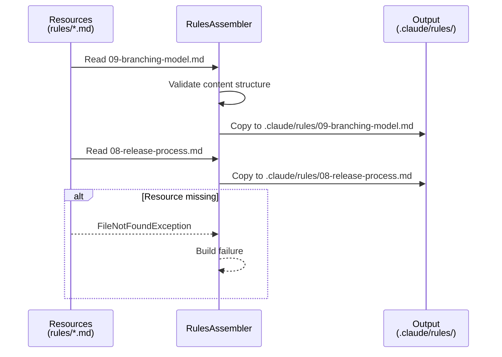

# História: Definição da Regra de Branching Model

**ID:** story-0027-0001
**Chave Jira:** —
**Status:** Concluída

## 1. Dependências

| Blocked By | Blocks |
| :--- | :--- |
| — | story-0027-0002, story-0027-0005, story-0027-0006, story-0027-0007, story-0027-0008, story-0027-0009 |

## 2. Regras Transversais Aplicáveis

| ID | Título |
| :--- | :--- |
| RULE-001 | Estrutura de Branches Git Flow |
| RULE-002 | Proibição de Merge Direto em Main |
| RULE-004 | Develop como Base Default |
| RULE-006 | Hotfix com Dual Merge |
| RULE-010 | Branch Protection Guidance |

## 3. Descrição

Como **Tech Lead**, eu quero uma regra formal (Rule 09) definindo o modelo de branching Git Flow como padrão do projeto, garantindo que todas as skills geradas sigam o mesmo fluxo de branches consistente.

Esta história é a fundação de todo o épico. A regra `09-branching-model.md` será o documento de referência que todas as outras skills consultam para determinar nomes de branches, direções de merge, e ações proibidas. Sem esta regra, cada skill implementaria Git Flow de forma inconsistente.

A regra é um artefato gerado: o conteúdo vive nos resources do gerador Java (`java/src/main/resources/`), e o assembler correspondente (`RulesAssembler`) o copia para `.claude/rules/` durante a geração. A Rule 08 existente também precisa de uma referência cruzada para a nova Rule 09.

### 3.1 Conteúdo da Rule 09

- Tabela de tipos de branch: `main`, `develop`, `feature/*`, `release/*`, `hotfix/*`
- Convenções de nomes para cada tipo de branch
- Regras de direção de merge (quem pode mergear onde)
- Ações proibidas: push direto em `main`, PRs de feature para `main`
- Diagrama ASCII do fluxo Git Flow
- Referência cruzada com Rule 08

### 3.2 Atualização da Rule 08

- Adicionar linha: "Veja Rule 09 para o modelo de branching"
- Adicionar seção sobre release branches no contexto de Git Flow
- Manter retrocompatibilidade do conteúdo existente

### 3.3 Resource Template

- Novo arquivo: `java/src/main/resources/shared/rules/09-branching-model.md`
- Atualização: `java/src/main/resources/shared/rules/08-release-process.md`
- O `RulesAssembler` já copia todos os `.md` da pasta `rules/` — não precisa de alteração no assembler

## 3.5 Entrega de Valor

- **Valor Principal:** Padrão de branching documentado e autoritativo, eliminando ambiguidade sobre fluxo Git em todos os projetos gerados pelo `ia-dev-env`
- **Métrica de Sucesso:** Rule 09 gerada com sucesso em todos os 8 profiles, contendo tabela de branches, direções de merge e ações proibidas
- **Impacto no Negócio:** Equipes downstream recebem regras claras de branching desde o setup do projeto, reduzindo erros de merge e conflitos de fluxo

## 4. Definições de Qualidade Locais

### DoR Local (Definition of Ready)

- [ ] Estrutura atual de rules resources mapeada (`java/src/main/resources/shared/rules/`)
- [ ] `RulesAssembler` analisado para confirmar que copia todos os `.md` automaticamente
- [ ] Formato de numeração de regras confirmado (09 é o próximo disponível)

### DoD Local (Definition of Done)

- [ ] Arquivo `09-branching-model.md` criado no diretório de resources
- [ ] Rule 08 atualizada com referência cruzada para Rule 09
- [ ] Geração para todos os 8 profiles inclui Rule 09 no output
- [ ] Conteúdo da regra cobre todos os 5 tipos de branch
- [ ] Pelo menos 1 teste automatizado validando presença e conteúdo da Rule 09 no output gerado
- [ ] Smoke test passando

### Global Definition of Done (DoD)

- **Cobertura:** ≥ 95% Line, ≥ 90% Branch
- **Testes Automatizados:** Unitários para conteúdo do template, integração para pipeline de geração
- **Relatório de Cobertura:** JaCoCo
- **Documentação:** CLAUDE.md gerado lista Rule 09 na tabela de regras
- **Performance:** Geração em < 30s por profile
- **TDD Compliance:** Test-first, refactoring explícito, TPP incremental
- **Double-Loop TDD:** Acceptance tests (outer loop), unit tests guiados por TPP (inner loop)

## 5. Contratos de Dados (Data Contract)

### 5.1 Input (Resource Template)

| Campo | Tipo | M/O | Validações | Exemplo |
| :--- | :--- | :--- | :--- | :--- |
| `filename` | `String` | M | Pattern: `NN-kebab-name.md`, NN = 09 | `09-branching-model.md` |
| `content` | `Markdown` | M | Deve conter seções: Branch Types, Naming, Merge Direction, Forbidden | Conteúdo completo da regra |

### 5.2 Output (Generated Rule)

| Campo | Tipo | Sempre presente | Descrição |
| :--- | :--- | :--- | :--- |
| `file_path` | `String` | Sim | `.claude/rules/09-branching-model.md` |
| `branch_types_table` | `Markdown Table` | Sim | Tabela com 5 tipos de branch |
| `merge_direction_rules` | `Markdown Section` | Sim | Regras de direção de merge |
| `forbidden_actions` | `Markdown List` | Sim | Lista de ações proibidas |
| `ascii_diagram` | `ASCII Art` | Sim | Diagrama do fluxo Git Flow |

### 5.3 Error Codes Mapeados

| Condição | Tipo | Severidade | Mensagem |
| :--- | :--- | :--- | :--- |
| Resource file 09-branching-model.md ausente | Build failure | CRITICAL | `Missing rule resource: 09-branching-model.md` |
| Rule 08 sem referência cruzada | Test failure | HIGH | `Rule 08 must reference Rule 09 for branching model` |

## 6. Diagramas

### 6.1 Fluxo Git Flow (conteúdo da Rule 09)

```mermaid
gitgraph
    commit id: "initial"
    branch develop
    checkout develop
    commit id: "feat-A"
    branch feature/story-001
    checkout feature/story-001
    commit id: "impl"
    checkout develop
    merge feature/story-001 id: "PR merge"
    branch release/1.0.0
    checkout release/1.0.0
    commit id: "bump version"
    checkout main
    merge release/1.0.0 id: "release merge" tag: "v1.0.0"
    checkout develop
    merge release/1.0.0 id: "back-merge"
    checkout main
    branch hotfix/fix-critical
    checkout hotfix/fix-critical
    commit id: "hotfix"
    checkout main
    merge hotfix/fix-critical id: "hotfix to main" tag: "v1.0.1"
    checkout develop
    merge hotfix/fix-critical id: "hotfix to develop"
```

### 6.2 Pipeline de Geração da Regra



## 7. Critérios de Aceite (Gherkin)

```gherkin
Cenario: Geração sem resource de regra 09
  DADO que o resource "09-branching-model.md" NÃO existe no diretório de rules
  QUANDO o gerador executa o pipeline para qualquer profile
  ENTÃO a geração falha com mensagem indicando resource ausente

Cenario: Geração bem-sucedida com Rule 09
  DADO que o resource "09-branching-model.md" existe com conteúdo válido
  QUANDO o gerador executa o pipeline para o profile "java-quarkus"
  ENTÃO o arquivo ".claude/rules/09-branching-model.md" é gerado no output
  E o conteúdo contém a tabela de 5 tipos de branch (main, develop, feature, release, hotfix)
  E o conteúdo contém a seção "Merge Direction"
  E o conteúdo contém a seção "Forbidden Actions"

Cenario: Rule 08 referencia Rule 09
  DADO que o resource "08-release-process.md" foi atualizado com referência cruzada
  QUANDO o gerador executa o pipeline
  ENTÃO o arquivo ".claude/rules/08-release-process.md" gerado contém "Rule 09"
  E o conteúdo menciona "branching model" ou "modelo de branching"

Cenario: Rule 09 gerada para todos os 8 profiles
  DADO que o resource "09-branching-model.md" existe com conteúdo válido
  QUANDO o gerador executa o pipeline para cada um dos 8 profiles (java-quarkus, java-spring, go-gin, kotlin-ktor, python-click-cli, python-fastapi, rust-axum, typescript-nestjs)
  ENTÃO cada output contém ".claude/rules/09-branching-model.md" com conteúdo idêntico
  E o CLAUDE.md gerado lista "09-branching-model.md" na tabela de regras

Cenario: Conteúdo da Rule 09 proíbe merge direto em main
  DADO que a Rule 09 foi gerada com sucesso
  QUANDO o conteúdo é inspecionado
  ENTÃO contém texto proibindo PRs de "feat/*" para "main"
  E contém texto permitindo apenas "release/*" e "hotfix/*" mergeando em "main"
```

## 8. Sub-tarefas

- [ ] [Dev] Criar resource `java/src/main/resources/shared/rules/09-branching-model.md` com conteúdo completo do Git Flow
- [ ] [Dev] Atualizar resource `java/src/main/resources/shared/rules/08-release-process.md` com referência cruzada para Rule 09
- [ ] [Test] Unitário: Validar que `RulesAssembler` inclui Rule 09 no output
- [ ] [Test] Integração: Gerar pipeline completo e verificar presença da Rule 09 em todos os profiles
- [ ] [Test] Smoke/E2E: Executar geração end-to-end e validar conteúdo da Rule 09 no output final
- [ ] [Doc] Atualizar CLAUDE.md template para listar Rule 09 na tabela de regras
