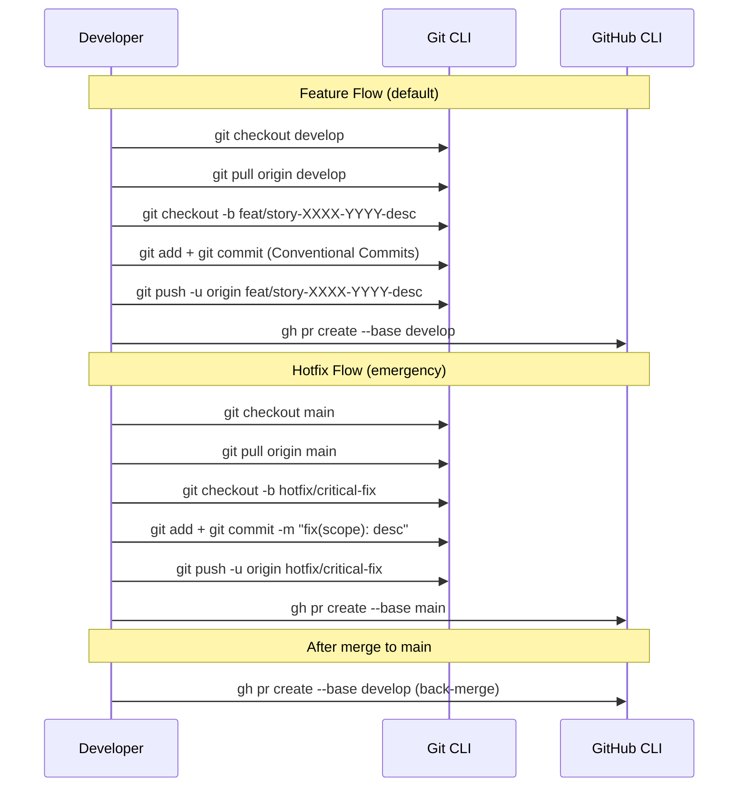

# História: x-git-push — Develop como Base Default

**ID:** story-0027-0002
**Chave Jira:** —
**Status:** Concluída

## 1. Dependências

| Blocked By | Blocks |
| :--- | :--- |
| story-0027-0001 | story-0027-0003, story-0027-0010 |

## 2. Regras Transversais Aplicáveis

| ID | Título |
| :--- | :--- |
| RULE-001 | Estrutura de Branches Git Flow |
| RULE-002 | Proibição de Merge Direto em Main |
| RULE-004 | Develop como Base Default |
| RULE-006 | Hotfix com Dual Merge |

## 3. Descrição

Como **Desenvolvedor**, eu quero que a skill `x-git-push` use `develop` como branch base padrão para feature branches e inclua suporte a hotfixes, garantindo que nenhum feature branch mergee diretamente em `main`.

A skill `x-git-push` é o ponto de entrada para todas as operações Git do projeto. Ela define como branches são criados, como commits são formatados, e como PRs são abertos. Atualmente, todas as 6 referências a `main` nesta skill direcionam features diretamente para produção. Esta história substitui essas referências por `develop` e adiciona um fluxo separado para hotfixes que brancha de `main`.

O arquivo é um template SKILL.md gerado pelo assembler `SkillsAssembler`. As alterações devem ser feitas no resource template em `java/src/main/resources/`.

### 3.1 Substituição de Referências a Main

- "Branch Strategy" section: `main (stable, always green)` → `develop (integration, always green)`
- "Creating a Branch": `git checkout main` → `git checkout develop`
- "Workflow Per Story": `git pull origin main` → `git pull origin develop`
- "Review changes": `git diff main...HEAD` → `git diff develop...HEAD`
- "PR Creation": adicionar `--base develop` explícito ao `gh pr create`
- "Integration Notes": atualizar referências de fases

### 3.2 Novo Fluxo de Hotfix

- Seção "Hotfix Workflow" após "Workflow Per Story"
- Branch de `main`: `git checkout main && git pull origin main`
- Criar hotfix: `git checkout -b hotfix/description`
- PR para `main`: `gh pr create --base main`
- Após merge: segundo PR de `main` para `develop` ou cherry-pick
- Convenção de commit: `fix(scope): description`

### 3.3 Diagrama de Branch Strategy Atualizado

- Mostrar: `develop → feat/* → develop` (fluxo principal)
- Mostrar: `main → hotfix/* → main + develop` (fluxo de emergência)
- Mostrar: `develop → release/* → main + develop` (fluxo de release)

## 3.5 Entrega de Valor

- **Valor Principal:** Operações Git seguras com `develop` como base padrão, eliminando merges acidentais de features direto em produção
- **Métrica de Sucesso:** Skill `x-git-push` gerada com zero referências a `main` no fluxo de feature, `--base develop` explícito em PR creation, e seção de hotfix documentada
- **Impacto no Negócio:** Desenvolvedores seguem automaticamente o Git Flow sem precisar lembrar de flags ou configurações manuais

## 4. Definições de Qualidade Locais

### DoR Local (Definition of Ready)

- [ ] Rule 09 (story-0027-0001) concluída e disponível como referência
- [ ] Template atual de `x-git-push/SKILL.md` analisado — 6 referências a `main` identificadas
- [ ] Resource path do template identificado no assembler

### DoD Local (Definition of Done)

- [ ] Zero referências a `main` no fluxo de feature da skill gerada
- [ ] `--base develop` presente no comando `gh pr create` de feature
- [ ] Seção "Hotfix Workflow" presente com `--base main`
- [ ] Diagrama de branch strategy atualizado com `develop`
- [ ] Pelo menos 1 teste automatizado validando conteúdo do SKILL.md gerado
- [ ] Smoke test passando

### Global Definition of Done (DoD)

- **Cobertura:** ≥ 95% Line, ≥ 90% Branch
- **Testes Automatizados:** Unitários + integração
- **Relatório de Cobertura:** JaCoCo
- **Documentação:** SKILL.md gerado consistente
- **Performance:** Geração em < 30s
- **TDD Compliance:** Test-first, refactoring explícito, TPP
- **Double-Loop TDD:** Acceptance tests (outer), unit tests (inner)

## 5. Contratos de Dados (Data Contract)

### 5.1 Template Changes (Before → After)

| Seção | Antes | Depois | Regra |
| :--- | :--- | :--- | :--- |
| Branch Strategy | `main (stable, always green)` | `develop (integration, always green)` | RULE-001 |
| Creating a Branch | `git checkout main` | `git checkout develop` | RULE-004 |
| git pull | `git pull origin main` | `git pull origin develop` | RULE-004 |
| Review changes | `git diff main...HEAD` | `git diff develop...HEAD` | RULE-004 |
| PR Creation | `gh pr create` (implicit main) | `gh pr create --base develop` | RULE-004 |
| Integration Notes | `Used by x-dev-lifecycle during Phase 0` | Atualizado com referência a develop | RULE-001 |

### 5.2 Nova Seção: Hotfix Workflow

| Campo | Tipo | Sempre presente | Descrição |
| :--- | :--- | :--- | :--- |
| `branch_from` | `String` | Sim | `main` |
| `branch_pattern` | `String` | Sim | `hotfix/short-description` |
| `pr_base` | `String` | Sim | `--base main` |
| `dual_merge` | `Boolean` | Sim | Merge para `main` E `develop` |
| `commit_type` | `String` | Sim | `fix(scope): description` |

## 6. Diagramas

### 6.1 Git Flow na Skill x-git-push



## 7. Critérios de Aceite (Gherkin)

```gherkin
Cenario: Skill gerada sem nenhum template de x-git-push
  DADO que o resource template do x-git-push NÃO existe
  QUANDO o gerador executa o pipeline
  ENTÃO a geração falha com mensagem indicando template ausente

Cenario: Skill x-git-push gerada com develop como base
  DADO que o resource template do x-git-push foi atualizado com develop
  QUANDO o gerador executa o pipeline para o profile "java-quarkus"
  ENTÃO o SKILL.md gerado contém "git checkout develop" na seção "Creating a Branch"
  E contém "git pull origin develop" na seção de workflow
  E contém "git diff develop...HEAD" na seção de review
  E contém "--base develop" no comando "gh pr create"
  E NÃO contém "git checkout main" no fluxo de feature

Cenario: Skill x-git-push contém seção de Hotfix
  DADO que o resource template inclui a seção "Hotfix Workflow"
  QUANDO o gerador executa o pipeline
  ENTÃO o SKILL.md gerado contém seção "Hotfix Workflow"
  E contém "git checkout main" APENAS na seção de hotfix
  E contém "--base main" APENAS no PR de hotfix
  E contém instrução de back-merge para develop

Cenario: Nenhuma referência a main no fluxo de feature
  DADO que o SKILL.md do x-git-push foi gerado
  QUANDO o conteúdo é analisado excluindo a seção de Hotfix
  ENTÃO zero ocorrências de "checkout main" existem fora da seção Hotfix
  E zero ocorrências de "--base main" existem fora da seção Hotfix

Cenario: Diagrama de branch strategy atualizado
  DADO que o SKILL.md do x-git-push foi gerado
  QUANDO a seção "Branch Strategy" é inspecionada
  ENTÃO contém "develop" como branch estável de integração
  E o diagrama mostra "develop → feat/* → develop"
```

## 8. Sub-tarefas

- [ ] [Dev] Atualizar resource template do x-git-push substituindo 6 referências a `main` por `develop`
- [ ] [Dev] Adicionar seção "Hotfix Workflow" ao template com fluxo completo
- [ ] [Dev] Atualizar diagrama de Branch Strategy com `develop` como centro
- [ ] [Dev] Adicionar `--base develop` explícito ao comando `gh pr create` no template
- [ ] [Test] Unitário: Validar que template gerado contém `develop` e não `main` no fluxo feature
- [ ] [Test] Integração: Gerar pipeline e verificar conteúdo do SKILL.md para 2+ profiles
- [ ] [Test] Smoke/E2E: Geração end-to-end validando x-git-push SKILL.md completo
- [ ] [Doc] Atualizar Integration Notes no template
