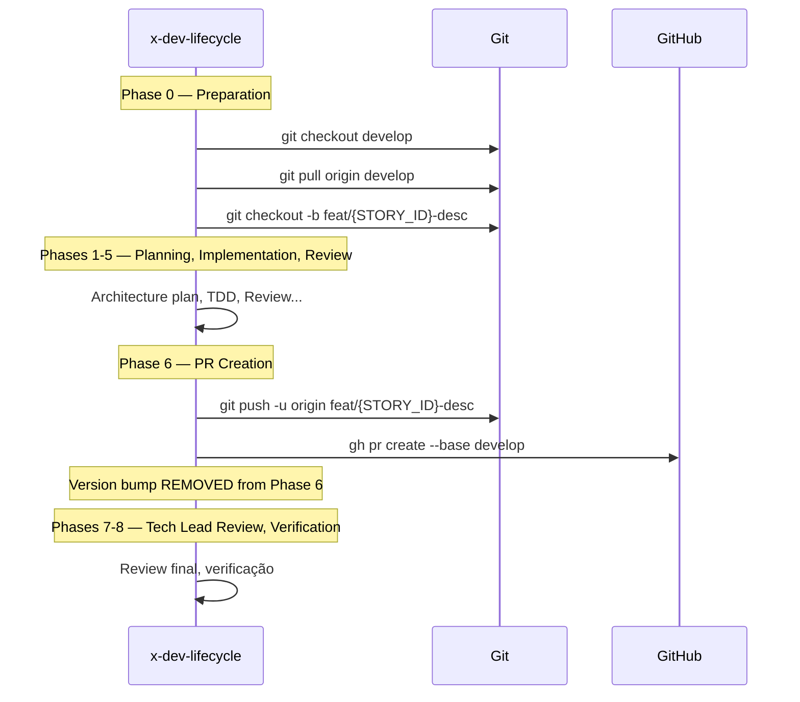

# História: x-dev-lifecycle — Integração com Develop

**ID:** story-0027-0003
**Chave Jira:** —
**Status:** Concluída

## 1. Dependências

| Blocked By | Blocks |
| :--- | :--- |
| story-0027-0002 | story-0027-0004, story-0027-0010 |

## 2. Regras Transversais Aplicáveis

| ID | Título |
| :--- | :--- |
| RULE-001 | Estrutura de Branches Git Flow |
| RULE-004 | Develop como Base Default |

## 3. Descrição

Como **Desenvolvedor**, eu quero que a skill `x-dev-lifecycle` use `develop` como branch de origem na Phase 0 e como target de PR na Phase 6, garantindo que o ciclo completo de implementação de stories siga o Git Flow.

A skill `x-dev-lifecycle` orquestra 9 fases do ciclo de desenvolvimento: desde a criação do branch (Phase 0) até a criação do PR (Phase 6) e review (Phase 7). Atualmente, Phase 0 faz `git checkout main` e Phase 6 cria PR targetando `main`. Além disso, Phase 6 contém lógica de version bump que não pertence ao fluxo de feature branches no Git Flow — version bumps devem acontecer na release branch.

As alterações são no resource template da skill, que é processado pelo `SkillsAssembler`.

### 3.1 Phase 0 — Branch Creation

- `git checkout main && git pull origin main` → `git checkout develop && git pull origin develop`
- `git checkout -b feat/{STORY_ID}-description` permanece inalterado (branch name pattern)

### 3.2 Phase 6 — PR Creation

- Push: `git push -u origin feat/{STORY_ID}-description` (inalterado)
- PR: adicionar `--base develop` ao `gh pr create`
- Remover/condicionalizar version bump (pertence a release branch, não feature)

### 3.3 Referências em Diff/Log

- `git log --oneline main..HEAD` → `git log --oneline develop..HEAD`
- `git diff main...HEAD --stat` → `git diff develop...HEAD --stat`

## 3.5 Entrega de Valor

- **Valor Principal:** Ciclo de desenvolvimento completo (branch → implementação → PR) alinhado ao Git Flow, impedindo que stories individuais afetem produção diretamente
- **Métrica de Sucesso:** Phase 0 usa `develop` como origem, Phase 6 cria PR com `--base develop`, version bump removido do fluxo de feature
- **Impacto no Negócio:** Desenvolvedores usando `/x-dev-lifecycle` automaticamente seguem Git Flow sem configuração adicional

## 4. Definições de Qualidade Locais

### DoR Local (Definition of Ready)

- [ ] story-0027-0002 (x-git-push) concluída — padrões de branch `develop` estabelecidos
- [ ] Template atual de x-dev-lifecycle SKILL.md analisado — referências a `main` identificadas
- [ ] Lógica de version bump em Phase 6 mapeada

### DoD Local (Definition of Done)

- [ ] Phase 0 usa `git checkout develop && git pull origin develop`
- [ ] Phase 6 PR usa `--base develop`
- [ ] Version bump removido ou condicionado ao modo release
- [ ] Todos os comandos diff/log referenciam `develop`
- [ ] Pelo menos 1 teste automatizado validando conteúdo gerado
- [ ] Smoke test passando

### Global Definition of Done (DoD)

- **Cobertura:** ≥ 95% Line, ≥ 90% Branch
- **Testes Automatizados:** Unitários + integração
- **Relatório de Cobertura:** JaCoCo
- **Documentação:** SKILL.md gerado consistente
- **Performance:** Geração em < 30s
- **TDD Compliance:** Test-first, refactoring explícito, TPP
- **Double-Loop TDD:** Acceptance tests (outer), unit tests (inner)

## 5. Contratos de Dados (Data Contract)

### 5.1 Template Changes (Before → After)

| Seção/Phase | Antes | Depois | Regra |
| :--- | :--- | :--- | :--- |
| Phase 0 checkout | `git checkout main` | `git checkout develop` | RULE-004 |
| Phase 0 pull | `git pull origin main` | `git pull origin develop` | RULE-004 |
| Phase 6 PR | `gh pr create` (implicit main) | `gh pr create --base develop` | RULE-004 |
| Phase 6 version bump | Version bump em feature branch | Removido (pertence a release) | RULE-005 |
| Diff commands | `main..HEAD`, `main...HEAD` | `develop..HEAD`, `develop...HEAD` | RULE-004 |

### 5.2 Seções Preservadas (sem alteração)

| Seção | Motivo |
| :--- | :--- |
| Phase 1-5 | Não contêm referências a branches |
| Phase 7-8 | Review e verificação não dependem de branch name |
| TDD Commit format | Independente de branching model |

## 6. Diagramas

### 6.1 Fluxo de Lifecycle com Develop



## 7. Critérios de Aceite (Gherkin)

```gherkin
Cenario: Template sem Phase 0 definida
  DADO que o resource template do x-dev-lifecycle NÃO contém a seção de Phase 0
  QUANDO o gerador tenta processar o template
  ENTÃO a geração falha com mensagem de erro indicando seção ausente

Cenario: Phase 0 usa develop como branch de origem
  DADO que o template do x-dev-lifecycle foi atualizado
  QUANDO o gerador executa o pipeline para o profile "java-spring"
  ENTÃO o SKILL.md gerado contém "git checkout develop" na seção Phase 0
  E contém "git pull origin develop" na seção Phase 0
  E NÃO contém "git checkout main" na seção Phase 0

Cenario: Phase 6 cria PR com --base develop
  DADO que o template do x-dev-lifecycle foi atualizado
  QUANDO o SKILL.md é gerado
  ENTÃO a seção Phase 6 contém "--base develop" no comando gh pr create
  E NÃO contém version bump logic no fluxo padrão de feature

Cenario: Comandos diff e log referenciam develop
  DADO que o SKILL.md do x-dev-lifecycle foi gerado
  QUANDO os comandos git diff e git log são inspecionados
  ENTÃO todos usam "develop" como referência (develop..HEAD, develop...HEAD)
  E nenhum usa "main" como referência no fluxo de feature

Cenario: Version bump ausente no fluxo de feature
  DADO que o SKILL.md do x-dev-lifecycle foi gerado
  QUANDO a Phase 6 é inspecionada
  ENTÃO NÃO contém chamada a x-lib-version-bump no modo padrão
  E contém nota explicando que version bump pertence ao release flow
```

## 8. Sub-tarefas

- [ ] [Dev] Atualizar Phase 0 do template: `main` → `develop` nos comandos git
- [ ] [Dev] Atualizar Phase 6 do template: adicionar `--base develop` ao PR creation
- [ ] [Dev] Remover/condicionalizar version bump na Phase 6
- [ ] [Dev] Atualizar todos os comandos diff/log: `main` → `develop`
- [ ] [Test] Unitário: Validar Phase 0 e Phase 6 do template gerado
- [ ] [Test] Integração: Gerar pipeline e verificar SKILL.md para 2+ profiles
- [ ] [Test] Smoke/E2E: Geração end-to-end validando x-dev-lifecycle completo
