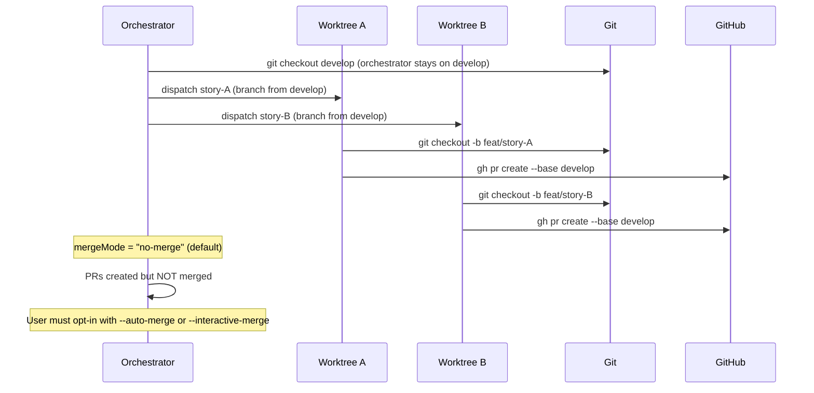

# História: x-dev-epic-implement — Develop Base e No-Merge Default

**ID:** story-0027-0004
**Chave Jira:** —
**Status:** Concluída

## 1. Dependências

| Blocked By | Blocks |
| :--- | :--- |
| story-0027-0003 | story-0027-0010 |

## 2. Regras Transversais Aplicáveis

| ID | Título |
| :--- | :--- |
| RULE-001 | Estrutura de Branches Git Flow |
| RULE-002 | Proibição de Merge Direto em Main |
| RULE-003 | Default No-Merge |
| RULE-004 | Develop como Base Default |
| RULE-009 | Schema Execution State |

## 3. Descrição

Como **Tech Lead**, eu quero que a skill `x-dev-epic-implement` use `develop` como branch base para todas as stories e mude o modo de merge padrão de `interactive` para `no-merge`, garantindo que PRs nunca sejam mergeados automaticamente e que nenhuma story mergee direto em `main`.

Esta é a história mais complexa do épico. A skill `x-dev-epic-implement` é o orquestrador de épicos com ~1400 linhas e 15+ referências a `main`. As alterações incluem: substituir todas as referências a `main` por `develop` no fluxo de feature, mudar o default de merge mode, adicionar o campo `baseBranch` ao execution-state.json, e atualizar a lógica de auto-rebase para usar `develop` como base.

### 3.1 Substituição de Referências a Main (15+ pontos)

- `git checkout main && git pull origin main` → `git checkout develop && git pull origin develop` (múltiplas ocorrências)
- `git fetch origin main && git rebase origin/main` → `git fetch origin develop && git rebase origin/develop`
- PRs target: `--base main` → `--base develop`
- Resume logic: orchestrator branch `main` → `develop`
- Diagrams and ASCII art: atualizar todos os diagramas com `develop`
- RULE-011 (auto-rebase): rebase contra `develop`

### 3.2 Default No-Merge

- Atual: `Neither → mergeMode = "interactive"` (default)
- Novo: `Neither → mergeMode = "no-merge"` (default)
- Nova flag: `--interactive-merge` para opt-in ao comportamento interativo
- `--auto-merge` permanece como opt-in para merge automático
- `--no-merge` permanece mas é agora o default

### 3.3 Execution State Schema

- Adicionar campo `baseBranch` ao schema (default: `"develop"`)
- Usado na lógica de resume para determinar o branch correto
- Persistido em `execution-state.json`
- Schema exemplo: `{ "baseBranch": "develop", "stories": { ... } }`

### 3.4 Auto-Rebase contra Develop

- RULE-011: `git fetch origin main` → `git fetch origin develop`
- `git rebase origin/main` → `git rebase origin/develop`
- `--force-with-lease` push strategy inalterada
- Conflict resolution subagent inalterado

## 3.5 Entrega de Valor

- **Valor Principal:** Orquestração de épicos inteiros sem merge automático, garantindo que revisão humana é obrigatória antes de qualquer código chegar ao branch de integração
- **Métrica de Sucesso:** Zero referências a `main` no fluxo feature, default `no-merge`, campo `baseBranch` no execution-state, auto-rebase contra `develop`
- **Impacto no Negócio:** Equipes usando `/x-dev-epic-implement` não precisam lembrar de flags de segurança — o fluxo seguro é o padrão

## 4. Definições de Qualidade Locais

### DoR Local (Definition of Ready)

- [ ] story-0027-0003 (x-dev-lifecycle) concluída
- [ ] Template x-dev-epic-implement analisado — 15+ referências a `main` catalogadas com line numbers
- [ ] Schema atual de execution-state.json documentado

### DoD Local (Definition of Done)

- [ ] Zero referências a `main` no fluxo feature do SKILL.md gerado
- [ ] Default merge mode é `no-merge`
- [ ] Flag `--interactive-merge` documentada como opt-in
- [ ] Campo `baseBranch` presente no schema de execution-state
- [ ] Auto-rebase usa `develop` como base
- [ ] Pelo menos 1 teste automatizado validando conteúdo gerado
- [ ] Smoke test passando

### Global Definition of Done (DoD)

- **Cobertura:** ≥ 95% Line, ≥ 90% Branch
- **Testes Automatizados:** Unitários + integração
- **Relatório de Cobertura:** JaCoCo
- **Documentação:** SKILL.md gerado consistente
- **Performance:** Geração em < 30s
- **TDD Compliance:** Test-first, refactoring explícito, TPP
- **Double-Loop TDD:** Acceptance tests (outer), unit tests (inner)

## 5. Contratos de Dados (Data Contract)

### 5.1 Flag Changes

| Flag | Antes | Depois | Regra |
| :--- | :--- | :--- | :--- |
| (none/default) | `mergeMode = "interactive"` | `mergeMode = "no-merge"` | RULE-003 |
| `--auto-merge` | `mergeMode = "auto"` | Inalterado | — |
| `--no-merge` | `mergeMode = "no-merge"` | Default (flag ainda aceita) | RULE-003 |
| `--interactive-merge` | N/A (nova) | `mergeMode = "interactive"` | RULE-003 |

### 5.2 Execution State Schema Addition

| Campo | Tipo | M/O | Default | Descrição |
| :--- | :--- | :--- | :--- | :--- |
| `baseBranch` | `String` | M | `"develop"` | Branch base para PRs e auto-rebase |

### 5.3 Template Changes (Main → Develop)

| Contexto | Antes | Depois |
| :--- | :--- | :--- |
| Orchestrator branch | `git checkout main` | `git checkout develop` |
| Pull before dispatch | `git pull origin main` | `git pull origin develop` |
| Auto-rebase fetch | `git fetch origin main` | `git fetch origin develop` |
| Auto-rebase | `git rebase origin/main` | `git rebase origin/develop` |
| PR target | `--base main` | `--base develop` |
| Resume branch | `remains on main` | `remains on develop` |
| Single-PR target | `feat/epic-{id}` → `main` | `feat/epic-{id}` → `develop` |

## 6. Diagramas

### 6.1 Fluxo de Epic com Develop



## 7. Critérios de Aceite (Gherkin)

```gherkin
Cenario: Template sem referência ao merge mode default
  DADO que o resource template do x-dev-epic-implement não define um merge mode default
  QUANDO o template é analisado pelo validador
  ENTÃO um warning é emitido indicando que o default deve estar documentado

Cenario: Default merge mode é no-merge
  DADO que o template do x-dev-epic-implement foi atualizado
  QUANDO o SKILL.md é gerado para o profile "java-quarkus"
  ENTÃO a seção de flags documenta que o default sem flags é "no-merge"
  E a flag "--interactive-merge" está documentada como opt-in para modo interativo
  E a flag "--auto-merge" permanece documentada como opt-in para merge automático

Cenario: Zero referências a main no fluxo feature
  DADO que o SKILL.md do x-dev-epic-implement foi gerado
  QUANDO o conteúdo é analisado excluindo seções de hotfix e single-pr legacy
  ENTÃO zero ocorrências de "checkout main" existem no fluxo feature
  E zero ocorrências de "pull origin main" existem no fluxo feature
  E zero ocorrências de "--base main" existem no fluxo feature

Cenario: Campo baseBranch no execution-state schema
  DADO que o SKILL.md do x-dev-epic-implement foi gerado
  QUANDO a seção de execution-state schema é inspecionada
  ENTÃO contém o campo "baseBranch" com default "develop"
  E a documentação explica que é usado para resume e auto-rebase

Cenario: Auto-rebase contra develop
  DADO que o SKILL.md do x-dev-epic-implement foi gerado
  QUANDO a seção RULE-011 (auto-rebase) é inspecionada
  ENTÃO contém "git fetch origin develop"
  E contém "git rebase origin/develop"
  E NÃO contém "git fetch origin main" no contexto de auto-rebase

Cenario: Flag --interactive-merge é nova e funcional
  DADO que o SKILL.md documenta a flag --interactive-merge
  QUANDO um usuário usa /x-dev-epic-implement 0042 --interactive-merge
  ENTÃO o comportamento é o antigo default: prompt com 3 opções ao fim de cada phase
```

## 8. Sub-tarefas

- [ ] [Dev] Substituir 15+ referências a `main` por `develop` no template do x-dev-epic-implement
- [ ] [Dev] Alterar default merge mode de `interactive` para `no-merge`
- [ ] [Dev] Adicionar flag `--interactive-merge` como opt-in ao comportamento interativo
- [ ] [Dev] Adicionar campo `baseBranch` ao schema de execution-state no template
- [ ] [Dev] Atualizar RULE-011 (auto-rebase): `main` → `develop` em todos os comandos git
- [ ] [Dev] Atualizar diagramas e ASCII art no template
- [ ] [Test] Unitário: Validar que template gerado contém `develop` e `no-merge` default
- [ ] [Test] Integração: Gerar pipeline e verificar SKILL.md com flags documentation
- [ ] [Test] Smoke/E2E: Geração end-to-end validando x-dev-epic-implement completo
