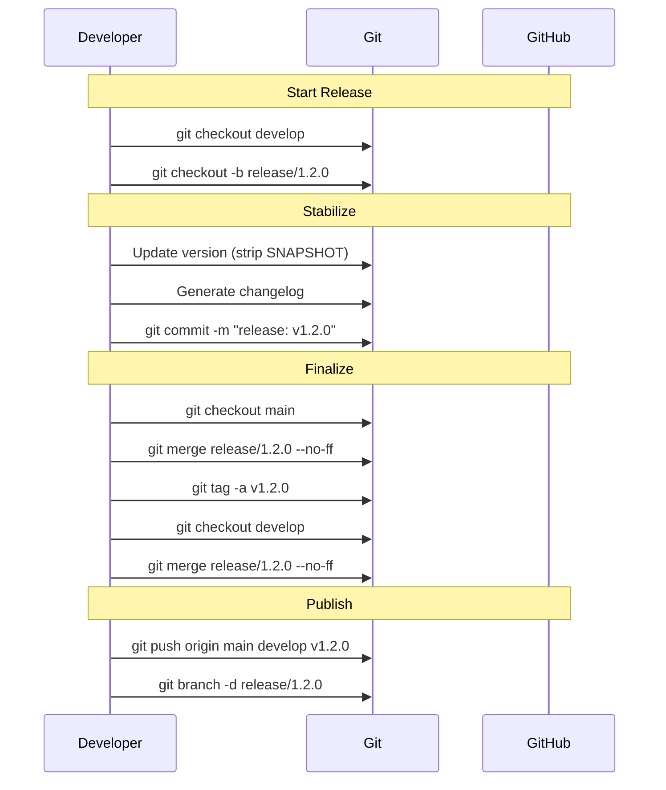

# História: x-release — Workflow de Release Branch

**ID:** story-0027-0005
**Chave Jira:** —
**Status:** Concluída

## 1. Dependências

| Blocked By | Blocks |
| :--- | :--- |
| story-0027-0001 | story-0027-0010 |

## 2. Regras Transversais Aplicáveis

| ID | Título |
| :--- | :--- |
| RULE-001 | Estrutura de Branches Git Flow |
| RULE-005 | Workflow de Release Branch |
| RULE-006 | Hotfix com Dual Merge |

## 3. Descrição

Como **Release Manager**, eu quero que a skill `x-release` implemente o workflow completo de release branches do Git Flow (branch de `develop`, estabilização, merge dual para `main` e `develop`, tag em `main`), garantindo que releases passem por estabilização antes de chegar a produção.

Atualmente a skill `x-release` faz tag diretamente em `main` sem release branch. O novo fluxo deve: criar `release/X.Y.Z` de `develop`, permitir estabilização, mergear para `main` com `--no-ff`, criar tag, mergear de volta para `develop`, e limpar a release branch. O fluxo de hotfix release também deve ser suportado.

### 3.1 Workflow de Release (9 Steps)

1. **DETERMINE**: Versão (inalterado — auto-detect ou explícito)
2. **VALIDATE**: Branch validation — deve estar em `develop` (início) ou `release/*` (continuação)
3. **BRANCH**: `git checkout -b release/X.Y.Z` a partir de `develop`
4. **UPDATE**: Version files na release branch (strip SNAPSHOT)
5. **CHANGELOG**: Geração de changelog na release branch
6. **COMMIT**: Release commit na release branch
7. **MERGE TO MAIN**: `git checkout main && git merge release/X.Y.Z --no-ff`
8. **TAG**: `git tag -a vX.Y.Z` em `main`
9. **MERGE BACK**: `git checkout develop && git merge release/X.Y.Z --no-ff`
10. **PUBLISH**: Push `main`, `develop`, e tag
11. **CLEANUP**: `git branch -d release/X.Y.Z`

### 3.2 Hotfix Release

- Branch de `main` (não `develop`)
- Tag em `main`
- Merge para `develop` (ou release branch se existir)
- PATCH version bump obrigatório

### 3.3 SNAPSHOT Handling

- `develop` sempre tem version `-SNAPSHOT`
- Release branch strip o SNAPSHOT
- Após release, `develop` avança para próxima `-SNAPSHOT`

## 3.5 Entrega de Valor

- **Valor Principal:** Releases estabilizadas em branch dedicada com período de bug fixing antes de produção, eliminando deploys de código instável
- **Métrica de Sucesso:** `/x-release minor` a partir de `develop` cria release branch, mergea para `main` e `develop`, cria tag, e limpa a branch
- **Impacto no Negócio:** Processo de release previsível e auditável, com rollback claro via tags em `main`

## 4. Definições de Qualidade Locais

### DoR Local (Definition of Ready)

- [ ] Rule 09 (story-0027-0001) concluída — workflow de release definido
- [ ] Template atual de x-release analisado — 5 referências a `main` catalogadas
- [ ] Fluxo de SNAPSHOT no Maven mapeado

### DoD Local (Definition of Done)

- [ ] Workflow completo de release branch documentado na skill (11 steps)
- [ ] Hotfix release suportado com branch de `main`
- [ ] Dry-run mostra plano completo incluindo branch, dual merge, e tag
- [ ] SNAPSHOT handling correto (strip na release, advance no develop)
- [ ] Pelo menos 1 teste automatizado validando workflow no SKILL.md gerado
- [ ] Smoke test passando

### Global Definition of Done (DoD)

- **Cobertura:** ≥ 95% Line, ≥ 90% Branch
- **Testes Automatizados:** Unitários + integração
- **Relatório de Cobertura:** JaCoCo
- **Documentação:** SKILL.md gerado consistente
- **Performance:** Geração em < 30s
- **TDD Compliance:** Test-first, refactoring explícito, TPP
- **Double-Loop TDD:** Acceptance tests (outer), unit tests (inner)

## 5. Contratos de Dados (Data Contract)

### 5.1 Release Workflow Steps (Before → After)

| Step | Antes | Depois |
| :--- | :--- | :--- |
| VALIDATE | Deve estar em `main` ou `master` | Deve estar em `develop` ou `release/*` |
| BRANCH | N/A (tag direto em main) | `git checkout -b release/X.Y.Z` de develop |
| MERGE TO MAIN | N/A | `git merge release/X.Y.Z --no-ff` |
| TAG | Tag em main (direto) | Tag em main (após merge de release) |
| MERGE BACK | N/A | `git checkout develop && git merge release/X.Y.Z --no-ff` |
| PUBLISH | Push main + tag | Push main + develop + tag |
| CLEANUP | N/A | `git branch -d release/X.Y.Z` |

### 5.2 Hotfix Release Contract

| Campo | Tipo | Descrição |
| :--- | :--- | :--- |
| `origin_branch` | `String` | `main` (sempre) |
| `branch_pattern` | `String` | `hotfix/description` |
| `version_bump` | `String` | PATCH only |
| `merge_targets` | `List<String>` | `[main, develop]` ou `[main, release/*]` |
| `tag_location` | `String` | `main` (após merge) |

## 6. Diagramas

### 6.1 Workflow de Release Branch



## 7. Critérios de Aceite (Gherkin)

```gherkin
Cenario: Release invocada sem estar em develop ou release branch
  DADO que o usuário está na branch "feat/some-feature"
  QUANDO /x-release minor é executado
  ENTÃO a skill exibe WARNING "not on develop/release branch"
  E sugere mudar para develop antes de prosseguir

Cenario: Release branch criada a partir de develop
  DADO que o template do x-release foi atualizado com workflow de release branch
  QUANDO o SKILL.md é gerado
  ENTÃO a seção VALIDATE documenta que deve estar em "develop" ou "release/*"
  E a seção BRANCH documenta "git checkout -b release/X.Y.Z" a partir de develop
  E a seção MERGE TO MAIN documenta "git merge release/X.Y.Z --no-ff"
  E a seção TAG documenta tag em main após merge

Cenario: Merge dual para main e develop documentado
  DADO que o SKILL.md do x-release foi gerado
  QUANDO a seção de workflow é inspecionada
  ENTÃO contém merge para main ("git checkout main && git merge release/X.Y.Z --no-ff")
  E contém merge de volta para develop ("git checkout develop && git merge release/X.Y.Z --no-ff")
  E contém cleanup ("git branch -d release/X.Y.Z")

Cenario: Hotfix release suportado
  DADO que o SKILL.md do x-release foi gerado
  QUANDO a seção de hotfix é inspecionada
  ENTÃO documenta branch de "main" (não develop)
  E documenta PATCH version bump obrigatório
  E documenta merge para main E develop

Cenario: Dry-run mostra plano completo com release branch
  DADO que o SKILL.md documenta o modo dry-run
  QUANDO a seção dry-run é inspecionada
  ENTÃO documenta que mostra: branch creation, version bump, changelog, dual merge, tag, e cleanup
  E NÃO mostra workflow antigo de tag direto em main
```

## 8. Sub-tarefas

- [ ] [Dev] Reescrever seções VALIDATE e BRANCH do template com release branch workflow
- [ ] [Dev] Adicionar seções MERGE TO MAIN, MERGE BACK, e CLEANUP ao template
- [ ] [Dev] Adicionar seção de hotfix release ao template
- [ ] [Dev] Atualizar dry-run para mostrar plano completo de release branch
- [ ] [Dev] Atualizar SNAPSHOT handling (strip na release, advance no develop)
- [ ] [Test] Unitário: Validar que template gerado contém todos os 11 steps do workflow
- [ ] [Test] Integração: Gerar pipeline e verificar SKILL.md de x-release
- [ ] [Test] Smoke/E2E: Geração end-to-end validando x-release completo
