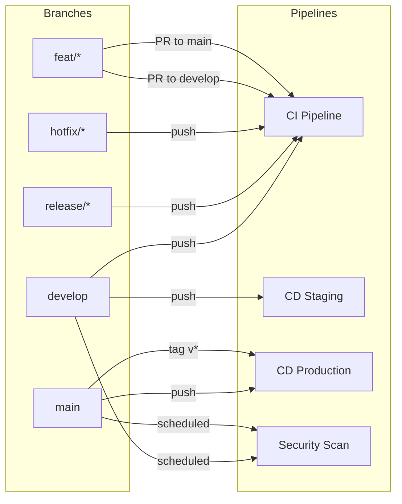

# História: x-ci-cd-generate — Triggers Multi-Branch

**ID:** story-0027-0006
**Chave Jira:** —
**Status:** Concluída

## 1. Dependências

| Blocked By | Blocks |
| :--- | :--- |
| story-0027-0001 | story-0027-0010 |

## 2. Regras Transversais Aplicáveis

| ID | Título |
| :--- | :--- |
| RULE-001 | Estrutura de Branches Git Flow |
| RULE-008 | CI/CD Branch Awareness |
| RULE-010 | Branch Protection Guidance |

## 3. Descrição

Como **DevOps Engineer**, eu quero que a skill `x-ci-cd-generate` produza workflows CI/CD com triggers conscientes do Git Flow (`develop`, `release/*`, `hotfix/*`), garantindo que CI rode em todas as branches ativas, CD staging deploy a partir de `develop`, e CD production deploy apenas via `main`.

Atualmente a skill gera CI com triggers em `[main, develop]` para push e `[main]` para PR. O novo modelo deve expandir para incluir `release/*` e `hotfix/*` no CI, separar staging (develop) de production (main), e adicionar comentários YAML explicando a estratégia de branches.

### 3.1 CI Pipeline Triggers

```yaml
on:
  push:
    branches: [develop, 'release/**', 'hotfix/**']
  pull_request:
    branches: [develop, main]
```

### 3.2 CD Staging Pipeline

```yaml
on:
  push:
    branches: [develop]
```

### 3.3 CD Production Pipeline

```yaml
on:
  push:
    branches: [main]
    tags: ['v*']
```

### 3.4 Security Pipeline

- Adicionar `develop` aos triggers de security scan
- Manter schedule (cron) inalterado

## 3.5 Entrega de Valor

- **Valor Principal:** Pipelines CI/CD corretos por branch, garantindo que testes rodam em todas as branches ativas e deploys automáticos acontecem apenas nos ambientes certos
- **Métrica de Sucesso:** CI trigga em `develop`, `release/*`, `hotfix/*`; CD staging em `develop`; CD production em `main` + tags
- **Impacto no Negócio:** Zero deploys acidentais em produção via branches erradas; validação contínua em todas as branches de desenvolvimento

## 4. Definições de Qualidade Locais

### DoR Local (Definition of Ready)

- [ ] Rule 09 (story-0027-0001) concluída
- [ ] Template atual de x-ci-cd-generate analisado — 4 referências a branches catalogadas
- [ ] Estrutura de workflows YAML entendida

### DoD Local (Definition of Done)

- [ ] CI pipeline trigga em `develop`, `release/**`, `hotfix/**`
- [ ] PR validation em PRs para `develop` e `main`
- [ ] CD staging trigga apenas em push para `develop`
- [ ] CD production trigga apenas em push para `main` ou tags `v*`
- [ ] Comentários YAML explicam a estratégia de branches
- [ ] Pelo menos 1 teste automatizado validando triggers nos workflows gerados
- [ ] Smoke test passando

### Global Definition of Done (DoD)

- **Cobertura:** ≥ 95% Line, ≥ 90% Branch
- **Testes Automatizados:** Unitários + integração
- **Relatório de Cobertura:** JaCoCo
- **Documentação:** Workflows gerados auto-documentados via comentários YAML
- **Performance:** Geração em < 30s
- **TDD Compliance:** Test-first, refactoring explícito, TPP
- **Double-Loop TDD:** Acceptance tests (outer), unit tests (inner)

## 5. Contratos de Dados (Data Contract)

### 5.1 Trigger Changes (Before → After)

| Pipeline | Antes | Depois | Regra |
| :--- | :--- | :--- | :--- |
| CI push | `branches: [main, develop]` | `branches: [develop, 'release/**', 'hotfix/**']` | RULE-008 |
| CI PR | `branches: [main]` | `branches: [develop, main]` | RULE-008 |
| CD Staging | `branches: [main]` | `branches: [develop]` | RULE-008 |
| CD Production | `branches: [main]` | `branches: [main]` + `tags: ['v*']` | RULE-008 |
| Security | `branches: [main]` | `branches: [develop, main]` | RULE-008 |

### 5.2 Novo Conteúdo: Comentários YAML

| Posição | Comentário |
| :--- | :--- |
| Antes de CI triggers | `# Git Flow: CI runs on integration (develop), release, and hotfix branches` |
| Antes de CD Staging | `# Git Flow: Staging deploys from develop (integration branch)` |
| Antes de CD Production | `# Git Flow: Production deploys only from main (via release/hotfix merge) or version tags` |

## 6. Diagramas

### 6.1 Pipeline Triggers por Branch



## 7. Critérios de Aceite (Gherkin)

```gherkin
Cenario: Template de CI sem triggers multi-branch
  DADO que o resource template do x-ci-cd-generate NÃO contém triggers para release/*
  QUANDO o template é validado
  ENTÃO um warning é emitido indicando que Git Flow branches estão ausentes

Cenario: CI workflow gerado com triggers multi-branch
  DADO que o template do x-ci-cd-generate foi atualizado com Git Flow
  QUANDO o gerador executa o pipeline para o profile "java-quarkus"
  ENTÃO o workflow CI gerado contém push triggers para "develop", "release/**", "hotfix/**"
  E contém PR triggers para "develop" e "main"
  E NÃO contém push trigger para "main" no CI (main recebe via merge, não push direto)

Cenario: CD staging deploya apenas de develop
  DADO que o workflow de CD staging foi gerado
  QUANDO os triggers são inspecionados
  ENTÃO contém push trigger APENAS para "develop"
  E NÃO contém trigger para "main" ou "release/*"

Cenario: CD production deploya de main e tags
  DADO que o workflow de CD production foi gerado
  QUANDO os triggers são inspecionados
  ENTÃO contém push trigger para "main"
  E contém tag trigger para "v*"
  E NÃO contém trigger para "develop"

Cenario: Comentários YAML explicam estratégia de branches
  DADO que os workflows CI/CD foram gerados
  QUANDO o conteúdo YAML é inspecionado
  ENTÃO cada workflow contém comentário explicando a estratégia Git Flow
  E os comentários mencionam "Git Flow" explicitamente
```

## 8. Sub-tarefas

- [ ] [Dev] Atualizar triggers de CI pipeline no template: develop, release/**, hotfix/**
- [ ] [Dev] Atualizar triggers de CD staging: apenas develop
- [ ] [Dev] Atualizar triggers de CD production: main + tags v*
- [ ] [Dev] Adicionar triggers de security scan para develop
- [ ] [Dev] Adicionar comentários YAML explicativos em cada workflow
- [ ] [Test] Unitário: Validar triggers em cada tipo de workflow gerado
- [ ] [Test] Integração: Gerar workflows para 2+ profiles e verificar triggers
- [ ] [Test] Smoke/E2E: Geração end-to-end validando todos os workflows CI/CD
