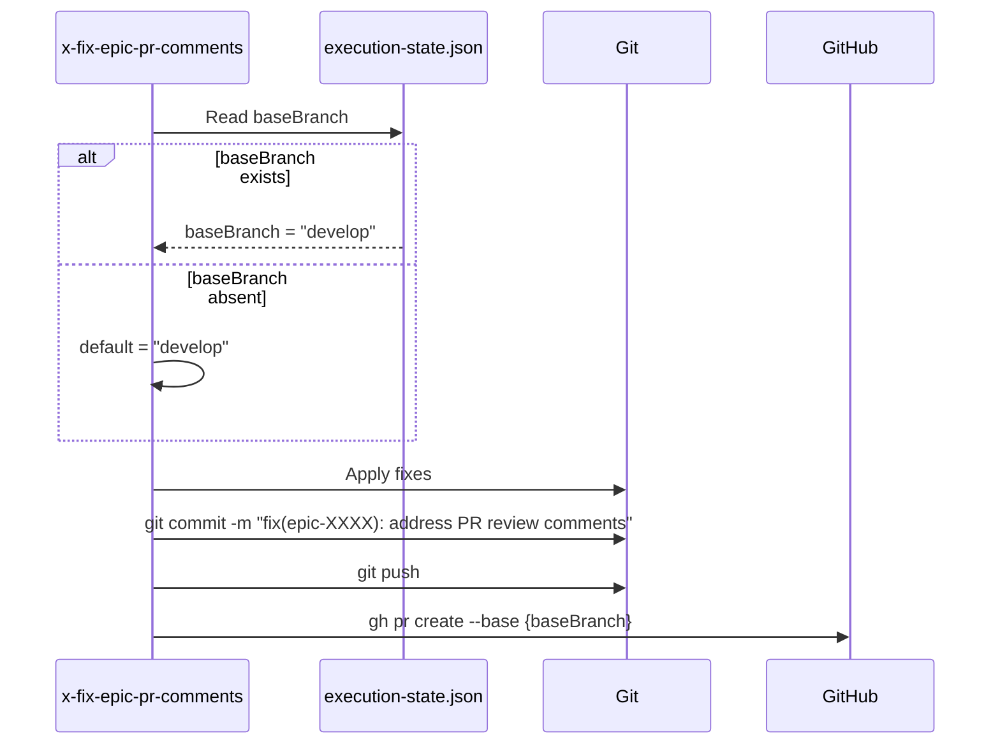

# História: x-fix-epic-pr-comments — Develop Base Branch

**ID:** story-0027-0007
**Chave Jira:** —
**Status:** Concluída

## 1. Dependências

| Blocked By | Blocks |
| :--- | :--- |
| story-0027-0001 | story-0027-0010 |

## 2. Regras Transversais Aplicáveis

| ID | Título |
| :--- | :--- |
| RULE-004 | Develop como Base Default |
| RULE-009 | Schema Execution State |

## 3. Descrição

Como **Desenvolvedor**, eu quero que a skill `x-fix-epic-pr-comments` crie PRs de correção targetando `develop` em vez de `main`, garantindo que correções de review comments sigam o fluxo Git Flow.

A skill `x-fix-epic-pr-comments` descobre PRs de um épico via execution-state.json, coleta comentários de review, classifica-os, aplica fixes, e cria um PR de correção consolidado. Atualmente, o PR de correção usa `--base main`. A alteração é simples: trocar `--base main` por `--base develop`. Adicionalmente, a skill deve respeitar o campo `baseBranch` do execution-state.json quando disponível (introduzido em story-0027-0004).

### 3.1 Mudança Principal

- `gh pr create --base main` → `gh pr create --base develop`
- Se `execution-state.json` contém `baseBranch`, usar esse valor
- Fallback: `develop` quando `baseBranch` não existe no estado

### 3.2 Operações Git Secundárias

- Qualquer `git checkout main` → `git checkout develop` (se existir)
- Qualquer referência a `main` em diff/log → `develop`

## 3.5 Entrega de Valor

- **Valor Principal:** Correções de review comments direcionadas corretamente ao branch de integração, evitando que fixes bypassen o fluxo Git Flow
- **Métrica de Sucesso:** PR de correção criado com `--base develop` (ou valor de `baseBranch` do execution-state)
- **Impacto no Negócio:** Manutenção da integridade do fluxo Git Flow mesmo durante ciclos de fix de PR comments

## 4. Definições de Qualidade Locais

### DoR Local (Definition of Ready)

- [ ] Rule 09 (story-0027-0001) concluída
- [ ] Template atual do x-fix-epic-pr-comments analisado — 2 referências a `main` identificadas
- [ ] Schema de execution-state.json com `baseBranch` entendido (story-0027-0004)

### DoD Local (Definition of Done)

- [ ] `--base develop` usado por default no `gh pr create` de correção
- [ ] Se `baseBranch` existe no execution-state, usar esse valor
- [ ] Zero referências a `--base main` no fluxo feature
- [ ] Pelo menos 1 teste automatizado validando PR base branch no SKILL.md gerado
- [ ] Smoke test passando

### Global Definition of Done (DoD)

- **Cobertura:** ≥ 95% Line, ≥ 90% Branch
- **Testes Automatizados:** Unitários + integração
- **Relatório de Cobertura:** JaCoCo
- **Documentação:** SKILL.md gerado consistente
- **Performance:** Geração em < 30s
- **TDD Compliance:** Test-first, refactoring explícito, TPP
- **Double-Loop TDD:** Acceptance tests (outer), unit tests (inner)

## 5. Contratos de Dados (Data Contract)

### 5.1 Template Changes (Before → After)

| Contexto | Antes | Depois | Regra |
| :--- | :--- | :--- | :--- |
| PR creation | `gh pr create --base main` | `gh pr create --base develop` | RULE-004 |
| baseBranch fallback | N/A | Read from execution-state, default `develop` | RULE-009 |

### 5.2 baseBranch Resolution Logic

| Prioridade | Fonte | Exemplo |
| :--- | :--- | :--- |
| 1 | `execution-state.json → baseBranch` | `"baseBranch": "develop"` |
| 2 | Default hardcoded | `develop` |

Nenhum endpoint declarado nesta story — alteração é puramente em template de skill.

## 6. Diagramas

### 6.1 Fluxo de Fix com Develop



## 7. Critérios de Aceite (Gherkin)

```gherkin
Cenario: Template sem definição de base branch
  DADO que o resource template do x-fix-epic-pr-comments não define base branch
  QUANDO o template é validado
  ENTÃO um warning é emitido indicando que base branch deve estar definido

Cenario: PR de correção targetando develop
  DADO que o template do x-fix-epic-pr-comments foi atualizado
  QUANDO o SKILL.md é gerado para qualquer profile
  ENTÃO o comando "gh pr create" contém "--base develop"
  E NÃO contém "--base main"

Cenario: baseBranch lido do execution-state quando disponível
  DADO que o SKILL.md documenta a lógica de resolução de baseBranch
  QUANDO a seção de PR creation é inspecionada
  ENTÃO documenta que baseBranch é lido de execution-state.json primeiro
  E documenta fallback para "develop" quando baseBranch está ausente

Cenario: Zero referências a main no fluxo de correção
  DADO que o SKILL.md do x-fix-epic-pr-comments foi gerado
  QUANDO todo o conteúdo é analisado
  ENTÃO zero ocorrências de "--base main" existem
  E zero ocorrências de "checkout main" existem no fluxo de correção
```

## 8. Sub-tarefas

- [ ] [Dev] Substituir `--base main` por `--base develop` no template
- [ ] [Dev] Adicionar lógica de leitura de `baseBranch` do execution-state no template
- [ ] [Dev] Atualizar quaisquer referências secundárias a `main`
- [ ] [Test] Unitário: Validar PR base branch no template gerado
- [ ] [Test] Integração: Gerar pipeline e verificar SKILL.md
- [ ] [Test] Smoke/E2E: Geração end-to-end validando x-fix-epic-pr-comments
