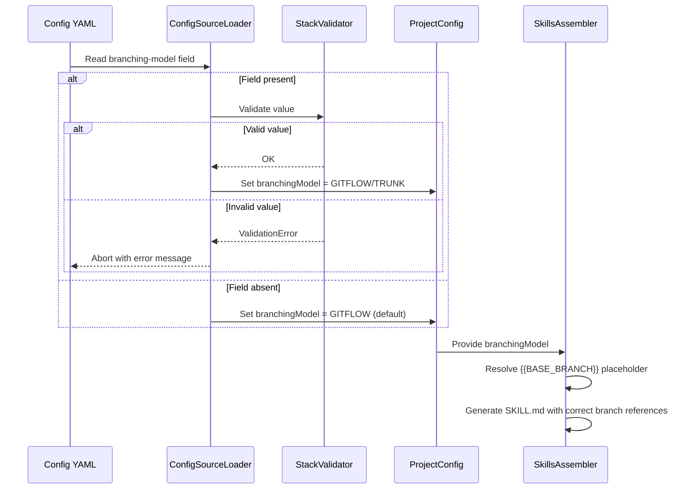

# História: Configuração de Branching Model no YAML

**ID:** story-0027-0009
**Chave Jira:** —
**Status:** Concluída

## 1. Dependências

| Blocked By | Blocks |
| :--- | :--- |
| story-0027-0001 | story-0027-0010 |

## 2. Regras Transversais Aplicáveis

| ID | Título |
| :--- | :--- |
| RULE-001 | Estrutura de Branches Git Flow |
| RULE-007 | Retrocompatibilidade |

## 3. Descrição

Como **Desenvolvedor**, eu quero configurar o modelo de branching no YAML do projeto (`branching-model: gitflow` ou `branching-model: trunk`), garantindo que skills geradas reflitam o modelo correto e que projetos trunk-based continuem funcionando.

Esta história introduz a configurabilidade do modelo de branching no gerador. O novo campo `branching-model` no YAML determina se as skills geradas usarão `develop` (gitflow) ou `main` (trunk) como branch base. O default é `gitflow` quando o campo está ausente. Os 8 profile config templates devem ser atualizados com `branching-model: gitflow` explícito.

### 3.1 Domain Model

- Novo enum `BranchingModel` com valores: `GITFLOW`, `TRUNK`
- Campo em `ProjectConfig`: `Optional<BranchingModel> branchingModel`
- Default: `GITFLOW` quando ausente

### 3.2 Config Parsing

- `ConfigSourceLoader` parseia a nova seção `branching-model:`
- Valores aceitos (case-insensitive): `gitflow`, `trunk`
- Validação no `StackValidator`: rejeitar valores inválidos com mensagem clara

### 3.3 Template Conditionality

- Skills leem `branchingModel` para determinar:
  - Branch base: `develop` (gitflow) vs `main` (trunk)
  - PR target: `--base develop` vs `--base main`
  - Release workflow: release branches vs tag direto
- Implementação via placeholder: `{{BASE_BRANCH}}` resolvido pelo assembler

### 3.4 Profile Templates

- Atualizar todos os 8 profile config templates com `branching-model: gitflow`
- Profiles: java-quarkus, java-spring, go-gin, kotlin-ktor, python-click-cli, python-fastapi, rust-axum, typescript-nestjs

## 3.5 Entrega de Valor

- **Valor Principal:** Modelo de branching configurável por projeto, permitindo que o mesmo gerador atenda projetos Git Flow e trunk-based sem forks ou customizações manuais
- **Métrica de Sucesso:** Config `branching-model: gitflow` gera skills com `develop`; config `branching-model: trunk` gera skills com `main`; ausência do campo gera `gitflow` por default
- **Impacto no Negócio:** Flexibilidade para equipes com diferentes necessidades de branching, sem sacrificar o default seguro (gitflow)

## 4. Definições de Qualidade Locais

### DoR Local (Definition of Ready)

- [ ] Rule 09 (story-0027-0001) concluída
- [ ] Estrutura de `ProjectConfig` e `ConfigSourceLoader` analisada
- [ ] Padrão de adição de novos campos YAML documentado (precedente de outros campos)

### DoD Local (Definition of Done)

- [ ] Enum `BranchingModel` criado no domain model
- [ ] `ConfigSourceLoader` parseia `branching-model` do YAML
- [ ] `StackValidator` rejeita valores inválidos com mensagem clara
- [ ] Default é `gitflow` quando campo ausente
- [ ] Todos os 8 profile templates atualizados
- [ ] Pelo menos 1 teste automatizado validando parsing e default
- [ ] Smoke test passando

### Global Definition of Done (DoD)

- **Cobertura:** ≥ 95% Line, ≥ 90% Branch
- **Testes Automatizados:** Unitários para enum, parsing, validação; integração para pipeline
- **Relatório de Cobertura:** JaCoCo
- **Documentação:** Campo documentado no `--help` e README
- **Performance:** Geração em < 30s
- **TDD Compliance:** Test-first, refactoring explícito, TPP
- **Double-Loop TDD:** Acceptance tests (outer), unit tests (inner)

## 5. Contratos de Dados (Data Contract)

### 5.1 YAML Config Schema

| Campo | Tipo | M/O | Validações | Exemplo |
| :--- | :--- | :--- | :--- | :--- |
| `branching-model` | `String` | O | Valores: `gitflow`, `trunk`. Case-insensitive. Default: `gitflow` | `branching-model: gitflow` |

### 5.2 Domain Model

| Campo | Tipo | M/O | Default | Descrição |
| :--- | :--- | :--- | :--- | :--- |
| `BranchingModel.GITFLOW` | `Enum` | — | — | Gera skills com `develop` como base |
| `BranchingModel.TRUNK` | `Enum` | — | — | Gera skills com `main` como base |
| `ProjectConfig.branchingModel` | `Optional<BranchingModel>` | O | `GITFLOW` | Modelo de branching do projeto |

### 5.3 Error Codes Mapeados

| Condição | Tipo | Severidade | Mensagem |
| :--- | :--- | :--- | :--- |
| Valor inválido para branching-model | Validation error | HIGH | `Invalid branching-model: '{value}'. Accepted values: gitflow, trunk` |
| YAML parse error na seção | Parse error | HIGH | `Failed to parse branching-model section` |

### 5.4 Template Placeholder

| Placeholder | Resolução (gitflow) | Resolução (trunk) |
| :--- | :--- | :--- |
| `{{BASE_BRANCH}}` | `develop` | `main` |
| `{{BRANCHING_MODEL}}` | `gitflow` | `trunk` |

## 6. Diagramas

### 6.1 Fluxo de Resolução do Branching Model



## 7. Critérios de Aceite (Gherkin)

```gherkin
Cenario: YAML com valor inválido para branching-model
  DADO que o YAML config contém "branching-model: invalid"
  QUANDO o gerador tenta carregar a configuração
  ENTÃO a validação falha com mensagem "Invalid branching-model: 'invalid'. Accepted values: gitflow, trunk"
  E a geração é abortada

Cenario: YAML com branching-model gitflow
  DADO que o YAML config contém "branching-model: gitflow"
  QUANDO o gerador executa o pipeline
  ENTÃO os skills gerados usam "develop" como branch base
  E os PRs usam "--base develop"

Cenario: YAML sem campo branching-model (default gitflow)
  DADO que o YAML config NÃO contém a seção "branching-model"
  QUANDO o gerador executa o pipeline
  ENTÃO o default GITFLOW é aplicado
  E os skills gerados usam "develop" como branch base
  E o comportamento é idêntico a "branching-model: gitflow" explícito

Cenario: YAML com branching-model trunk
  DADO que o YAML config contém "branching-model: trunk"
  QUANDO o gerador executa o pipeline
  ENTÃO os skills gerados usam "main" como branch base
  E os PRs usam "--base main" (comportamento pré-migração)
  E o release workflow usa tag direto em main (sem release branch)

Cenario: Todos os 8 profiles com branching-model explícito
  DADO que os 8 profile templates foram atualizados
  QUANDO cada template é inspecionado
  ENTÃO todos contêm "branching-model: gitflow" explicitamente
```

## 8. Sub-tarefas

- [ ] [Dev] Criar enum `BranchingModel` no domain model (GITFLOW, TRUNK)
- [ ] [Dev] Adicionar campo `branchingModel` ao `ProjectConfig`
- [ ] [Dev] Atualizar `ConfigSourceLoader` para parsear `branching-model` do YAML
- [ ] [Dev] Adicionar validação no `StackValidator` para valores aceitos
- [ ] [Dev] Implementar resolução de `{{BASE_BRANCH}}` no assembler
- [ ] [Dev] Atualizar os 8 profile config templates com `branching-model: gitflow`
- [ ] [Test] Unitário: Enum values, parsing, validação de input inválido, default behavior
- [ ] [Test] Integração: Geração com gitflow config, trunk config, e sem config
- [ ] [Test] Smoke/E2E: Geração end-to-end com cada combinação de branching model
- [ ] [Doc] Documentar campo no `--help` do CLI
