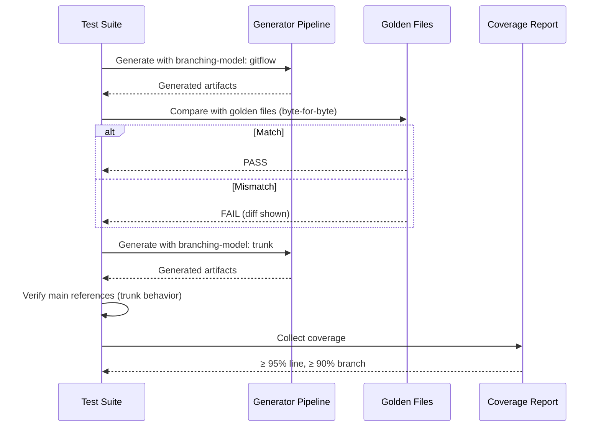

# História: Testes de Integração e Golden Files

**ID:** story-0027-0010
**Chave Jira:** —
**Status:** Concluída

## 1. Dependências

| Blocked By | Blocks |
| :--- | :--- |
| story-0027-0002, story-0027-0003, story-0027-0004, story-0027-0005, story-0027-0006, story-0027-0007, story-0027-0008, story-0027-0009 | — |

## 2. Regras Transversais Aplicáveis

| ID | Título |
| :--- | :--- |
| RULE-001 | Estrutura de Branches Git Flow |
| RULE-007 | Retrocompatibilidade |

## 3. Descrição

Como **QA Engineer**, eu quero que o test suite e golden files validem o modelo Git Flow em todos os artefatos gerados, garantindo que futuras alterações no gerador não introduzam regressões no branching model.

Esta história é a validação cross-cutting de todo o épico. Atualiza golden files para os 8 profiles refletindo `develop` como branch base, adiciona testes para `branching-model: gitflow` (default) vs `branching-model: trunk`, e valida end-to-end que todas as skills geradas estão corretas. O objetivo é que qualquer regressão futura seja detectada automaticamente pelos testes.

### 3.1 Golden File Updates

- Atualizar golden files dos 8 profiles para refletir `develop` nos skills gerados
- Profiles: java-quarkus, java-spring, go-gin, kotlin-ktor, python-click-cli, python-fastapi, rust-axum, typescript-nestjs
- Skills afetados: x-git-push, x-dev-lifecycle, x-dev-epic-implement, x-release, x-ci-cd-generate, x-fix-epic-pr-comments

### 3.2 Novos Testes para Git Flow

- Testes unitários: `BranchingModel` enum, config parsing, validação
- Testes de integração: pipeline de geração com gitflow vs trunk
- Testes de conteúdo: verificar referências a `develop` nos skills gerados
- Testes de regressão: verificar que `branching-model: trunk` reproduz comportamento pré-migração

### 3.3 Smoke Tests

- Smoke test com `branching-model: gitflow`: verificar que `main` NÃO aparece no fluxo feature
- Smoke test com `branching-model: trunk`: verificar que `main` é usado como base
- Smoke test sem config: verificar default `gitflow`

### 3.4 Verificações Específicas por Skill

| Skill | Verificação |
| :--- | :--- |
| x-git-push | `develop` na seção Branch Strategy, `--base develop` no PR |
| x-dev-lifecycle | Phase 0 com `develop`, Phase 6 com `--base develop` |
| x-dev-epic-implement | Default `no-merge`, `baseBranch` no schema, auto-rebase com `develop` |
| x-release | Release branch workflow (11 steps), hotfix support |
| x-ci-cd-generate | CI triggers em `develop`, `release/**`, `hotfix/**` |
| x-fix-epic-pr-comments | `--base develop` no PR de correção |
| Rule 09 | Presente com 5 tipos de branch documentados |
| release-management | Git Flow como recomendação primária |

## 3.5 Entrega de Valor

- **Valor Principal:** Validação completa de artefatos Git Flow via testes automatizados, garantindo regressão zero em futuras gerações do `ia-dev-env`
- **Métrica de Sucesso:** Todos os testes existentes passam (zero regressão), novos testes cobrem gitflow e trunk, coverage ≥ 95% line / ≥ 90% branch mantidos, golden files atualizados para 8 profiles
- **Impacto no Negócio:** Confiança na integridade do gerador — qualquer alteração futura que quebre o Git Flow será detectada automaticamente antes de chegar ao usuário

## 4. Definições de Qualidade Locais

### DoR Local (Definition of Ready)

- [ ] Todas as stories de skill (0002-0009) concluídas
- [ ] Resources templates finalizados para todas as skills
- [ ] Padrão de testes de golden file entendido (byte-for-byte comparison)

### DoD Local (Definition of Done)

- [ ] Golden files atualizados para todos os 8 profiles
- [ ] Nenhum teste existente quebrado (zero regressão)
- [ ] Novos testes para gitflow behavior em cada skill afetada
- [ ] Novos testes para trunk fallback behavior
- [ ] Coverage ≥ 95% line, ≥ 90% branch mantidos
- [ ] Smoke tests passando para gitflow e trunk configs
- [ ] Pelo menos 1 teste E2E validando geração completa com Git Flow

### Global Definition of Done (DoD)

- **Cobertura:** ≥ 95% Line, ≥ 90% Branch
- **Testes Automatizados:** Unitários, integração, smoke, E2E
- **Relatório de Cobertura:** JaCoCo com thresholds validados
- **Documentação:** Test cases documentados
- **Performance:** Suite de testes completo em tempo razoável
- **TDD Compliance:** Test-first, refactoring explícito, TPP
- **Double-Loop TDD:** Acceptance tests (outer), unit tests (inner)

## 5. Contratos de Dados (Data Contract)

### 5.1 Test Matrix

| Dimensão | gitflow (default) | trunk |
| :--- | :--- | :--- |
| x-git-push | `develop` como base | `main` como base |
| x-dev-lifecycle | Phase 0/6 com `develop` | Phase 0/6 com `main` |
| x-dev-epic-implement | `no-merge` default, `develop` | `interactive` default, `main` |
| x-release | Release branch workflow | Tag direto em `main` |
| x-ci-cd-generate | CI em develop/release/hotfix | CI em main/develop |
| x-fix-epic-pr-comments | `--base develop` | `--base main` |
| Rule 09 | Presente | Presente (trunk variant) |

### 5.2 Golden File Profiles

| Profile | Path | Status |
| :--- | :--- | :--- |
| java-quarkus | `tests/golden/java-quarkus/` | Atualizar |
| java-spring | `tests/golden/java-spring/` | Atualizar |
| go-gin | `tests/golden/go-gin/` | Atualizar |
| kotlin-ktor | `tests/golden/kotlin-ktor/` | Atualizar |
| python-click-cli | `tests/golden/python-click-cli/` | Atualizar |
| python-fastapi | `tests/golden/python-fastapi/` | Atualizar |
| rust-axum | `tests/golden/rust-axum/` | Atualizar |
| typescript-nestjs | `tests/golden/typescript-nestjs/` | Atualizar |

Nenhum endpoint declarado nesta story — alteração é puramente em artefatos de teste.

## 6. Diagramas

### 6.1 Fluxo de Validação de Testes



## 7. Critérios de Aceite (Gherkin)

```gherkin
Cenario: Geração sem nenhum profile configurado
  DADO que nenhum profile de teste está disponível
  QUANDO o test suite tenta executar
  ENTÃO o test suite falha com mensagem indicando profiles ausentes

Cenario: Golden files atualizados para gitflow em todos os profiles
  DADO que todos os golden files foram regenerados
  QUANDO a geração é executada para cada um dos 8 profiles com "branching-model: gitflow"
  ENTÃO o output corresponde exatamente aos golden files atualizados
  E nenhum teste de golden file falha

Cenario: Nenhum teste existente quebrado após migração
  DADO que o test suite completo (1384+ testes) está disponível
  QUANDO todos os testes são executados
  ENTÃO zero testes falham
  E o coverage permanece ≥ 95% line e ≥ 90% branch

Cenario: Trunk mode reproduz comportamento pré-migração
  DADO que o YAML config contém "branching-model: trunk"
  QUANDO a geração é executada
  ENTÃO os skills gerados usam "main" como branch base
  E o comportamento é idêntico ao output pré-migração
  E nenhum teste de regressão falha

Cenario: Smoke test valida Git Flow end-to-end
  DADO que o smoke test está configurado com "branching-model: gitflow"
  QUANDO a geração completa é executada
  ENTÃO x-git-push contém "develop" e "hotfix" sections
  E x-dev-lifecycle Phase 0 usa "develop"
  E x-dev-epic-implement default é "no-merge"
  E x-release documenta release branch workflow
  E x-ci-cd-generate CI trigga em "develop", "release/**", "hotfix/**"
  E Rule 09 está presente com 5 tipos de branch
```

## 8. Sub-tarefas

- [ ] [Dev] Regenerar golden files para os 8 profiles com branching-model gitflow
- [ ] [Test] Unitário: BranchingModel enum, config parsing, validação
- [ ] [Test] Integração: Pipeline com gitflow config — validar 6 skills afetados
- [ ] [Test] Integração: Pipeline com trunk config — validar fallback
- [ ] [Test] Integração: Pipeline sem config — validar default gitflow
- [ ] [Test] Smoke/E2E: Geração completa com gitflow validando todos os artefatos
- [ ] [Test] Regressão: Executar test suite completo e verificar zero failures
- [ ] [Test] Coverage: Verificar que ≥ 95% line e ≥ 90% branch são mantidos
- [ ] [Doc] Documentar test matrix e verificações por skill
