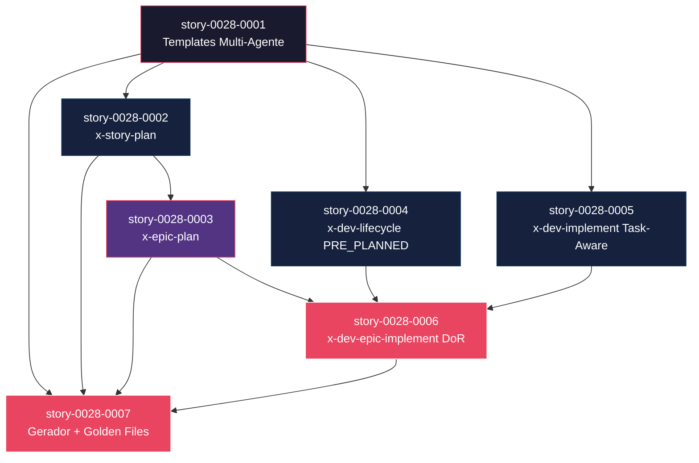

# Mapa de Implementação — Planejamento Multi-Agente de Histórias

**Gerado a partir das dependências BlockedBy/Blocks de cada história do epic-0028.**

---

## 1. Matriz de Dependências

| Story | Título | Chave Jira | Blocked By | Blocks | Status |
| :--- | :--- | :--- | :--- | :--- | :--- |
| story-0028-0001 | Templates de Planejamento Multi-Agente | — | — | story-0028-0002, story-0028-0003, story-0028-0004, story-0028-0005, story-0028-0006, story-0028-0007 | Pendente |
| story-0028-0002 | Skill x-story-plan | — | story-0028-0001 | story-0028-0003, story-0028-0006, story-0028-0007 | Pendente |
| story-0028-0003 | Skill x-epic-plan | — | story-0028-0002 | story-0028-0006, story-0028-0007 | Pendente |
| story-0028-0004 | x-dev-lifecycle PRE_PLANNED | — | story-0028-0001 | story-0028-0006, story-0028-0007 | Pendente |
| story-0028-0005 | x-dev-implement Task-Aware | — | story-0028-0001 | story-0028-0006, story-0028-0007 | Pendente |
| story-0028-0006 | x-dev-epic-implement DoR + Per-Task | — | story-0028-0003, story-0028-0004, story-0028-0005 | story-0028-0007 | Pendente |
| story-0028-0007 | Gerador + Golden Files | — | story-0028-0001, story-0028-0002, story-0028-0003 | — | Pendente |

> **Valores de Status:** `Pendente` (padrão) · `Em Andamento` · `Concluída` · `Falha` · `Bloqueada` · `Parcial`

> **Nota:** story-0028-0004 e story-0028-0005 são independentes entre si e podem ser desenvolvidas em paralelo na Fase 1. story-0028-0006 é a story de composição que integra todas as modificações de skills existentes. story-0028-0007 é a última a ser executada pois precisa de todos os resource files prontos antes de atualizar o gerador.

---

## 2. Fases de Implementação

> As histórias são agrupadas em fases. Dentro de cada fase, as histórias podem ser implementadas **em paralelo**. Uma fase só pode iniciar quando todas as dependências das fases anteriores estiverem concluídas.

```
╔══════════════════════════════════════════════════════════════════════════╗
║                  FASE 0 — Foundation (1 story)                         ║
║                                                                        ║
║   ┌───────────────────────────────────────────────────────────┐        ║
║   │  story-0028-0001  Templates Multi-Agente                  │        ║
║   │  (3 novos + 4 modificados = 7 templates)                  │        ║
║   └──────────────────────┬────────────────────────────────────┘        ║
╚══════════════════════════╪═════════════════════════════════════════════╝
                           │
           ┌───────────────┼───────────────┐
           ▼               ▼               ▼
╔══════════════════════════════════════════════════════════════════════════╗
║                  FASE 1 — Core + Extensions (3 stories, paralelo)      ║
║                                                                        ║
║   ┌─────────────────┐ ┌─────────────────┐ ┌─────────────────┐         ║
║   │  story-0028-0002 │ │  story-0028-0004 │ │  story-0028-0005 │        ║
║   │  x-story-plan    │ │  x-dev-lifecycle │ │  x-dev-implement │        ║
║   │  (skill nova)    │ │  (PRE_PLANNED)   │ │  (task-aware)    │        ║
║   └────────┬─────────┘ └────────┬─────────┘ └────────┬─────────┘       ║
╚════════════╪════════════════════╪════════════════════╪══════════════════╝
             │                    │                    │
             ▼                    │                    │
╔══════════════════════════════════════════════════════════════════════════╗
║                  FASE 2 — Extension (1 story)                          ║
║                                                                        ║
║   ┌───────────────────────────────────────────────────────────┐        ║
║   │  story-0028-0003  x-epic-plan (orquestrador)               │        ║
║   │  (← story-0028-0002)                                       │        ║
║   └────────────────────��─┬────────────────────────────────────┘        ║
╚══════════════════════════╪═════════════════════════════════════════════╝
                           │
                           ▼
╔══════════════════════════════════════════════════════════════════════════╗
║                  FASE 3 — Composition + Cross-Cutting (2 stories)      ║
║                                                                        ║
║   ┌─────────────────────┐  ┌─────────────────────┐                     ║
║   │  story-0028-0006     │  │  story-0028-0007     │                    ║
║   │  x-dev-epic-implement│  │  Gerador + Golden    │                    ║
║   │  (DoR + per-task)    │  │  Files               │                    ║
║   └─────────────────────┘  └─────────────────────┘                     ║
╚══════════════════════════════════════════════════════════════════════════╝
```

---

## 3. Caminho Crítico

> O caminho crítico (a sequência mais longa de dependências) determina o tempo mínimo de implementação do projeto.

```
story-0028-0001 → story-0028-0002 → story-0028-0003 → story-0028-0006
    Fase 0            Fase 1            Fase 2            Fase 3
```

**4 fases no caminho crítico, 4 histórias na cadeia mais longa (story-0028-0001 → 0002 → 0003 → 0006).**

Caminho alternativo de mesma duração: story-0028-0001 → story-0028-0002 → story-0028-0003 → story-0028-0007.

Atrasos em story-0028-0001 (templates) ou story-0028-0002 (x-story-plan) impactam TODAS as demais histórias. Estas duas stories devem receber prioridade máxima.

---

## 4. Grafo de Dependências (Mermaid)



---

## 5. Resumo por Fase

| Fase | Histórias | Camada | Paralelismo | Pré-requisito |
| :--- | :--- | :--- | :--- | :--- |
| 0 | story-0028-0001 | Foundation | 1 (sequencial) | — |
| 1 | story-0028-0002, story-0028-0004, story-0028-0005 | Core + Extensions | 3 paralelas | Fase 0 concluída |
| 2 | story-0028-0003 | Extension | 1 (sequencial) | story-0028-0002 concluída |
| 3 | story-0028-0006, story-0028-0007 | Composition + Cross-Cutting | 2 paralelas | Fase 2 concluída + story-0028-0004 + story-0028-0005 |

**Total: 7 histórias em 4 fases.**

> **Nota:** A Fase 1 oferece o maior paralelismo (3 stories). story-0028-0004 e story-0028-0005 modificam skills independentes (x-dev-lifecycle e x-dev-implement) e podem ser desenvolvidas simultaneamente com story-0028-0002 (nova skill x-story-plan).

---

## 6. Detalhamento por Fase

### Fase 0 — Foundation

| Story | Escopo Principal | Artefatos Chave |
| :--- | :--- | :--- |
| story-0028-0001 | 3 novos templates + 4 modificados | `_TEMPLATE-TASK-PLAN.md`, `_TEMPLATE-STORY-PLANNING-REPORT.md`, `_TEMPLATE-DOR-CHECKLIST.md`, modificações em `_TEMPLATE-TASK-BREAKDOWN.md`, `_TEMPLATE-STORY.md`, `_TEMPLATE-EPIC.md`, `_TEMPLATE-EXECUTION-STATE.json` |

**Entregas da Fase 0:**

- 3 novos templates de planejamento com seções obrigatórias validáveis
- 4 templates existentes com mudanças incrementais backward-compatible
- Infraestrutura de formatos para todas as skills subsequentes

### Fase 1 — Core + Extensions

| Story | Escopo Principal | Artefatos Chave |
| :--- | :--- | :--- |
| story-0028-0002 | Skill x-story-plan (6 fases, 5 subagentes) | `x-story-plan/SKILL.md`, `references/planning-guide.md`, `README.md` |
| story-0028-0004 | Modo PRE_PLANNED no x-dev-lifecycle | `x-dev-lifecycle/SKILL.md` (modificado) |
| story-0028-0005 | Execução task-aware no x-dev-implement | `x-dev-implement/SKILL.md` (modificado) |

**Entregas da Fase 1:**

- Skill core de planejamento multi-agente funcional
- x-dev-lifecycle capaz de detectar e usar planos pré-existentes
- x-dev-implement capaz de iterar por tasks individuais com resume point

### Fase 2 — Extension

| Story | Escopo Principal | Artefatos Chave |
| :--- | :--- | :--- |
| story-0028-0003 | Skill x-epic-plan (4 fases, orquestrador) | `x-epic-plan/SKILL.md`, `README.md` |

**Entregas da Fase 2:**

- Orquestração de planejamento para épico inteiro com uma única invocação
- Checkpoint e resume via execution-state.json
- Relatório de readiness consolidado

### Fase 3 — Composition + Cross-Cutting

| Story | Escopo Principal | Artefatos Chave |
| :--- | :--- | :--- |
| story-0028-0006 | DoR pre-check + per-task checkpoint | `x-dev-epic-implement/SKILL.md` (modificado) |
| story-0028-0007 | Registro no gerador + golden files | `SkillGroupRegistry.java`, `PlanTemplatesAssembler.java`, ~272 golden files |

**Entregas da Fase 3:**

- Gate de DoR antes do desenvolvimento (impede stories não planejadas)
- Tracking granular por task no execution-state.json
- Novas skills e templates disponíveis em todos os projetos gerados
- Validação byte-for-byte via golden files em 17 profiles

---

## 7. Observações Estratégicas

### Gargalo Principal

**story-0028-0001 (Templates)** é o gargalo absoluto — bloqueia TODAS as 6 outras histórias. Porém é a story mais simples (apenas criação/modificação de arquivos markdown), então o risco de atraso é baixo. O gargalo funcional é **story-0028-0002 (x-story-plan)** que bloqueia 3 histórias diretamente e é a mais complexa do épico (6 fases, 5 subagentes paralelos, consolidação com regras de merge).

### Histórias Folha (sem dependentes)

**story-0028-0007 (Gerador + Golden Files)** é a única folha verdadeira — não bloqueia nenhuma outra história. Pode absorver atrasos sem impacto no caminho crítico. Também é a story com maior impacto em volume de arquivos (~272 golden files) mas menor complexidade lógica.

### Otimização de Tempo

- **Fase 1 é a janela de máximo paralelismo** (3 stories em paralelo): story-0028-0002 (nova skill), story-0028-0004 (modificação x-dev-lifecycle), story-0028-0005 (modificação x-dev-implement). Alocar 3 desenvolvedores/worktrees para máxima velocidade.
- **story-0028-0001 pode começar imediatamente** — não tem dependências.
- **story-0028-0006 e story-0028-0007 podem iniciar em paralelo** na Fase 3, desde que todas as dependências da Fase 2 e skills modificadas estejam concluídas.

### Dependências Cruzadas

story-0028-0006 é o ponto de convergência principal — depende de 3 stories de ramos diferentes da árvore (story-0028-0003 via ramo x-story-plan, story-0028-0004 via ramo x-dev-lifecycle, story-0028-0005 via ramo x-dev-implement). Qualquer atraso em qualquer um dos 3 ramos bloqueia story-0028-0006.

story-0028-0007 também converge 3 dependências (story-0028-0001, 0002, 0003) mas do mesmo ramo (pipeline templates → x-story-plan → x-epic-plan).

### Marco de Validação Arquitetural

**story-0028-0002 (x-story-plan)** serve como marco de validação. Após sua conclusão, é possível verificar:
- O padrão de 5 subagentes paralelos funciona
- O formato TASK_PROPOSAL é viável
- As regras de consolidação (MERGE, AUGMENT, PAIR) produzem output consistente
- Os templates novos suportam o formato de saída esperado

Se story-0028-0002 revelar problemas no design, as stories subsequentes (0003, 0004, 0005, 0006) podem ser ajustadas antes de iniciar. Recomenda-se uma revisão de design após a conclusão da Fase 1.
