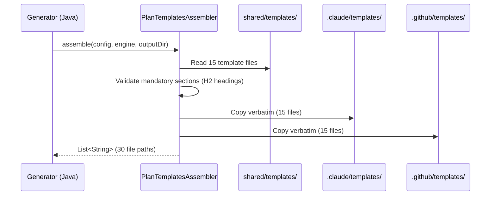

# História: Templates de Planejamento Multi-Agente

**ID:** story-0028-0001
**Chave Jira:** —
**Status:** Pendente

## 1. Dependências

| Blocked By | Blocks |
| :--- | :--- |
| — | story-0028-0002, story-0028-0003, story-0028-0004, story-0028-0005, story-0028-0006, story-0028-0007 |

## 2. Regras Transversais Aplicáveis

| ID | Título |
| :--- | :--- |
| RULE-003 | Template Verbatim Copy |
| RULE-004 | Convenção Flat de Arquivos |
| RULE-006 | Conteúdo em pt-BR |

## 3. Descrição

Como **desenvolvedor usando ia-dev-env**, eu quero que o gerador produza templates padronizados para planejamento multi-agente (task plans, relatórios de planejamento, checklists DoR), garantindo que todas as skills de planejamento tenham um formato de saída consistente e validável.

Esta história cria a infraestrutura de templates que todas as demais histórias do épico consomem. São 3 novos templates e 4 templates existentes modificados. Os templates são copiados verbatim pelo `PlanTemplatesAssembler` (RULE-003) — os tokens `{{PLACEHOLDER}}` são preenchidos pelo LLM em runtime.

### 3.1 Novos Templates

- `_TEMPLATE-TASK-PLAN.md` — Plano individual por task com Header, Objective, Implementation Guide, Definition of Done, Dependencies, Estimated Effort, Risks (7 seções obrigatórias)
- `_TEMPLATE-STORY-PLANNING-REPORT.md` — Relatório consolidado dos 5 agentes com Header, Planning Summary, Architecture/Test/Security/Implementation Assessment, Task Breakdown Summary, Consolidated Risk Matrix, DoR Status (9 seções obrigatórias)
- `_TEMPLATE-DOR-CHECKLIST.md` — Checklist de Definition of Ready com Header, Architecture/Test/Security/Implementation/Task Readiness, Blockers, Final Verdict (8 seções obrigatórias)

### 3.2 Templates Modificados

- `_TEMPLATE-TASK-BREAKDOWN.md` — Adicionar colunas `Agent` e `DoD` na Tasks Table
- `_TEMPLATE-STORY.md` — Section 8 enhanced com formato dual (genérico + detalhado)
- `_TEMPLATE-EPIC.md` — Coluna `Planejamento` no índice de histórias
- `_TEMPLATE-EXECUTION-STATE.json` — Campos `planningStatus` e `tasks` por story

## 3.5 Entrega de Valor

- **Valor Principal:** Formato padronizado para planejamento multi-agente — habilita geração consistente de task plans, relatórios e checklists DoR, eliminando variação de output entre sessões
- **Métrica de Sucesso:** 3 novos templates com número exato de seções obrigatórias (7, 9, 8 respectivamente) e 4 templates existentes com mudanças incrementais validáveis. `PlanTemplatesAssembler` valida todas as seções obrigatórias antes de copiar.
- **Impacto no Negócio:** Desbloqueia 6 histórias e elimina retrabalho causado por formatos inconsistentes de planejamento

## 4. Definições de Qualidade Locais

### DoR Local (Definition of Ready)

- [ ] Templates existentes lidos e compreendidos (formatos atuais de _TEMPLATE-TASK-BREAKDOWN.md, _TEMPLATE-STORY.md, _TEMPLATE-EPIC.md, _TEMPLATE-EXECUTION-STATE.json)
- [ ] Seções obrigatórias de cada novo template definidas no plano
- [ ] Formato de `{{PLACEHOLDER}}` tokens documentado

### DoD Local (Definition of Done)

- [ ] 3 novos templates criados em `java/src/main/resources/shared/templates/`
- [ ] 4 templates existentes modificados com mudanças incrementais
- [ ] Cada template tem seções obrigatórias validáveis (H2 headings)
- [ ] Novos templates contêm `{{PLACEHOLDER}}` tokens (não valores hardcoded)
- [ ] Templates modificados mantêm backward compatibility (seções existentes inalteradas)
- [ ] Pelo menos 1 teste automatizado validando as seções obrigatórias dos novos templates
- [ ] Smoke test: `PlanTemplatesAssembler` processa os 15 templates sem erro

### Global Definition of Done (DoD)

- **Cobertura:** ≥ 95% Line, ≥ 90% Branch
- **Testes Automatizados:** Unitários para validação de seções + integração via PlanTemplatesAssembler
- **Documentação:** Seções obrigatórias documentadas no código do assembler
- **TDD Compliance:** Test-first commits, refactoring explícito após green
- **Double-Loop TDD:** Acceptance tests from Gherkin (outer), unit tests by TPP (inner)

## 5. Contratos de Dados (Data Contract)

### 5.1 _TEMPLATE-TASK-PLAN.md — Seções Obrigatórias

| Seção (H2) | Conteúdo Esperado | M/O |
| :--- | :--- | :--- |
| `Header` | Tabela com Task ID, Story ID, Epic ID, Source Agent, Type, TDD Phase, Layer, Estimated Effort, Date | M |
| `Objective` | Texto livre descrevendo o objetivo da task | M |
| `Implementation Guide` | Instruções específicas (classe, método, padrão) | M |
| `Definition of Done` | Checklist com critérios do agente fonte | M |
| `Dependencies` | Tabela Depends On / Reason | M |
| `Estimated Effort` | Breakdown de esforço | M |
| `Risks` | Tabela Risk / Probability / Impact / Mitigation | M |

### 5.2 _TEMPLATE-STORY-PLANNING-REPORT.md — Seções Obrigatórias

| Seção (H2) | Conteúdo Esperado | M/O |
| :--- | :--- | :--- |
| `Header` | Story ID, Epic ID, Date, Agents Participating | M |
| `Planning Summary` | Resumo consolidado de todos os agentes | M |
| `Architecture Assessment` | Resumo do Architect agent | M |
| `Test Strategy Summary` | Resumo do QA agent | M |
| `Security Assessment Summary` | Resumo do Security agent | M |
| `Implementation Approach` | Resumo do Tech Lead agent | M |
| `Task Breakdown Summary` | Resumo do PO agent + consolidação | M |
| `Consolidated Risk Matrix` | Riscos de todos os agentes | M |
| `DoR Status` | READY / NOT READY com blockers | M |

### 5.3 _TEMPLATE-DOR-CHECKLIST.md — Seções Obrigatórias

| Seção (H2) | Conteúdo Esperado | M/O |
| :--- | :--- | :--- |
| `Header` | Story ID, Epic ID, Date, Verdict | M |
| `Architecture Readiness` | Checklist derivado do Architect | M |
| `Test Readiness` | Checklist derivado do QA | M |
| `Security Readiness` | Checklist derivado do Security | M |
| `Implementation Readiness` | Checklist do Tech Lead | M |
| `Task Decomposition Readiness` | Checklist do PO | M |
| `Blockers and Open Questions` | Lista de blockers | M |
| `Final Verdict` | READY / NOT READY | M |

### 5.4 Mudanças em Templates Existentes

| Template | Mudança | Backward Compatible |
| :--- | :--- | :--- |
| `_TEMPLATE-TASK-BREAKDOWN.md` | +2 colunas: `Agent`, `DoD` na Tasks Table | Sim (colunas adicionais) |
| `_TEMPLATE-STORY.md` | Section 8 dual: 8.0 genérico + 8.1 detalhado | Sim (8.0 preservado) |
| `_TEMPLATE-EPIC.md` | +1 coluna: `Planejamento` no índice | Sim (coluna adicional) |
| `_TEMPLATE-EXECUTION-STATE.json` | +2 campos: `planningStatus`, `tasks` por story | Sim (campos opcionais) |

## 6. Diagramas

### 6.1 Fluxo de Templates no Pipeline



## 7. Critérios de Aceite (Gherkin)

```gherkin
Cenario: Template vazio falha validação de seções
  DADO que o arquivo "_TEMPLATE-TASK-PLAN.md" existe mas está vazio
  QUANDO PlanTemplatesAssembler valida as seções obrigatórias
  ENTÃO a validação falha com mensagem indicando seções ausentes
  E o template NÃO é copiado para .claude/templates/

Cenario: Novo template _TEMPLATE-TASK-PLAN.md tem todas 7 seções obrigatórias
  DADO que o arquivo "_TEMPLATE-TASK-PLAN.md" existe em shared/templates/
  E contém os headings H2: Header, Objective, Implementation Guide, Definition of Done, Dependencies, Estimated Effort, Risks
  QUANDO PlanTemplatesAssembler processa o template
  ENTÃO o template é copiado verbatim para .claude/templates/ e .github/templates/
  E o conteúdo é idêntico byte-for-byte ao source

Cenario: Template _TEMPLATE-STORY-PLANNING-REPORT.md tem todas 9 seções
  DADO que o arquivo "_TEMPLATE-STORY-PLANNING-REPORT.md" existe em shared/templates/
  E contém os headings H2: Header, Planning Summary, Architecture Assessment, Test Strategy Summary, Security Assessment Summary, Implementation Approach, Task Breakdown Summary, Consolidated Risk Matrix, DoR Status
  QUANDO PlanTemplatesAssembler processa o template
  ENTÃO o template é copiado para ambos targets (.claude e .github)
  E a contagem total de templates é 15

Cenario: Template _TEMPLATE-TASK-BREAKDOWN.md modificado mantém seções existentes
  DADO que "_TEMPLATE-TASK-BREAKDOWN.md" foi modificado com colunas Agent e DoD
  QUANDO PlanTemplatesAssembler valida as seções obrigatórias
  ENTÃO as 5 seções originais (Header, Summary, Dependency Graph, Tasks Table, Escalation Notes) continuam presentes
  E a Tasks Table contém as colunas Agent e DoD

Cenario: TEMPLATE_COUNT atualizado de 12 para 15
  DADO que PlanTemplatesAssembler tem TEMPLATE_COUNT = 15
  E existem exatamente 15 templates em shared/templates/ com prefixo "_TEMPLATE-"
  QUANDO o assembler copia todos os templates
  ENTÃO 30 arquivos são gerados (15 × 2 targets)
  E nenhum template é omitido

Cenario: _TEMPLATE-EXECUTION-STATE.json contém campo tasks
  DADO que "_TEMPLATE-EXECUTION-STATE.json" foi modificado
  QUANDO o conteúdo é parseado como JSON
  ENTÃO o campo "stories.XXXX-0001.tasks" existe como objeto
  E o campo "stories.XXXX-0001.planningStatus" existe como string
```

## 8. Sub-tarefas

- [ ] [Dev] Criar `_TEMPLATE-TASK-PLAN.md` com 7 seções obrigatórias em `java/src/main/resources/shared/templates/`
- [ ] [Dev] Criar `_TEMPLATE-STORY-PLANNING-REPORT.md` com 9 seções obrigatórias
- [ ] [Dev] Criar `_TEMPLATE-DOR-CHECKLIST.md` com 8 seções obrigatórias
- [ ] [Dev] Modificar `_TEMPLATE-TASK-BREAKDOWN.md` — adicionar colunas Agent e DoD na Tasks Table
- [ ] [Dev] Modificar `_TEMPLATE-STORY.md` — Section 8 com formato dual (8.0 genérico preservado + 8.1 detalhado)
- [ ] [Dev] Modificar `_TEMPLATE-EPIC.md` — adicionar coluna Planejamento no índice de histórias
- [ ] [Dev] Modificar `_TEMPLATE-EXECUTION-STATE.json` — adicionar campos planningStatus e tasks por story
- [ ] [Test] Unitário: Validação de seções obrigatórias dos 3 novos templates via PlanTemplatesAssembler
- [ ] [Test] Integração: Pipeline completo gera 30 arquivos (15 templates × 2 targets)
- [ ] [Test] Smoke/E2E: Golden files byte-for-byte match para templates novos e modificados
- [ ] [Doc] Atualizar contagem de templates na documentação do PlanTemplatesAssembler (12 → 15)
