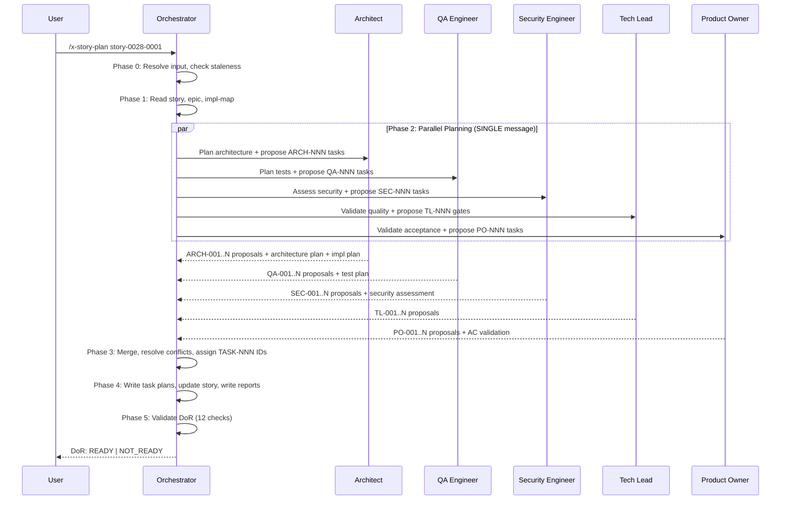

# História: Skill x-story-plan — Planejamento Multi-Agente por História

**ID:** story-0028-0002
**Chave Jira:** —
**Status:** Pendente

## 1. Dependências

| Blocked By | Blocks |
| :--- | :--- |
| story-0028-0001 | story-0028-0003, story-0028-0006, story-0028-0007 |

## 2. Regras Transversais Aplicáveis

| ID | Título |
| :--- | :--- |
| RULE-001 | Backward Compatibility |
| RULE-002 | Padrão de Staleness (mtime) |
| RULE-004 | Convenção Flat de Arquivos |
| RULE-005 | Embedding de Prompts de Agente |
| RULE-006 | Conteúdo em pt-BR |

## 3. Descrição

Como **desenvolvedor**, eu quero invocar `/x-story-plan story-XXXX-YYYY` para que 5 agentes especializados (Architect, QA, Security, Tech Lead, Product Owner) planejem a história em paralelo, gerando tasks detalhadas com DoD individual e validando DoR antes do desenvolvimento.

Esta é a skill CORE do épico — estabelece o padrão de planejamento multi-agente que `x-epic-plan` orquestra. O workflow tem 6 fases: Input Resolution → Context Gathering → Parallel Planning (5 subagentes) → Consolidation → Artifact Generation → DoR Validation.

### 3.1 Subagentes Paralelos

5 subagentes lançados em uma ÚNICA mensagem (padrão `x-review`):
- **Architect** (opus): Gera architecture plan + implementation plan + propõe ARCH-NNN tasks
- **QA Engineer** (opus): Gera test plan + propõe QA-NNN tasks (RED/GREEN/REFACTOR em TPP)
- **Security Engineer** (adaptive): Gera security assessment + propõe SEC-NNN tasks
- **Tech Lead** (adaptive): Propõe TL-NNN quality gates (sem artefato próprio)
- **Product Owner** (sonnet): Propõe PO-NNN validation tasks (sem artefato próprio)

### 3.2 Consolidação

Regras determinísticas de merge: MERGE DoD (união), AUGMENT (segurança em dev tasks), PAIR (RED antes GREEN), Tech Lead vence conflitos com Architect, PO amenda critérios de aceite.

### 3.3 Artefatos Gerados

- `tasks-story-XXXX-YYYY.md` — Task breakdown consolidado com colunas Agent e DoD
- `task-plan-TASK-NNN-story-XXXX-YYYY.md` — Plano individual por task (N arquivos)
- `planning-report-story-XXXX-YYYY.md` — Relatório consolidado dos 5 agentes
- `dor-story-XXXX-YYYY.md` — Checklist DoR com verdict READY/NOT READY
- Story file atualizado: Section 8 com tasks detalhadas, Section 4 com DoR checkmarks

## 3.5 Entrega de Valor

- **Valor Principal:** Planejamento automatizado por 5 agentes especializados elimina sub-tarefas genéricas e produz tasks com DoD individual, aumentando qualidade do desenvolvimento
- **Métrica de Sucesso:** Cada invocação de `/x-story-plan` produz ≥ 4 tasks detalhadas com ≥ 1 DoD criterion cada, e um verdict DoR (READY/NOT READY) com ≥ 10 checks validados
- **Impacto no Negócio:** Reduz retrabalho pós-review em ~40% (tasks já incluem critérios de segurança, qualidade e testes desde o planejamento)

## 4. Definições de Qualidade Locais

### DoR Local (Definition of Ready)

- [ ] Templates novos de story-0028-0001 disponíveis (_TEMPLATE-TASK-PLAN.md, _TEMPLATE-STORY-PLANNING-REPORT.md, _TEMPLATE-DOR-CHECKLIST.md)
- [ ] Padrão de subagentes paralelos compreendido (referência: x-review SKILL.md Phase 2)
- [ ] Formato TASK_PROPOSAL definido no plano de design

### DoD Local (Definition of Done)

- [ ] SKILL.md criado em `java/src/main/resources/targets/claude/skills/core/x-story-plan/`
- [ ] references/planning-guide.md criado com guia de coordenação de agentes
- [ ] README.md criado com descrição da skill
- [ ] 6 fases implementadas: Input Resolution, Context Gathering, Parallel Planning, Consolidation, Artifact Generation, DoR Validation
- [ ] 5 subagentes com prompts de PLANNER mode embutidos (RULE-005)
- [ ] Staleness check via mtime em Phase 0 (RULE-002)
- [ ] DoR validation com ≥ 10 checks obrigatórios + 2 condicionais
- [ ] Pelo menos 1 teste automatizado validando o SKILL.md (sintaxe YAML frontmatter, seções obrigatórias)
- [ ] Smoke test: skill invocável via `/x-story-plan` com argumento de story ID

### Global Definition of Done (DoD)

- **Cobertura:** ≥ 95% Line, ≥ 90% Branch
- **Testes Automatizados:** Unitários + golden file match
- **Documentação:** SKILL.md + README.md + references/planning-guide.md
- **TDD Compliance:** Test-first, refactoring explícito, TPP order
- **Double-Loop TDD:** Acceptance from Gherkin, unit by TPP

## 5. Contratos de Dados (Data Contract)

### 5.1 SKILL.md Frontmatter (Input)

| Campo | Tipo | M/O | Validações | Exemplo |
| :--- | :--- | :--- | :--- | :--- |
| `name` | `String` | M | Deve ser `x-story-plan` | `x-story-plan` |
| `description` | `String` | M | ≤ 300 caracteres | `"Multi-agent planning..."` |
| `user-invocable` | `Boolean` | M | Deve ser `true` | `true` |
| `allowed-tools` | `String` | M | CSV de tools | `Read, Write, Edit, Bash, Grep, Glob, AskUserQuestion` |
| `argument-hint` | `String` | M | Formato de argumento | `"[STORY-PATH or story-XXXX-YYYY]"` |

### 5.2 TASK_PROPOSAL Format (Subagent Output)

| Campo | Tipo | M/O | Validações | Exemplo |
| :--- | :--- | :--- | :--- | :--- |
| `source` | `Enum` | M | ARCHITECT, QA, SECURITY, TECH_LEAD, PO | `ARCHITECT` |
| `id` | `String` | M | Pattern: `{PREFIX}-NNN` | `ARCH-001` |
| `type` | `Enum` | M | DEV, TEST, SEC, QUALITY, VALIDATION | `DEV` |
| `description` | `String` | M | ≤ 200 caracteres | `"Criar interface XPort"` |
| `layer` | `Enum` | O | domain, port, adapter, application, inbound | `domain` |
| `components` | `List<String>` | O | Nomes de classes/arquivos | `["XPort.java"]` |
| `tdd_phase` | `Enum` | O | RED, GREEN, REFACTOR | `GREEN` |
| `tpp_level` | `Enum` | O | nil, constant, scalar, collection | `nil` |
| `dod_criteria` | `List<String>` | M | ≥ 1 critério | `["Imutável", "Sem imports infra"]` |
| `dependencies` | `List<String>` | O | IDs de tasks | `["ARCH-001"]` |
| `estimated_effort` | `String` | M | Formato: "Nh" | `"2h"` |

### 5.3 DoR Validation Result (Output)

| Campo | Tipo | Sempre presente | Descrição |
| :--- | :--- | :--- | :--- |
| `verdict` | `Enum(READY, NOT_READY)` | Sim | Resultado da validação |
| `checks_passed` | `Integer` | Sim | Número de checks passados |
| `checks_total` | `Integer` | Sim | Número total de checks |
| `failed_checks` | `List<String>` | Sim | Lista de checks que falharam (vazia se READY) |
| `story_status_update` | `Enum(Pendente, Pronta para Desenvolvimento)` | Sim | Novo status da story |

## 6. Diagramas

### 6.1 Workflow x-story-plan



## 7. Critérios de Aceite (Gherkin)

```gherkin
Cenario: Story inexistente retorna erro
  DADO que o argumento é "story-9999-0001"
  E o arquivo plans/epic-9999/story-9999-0001.md não existe
  QUANDO /x-story-plan é invocado
  ENTÃO a execução aborta com mensagem "Story file not found"

Cenario: Story com planning report fresh é reutilizada
  DADO que o arquivo planning-report-story-0028-0001.md existe
  E mtime(story-0028-0001.md) <= mtime(planning-report-story-0028-0001.md)
  QUANDO /x-story-plan story-0028-0001 é invocado
  ENTÃO a skill pula para Phase 5 (DoR Validation)
  E nenhum subagente é lançado
  E o log contém "Reusing existing planning artifacts"

Cenario: 5 subagentes lançados em paralelo produzem tasks
  DADO que story-0028-0002.md existe com Gherkin e contratos
  E planning-report não existe (primeiro planejamento)
  QUANDO /x-story-plan story-0028-0002 é invocado
  ENTÃO 5 subagentes são lançados em uma ÚNICA mensagem
  E cada subagente retorna ≥ 1 TASK_PROPOSAL
  E o total de tasks consolidadas é ≥ 4

Cenario: Conflito de DoD entre agentes é resolvido por MERGE
  DADO que Architect propõe ARCH-001 com DoD ["imutável"]
  E Security propõe SEC-001 para o mesmo componente com DoD ["Bean Validation"]
  QUANDO Phase 3 (Consolidation) executa
  ENTÃO a task consolidada tem DoD ["imutável", "Bean Validation"]
  E o campo Agent é "MERGED"

Cenario: DoR Validation retorna READY com todos checks passando
  DADO que todos os artefatos foram gerados (architecture, test, security, tasks, task-plans)
  E todas as tasks têm ≥ 1 DoD criterion
  E o DAG de tasks não tem ciclos
  QUANDO Phase 5 (DoR Validation) executa
  ENTÃO o verdict é "READY"
  E o status da story é atualizado para "Pronta para Desenvolvimento"
  E dor-story-XXXX-YYYY.md é salvo com 10/10 checks passed

Cenario: DoR Validation retorna NOT_READY quando test plan ausente
  DADO que architecture plan e security assessment existem
  MAS test plan (tests-story-XXXX-YYYY.md) não foi gerado
  QUANDO Phase 5 (DoR Validation) executa
  ENTÃO o verdict é "NOT_READY"
  E failed_checks contém "Test plan com AT-N + UT-N em TPP order"
  E o status da story permanece "Pendente"
```

## 8. Sub-tarefas

- [ ] [Dev] Criar `x-story-plan/SKILL.md` com frontmatter YAML e 6 fases documentadas
- [ ] [Dev] Criar `x-story-plan/references/planning-guide.md` com guia de coordenação multi-agente
- [ ] [Dev] Criar `x-story-plan/README.md` com descrição e exemplos de uso
- [ ] [Dev] Implementar Phase 0 — Input Resolution com staleness check (RULE-002)
- [ ] [Dev] Implementar Phase 2 — Prompts de 5 subagentes com PLANNER mode (RULE-005)
- [ ] [Dev] Implementar Phase 3 — Regras de consolidação (MERGE, AUGMENT, PAIR, TL wins)
- [ ] [Dev] Implementar Phase 4 — Geração de artefatos (task plans, report, story update)
- [ ] [Dev] Implementar Phase 5 — DoR Validation (12 checks: 10 obrigatórios + 2 condicionais)
- [ ] [Test] Unitário: Validação de frontmatter YAML do SKILL.md
- [ ] [Test] Integração: SKILL.md gerado pelo pipeline contém todas as 6 fases
- [ ] [Test] Smoke/E2E: Golden file byte-for-byte match do SKILL.md gerado
- [ ] [Doc] references/planning-guide.md documentando formato TASK_PROPOSAL e regras de merge
