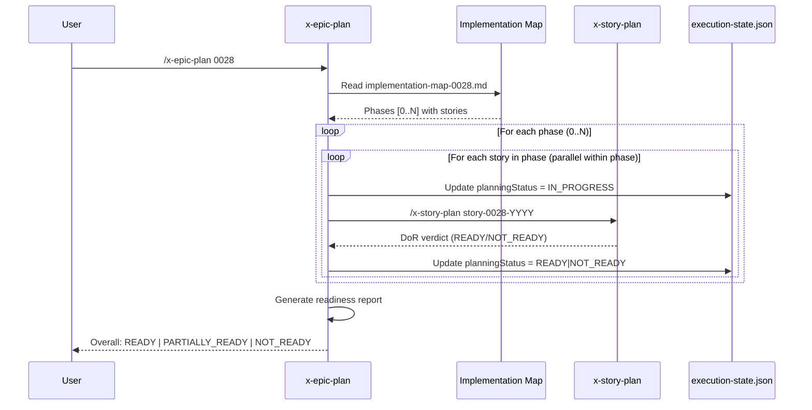

# História: Skill x-epic-plan — Orquestração de Planejamento por Épico

**ID:** story-0028-0003
**Chave Jira:** —
**Status:** Pendente

## 1. Dependências

| Blocked By | Blocks |
| :--- | :--- |
| story-0028-0002 | story-0028-0006, story-0028-0007 |

## 2. Regras Transversais Aplicáveis

| ID | Título |
| :--- | :--- |
| RULE-001 | Backward Compatibility |
| RULE-002 | Padrão de Staleness (mtime) |
| RULE-004 | Convenção Flat de Arquivos |
| RULE-006 | Conteúdo em pt-BR |

## 3. Descrição

Como **desenvolvedor**, eu quero invocar `/x-epic-plan 0028` para que todas as histórias de um épico sejam planejadas automaticamente na ordem de dependência, garantindo que cada história passe pela validação DoR antes de ser marcada como pronta.

Esta skill orquestra `x-story-plan` para todas as stories de um épico. Lê o implementation map para determinar a ordem de planejamento (fase por fase), planeja stories dentro da mesma fase em paralelo, e gera um relatório de readiness do épico. Suporta `--resume` para continuar de onde parou e `--story` para planejar uma única story.

### 3.1 Workflow

4 fases: Prerequisites → Dependency Order → Plan Loop → Report

### 3.2 Checkpoint

Usa `execution-state.json` com campo `planningStatus` por story para checkpoint e resume. Valores: `PENDING`, `IN_PROGRESS`, `READY`, `NOT_READY`.

### 3.3 Relatório Final

Atualiza o epic.md com coluna `Planejamento` no índice de histórias e gera sumário com DoR status, tasks geradas e estimativas por story.

## 3.5 Entrega de Valor

- **Valor Principal:** Planejamento em lote de todas as histórias de um épico com uma única invocação, respeitando dependências e com checkpoint para retomada
- **Métrica de Sucesso:** `/x-epic-plan 0028` planeja N stories sequencialmente por fase, cada uma com DoR verdict, e gera relatório com status consolidado em < 5 minutos por story
- **Impacto no Negócio:** Elimina planejamento manual story-a-story, reduzindo tempo de preparação de épico de N×manual para 1×automatizado

## 4. Definições de Qualidade Locais

### DoR Local (Definition of Ready)

- [ ] Skill x-story-plan (story-0028-0002) implementada e testada
- [ ] execution-state.json tem campo planningStatus (story-0028-0001)
- [ ] Implementation map format compreendido (referência: x-story-map SKILL.md)

### DoD Local (Definition of Done)

- [ ] SKILL.md criado em `java/src/main/resources/targets/claude/skills/core/x-epic-plan/`
- [ ] README.md criado com descrição e flags suportadas
- [ ] 4 fases implementadas: Prerequisites, Dependency Order, Plan Loop, Report
- [ ] Suporta flags: `--resume`, `--story story-XXXX-YYYY`
- [ ] Checkpoint em execution-state.json com planningStatus por story
- [ ] Relatório final com tabela DoR status × tasks × estimativa por story
- [ ] Epic.md atualizado com coluna Planejamento
- [ ] Pelo menos 1 teste automatizado validando o SKILL.md
- [ ] Smoke test: golden file match

### Global Definition of Done (DoD)

- **Cobertura:** ≥ 95% Line, ≥ 90% Branch
- **Testes Automatizados:** Unitários + golden file match
- **Documentação:** SKILL.md + README.md
- **TDD Compliance:** Test-first, refactoring explícito, TPP order
- **Double-Loop TDD:** Acceptance from Gherkin, unit by TPP

## 5. Contratos de Dados (Data Contract)

### 5.1 Input — Argumentos CLI

| Campo | Tipo | M/O | Validações | Exemplo |
| :--- | :--- | :--- | :--- | :--- |
| `epic-id` | `String(4)` | M | 4 dígitos, diretório epic-XXXX existe | `0028` |
| `--resume` | `Boolean` | O | Flag sem valor | `--resume` |
| `--story` | `String` | O | Pattern: story-XXXX-YYYY | `--story story-0028-0002` |

### 5.2 Output — Relatório de Readiness

| Campo | Tipo | Sempre presente | Descrição |
| :--- | :--- | :--- | :--- |
| `epic_id` | `String` | Sim | ID do épico |
| `stories_planned` | `Integer` | Sim | Número de stories planejadas com sucesso |
| `stories_total` | `Integer` | Sim | Número total de stories |
| `stories_ready` | `Integer` | Sim | Número de stories com DoR = READY |
| `stories_not_ready` | `Integer` | Sim | Número de stories com DoR = NOT_READY |
| `overall_status` | `Enum` | Sim | READY (todos), PARTIALLY_READY, NOT_READY |

### 5.3 Checkpoint — planningStatus em execution-state.json

| Valor | Significado |
| :--- | :--- |
| `PENDING` | Story ainda não planejada |
| `IN_PROGRESS` | Planejamento em andamento |
| `READY` | DoR = READY |
| `NOT_READY` | DoR = NOT_READY (com lista de blockers) |

## 6. Diagramas

### 6.1 Workflow x-epic-plan



## 7. Critérios de Aceite (Gherkin)

```gherkin
Cenario: Diretório de épico inexistente retorna erro
  DADO que o argumento é "9999"
  E o diretório plans/epic-9999/ não existe
  QUANDO /x-epic-plan 9999 é invocado
  ENTÃO a execução aborta com mensagem "Epic directory not found: plans/epic-9999/"

Cenario: Planejamento respeita ordem de dependência do implementation map
  DADO que epic-0028 tem implementation map com Phase 0 (story-0001) e Phase 1 (story-0002 blocked by story-0001)
  QUANDO /x-epic-plan 0028 é invocado
  ENTÃO story-0028-0001 é planejada ANTES de story-0028-0002
  E execution-state.json mostra story-0001.planningStatus atualizado antes de story-0002

Cenario: Resume continua de onde parou
  DADO que execution-state.json tem story-0001.planningStatus = "READY" e story-0002.planningStatus = "PENDING"
  QUANDO /x-epic-plan 0028 --resume é invocado
  ENTÃO story-0028-0001 é PULADA (já planejada)
  E story-0028-0002 é planejada normalmente
  E o log contém "Skipping story-0028-0001 (already READY)"

Cenario: Flag --story planeja apenas uma story específica
  DADO que epic-0028 tem 7 stories
  QUANDO /x-epic-plan 0028 --story story-0028-0004 é invocado
  ENTÃO apenas story-0028-0004 é planejada
  E as demais stories não são alteradas

Cenario: Relatório final mostra status consolidado
  DADO que 5 de 7 stories foram planejadas com DoR = READY
  E 2 stories têm DoR = NOT_READY
  QUANDO o relatório é gerado
  ENTÃO overall_status é "PARTIALLY_READY"
  E a tabela mostra 5 stories READY e 2 NOT_READY com blockers listados

Cenario: Epic.md atualizado com coluna Planejamento
  DADO que todas as stories foram planejadas
  QUANDO /x-epic-plan completa
  ENTÃO epic-0028.md Section 5 (Índice de Histórias) contém coluna "Planejamento"
  E cada story tem valor "Pronta" ou "Pendente" na coluna
```

## 8. Sub-tarefas

- [ ] [Dev] Criar `x-epic-plan/SKILL.md` com frontmatter YAML e 4 fases
- [ ] [Dev] Criar `x-epic-plan/README.md` com descrição, flags e exemplos
- [ ] [Dev] Implementar Phase 0 — Validação de prerequisites (epic dir, impl-map, story files)
- [ ] [Dev] Implementar Phase 1 — Parse implementation map e computar ordem de planejamento
- [ ] [Dev] Implementar Phase 2 — Plan Loop com invocação de x-story-plan por story
- [ ] [Dev] Implementar checkpoint via execution-state.json com planningStatus
- [ ] [Dev] Implementar suporte a --resume e --story flags
- [ ] [Dev] Implementar Phase 3 — Geração de relatório de readiness e atualização do epic.md
- [ ] [Test] Unitário: Validação de frontmatter YAML do SKILL.md
- [ ] [Test] Integração: SKILL.md gerado pelo pipeline contém todas as 4 fases
- [ ] [Test] Smoke/E2E: Golden file byte-for-byte match do SKILL.md gerado
- [ ] [Doc] README.md com exemplos de invocação e descrição de flags
