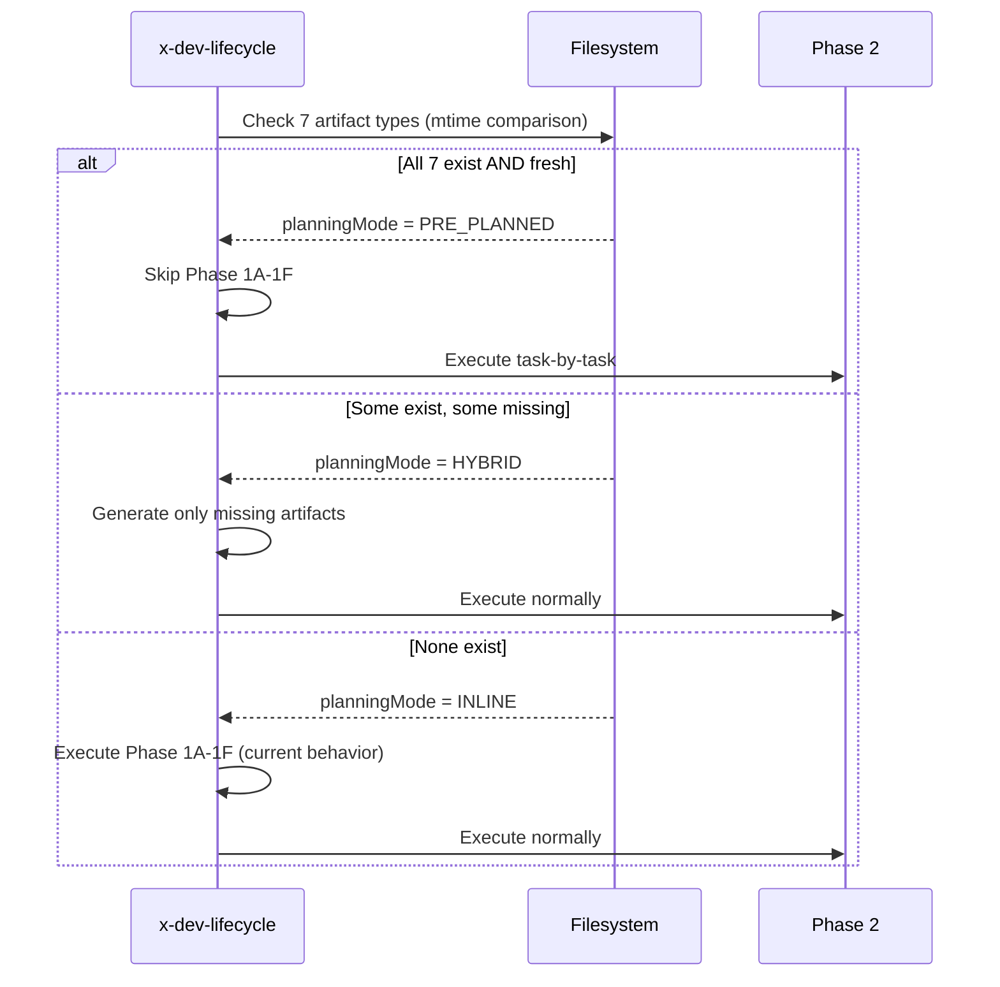

# História: x-dev-lifecycle — Modo PRE_PLANNED

**ID:** story-0028-0004
**Chave Jira:** —
**Status:** Pendente

## 1. Dependências

| Blocked By | Blocks |
| :--- | :--- |
| story-0028-0001 | story-0028-0006, story-0028-0007 |

## 2. Regras Transversais Aplicáveis

| ID | Título |
| :--- | :--- |
| RULE-001 | Backward Compatibility |
| RULE-002 | Padrão de Staleness (mtime) |

## 3. Descrição

Como **desenvolvedor**, eu quero que o `x-dev-lifecycle` detecte automaticamente quando planos foram gerados previamente por `/x-story-plan` e pule a geração redundante (Phase 1A-1F), implementando task-a-task usando os planos pré-existentes.

Esta história modifica 3 fases do `x-dev-lifecycle` existente:
- **Phase 0:** Adiciona detecção de modo PRE_PLANNED/HYBRID/INLINE baseada na presença e freshness de artefatos
- **Phase 2:** Quando PRE_PLANNED, implementa task-a-task lendo `task-plan-TASK-NNN-story-XXXX-YYYY.md` ao invés de seguir o fluxo genérico
- **Phase 8:** Atualiza status por task no story file e execution-state.json

### 3.1 Modos de Planejamento

| Modo | Condição | Comportamento |
| :--- | :--- | :--- |
| PRE_PLANNED | Todos 6 artefatos + per-task plans existem E são fresh | Pula Phase 1A-1F, Phase 2 task-by-task |
| HYBRID | Alguns artefatos existem mas não todos | Gera apenas os faltantes (comportamento atual) |
| INLINE | Nenhum artefato existe | Executa Phase 1A-1F como hoje (backward compatible) |

## 3.5 Entrega de Valor

- **Valor Principal:** Implementação task-a-task usando planos pré-existentes elimina geração redundante de 5 subagentes de planejamento, economizando tokens e tempo
- **Métrica de Sucesso:** Quando modo PRE_PLANNED detectado, Phase 1 é pulada completamente (0 subagentes lançados) e Phase 2 executa N tasks com commit atômico por task
- **Impacto no Negócio:** Economia de ~5 minutos e ~50k tokens por story ao eliminar planejamento redundante durante implementação

## 4. Definições de Qualidade Locais

### DoR Local (Definition of Ready)

- [ ] Templates com formato de task plan disponíveis (story-0028-0001)
- [ ] x-dev-lifecycle SKILL.md atual lido e compreendido (Phase 0, 1, 2, 8)
- [ ] Formato de per-task plans definido no plano de design

### DoD Local (Definition of Done)

- [ ] x-dev-lifecycle SKILL.md modificado com detecção de PRE_PLANNED/HYBRID/INLINE em Phase 0
- [ ] Phase 2 implementa task-by-task quando PRE_PLANNED (lê task-plan files)
- [ ] Phase 8 atualiza status por task no story file e execution-state
- [ ] Modo INLINE preservado integralmente (RULE-001)
- [ ] Commits atômicos por task: `feat(scope): implement TASK-NNN [TDD:RED|GREEN|REFACTOR]`
- [ ] Pelo menos 1 teste automatizado validando a presença das novas instruções no SKILL.md
- [ ] Smoke test: golden file match

### Global Definition of Done (DoD)

- **Cobertura:** ≥ 95% Line, ≥ 90% Branch
- **Testes Automatizados:** Unitários + golden file match
- **Documentação:** SKILL.md atualizado com seções PRE_PLANNED
- **TDD Compliance:** Test-first, refactoring explícito, TPP order
- **Double-Loop TDD:** Acceptance from Gherkin, unit by TPP

## 5. Contratos de Dados (Data Contract)

### 5.1 Artefatos Verificados em Phase 0

| # | Tipo de Artefato | Padrão de Arquivo | Phase que Gera |
| :--- | :--- | :--- | :--- |
| 1 | Architecture Plan | `architecture-story-XXXX-YYYY.md` | x-story-plan Phase 2A |
| 2 | Test Plan | `tests-story-XXXX-YYYY.md` | x-story-plan Phase 2B |
| 3 | Implementation Plan | `plan-story-XXXX-YYYY.md` | x-story-plan Phase 2A |
| 4 | Task Breakdown | `tasks-story-XXXX-YYYY.md` | x-story-plan Phase 4 |
| 5 | Security Assessment | `security-story-XXXX-YYYY.md` | x-story-plan Phase 2C |
| 6 | Compliance Assessment | `compliance-story-XXXX-YYYY.md` | x-story-plan Phase 2C |
| 7 | Per-Task Plans | `task-plan-TASK-*-story-XXXX-YYYY.md` | x-story-plan Phase 4 |

### 5.2 Commit Message Format (Phase 2 Task-by-Task)

| Campo | Formato | Exemplo |
| :--- | :--- | :--- |
| Prefix | `feat` ou `test` | `feat` |
| Scope | Story scope | `(auth)` |
| Description | `implement TASK-NNN` | `implement TASK-003` |
| TDD Marker | `[TDD:RED\|GREEN\|REFACTOR]` | `[TDD:GREEN]` |
| Full | Conventional Commit | `feat(auth): implement TASK-003 [TDD:GREEN]` |

## 6. Diagramas

### 6.1 Detecção de Modo em Phase 0



## 7. Critérios de Aceite (Gherkin)

```gherkin
Cenario: Sem artefatos pré-existentes usa modo INLINE
  DADO que nenhum artefato de planejamento existe para story-0028-0004
  QUANDO x-dev-lifecycle executa Phase 0
  ENTÃO planningMode é definido como "INLINE"
  E Phase 1A-1F são executadas normalmente
  E o log contém "Planning mode: INLINE"

Cenario: Todos artefatos fresh ativa modo PRE_PLANNED
  DADO que todos 7 tipos de artefatos existem para story-0028-0004
  E mtime(story) <= mtime(artefato) para todos
  QUANDO x-dev-lifecycle executa Phase 0
  ENTÃO planningMode é definido como "PRE_PLANNED"
  E Phase 1A-1F são PULADAS
  E o log contém "Planning mode: PRE_PLANNED — skipping Phase 1"

Cenario: Phase 2 executa task-by-task em modo PRE_PLANNED
  DADO que planningMode = PRE_PLANNED
  E tasks-story-XXXX-YYYY.md contém TASK-001, TASK-002, TASK-003
  QUANDO Phase 2 executa
  ENTÃO para cada TASK-NNN, o arquivo task-plan-TASK-NNN-story-XXXX-YYYY.md é lido
  E a implementação segue o Implementation Guide de cada task plan
  E um commit atômico é feito por task com formato "feat(scope): implement TASK-NNN [TDD:...]"

Cenario: Artefatos parciais ativam modo HYBRID
  DADO que architecture plan e test plan existem e são fresh
  MAS security assessment não existe
  QUANDO x-dev-lifecycle executa Phase 0
  ENTÃO planningMode é definido como "HYBRID"
  E apenas security assessment é gerada em Phase 1E
  E o log contém "Planning mode: HYBRID — generating 1 missing artifact(s)"

Cenario: Phase 8 atualiza status por task no story file
  DADO que Phase 2 completou tasks TASK-001 (DONE), TASK-002 (DONE), TASK-003 (DONE)
  QUANDO Phase 8 executa
  ENTÃO Section 8 do story file tem cada TASK-NNN marcado como concluído
  E execution-state.json tem tasks.TASK-NNN.status = "DONE" para cada task
```

## 8. Sub-tarefas

- [ ] [Dev] Modificar x-dev-lifecycle Phase 0 — adicionar detecção de PRE_PLANNED/HYBRID/INLINE
- [ ] [Dev] Modificar x-dev-lifecycle Phase 2 — implementar execução task-by-task para PRE_PLANNED
- [ ] [Dev] Modificar x-dev-lifecycle Phase 8 — atualizar status por task no story e execution-state
- [ ] [Dev] Manter modo INLINE intacto como fallback (RULE-001)
- [ ] [Test] Unitário: SKILL.md contém instruções de detecção de modo e task-by-task execution
- [ ] [Test] Integração: Golden file match do SKILL.md modificado
- [ ] [Test] Smoke/E2E: SKILL.md gerado pelo pipeline contém seções PRE_PLANNED
- [ ] [Doc] Documentar os 3 modos (PRE_PLANNED, HYBRID, INLINE) no SKILL.md
