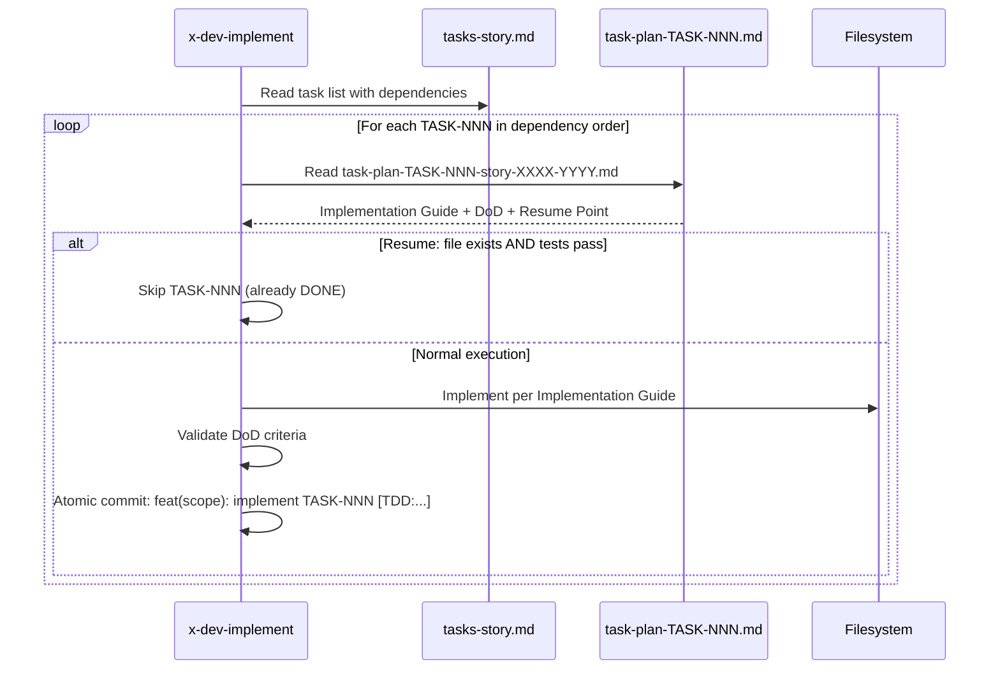

# História: x-dev-implement — Execução Task-Aware

**ID:** story-0028-0005
**Chave Jira:** —
**Status:** Pendente

## 1. Dependências

| Blocked By | Blocks |
| :--- | :--- |
| story-0028-0001 | story-0028-0006, story-0028-0007 |

## 2. Regras Transversais Aplicáveis

| ID | Título |
| :--- | :--- |
| RULE-001 | Backward Compatibility |
| RULE-002 | Padrão de Staleness (mtime) |

## 3. Descrição

Como **desenvolvedor**, eu quero que o `x-dev-implement` detecte per-task plans e execute o TDD loop iterando sobre TASK-NNN (na ordem de dependência) ao invés de UT-N, garantindo que cada task tenha seu plano individual com resume point para retomada.

Esta história modifica 2 steps do `x-dev-implement` existente:
- **Step 0 (Pre-check):** Adiciona detecção de task plans e task breakdown como artefatos reusáveis
- **Step 2 (TDD Loop):** Quando per-task plans existem, itera TASK-NNN ao invés de UT-N, usando o Implementation Guide e DoD de cada task plan

### 3.1 Backward Compatibility

Quando per-task plans NÃO existem, o comportamento atual é preservado integralmente:
- Mode A: Test-driven (itera UT-N do test plan)
- Mode B: Layer-based fallback (G1-G7)

### 3.2 Resume Point

Cada task plan contém uma seção "Resume Point" com instruções para retomada:
1. Verificar se o arquivo/classe do Implementation Guide existe
2. Se sim, rodar testes para verificar se a task está DONE
3. Se testes passam, pular para próxima task
4. Se testes falham ou arquivo não existe, recomeçar do Implementation Guide

## 3.5 Entrega de Valor

- **Valor Principal:** Implementação granular por task com resume point individual permite retomada exata de onde parou, eliminando retrabalho em caso de interrupção
- **Métrica de Sucesso:** Cada task implementada consulta seu task-plan individual, segue o Implementation Guide, e valida o DoD antes de marcar como DONE. Resume pula tasks já concluídas.
- **Impacto no Negócio:** Reduz custo de interrupções de "recomeçar a story" para "retomar da task N", economizando ~60% do tempo perdido

## 4. Definições de Qualidade Locais

### DoR Local (Definition of Ready)

- [ ] Templates de task plan disponíveis (story-0028-0001)
- [ ] x-dev-implement SKILL.md atual lido e compreendido (Step 0, Step 2)
- [ ] Formato de per-task plans e resume point definido no plano de design

### DoD Local (Definition of Done)

- [ ] x-dev-implement SKILL.md modificado com detecção de task plans em Step 0
- [ ] Step 2 itera TASK-NNN quando per-task plans existem
- [ ] Resume point funciona: tasks DONE são puladas, IN_PROGRESS retomam
- [ ] Fallback para Mode A/B quando per-task plans não existem (RULE-001)
- [ ] Pelo menos 1 teste automatizado validando a presença das novas instruções no SKILL.md
- [ ] Smoke test: golden file match

### Global Definition of Done (DoD)

- **Cobertura:** ≥ 95% Line, ≥ 90% Branch
- **Testes Automatizados:** Unitários + golden file match
- **Documentação:** SKILL.md atualizado
- **TDD Compliance:** Test-first, refactoring explícito, TPP order
- **Double-Loop TDD:** Acceptance from Gherkin, unit by TPP

## 5. Contratos de Dados (Data Contract)

### 5.1 Artefatos Detectados em Step 0 (Novos)

| # | Tipo de Artefato | Padrão de Arquivo | Context Injection |
| :--- | :--- | :--- | :--- |
| 4 | Task Plans | `task-plan-TASK-*-story-XXXX-YYYY.md` | "Use per-task plans for implementation sequence and DoD criteria" |
| 5 | Task Breakdown | `tasks-story-XXXX-YYYY.md` | "Use task breakdown for execution order and parallelism markers" |

### 5.2 Task Iteration Order (Step 2)

| Critério | Ordem |
| :--- | :--- |
| Dependências explícitas | Tasks sem dependências primeiro |
| TDD Phase | RED → GREEN → REFACTOR para cada componente |
| Parallelism marker | Tasks com `Parallel: yes` podem executar em qualquer ordem entre si |
| TPP Level | Dentro de tasks paralelas, seguir TPP: nil → constant → scalar → collection |

## 6. Diagramas

### 6.1 Step 2 — Task-Aware TDD Loop



## 7. Critérios de Aceite (Gherkin)

```gherkin
Cenario: Sem per-task plans usa fallback Mode A
  DADO que tests-story-0028-0005.md existe com UT-01, UT-02
  MAS nenhum arquivo task-plan-TASK-* existe
  QUANDO x-dev-implement executa Step 2
  ENTÃO o TDD loop itera sobre UT-01, UT-02 (Mode A: test-driven)
  E o log contém "No per-task plans found, using test-driven mode"

Cenario: Com per-task plans itera TASK-NNN
  DADO que tasks-story-0028-0005.md contém TASK-001, TASK-002, TASK-003
  E task-plan-TASK-001-story-0028-0005.md existe com Implementation Guide
  QUANDO x-dev-implement executa Step 2
  ENTÃO TASK-001 é implementada primeiro (seguindo Implementation Guide)
  E TASK-002 é implementada depois (respeitando dependência em TASK-001)
  E cada task produz um commit atômico

Cenario: Resume pula tasks já concluídas
  DADO que TASK-001 já foi implementada (classe existe E testes passam)
  E TASK-002 não foi implementada (classe não existe)
  QUANDO x-dev-implement executa Step 2 com resume
  ENTÃO TASK-001 é pulada com log "TASK-001: DONE (resume point verified)"
  E TASK-002 é implementada normalmente

Cenario: DoD de cada task é validado após implementação
  DADO que TASK-001 tem DoD ["imutável", "sem imports de infra"]
  QUANDO TASK-001 é implementada
  ENTÃO o DoD é verificado (imutabilidade + ausência de imports de infra)
  E se DoD falha, a task não é marcada como DONE

Cenario: Step 0 detecta task plans como artefatos reusáveis
  DADO que task-plan-TASK-001-story-0028-0005.md existe
  E mtime(story) <= mtime(task-plan)
  QUANDO x-dev-implement executa Step 0
  ENTÃO o artefato é marcado como "Reuse" com log "Found N per-task plans, using task-aware mode"
```

## 8. Sub-tarefas

- [ ] [Dev] Modificar x-dev-implement Step 0 — adicionar detecção de task plans e task breakdown
- [ ] [Dev] Modificar x-dev-implement Step 2 — implementar iteração por TASK-NNN com leitura de task-plan
- [ ] [Dev] Implementar resume point: verificar se task já concluída antes de executar
- [ ] [Dev] Manter fallback Mode A (test-driven) e Mode B (layer-based) intactos (RULE-001)
- [ ] [Test] Unitário: SKILL.md contém instruções de task-aware TDD loop
- [ ] [Test] Integração: Golden file match do SKILL.md modificado
- [ ] [Test] Smoke/E2E: SKILL.md gerado pelo pipeline contém seções task-aware
- [ ] [Doc] Documentar task iteration order e resume point no SKILL.md
