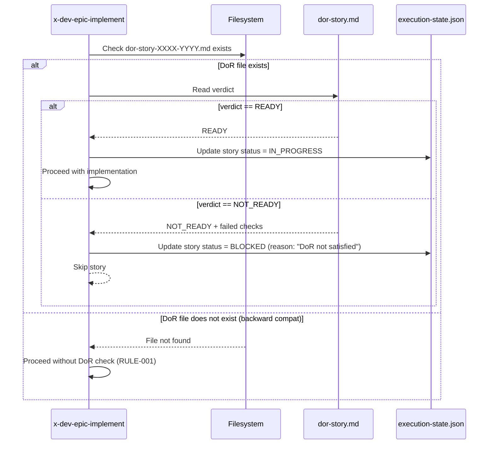

# História: x-dev-epic-implement — DoR Pre-check e Checkpoint Per-Task

**ID:** story-0028-0006
**Chave Jira:** —
**Status:** Pendente

## 1. Dependências

| Blocked By | Blocks |
| :--- | :--- |
| story-0028-0003, story-0028-0004, story-0028-0005 | story-0028-0007 |

## 2. Regras Transversais Aplicáveis

| ID | Título |
| :--- | :--- |
| RULE-001 | Backward Compatibility |
| RULE-002 | Padrão de Staleness (mtime) |
| RULE-004 | Convenção Flat de Arquivos |

## 3. Descrição

Como **desenvolvedor**, eu quero que o `x-dev-epic-implement` verifique o DoR de cada história antes de iniciar seu desenvolvimento e rastreie progresso por task individual, garantindo que histórias não planejadas não iniciem e que interrupções possam ser retomadas com granularidade de task.

Esta história modifica 2 áreas do `x-dev-epic-implement` existente:
- **Phase 0 (Pre-check):** Antes de executar uma story, verificar se `dor-story-XXXX-YYYY.md` existe e verdict = READY. Stories sem DoR são BLOCKED.
- **Resume:** Ao resumir, verifica status de tasks individuais no execution-state.json. Tasks DONE são puladas, IN_PROGRESS voltam para PENDING.

### 3.1 DoR Pre-check

Antes de despachar uma story para implementação:
1. Verificar se `dor-story-XXXX-YYYY.md` existe
2. Se existe, ler o verdict (READY/NOT_READY)
3. Se READY: proceder com implementação
4. Se NOT_READY ou inexistente: marcar story como BLOCKED com razão "DoR not satisfied"

### 3.2 Per-Task Checkpoint

O execution-state.json agora rastreia tasks dentro de cada story:
```json
{
  "stories": {
    "0028-0001": {
      "status": "IN_PROGRESS",
      "tasks": {
        "TASK-001": { "status": "DONE", "agent": "architect" },
        "TASK-002": { "status": "IN_PROGRESS", "agent": "qa-engineer" }
      }
    }
  }
}
```

## 3.5 Entrega de Valor

- **Valor Principal:** Impede início de desenvolvimento em histórias não planejadas e permite tracking granular de progresso por task, habilitando retomada precisa em caso de falha
- **Métrica de Sucesso:** Stories sem DoR READY são automaticamente BLOCKED. Resume de épico retoma da task exata (não da story inteira), medido por tasks puladas vs re-executadas.
- **Impacto no Negócio:** Elimina desperdício de implementar stories sem planejamento adequado e reduz custo de retomada de épicos interrompidos

## 4. Definições de Qualidade Locais

### DoR Local (Definition of Ready)

- [ ] x-epic-plan (story-0028-0003) implementado — gera dor-story files
- [ ] x-dev-lifecycle (story-0028-0004) implementado — modo PRE_PLANNED
- [ ] x-dev-implement (story-0028-0005) implementado — task-aware execution
- [ ] execution-state.json com campo tasks (story-0028-0001)

### DoD Local (Definition of Done)

- [ ] x-dev-epic-implement SKILL.md modificado com DoR pre-check em Phase 0
- [ ] Stories sem DoR READY são automaticamente BLOCKED
- [ ] execution-state.json rastreia tasks individuais por story
- [ ] Resume com granularidade de task: DONE puladas, IN_PROGRESS → PENDING
- [ ] Backward compatible quando dor-story files não existem (RULE-001)
- [ ] Pelo menos 1 teste automatizado validando a presença das novas instruções
- [ ] Smoke test: golden file match

### Global Definition of Done (DoD)

- **Cobertura:** ≥ 95% Line, ≥ 90% Branch
- **Testes Automatizados:** Unitários + golden file match
- **Documentação:** SKILL.md atualizado
- **TDD Compliance:** Test-first, refactoring explícito, TPP order
- **Double-Loop TDD:** Acceptance from Gherkin, unit by TPP

## 5. Contratos de Dados (Data Contract)

### 5.1 DoR Pre-check Input

| Campo | Tipo | M/O | Validações | Exemplo |
| :--- | :--- | :--- | :--- | :--- |
| `dor_file_path` | `String` | M | Pattern: `dor-story-XXXX-YYYY.md` | `plans/epic-0028/plans/dor-story-0028-0001.md` |
| `verdict` | `Enum` | M | READY, NOT_READY | `READY` |

### 5.2 Task Status em execution-state.json

| Status | Significado | Transições Permitidas |
| :--- | :--- | :--- |
| `PENDING` | Task não iniciada | → IN_PROGRESS |
| `IN_PROGRESS` | Task em execução | → DONE, → PENDING (resume) |
| `DONE` | Task concluída com commit | Terminal |
| `BLOCKED` | Task bloqueada por dependência | → PENDING (quando dependência DONE) |
| `SKIPPED` | Task pulada (N/A para esta story) | Terminal |

### 5.3 Task Entry em execution-state.json

| Campo | Tipo | M/O | Descrição |
| :--- | :--- | :--- | :--- |
| `status` | `TaskStatus` | M | Status da task |
| `agent` | `String` | M | Agente que propôs a task |
| `type` | `String` | M | DEV, TEST, SEC, QUALITY, VALIDATION |
| `commitSha` | `String` | O | SHA do commit que completou a task (quando DONE) |
| `duration` | `Long` | O | Duração em ms (quando DONE) |

## 6. Diagramas

### 6.1 DoR Pre-check Flow



## 7. Critérios de Aceite (Gherkin)

```gherkin
Cenario: Story sem DoR file é executada normalmente (backward compat)
  DADO que dor-story-0028-0004.md NÃO existe
  QUANDO x-dev-epic-implement avalia story-0028-0004 para execução
  ENTÃO a story é executada normalmente (sem bloqueio)
  E o log contém "No DoR file found, proceeding without DoR check (backward compatible)"

Cenario: Story com DoR READY prossegue para implementação
  DADO que dor-story-0028-0004.md existe com verdict = "READY"
  QUANDO x-dev-epic-implement avalia story-0028-0004 para execução
  ENTÃO a story prossegue para implementação
  E execution-state.json atualiza status para IN_PROGRESS

Cenario: Story com DoR NOT_READY é bloqueada
  DADO que dor-story-0028-0004.md existe com verdict = "NOT_READY"
  E failed_checks contém "Test plan ausente"
  QUANDO x-dev-epic-implement avalia story-0028-0004 para execução
  ENTÃO a story é marcada como BLOCKED em execution-state.json
  E a razão do bloqueio é "DoR not satisfied: Test plan ausente"
  E a story é pulada

Cenario: Resume retoma da task exata
  DADO que execution-state.json tem story-0028-0001 com tasks:
    | TASK-001 | DONE |
    | TASK-002 | IN_PROGRESS |
    | TASK-003 | PENDING |
  QUANDO x-dev-epic-implement é invocado com --resume
  ENTÃO TASK-001 é pulada (status DONE)
  E TASK-002 é reclassificada para PENDING (interrompida)
  E TASK-002 e TASK-003 são executadas

Cenario: Tasks com dependências BLOCKED são reavaliadas
  DADO que TASK-003 depende de TASK-002
  E TASK-002 estava BLOCKED
  E TASK-002 agora está DONE após resume
  QUANDO as tasks são reavaliadas
  ENTÃO TASK-003 é reclassificada de BLOCKED para PENDING
  E TASK-003 pode ser executada
```

## 8. Sub-tarefas

- [ ] [Dev] Modificar x-dev-epic-implement Phase 0 — adicionar DoR pre-check antes de cada story
- [ ] [Dev] Implementar lógica de BLOCKED quando DoR = NOT_READY
- [ ] [Dev] Implementar backward compatibility quando dor file não existe (RULE-001)
- [ ] [Dev] Adicionar per-task tracking em execution-state.json
- [ ] [Dev] Modificar resume logic para granularidade de task (DONE puladas, IN_PROGRESS → PENDING)
- [ ] [Dev] Reavaliar tasks BLOCKED quando dependências mudam para DONE
- [ ] [Test] Unitário: SKILL.md contém instruções de DoR pre-check e per-task checkpoint
- [ ] [Test] Integração: Golden file match do SKILL.md modificado
- [ ] [Test] Smoke/E2E: SKILL.md gerado pelo pipeline contém seções DoR e per-task
- [ ] [Doc] Documentar DoR pre-check e per-task checkpoint no SKILL.md
