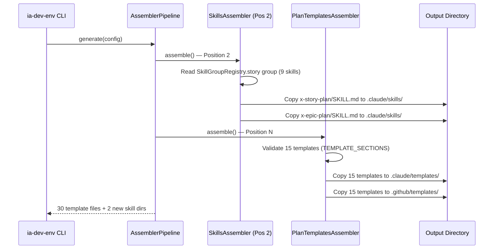

# História: Gerador — Registro de Skills, Templates e Golden Files

**ID:** story-0028-0007
**Chave Jira:** —
**Status:** Pendente

## 1. Dependências

| Blocked By | Blocks |
| :--- | :--- |
| story-0028-0001, story-0028-0002, story-0028-0003 | — |

## 2. Regras Transversais Aplicáveis

| ID | Título |
| :--- | :--- |
| RULE-003 | Template Verbatim Copy |

## 3. Descrição

Como **desenvolvedor usando ia-dev-env**, eu quero que o gerador Java registre as 2 novas skills (`x-story-plan`, `x-epic-plan`) e os 3 novos templates no pipeline de geração, garantindo que todos os projetos gerados tenham acesso às novas capacidades de planejamento multi-agente.

Esta história modifica 2 classes Java do gerador e seus testes correspondentes, além de regenerar todos os golden files para validar byte-for-byte match.

### 3.1 SkillGroupRegistry

Adicionar `x-story-plan` e `x-epic-plan` ao grupo `story` (7 → 9 skills).

### 3.2 PlanTemplatesAssembler

Adicionar 3 novos templates (`_TEMPLATE-TASK-PLAN.md`, `_TEMPLATE-STORY-PLANNING-REPORT.md`, `_TEMPLATE-DOR-CHECKLIST.md`) ao mapa de seções obrigatórias. TEMPLATE_COUNT: 12 → 15.

### 3.3 Golden Files

Regenerar todos os 17 golden directories para incluir novos skills e templates. Total estimado: ~272 novos/modificados golden files.

## 3.5 Entrega de Valor

- **Valor Principal:** Novas skills e templates de planejamento multi-agente disponíveis em TODOS os projetos gerados pelo ia-dev-env, validado por golden files em 17 profiles
- **Métrica de Sucesso:** `mvn test` passa com 0 falhas. Golden files byte-for-byte match para todos os 17 profiles. TEMPLATE_COUNT = 15. Story group size = 9.
- **Impacto no Negócio:** Qualquer projeto que use ia-dev-env ganha automaticamente as capacidades de planejamento multi-agente ao regenerar seu `.claude/` directory

## 4. Definições de Qualidade Locais

### DoR Local (Definition of Ready)

- [ ] 3 novos templates criados em shared/templates/ (story-0028-0001)
- [ ] x-story-plan SKILL.md criado em targets/claude/skills/core/ (story-0028-0002)
- [ ] x-epic-plan SKILL.md criado em targets/claude/skills/core/ (story-0028-0003)

### DoD Local (Definition of Done)

- [ ] SkillGroupRegistry.java atualizado — story group: 7 → 9 skills
- [ ] PlanTemplatesAssembler.java atualizado — TEMPLATE_COUNT: 12 → 15 com 3 novas entradas em buildTemplateSections()
- [ ] SkillGroupRegistryTest.java atualizado — assertion hasSize(7) → hasSize(9)
- [ ] PlanTemplatesAssemblerTest.java atualizado — assertions 12 → 15, 24 → 30
- [ ] Todos os 17 golden directories regenerados
- [ ] `mvn test` passa com 0 falhas
- [ ] Pelo menos 1 teste automatizado validando as novas entradas no registry e assembler
- [ ] Smoke test: `mvn test -Dtest=*Golden*` passa

### Global Definition of Done (DoD)

- **Cobertura:** ≥ 95% Line, ≥ 90% Branch
- **Testes Automatizados:** Unitários para SkillGroupRegistry e PlanTemplatesAssembler + golden file validation
- **Relatório de Cobertura:** JaCoCo XML
- **Documentação:** CLAUDE.md atualizado com contagem correta de skills e templates
- **Performance:** Golden file regeneration em < 60s por profile
- **TDD Compliance:** Test-first, refactoring explícito, TPP order
- **Double-Loop TDD:** Acceptance from Gherkin, unit by TPP

## 5. Contratos de Dados (Data Contract)

### 5.1 SkillGroupRegistry — Story Group

| Campo | Valor Atual | Novo Valor |
| :--- | :--- | :--- |
| Group name | `"story"` | `"story"` (inalterado) |
| Skills count | 7 | 9 |
| New entries | — | `"x-story-plan"`, `"x-epic-plan"` |
| Position | Após `x-story-epic-full`, antes de `story-planning` | Após `x-story-epic-full`, antes de `story-planning` |

### 5.2 PlanTemplatesAssembler — Novas Entradas

| Template | Seções Obrigatórias | Count |
| :--- | :--- | :--- |
| `_TEMPLATE-TASK-PLAN.md` | Header, Objective, Implementation Guide, Definition of Done, Dependencies, Estimated Effort, Risks | 7 |
| `_TEMPLATE-STORY-PLANNING-REPORT.md` | Header, Planning Summary, Architecture Assessment, Test Strategy Summary, Security Assessment Summary, Implementation Approach, Task Breakdown Summary, Consolidated Risk Matrix, DoR Status | 9 |
| `_TEMPLATE-DOR-CHECKLIST.md` | Header, Architecture Readiness, Test Readiness, Security Readiness, Implementation Readiness, Task Decomposition Readiness, Blockers and Open Questions, Final Verdict | 8 |

### 5.3 Golden Files — Impacto Estimado

| Tipo | Operação | Quantidade |
| :--- | :--- | :--- |
| Novos templates | CRIAR | 102 (3 templates × 17 dirs × 2 targets) |
| Template modificado | ATUALIZAR | 34 (_TEMPLATE-TASK-BREAKDOWN.md × 17 dirs × 2 targets) |
| Novas skills | CRIAR | ~136 (2 skills × 17 dirs × 4 targets) |
| **Total** | — | **~272 arquivos** |

## 6. Diagramas

### 6.1 Pipeline de Geração com Novos Artefatos



## 7. Critérios de Aceite (Gherkin)

```gherkin
Cenario: SkillGroupRegistry story group vazio falha
  DADO que o grupo "story" no SkillGroupRegistry está vazio
  QUANDO o teste de tamanho executa
  ENTÃO o teste falha com assertion error

Cenario: SkillGroupRegistry story group tem 9 skills
  DADO que SkillGroupRegistry foi atualizado
  QUANDO o grupo "story" é consultado
  ENTÃO a lista contém exatamente 9 skills
  E "x-story-plan" está na posição após "x-story-epic-full"
  E "x-epic-plan" está na posição após "x-story-plan"

Cenario: PlanTemplatesAssembler processa 15 templates
  DADO que TEMPLATE_COUNT = 15
  E TEMPLATE_SECTIONS contém 15 entradas
  E todos os 15 templates existem em shared/templates/
  QUANDO PlanTemplatesAssembler.assemble() executa
  ENTÃO 30 arquivos são gerados (15 × 2 targets)
  E nenhum template é omitido

Cenario: Novo template sem seção obrigatória falha validação
  DADO que "_TEMPLATE-TASK-PLAN.md" existe mas não contém heading "## Objective"
  QUANDO PlanTemplatesAssembler valida o template
  ENTÃO a validação falha indicando seção ausente "Objective"

Cenario: Golden files match byte-for-byte após regeneração
  DADO que todos os 17 golden directories foram regenerados
  QUANDO o teste de golden file comparison executa
  ENTÃO todos os arquivos gerados são idênticos byte-for-byte aos golden files
  E o teste passa com 0 falhas

Cenario: Skills novas aparecem no output gerado
  DADO que o gerador é executado para o profile java-quarkus
  QUANDO o output é inspecionado
  ENTÃO .claude/skills/x-story-plan/SKILL.md existe
  E .claude/skills/x-epic-plan/SKILL.md existe
  E .github/skills/x-story-plan/SKILL.md existe
  E .github/skills/x-epic-plan/SKILL.md existe
```

## 8. Sub-tarefas

- [ ] [Dev] Atualizar `SkillGroupRegistry.java` — adicionar `x-story-plan` e `x-epic-plan` ao grupo story (line 44-49)
- [ ] [Dev] Atualizar `PlanTemplatesAssembler.java` — TEMPLATE_COUNT 12→15, adicionar 3 entradas em buildTemplateSections()
- [ ] [Test] Unitário: `SkillGroupRegistryTest` — assertion story group hasSize(9)
- [ ] [Test] Unitário: `PlanTemplatesAssemblerTest` — assertions 12→15, 24→30, 3 novos template names
- [ ] [Dev] Regenerar todos os 17 golden directories via `ia-dev-env generate`
- [ ] [Test] Integração: `mvn test -Dtest=*Golden*` — byte-for-byte match
- [ ] [Test] Smoke/E2E: `mvn test` completo — 0 falhas
- [ ] [Doc] Atualizar CLAUDE.md com contagem correta de skills (28 → 30) e templates (12 → 15)
