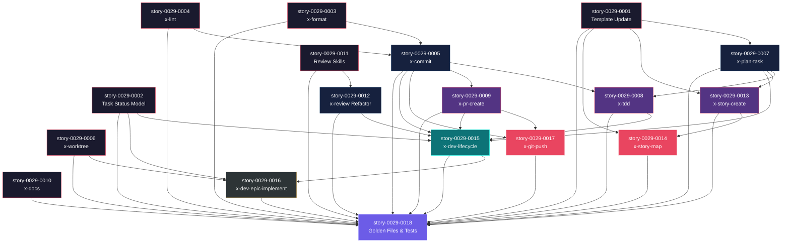

# Mapa de Implementação — Task-Centric Workflow Overhaul

**Gerado a partir das dependências BlockedBy/Blocks de cada história do epic-0029.**

---

## 1. Matriz de Dependências

| Story | Título | Chave Jira | Blocked By | Blocks | Status |
| :--- | :--- | :--- | :--- | :--- | :--- |
| story-0029-0001 | Formal Task Definition & Story Template Update | — | — | story-0029-0007, story-0029-0013, story-0029-0014 | Pendente |
| story-0029-0002 | Task Status Model & Execution State Schema | — | — | story-0029-0015, story-0029-0016 | Pendente |
| story-0029-0003 | x-format — Code Formatting Skill | — | — | story-0029-0005 | Pendente |
| story-0029-0004 | x-lint — Code Linting Skill | — | — | story-0029-0005 | Pendente |
| story-0029-0005 | x-commit — Conventional Commit Skill | — | story-0029-0003, story-0029-0004 | story-0029-0008, story-0029-0009, story-0029-0015, story-0029-0017 | Pendente |
| story-0029-0006 | x-worktree — Git Worktree Management Skill | — | — | story-0029-0016 | Pendente |
| story-0029-0007 | x-plan-task — Task Planning Skill | — | story-0029-0001 | story-0029-0008, story-0029-0013 | Pendente |
| story-0029-0008 | x-tdd — TDD Execution Skill | — | story-0029-0005, story-0029-0007 | story-0029-0015 | Pendente |
| story-0029-0009 | x-pr-create — Task PR Creation Skill | — | story-0029-0005 | story-0029-0015, story-0029-0017 | Pendente |
| story-0029-0010 | x-docs — Documentation Skill | — | — | — | Pendente |
| story-0029-0011 | Individual Review Skills Extraction | — | — | story-0029-0012 | Pendente |
| story-0029-0012 | x-review Orchestrator Refactor | — | story-0029-0011 | story-0029-0015 | Pendente |
| story-0029-0013 | x-story-create — Testable Tasks & Value Delivery | — | story-0029-0001, story-0029-0007 | story-0029-0014 | Pendente |
| story-0029-0014 | x-story-map — Task-Level Dependency Graph | — | story-0029-0001, story-0029-0013 | — | Pendente |
| story-0029-0015 | x-dev-lifecycle — Task-Centric Workflow | — | story-0029-0002, story-0029-0005, story-0029-0007, story-0029-0008, story-0029-0009, story-0029-0012 | story-0029-0016 | Pendente |
| story-0029-0016 | x-dev-epic-implement — Auto-Approve & Task Tracking | — | story-0029-0002, story-0029-0006, story-0029-0015 | story-0029-0018 | Pendente |
| story-0029-0017 | x-git-push — Task Branch Naming & Conventions | — | story-0029-0005, story-0029-0009 | — | Pendente |
| story-0029-0018 | Golden File Regeneration & Integration Tests | — | story-0029-0001 a story-0029-0017 | — | Pendente |

> **Nota:** story-0029-0018 depende de TODAS as 17 stories anteriores, pois regenera golden files que refletem todas as mudanças. story-0029-0010 e story-0029-0006 são folhas independentes sem dependências, maximizando paralelismo na Fase 0.

---

## 2. Fases de Implementação

> As histórias são agrupadas em fases. Dentro de cada fase, as histórias podem ser implementadas **em paralelo**. Uma fase só pode iniciar quando todas as dependências das fases anteriores estiverem concluídas.

```
╔══════════════════════════════════════════════════════════════════════════════════════╗
║                        FASE 0 — Foundation (7 paralelas)                            ║
║                                                                                     ║
║  ┌──────────┐ ┌──────────┐ ┌──────────┐ ┌──────────┐ ┌──────────┐ ┌──────────┐ ┌──────────┐
║  │  0001    │ │  0002    │ │  0003    │ │  0004    │ │  0006    │ │  0010    │ │  0011    │
║  │ Template │ │ TaskModel│ │ x-format │ │ x-lint   │ │ x-worktree│ │ x-docs   │ │ Reviews  │
║  └────┬─────┘ └────┬─────┘ └────┬─────┘ └────┬─────┘ └────┬─────┘ └──────────┘ └────┬─────┘
╚═══════╪════════════╪════════════╪════════════╪════════════╪═════════════════════════╪═════╝
        │            │            │            │            │                         │
        ▼            │            ▼            ▼            │                         ▼
╔══════════════════════════════════════════════════════════════════════════════════════╗
║                        FASE 1 — Core Skills (3 paralelas)                           ║
║                                                                                     ║
║  ┌──────────────────┐  ┌──────────────────┐  ┌──────────────────┐                   ║
║  │  0005            │  │  0007            │  │  0012            │                   ║
║  │ x-commit         │  │ x-plan-task      │  │ x-review refactor│                   ║
║  │ (← 0003, 0004)   │  │ (← 0001)         │  │ (← 0011)         │                   ║
║  └──────┬───────────┘  └──────┬───────────┘  └──────┬───────────┘                   ║
╚═════════╪══════════════════════╪══════════════════════╪══════════════════════════════╝
          │                      │                      │
          ▼                      ▼                      │
╔══════════════════════════════════════════════════════════════════════════════════════╗
║                       FASE 2 — Workers (3 paralelas)                                ║
║                                                                                     ║
║  ┌──────────────────┐  ┌──────────────────┐  ┌──────────────────┐                   ║
║  │  0008            │  │  0009            │  │  0013            │                   ║
║  │ x-tdd            │  │ x-pr-create      │  │ x-story-create   │                   ║
║  │ (← 0005, 0007)   │  │ (← 0005)         │  │ (← 0001, 0007)   │                   ║
║  └──────┬───────────┘  └──────┬───────────┘  └──────┬───────────┘                   ║
╚═════════╪══════════════════════╪══════════════════════╪══════════════════════════════╝
          │                      │                      │
          │                      ▼                      ▼
╔══════════════════════════════════════════════════════════════════════════════════════╗
║                   FASE 3 — Compositions (2 paralelas)                               ║
║                                                                                     ║
║  ┌──────────────────┐  ┌──────────────────┐                                         ║
║  │  0014            │  │  0017            │                                         ║
║  │ x-story-map      │  │ x-git-push       │                                         ║
║  │ (← 0001, 0013)   │  │ (← 0005, 0009)   │                                         ║
║  └──────────────────┘  └──────────────────┘                                         ║
╚══════════════════════════════════════════════════════════════════════════════════════╝
          │
          ▼
╔══════════════════════════════════════════════════════════════════════════════════════╗
║                   FASE 4 — Lifecycle Rewrite (1 história)                           ║
║                                                                                     ║
║  ┌──────────────────────────────────────────────────────────────────┐               ║
║  │  0015                                                            │               ║
║  │ x-dev-lifecycle — Task-Centric Workflow (MAJOR REWRITE)          │               ║
║  │ (← 0002, 0005, 0007, 0008, 0009, 0012)                          │               ║
║  └──────────────────────────────┬───────────────────────────────────┘               ║
╚═════════════════════════════════╪════════════════════════════════════════════════════╝
                                  │
                                  ▼
╔══════════════════════════════════════════════════════════════════════════════════════╗
║                   FASE 5 — Epic Orchestrator (1 história)                           ║
║                                                                                     ║
║  ┌──────────────────────────────────────────────────────────────────┐               ║
║  │  0016                                                            │               ║
║  │ x-dev-epic-implement — Auto-Approve & Task Tracking              │               ║
║  │ (← 0002, 0006, 0015)                                             │               ║
║  └──────────────────────────────┬───────────────────────────────────┘               ║
╚═════════════════════════════════╪════════════════════════════════════════════════════╝
                                  │
                                  ▼
╔══════════════════════════════════════════════════════════════════════════════════════╗
║                   FASE 6 — Validation (1 história)                                  ║
║                                                                                     ║
║  ┌──────────────────────────────────────────────────────────────────┐               ║
║  │  0018                                                            │               ║
║  │ Golden File Regeneration & Integration Tests                     │               ║
║  │ (← TODAS as 17 stories anteriores)                               │               ║
║  └──────────────────────────────────────────────────────────────────┘               ║
╚══════════════════════════════════════════════════════════════════════════════════════╝
```

---

## 3. Caminho Crítico

> O caminho crítico (a sequência mais longa de dependências) determina o tempo mínimo de implementação do projeto.

```
0003/0004 ─┐
           ├──→ 0005 ──→ 0008 ──┐
0001 ──→ 0007 ──┘               ├──→ 0015 ──→ 0016 ──→ 0018
                   0011 ──→ 0012 ─┘
   Fase 0     Fase 1   Fase 2     Fase 4    Fase 5    Fase 6
```

**7 fases no caminho crítico (0→1→2→4→5→6), 7 histórias na cadeia mais longa (0003 → 0005 → 0008 → 0015 → 0016 → 0018).**

O caminho crítico passa pelas skills atômicas de desenvolvimento (format, commit, TDD) e culmina nas reescritas dos orquestradores (lifecycle, epic). Atrasos em qualquer dessas stories impactam diretamente a entrega do épico.

Note que a Fase 3 (0014, 0017) NÃO está no caminho crítico — essas stories podem absorver atrasos sem impacto na entrega final.

---

## 4. Grafo de Dependências (Mermaid)



---

## 5. Resumo por Fase

| Fase | Histórias | Camada | Paralelismo | Pré-requisito |
| :--- | :--- | :--- | :--- | :--- |
| 0 | 0001, 0002, 0003, 0004, 0006, 0010, 0011 | Foundation | 7 paralelas | — |
| 1 | 0005, 0007, 0012 | Core | 3 paralelas | Fase 0 (parcial: deps específicas) |
| 2 | 0008, 0009, 0013 | Workers | 3 paralelas | Fase 1 (parcial) |
| 3 | 0014, 0017 | Compositions | 2 paralelas | Fase 2 (parcial) |
| 4 | 0015 | Lifecycle | 1 (gargalo) | Fases 0-2 completas + 0012 |
| 5 | 0016 | Epic Orchestrator | 1 (gargalo) | Fase 4 + 0006 |
| 6 | 0018 | Validation | 1 (final) | TODAS as anteriores |

**Total: 18 histórias em 7 fases.**

> **Nota:** As Fases 0-3 permitem alto paralelismo (até 7 stories simultâneas). As Fases 4-6 são gargalos seriais — a reescrita do lifecycle (0015) e do epic orchestrator (0016) são as stories mais complexas e devem receber atenção prioritária. A Fase 3 (0014, 0017) pode ser executada em paralelo com a Fase 2 após suas deps serem satisfeitas.

---

## 6. Detalhamento por Fase

### Fase 0 — Foundation

| Story | Escopo Principal | Artefatos Chave |
| :--- | :--- | :--- |
| story-0029-0001 | Formato formal de tasks no template de story | `_TEMPLATE-STORY.md` (Section 8), `story-decomposition.md` (SD-12, SD-13) |
| story-0029-0002 | Modelo de status e estado de execução por task | `TaskEntry.java`, `TaskStatus.java`, `StoryEntry.java`, `_TEMPLATE-EXECUTION-STATE.json` |
| story-0029-0003 | Skill de formatação de código multi-linguagem | `core/x-format/SKILL.md` |
| story-0029-0004 | Skill de linting de código multi-linguagem | `core/x-lint/SKILL.md` |
| story-0029-0006 | Skill de gerenciamento de worktrees | `core/x-worktree/SKILL.md` |
| story-0029-0010 | Skill de documentação automática | `core/x-docs/SKILL.md` |
| story-0029-0011 | Extração de 6 skills de review individuais | `core/x-review-qa/SKILL.md`, `core/x-review-perf/SKILL.md`, `conditional/x-review-db/SKILL.md`, `conditional/x-review-obs/SKILL.md`, `conditional/x-review-devops/SKILL.md`, `conditional/x-review-data-modeling/SKILL.md` |

**Entregas da Fase 0:**

- Template de story com tasks formais (TASK-XXXX-YYYY-NNN) e regras de testabilidade
- TaskStatus enum e TaskEntry record para rastreamento granular
- 4 skills novas independentes (format, lint, worktree, docs)
- 6 skills de review individuais extraídas do x-review monolítico

### Fase 1 — Core Skills

| Story | Escopo Principal | Artefatos Chave |
| :--- | :--- | :--- |
| story-0029-0005 | Skill de commit com pre-commit chain e task ID | `core/x-commit/SKILL.md` |
| story-0029-0007 | Skill de planejamento por task com TDD mapping | `core/x-plan-task/SKILL.md` |
| story-0029-0012 | Refatoração do orquestrador de review | `core/x-review/SKILL.md` (modificado) |

**Entregas da Fase 1:**

- Pre-commit chain completo: format → lint → compile → commit
- Planejamento detalhado por task com ciclos TDD mapeados
- Orquestrador de review simplificado delegando para skills individuais

### Fase 2 — Workers

| Story | Escopo Principal | Artefatos Chave |
| :--- | :--- | :--- |
| story-0029-0008 | Skill de execução TDD com ciclos atômicos | `core/x-tdd/SKILL.md` |
| story-0029-0009 | Skill de criação de PR por task | `core/x-pr-create/SKILL.md` |
| story-0029-0013 | Geração de stories com tasks testáveis | `core/x-story-create/SKILL.md` (modificado) |

**Entregas da Fase 2:**

- Ciclos Red-Green-Refactor com commits atômicos via x-commit
- PRs padronizados com task ID, labels e referências
- Stories geradas com tasks formais, testáveis e com valor de negócio

### Fase 3 — Compositions

| Story | Escopo Principal | Artefatos Chave |
| :--- | :--- | :--- |
| story-0029-0014 | Grafo de dependências no nível de tasks | `core/x-story-map/SKILL.md` (modificado), `_TEMPLATE-IMPLEMENTATION-MAP.md` |
| story-0029-0017 | Convenções de branch e PR task-centric | `core/x-git-push/SKILL.md` (modificado) |

**Entregas da Fase 3:**

- Implementation map com Section 8 (task dependencies, merge order, Mermaid graph)
- Branch naming, commit scope e PR format atualizados para tasks

### Fase 4 — Lifecycle Rewrite

| Story | Escopo Principal | Artefatos Chave |
| :--- | :--- | :--- |
| story-0029-0015 | Reescrita do lifecycle para PRs por task | `core/x-dev-lifecycle/SKILL.md` (MAJOR REWRITE) |

**Entregas da Fase 4:**

- Phase 2 reescrita como Task Execution Loop com approval gates
- Phase 3 absorve Phases 3-8 antigos como Story-Level Verification
- Flag --auto-approve-pr com branch-mãe

### Fase 5 — Epic Orchestrator

| Story | Escopo Principal | Artefatos Chave |
| :--- | :--- | :--- |
| story-0029-0016 | Auto-approve e task tracking no epic orchestrator | `core/x-dev-epic-implement/SKILL.md` (modificado) |

**Entregas da Fase 5:**

- Propagação de --auto-approve-pr para x-dev-lifecycle
- Task-level state tracking no execution-state.json
- Batch approval prompts para stories paralelas

### Fase 6 — Validation

| Story | Escopo Principal | Artefatos Chave |
| :--- | :--- | :--- |
| story-0029-0018 | Regeneração de golden files e testes | Golden files (8 perfis), `SkillGroupRegistry.java`, `SkillsSelection.java` |

**Entregas da Fase 6:**

- Golden files regenerados para 8 perfis
- Testes de integração para todas as mudanças
- SkillGroupRegistry e SkillsSelection atualizados

---

## 7. Observações Estratégicas

### Gargalo Principal

**story-0029-0015 (x-dev-lifecycle)** é o maior gargalo do épico. Esta story depende de 6 outras stories (0002, 0005, 0007, 0008, 0009, 0012) e bloqueia story-0029-0016. É uma reescrita major do workflow principal (~742 linhas). Investir mais tempo na qualidade desta implementação compensa — qualquer bug aqui cascateia para o epic orchestrator.

### Histórias Folha (sem dependentes)

- **story-0029-0010** (x-docs): Independente, sem bloqueios. Candidata ideal para paralelismo.
- **story-0029-0014** (x-story-map): Não bloqueia nenhuma outra. Pode absorver atrasos.
- **story-0029-0017** (x-git-push): Não bloqueia nenhuma outra. Pode absorver atrasos.
- **story-0029-0018** (Golden Files): Terminal — depende de tudo, não bloqueia nada.

### Otimização de Tempo

- **Máximo paralelismo na Fase 0**: 7 stories podem começar imediatamente. Alocar equipes/agentes para todas.
- **Fases 1-3 parcialmente paralelizáveis**: story-0029-0005 pode começar assim que 0003+0004 terminam, sem esperar toda a Fase 0.
- **Fases 4-6 são seriais**: Nenhuma otimização possível — são dependências genuínas.
- **story-0029-0010 e story-0029-0006** podem começar e terminar a qualquer momento, desde que estejam prontas antes da Fase 6.

### Dependências Cruzadas

**Ponto de convergência principal: story-0029-0015** — converge 3 ramos independentes:
1. Ramo template: 0001 → 0007 → 0008
2. Ramo commit: 0003/0004 → 0005 → 0009
3. Ramo review: 0011 → 0012

Todos devem estar completos antes de iniciar a reescrita do lifecycle.

**Ponto de convergência secundário: story-0029-0016** — converge o lifecycle (0015) com worktree (0006) e task model (0002). A story 0006 é independente e pode ser implementada em qualquer momento antes da Fase 5.

### Marco de Validação Arquitetural

**story-0029-0005 (x-commit)** serve como checkpoint de validação. Quando concluída, valida que:
- O pre-commit chain (format → lint → compile → commit) funciona end-to-end
- O formato de commit com task ID está correto
- As skills x-format e x-lint integram corretamente

Se esta story funcionar, as stories downstream (x-tdd, x-pr-create, lifecycle) podem ser construídas com confiança sobre a fundação.
