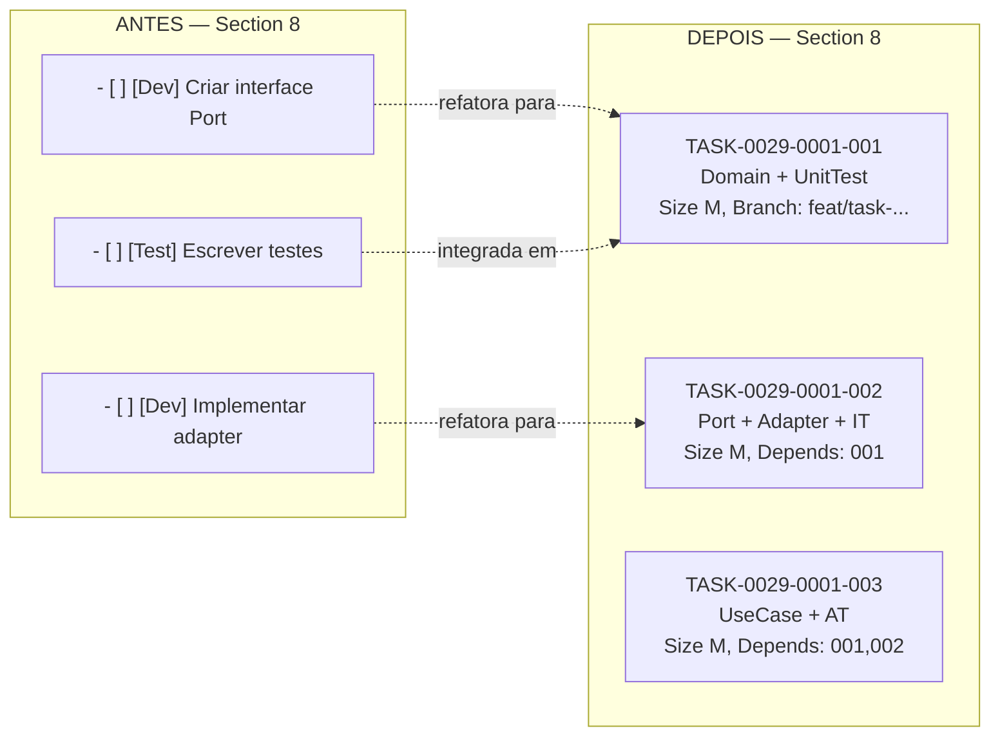
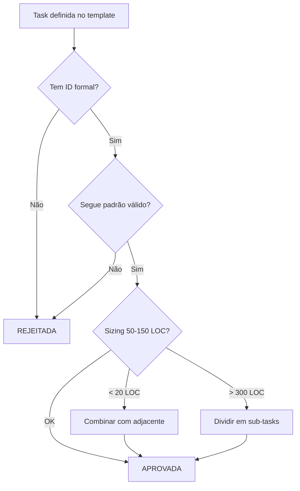

# História: Formal Task Definition & Story Template Update

**ID:** story-0029-0001
**Chave Jira:** —
**Status:** Pendente

## 1. Dependências

| Blocked By | Blocks |
| :--- | :--- |
| — | [story-0029-0007](./story-0029-0007.md), [story-0029-0013](./story-0029-0013.md), [story-0029-0014](./story-0029-0014.md) |

## 2. Regras Transversais Aplicáveis

| ID | Título |
| :--- | :--- |
| RULE-001 | Task como Unidade de Entrega |
| RULE-002 | Testabilidade Obrigatória |
| RULE-006 | Task ID Format |
| RULE-011 | Sizing Constraints |
| RULE-015 | Value Delivery |

## 3. Descrição

Como **Engenheiro de Plataforma**, eu quero que o template de story (`_TEMPLATE-STORY.md`) defina tasks com IDs formais, critérios de testabilidade e sizing constraints, garantindo que cada task seja rastreável, independentemente testável e dimensionada para entrega atômica via PR individual.

O template atual de story possui uma Section 8 (Sub-tarefas) com checkboxes informais — sem IDs padronizados, sem critérios de testabilidade, sem camadas arquiteturais associadas e sem validação de sizing. Isso impede o modelo de 1 task = 1 branch = 1 PR porque não há como referenciar uma task unicamente em commits, branches ou PRs. Além disso, tasks como "criar interface Port" ou "criar DTO" isoladamente não são testáveis, violando RULE-002.

Esta story refatora a Section 8 do `_TEMPLATE-STORY.md` para um formato formal com blocos de task estruturados e atualiza o guia de decomposição (`story-decomposition.md`) com regras de testabilidade (SD-12, SD-13) que proíbem anti-patterns e definem padrões válidos de task. A mudança é fundacional — todas as stories subsequentes que geram ou consomem tasks dependem deste formato.

### 3.1 Formato Formal de Task Block

Cada task na Section 8 deve seguir o formato:

- **ID:** `TASK-XXXX-YYYY-NNN` (XXXX=epic, YYYY=story, NNN=sequencial 001-999)
- **Título:** Descrição imperativa curta (≤ 80 caracteres)
- **Camada:** Domain, Port, Adapter, Application, Config, Test, Doc
- **Tipo de Teste:** Unit, Integration, API, Contract, E2E, Smoke, Verification
- **Estimativa:** S (< 50 LOC), M (50-150 LOC), L (150-300 LOC)
- **Dependências:** Lista de TASK IDs predecessores dentro da mesma story
- **Branch:** `feat/task-XXXX-YYYY-NNN-short-desc`
- **Critério de Testabilidade:** Um dos padrões válidos (ver 3.2)

### 3.2 Padrões Válidos de Testabilidade (RULE-002)

Toda task DEVE seguir um dos padrões:

| Padrão | Conteúdo | Tipo de Teste |
| :--- | :--- | :--- |
| Domain + UnitTest | Entity/VO/Engine + teste unitário | Unit |
| Port + Adapter + IT | Interface + implementação + teste de integração | Integration |
| UseCase + AT | Use case + acceptance test | Acceptance |
| Endpoint + APITest | Controller/Resource + teste de API | API |
| Migration + Smoke | Migration script + smoke test | Smoke |
| Config + VerificationTest | Configuração + teste de verificação | Verification |

Anti-patterns proibidos:
- Interface-only (Port sem Adapter)
- DTO-only (DTO sem uso em endpoint ou use case)
- Test-only (teste sem código — exceto Layer 4 acceptance tests)
- Config-only (configuração sem teste de verificação)

### 3.3 Regras de Sizing (RULE-011)

- Mínimo 3 tasks por story, máximo 8
- Cada task idealmente 50-150 LOC (size M)
- Tasks < 20 LOC devem ser combinadas com tasks adjacentes
- Tasks > 300 LOC devem ser divididas

### 3.4 Atualização do Guia de Decomposição

Adicionar ao `story-decomposition.md`:
- **SD-12:** Toda task DEVE ser testável — seguir um padrão válido da tabela de testabilidade
- **SD-13:** Tasks não-testáveis (interface-only, DTO-only, config-only sem teste) são proibidas como unidade de entrega isolada

### 3.5 Seção de Entrega de Valor (RULE-015)

Adicionar Section 3.5 ao template com campos obrigatórios:
- **Valor Principal:** Valor de negócio mensurável (proibido: "Implementar X")
- **Métrica de Sucesso:** Como medir o sucesso
- **Impacto no Negócio:** Impacto direto no negócio

## 3.5 Entrega de Valor

- **Valor Principal:** Template de story com tasks formais e rastreáveis, desbloqueando o modelo PR-por-task para todo o workflow de desenvolvimento
- **Métrica de Sucesso:** 100% das stories geradas possuem tasks com IDs formais (`TASK-XXXX-YYYY-NNN`), critérios de testabilidade e sizing válido
- **Impacto no Negócio:** Redução de 60-80% no tamanho médio de PRs por permitir entrega granular, acelerando ciclos de review e reduzindo risco de regressão

## 4. Definições de Qualidade Locais

### DoR Local

- [ ] Template atual `_TEMPLATE-STORY.md` lido e Section 8 analisada
- [ ] Guia de decomposição `story-decomposition.md` lido e regras SD existentes mapeadas
- [ ] Formato de Task ID (`TASK-XXXX-YYYY-NNN`) definido e aprovado no épico
- [ ] Padrões válidos de testabilidade listados e anti-patterns identificados

### DoD Local

- [ ] Section 8 do `_TEMPLATE-STORY.md` substituída por formato formal de task blocks
- [ ] Cada task block contém: ID, título, camada, tipo de teste, estimativa, dependências, branch, critério de testabilidade
- [ ] Regras SD-12 e SD-13 adicionadas ao `story-decomposition.md`
- [ ] Section 3.5 (Entrega de Valor) adicionada ao template com campos obrigatórios
- [ ] Placeholders `{{EPIC_ID}}` e `{{STORY_ID}}` usados nos IDs de task do template
- [ ] Golden files regenerados para os 8 perfis
- [ ] Testes de integração byte-for-byte passando com novo formato

### Global DoD

- **Cobertura:** ≥ 95% Line, ≥ 90% Branch
- **TDD Compliance:** test-first, refactoring after green, TPP
- **Double-Loop TDD:** acceptance tests (outer), unit tests (inner)

## 5. Contratos de Dados

### Arquivos Modificados

| Arquivo | Tipo de Mudança |
| :--- | :--- |
| `java/src/main/resources/shared/templates/_TEMPLATE-STORY.md` | Substituição da Section 8 e adição da Section 3.5 |
| `.claude/skills/story-planning/references/story-decomposition.md` | Adição de regras SD-12 e SD-13 |

### Formato do Task Block (Section 8)

```markdown
## 8. Tasks

### TASK-{{EPIC_ID}}-{{STORY_ID}}-001: <Título imperativo>

- **Camada:** <Domain|Port|Adapter|Application|Config|Test|Doc>
- **Tipo de Teste:** <Unit|Integration|API|Contract|E2E|Smoke|Verification>
- **Estimativa:** <S|M|L>
- **Dependências:** <TASK IDs ou —>
- **Branch:** `feat/task-{{EPIC_ID}}-{{STORY_ID}}-001-short-desc`
- **Testabilidade:** <Padrão válido da tabela>
- **Arquivos:**
  - `path/to/file1.java`
  - `path/to/file2.java`
- **Critérios de Aceite:**
  - [ ] <critério 1>
  - [ ] <critério 2>
```

## 6. Diagramas

### 6.1 Estrutura do Task Block (Antes vs Depois)



### 6.2 Fluxo de Validação de Task



## 7. Critérios de Aceite (Gherkin)

```gherkin
@GK-1
Cenário: Template sem tasks definidas
  DADO o template _TEMPLATE-STORY.md
  QUANDO a Section 8 é renderizada sem tasks preenchidas
  ENTÃO o template exibe o formato de task block com placeholders {{EPIC_ID}} e {{STORY_ID}}
  E o bloco de exemplo contém todos os campos obrigatórios (ID, camada, tipo de teste, estimativa, dependências, branch, testabilidade)

@GK-2
Cenário: Task com ID formal e padrão válido
  DADO uma story gerada a partir do template
  QUANDO uma task é definida com ID TASK-0029-0001-001 e padrão "Domain + UnitTest"
  ENTÃO o task block contém campo ID com formato TASK-XXXX-YYYY-NNN
  E o campo camada é "Domain"
  E o campo tipo de teste é "Unit"
  E o campo branch segue o padrão feat/task-0029-0001-001-short-desc

@GK-3
Cenário: Anti-pattern detectado — interface-only
  DADO uma story sendo validada
  QUANDO uma task define apenas uma interface Port sem adapter nem teste de integração
  ENTÃO a validação retorna erro "Anti-pattern: interface-only task não é permitida (SD-12)"
  E a task é marcada como inválida

@GK-4
Cenário: Sizing abaixo do mínimo
  DADO uma story com task estimada em < 20 LOC (Size S)
  QUANDO a validação de sizing é executada
  ENTÃO um warning é emitido: "Task < 20 LOC deve ser combinada com task adjacente (RULE-011)"

@GK-5
Cenário: Story com menos de 3 tasks
  DADO uma story com apenas 2 tasks na Section 8
  QUANDO a validação de sizing constraints é executada
  ENTÃO um warning é emitido: "Story deve ter entre 3 e 8 tasks (RULE-011)"

@GK-6
Cenário: Section 3.5 com valor de negócio mensurável
  DADO o template _TEMPLATE-STORY.md renderizado
  QUANDO a Section 3.5 é preenchida
  ENTÃO os campos "Valor Principal", "Métrica de Sucesso" e "Impacto no Negócio" estão presentes
  E o campo "Valor Principal" não pode conter padrões proibidos como "Implementar repositório"

@GK-7
Cenário: Golden files regenerados com novo formato
  DADO o template _TEMPLATE-STORY.md atualizado com task blocks
  QUANDO o gerador é executado para os 8 perfis
  ENTÃO os golden files de cada perfil refletem o novo formato da Section 8
  E os testes byte-for-byte passam para todos os perfis
```

## 8. Sub-tarefas

- [ ] [Dev] Refatorar Section 8 do `_TEMPLATE-STORY.md` — substituir checkboxes informais por formato formal de task blocks com todos os campos obrigatórios
- [ ] [Dev] Adicionar Section 3.5 (Entrega de Valor) ao `_TEMPLATE-STORY.md` com campos: Valor Principal, Métrica de Sucesso, Impacto no Negócio
- [ ] [Dev] Adicionar regras SD-12 (testabilidade obrigatória) e SD-13 (anti-patterns proibidos) ao `story-decomposition.md`
- [ ] [Test] Escrever testes de integração byte-for-byte para o novo formato de Section 8 nos 8 perfis
- [ ] [Test] Escrever testes de validação para anti-patterns (interface-only, DTO-only, config-only)
- [ ] [Test] Escrever testes de validação para sizing constraints (min 3, max 8, LOC range)
- [ ] [Doc] Atualizar README do knowledge pack `story-planning` com referência às novas regras SD-12/SD-13
