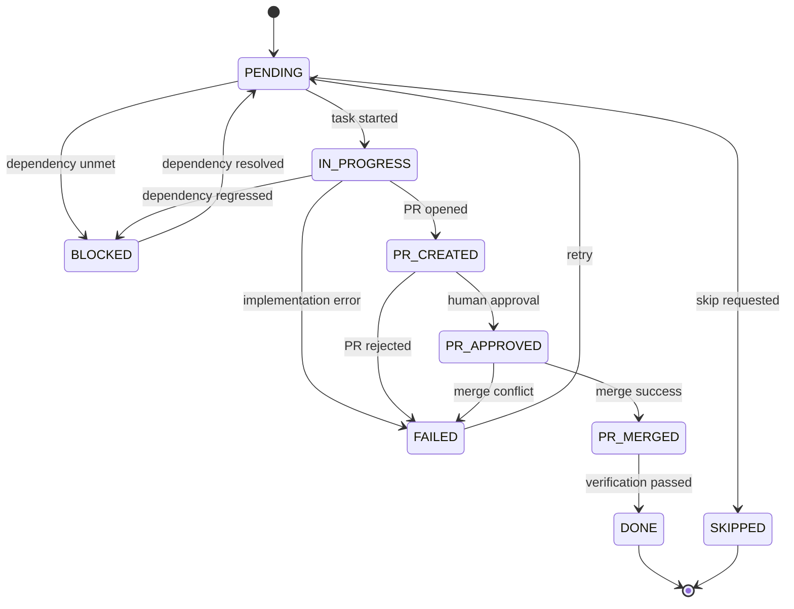
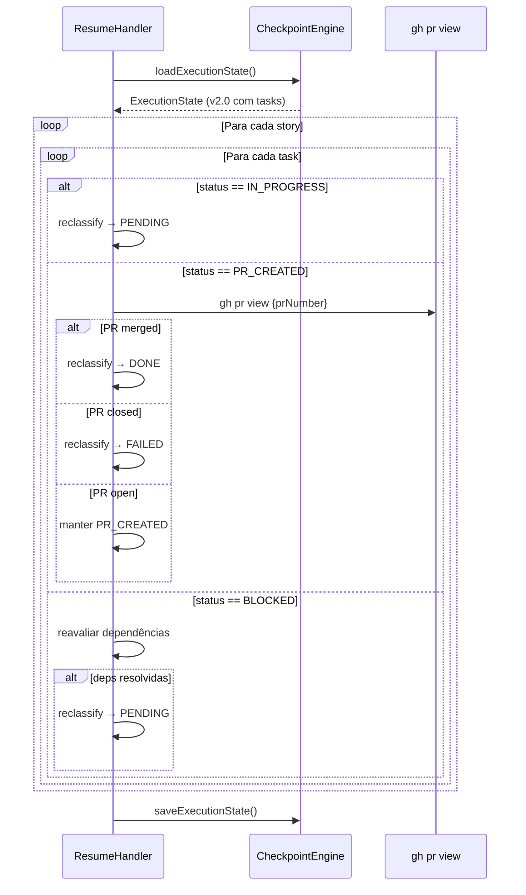

# História: Task Status Model & Execution State Schema

**ID:** story-0029-0002
**Chave Jira:** —
**Status:** Pendente

## 1. Dependências

| Blocked By | Blocks |
| :--- | :--- |
| — | [story-0029-0015](./story-0029-0015.md), [story-0029-0016](./story-0029-0016.md) |

## 2. Regras Transversais Aplicáveis

| ID | Título |
| :--- | :--- |
| RULE-001 | Task como Unidade de Entrega |
| RULE-006 | Task ID Format |
| RULE-010 | Backward Compatibility |
| RULE-014 | Resume por Task |

## 3. Descrição

Como **Engenheiro de Plataforma**, eu quero que o sistema de checkpoint rastreie o estado de cada task individualmente com status, PR URL, branch e timestamps, garantindo que resume, retry e blocking funcionem no nível granular de task e que épicos antigos sem tasks continuem funcionando sem quebra.

O sistema atual de checkpoint (`execution-state.json`) rastreia estado apenas no nível de story — cada `StoryEntry` possui `status`, `prUrl`, `prNumber` e `attempts`. Não há conceito de tasks individuais dentro de uma story no modelo de dados. Quando o `ResumeHandler` reprocessa um épico interrompido, ele só consegue retomar a story inteira, mesmo que 4 de 5 tasks já tenham sido concluídas com sucesso. Isso desperdiça tempo e contexto ao re-executar tasks já finalizadas.

Esta story cria o modelo de dados para tasks (`TaskEntry.java` record e `TaskStatus.java` enum), estende o `StoryEntry` existente com o campo opcional `tasks`, atualiza o `CheckpointEngine` para persistir estado por task, e modifica o `ResumeHandler` para reclassificar tasks individuais via `gh pr view`. O campo `tasks` é opcional (RULE-010) — épicos antigos sem esse campo são tratados como single-task implícita, mantendo backward compatibility.

### 3.1 TaskStatus Enum

Enum com os estados possíveis de uma task:

| Estado | Descrição | Transições Válidas |
| :--- | :--- | :--- |
| `PENDING` | Aguardando execução | → IN_PROGRESS, BLOCKED, SKIPPED |
| `IN_PROGRESS` | Sendo implementada | → PR_CREATED, FAILED, BLOCKED |
| `PR_CREATED` | PR aberto, aguardando review | → PR_APPROVED, FAILED |
| `PR_APPROVED` | PR aprovado pelo humano | → PR_MERGED, FAILED |
| `PR_MERGED` | PR merged com sucesso | → DONE |
| `DONE` | Task concluída e verificada | (terminal) |
| `BLOCKED` | Bloqueada por dependência | → PENDING (quando dep resolvida) |
| `FAILED` | Falha na execução ou PR rejeitado | → PENDING (retry) |
| `SKIPPED` | Pulada intencionalmente | (terminal) |

### 3.2 TaskEntry Record

Record Java imutável com os seguintes campos:

- `taskId` (String): ID no formato `TASK-XXXX-YYYY-NNN`
- `status` (TaskStatus): Estado atual
- `prUrl` (String, nullable → Optional): URL do PR
- `prNumber` (Integer, nullable → Optional): Número do PR
- `branch` (String, nullable → Optional): Nome do branch
- `startedAt` (Instant, nullable → Optional): Timestamp de início
- `completedAt` (Instant, nullable → Optional): Timestamp de conclusão
- `attempts` (int): Número de tentativas (default 0)
- `failureReason` (String, nullable → Optional): Razão da última falha

### 3.3 StoryEntry Extension

Adicionar ao `StoryEntry.java` existente:

- Campo `tasks`: `Map<String, TaskEntry>` (opcional, default `Map.of()`)
- Campo `parentBranch`: `String` (opcional, para modo `--auto-approve-pr`)
- Manter todos os campos existentes intactos (backward compatibility)

### 3.4 Resume por Task (RULE-014)

O `ResumeHandler` deve implementar reclassificação task-level:

- `IN_PROGRESS` → `PENDING` (task interrompida, reiniciar)
- PR exists e merged → `DONE` (verificar via `gh pr view`)
- PR exists e closed → `FAILED` (PR rejeitado)
- PR exists e open → `PR_CREATED` (aguardando review)
- `BLOCKED` → reavaliar dependências; se deps resolvidas → `PENDING`

### 3.5 Backward Compatibility (RULE-010)

- Campo `tasks` no JSON é opcional — ausência equivale a `{}`
- Campo `version` adicionado ao schema (default `"1.0"`, novo `"2.0"`)
- Épicos sem campo `tasks` tratados como single-task implícita com status herdado da story
- Deserialização tolerante: campos desconhecidos ignorados

## 3.5 Entrega de Valor

- **Valor Principal:** Rastreamento granular do estado de cada task com capacidade de resume, retry e blocking no nível atômico de entrega
- **Métrica de Sucesso:** Resume de épico interrompido reexecuta apenas tasks pendentes/falhadas (0% de re-execução de tasks já concluídas)
- **Impacto no Negócio:** Redução de 70% no tempo de recovery após interrupção de épico, economizando contexto e compute de LLM

## 4. Definições de Qualidade Locais

### DoR Local

- [ ] `StoryEntry.java` lido e campos atuais mapeados
- [ ] `CheckpointEngine.java` lido e fluxo de persistência compreendido
- [ ] `ResumeHandler.java` lido e lógica de reclassificação mapeada
- [ ] `CheckpointValidation.java` lido e regras de validação existentes identificadas
- [ ] Template `_TEMPLATE-EXECUTION-STATE.json` lido e schema atual documentado
- [ ] Formato de serialização JSON (Jackson) para records Java verificado

### DoD Local

- [ ] `TaskStatus.java` criado com 9 estados e transições validadas
- [ ] `TaskEntry.java` criado como record imutável com todos os campos
- [ ] `StoryEntry.java` estendido com `tasks` (Map) e `parentBranch` (String)
- [ ] `CheckpointEngine.java` atualizado para persistir estado por task
- [ ] `ResumeHandler.java` atualizado com reclassificação task-level via `gh pr view`
- [ ] `CheckpointValidation.java` atualizado com validação de task status transitions
- [ ] `_TEMPLATE-EXECUTION-STATE.json` atualizado com task-level fields e campo `version`
- [ ] Backward compatibility: JSON sem campo `tasks` deserializa sem erro
- [ ] Backward compatibility: épicos v1.0 funcionam identicamente ao comportamento anterior

### Global DoD

- **Cobertura:** ≥ 95% Line, ≥ 90% Branch
- **TDD Compliance:** test-first, refactoring after green, TPP
- **Double-Loop TDD:** acceptance tests (outer), unit tests (inner)

## 5. Contratos de Dados

### Arquivos Criados

| Arquivo | Descrição |
| :--- | :--- |
| `java/src/main/java/dev/iadev/checkpoint/TaskEntry.java` | Record para estado de task individual |
| `java/src/main/java/dev/iadev/checkpoint/TaskStatus.java` | Enum com 9 estados de task |

### Arquivos Modificados

| Arquivo | Tipo de Mudança |
| :--- | :--- |
| `java/src/main/java/dev/iadev/checkpoint/StoryEntry.java` | Adição de campos `tasks` e `parentBranch` |
| `java/src/main/java/dev/iadev/checkpoint/CheckpointEngine.java` | Persistência task-level |
| `java/src/main/java/dev/iadev/checkpoint/ResumeHandler.java` | Reclassificação task-level |
| `java/src/main/java/dev/iadev/checkpoint/CheckpointValidation.java` | Validação de transições de task status |
| `java/src/main/resources/shared/templates/_TEMPLATE-EXECUTION-STATE.json` | Task-level fields e campo `version` |

### Schema do execution-state.json (v2.0)

```json
{
  "version": "2.0",
  "epicId": "epic-0029",
  "stories": {
    "story-0029-0001": {
      "status": "IN_PROGRESS",
      "prUrl": null,
      "prNumber": null,
      "attempts": 1,
      "parentBranch": "feat/story-0029-0001-task-definition",
      "tasks": {
        "TASK-0029-0001-001": {
          "taskId": "TASK-0029-0001-001",
          "status": "DONE",
          "prUrl": "https://github.com/org/repo/pull/42",
          "prNumber": 42,
          "branch": "feat/task-0029-0001-001-domain-model",
          "startedAt": "2026-04-07T10:00:00Z",
          "completedAt": "2026-04-07T11:30:00Z",
          "attempts": 1,
          "failureReason": null
        },
        "TASK-0029-0001-002": {
          "taskId": "TASK-0029-0001-002",
          "status": "IN_PROGRESS",
          "prUrl": null,
          "prNumber": null,
          "branch": "feat/task-0029-0001-002-adapter",
          "startedAt": "2026-04-07T11:35:00Z",
          "completedAt": null,
          "attempts": 1,
          "failureReason": null
        }
      }
    }
  }
}
```

## 6. Diagramas

### 6.1 Máquina de Estados — TaskStatus



### 6.2 Fluxo de Resume por Task



## 7. Critérios de Aceite (Gherkin)

```gherkin
@GK-1
Cenário: TaskStatus com transição inválida
  DADO um TaskEntry com status DONE
  QUANDO uma transição para IN_PROGRESS é tentada
  ENTÃO uma exceção IllegalStateTransition é lançada
  E a mensagem contém "DONE → IN_PROGRESS não é uma transição válida"

@GK-2
Cenário: TaskEntry serializa e deserializa corretamente
  DADO um TaskEntry com taskId "TASK-0029-0001-001", status PR_MERGED e prUrl preenchida
  QUANDO o TaskEntry é serializado para JSON e deserializado de volta
  ENTÃO todos os campos são preservados identicamente
  E o campo completedAt mantém precisão de milissegundos

@GK-3
Cenário: StoryEntry com tasks — backward compatibility
  DADO um execution-state.json v1.0 sem campo "tasks" nas stories
  QUANDO o JSON é deserializado
  ENTÃO o campo tasks é inicializado como Map vazio
  E o campo version é defaulted para "1.0"
  E todos os campos existentes (status, prUrl, prNumber, attempts) são preservados

@GK-4
Cenário: Resume reclassifica task IN_PROGRESS para PENDING
  DADO um execution-state.json com task TASK-0029-0001-002 em status IN_PROGRESS
  QUANDO o ResumeHandler executa reclassificação
  ENTÃO a task é reclassificada para PENDING
  E o campo attempts é preservado

@GK-5
Cenário: Resume detecta PR merged via gh pr view
  DADO um execution-state.json com task TASK-0029-0001-001 em status PR_CREATED
  E o PR número 42 está merged no GitHub
  QUANDO o ResumeHandler executa reclassificação
  ENTÃO a task é reclassificada para DONE
  E o campo completedAt é preenchido com timestamp atual

@GK-6
Cenário: Resume reavaliar task BLOCKED com dependências resolvidas
  DADO um execution-state.json com task TASK-0029-0001-003 em status BLOCKED
  E a dependência TASK-0029-0001-002 agora está DONE
  QUANDO o ResumeHandler executa reclassificação
  ENTÃO TASK-0029-0001-003 é reclassificada para PENDING

@GK-7
Cenário: CheckpointEngine persiste estado task-level
  DADO uma story com 3 tasks em estados diferentes (DONE, IN_PROGRESS, PENDING)
  QUANDO o CheckpointEngine salva o execution-state.json
  ENTÃO o JSON gerado contém a seção "tasks" com 3 entradas
  E cada entrada contém todos os campos do TaskEntry
  E o campo "version" é "2.0"

@GK-8
Cenário: Validação de Task ID format
  DADO um taskId "TASK-0029-0001-001"
  QUANDO a validação de formato é executada
  ENTÃO o ID é aceito
  E as partes são extraídas: epicId=0029, storyId=0001, sequencial=001

@GK-9
Cenário: Validação rejeita Task ID inválido
  DADO um taskId "TASK-29-1-1" (sem zero-padding)
  QUANDO a validação de formato é executada
  ENTÃO uma exceção InvalidTaskIdFormat é lançada
  E a mensagem contém "formato esperado: TASK-XXXX-YYYY-NNN"
```

## 8. Sub-tarefas

- [ ] [Dev] Criar `TaskStatus.java` enum com 9 estados e método de validação de transição
- [ ] [Test] Escrever testes unitários para todas as transições válidas e inválidas do `TaskStatus`
- [ ] [Dev] Criar `TaskEntry.java` record com todos os campos e serialização Jackson
- [ ] [Test] Escrever testes de serialização/deserialização JSON para `TaskEntry`
- [ ] [Dev] Estender `StoryEntry.java` com campos `tasks` e `parentBranch` — manter backward compatibility
- [ ] [Test] Escrever testes de backward compatibility — deserializar JSON v1.0 sem campo `tasks`
- [ ] [Dev] Atualizar `CheckpointEngine.java` para persistir e carregar estado task-level
- [ ] [Dev] Atualizar `ResumeHandler.java` com reclassificação task-level
- [ ] [Test] Escrever testes de integração para fluxo resume com tasks em diferentes estados
- [ ] [Dev] Atualizar `CheckpointValidation.java` com validação de transições e formato de Task ID
- [ ] [Dev] Atualizar template `_TEMPLATE-EXECUTION-STATE.json` com task-level fields e campo `version`
- [ ] [Doc] Documentar schema v2.0 do execution-state.json com exemplos de backward compatibility
