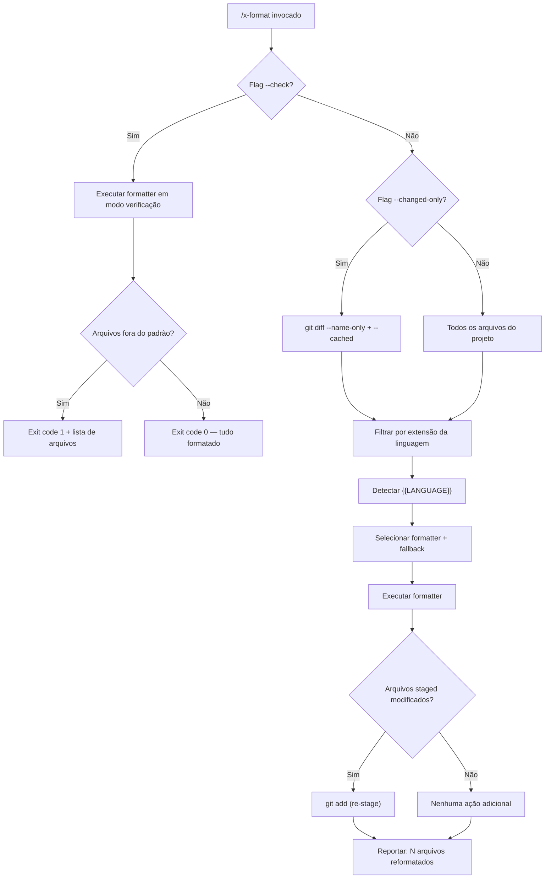

# História: x-format — Code Formatting Skill

**ID:** story-0029-0003
**Chave Jira:** —
**Status:** Pendente

## 1. Dependências

| Blocked By | Blocks |
| :--- | :--- |
| — | [story-0029-0005](./story-0029-0005.md) |

## 2. Regras Transversais Aplicáveis

| ID | Título |
| :--- | :--- |
| RULE-007 | Pre-Commit Chain |

## 3. Descrição

Como **Engenheiro de Plataforma**, eu quero uma skill `x-format` que detecte a linguagem do projeto via `{{LANGUAGE}}` e execute o formatter apropriado, garantindo que todo código gerado seja consistente em estilo antes de qualquer commit, eliminando variações de formatação como fonte de ruído em diffs e reviews.

O workflow atual não possui uma skill dedicada para formatação de código. Quando o `x-dev-lifecycle` ou `x-commit` precisam garantir formatação, dependem de instruções textuais no SKILL.md que pedem ao LLM para "rodar o formatter". Isso é frágil — o LLM pode esquecer, usar o comando errado, ou não re-stage arquivos modificados pelo formatter. Uma skill dedicada garante execução determinística da cadeia de formatação.

A skill `x-format` é o primeiro elo da cadeia pre-commit (RULE-007: format → lint → compile → commit). Ela detecta a linguagem do projeto usando a template variable `{{LANGUAGE}}`, seleciona o formatter correspondente, executa-o, e re-stage arquivos modificados automaticamente. Suporta modo `--check` (dry-run para CI) e `--changed-only` (formatar apenas arquivos modificados no working tree).

### 3.1 Detecção de Linguagem e Mapeamento de Formatters

| Linguagem | Formatter Primário | Fallback | Comando |
| :--- | :--- | :--- | :--- |
| Java | spotless (maven plugin) | google-java-format | `{{BUILD_TOOL}} spotless:apply` / `google-java-format --replace` |
| TypeScript | prettier | — | `npx prettier --write` |
| Python | ruff format | black | `ruff format` / `black` |
| Go | gofmt | — | `gofmt -w` |
| Rust | rustfmt | — | `cargo fmt` |
| Kotlin | ktfmt | — | `ktfmt --google-style` |

### 3.2 Flags Suportadas

- `--check`: Modo dry-run — verifica se arquivos estão formatados sem modificá-los. Exit code 0 = ok, 1 = precisa formatar. Útil para CI/CD.
- `--changed-only`: Formata apenas arquivos modificados (staged + unstaged) no working tree. Detecta via `git diff --name-only` e `git diff --cached --name-only`.
- Sem flags: Formata todo o projeto.

### 3.3 Re-stage Automático

Quando o formatter modifica arquivos que já estão staged:
1. Executar formatter nos arquivos alvo
2. Detectar quais arquivos staged foram modificados pelo formatter
3. Re-stage automaticamente (`git add`) os arquivos modificados
4. Reportar quantos arquivos foram reformatados e re-staged

### 3.4 Template Variables Utilizadas

- `{{LANGUAGE}}`: Linguagem principal do projeto (java, typescript, python, go, rust, kotlin)
- `{{BUILD_TOOL}}`: Ferramenta de build (maven, gradle, npm, pip, cargo, go)
- `{{FORMAT_COMMAND}}`: Comando de formatação (se configurado explicitamente no projeto)

### 3.5 Integração com Pre-Commit Chain (RULE-007)

A skill é invocada como primeiro passo da cadeia:
```
x-format → x-lint → compile → commit
```

Se `x-format` modifica arquivos, a cadeia continua com os arquivos reformatados. Se `--check` falha, a cadeia é interrompida com mensagem de erro.

## 3.5 Entrega de Valor

- **Valor Principal:** Código gerado consistente em estilo para todas as 6 linguagens suportadas, eliminando variações de formatação como fonte de ruído em diffs
- **Métrica de Sucesso:** 100% dos commits passam por formatação automática; zero diferenças de estilo em code reviews
- **Impacto no Negócio:** Redução de 30% no tempo de code review por eliminar comentários sobre formatação, permitindo foco em lógica e design

## 4. Definições de Qualidade Locais

### DoR Local

- [ ] Skills core existentes lidas para entender padrão de SKILL.md
- [ ] Template variables disponíveis mapeadas (`{{LANGUAGE}}`, `{{BUILD_TOOL}}`, `{{FORMAT_COMMAND}}`)
- [ ] Comandos de formatação validados para cada linguagem suportada
- [ ] Diretório `java/src/main/resources/targets/claude/skills/core/` verificado

### DoD Local

- [ ] Arquivo `SKILL.md` criado em `java/src/main/resources/targets/claude/skills/core/x-format/`
- [ ] SKILL.md usa template variables `{{LANGUAGE}}` e `{{BUILD_TOOL}}` para detecção de linguagem
- [ ] Flags `--check` e `--changed-only` documentadas e com comportamento especificado
- [ ] Re-stage automático de arquivos staged modificados pelo formatter
- [ ] Tabela de mapeamento linguagem → formatter com fallbacks
- [ ] Golden files regenerados para os 8 perfis
- [ ] Testes de integração byte-for-byte passando para todos os perfis
- [ ] Skill aparece no output gerado com nome e descrição corretos

### Global DoD

- **Cobertura:** ≥ 95% Line, ≥ 90% Branch
- **TDD Compliance:** test-first, refactoring after green, TPP
- **Double-Loop TDD:** acceptance tests (outer), unit tests (inner)

## 5. Contratos de Dados

### Arquivos Criados

| Arquivo | Descrição |
| :--- | :--- |
| `java/src/main/resources/targets/claude/skills/core/x-format/SKILL.md` | Skill de formatação de código com detecção de linguagem |

### Arquivos Potencialmente Modificados

| Arquivo | Tipo de Mudança |
| :--- | :--- |
| `java/src/main/java/dev/iadev/application/assembler/SkillsSelection.java` | Registro da nova skill (se necessário) |
| `java/src/main/java/dev/iadev/application/assembler/SkillGroupRegistry.java` | Grupo da skill (core) |
| Golden files dos 8 perfis | Regeneração com nova skill incluída |

### Estrutura do SKILL.md

```yaml
---
name: x-format
description: "Formata código-fonte usando o formatter apropriado para {{LANGUAGE}}. Primeiro passo da cadeia pre-commit (RULE-007)."
user-invocable: true
---
```

## 6. Diagramas

### 6.1 Fluxo de Execução do x-format



### 6.2 Posição na Pre-Commit Chain


## 7. Critérios de Aceite (Gherkin)

```gherkin
@GK-1
Cenário: Skill invocada sem argumentos em projeto vazio
  DADO um projeto sem arquivos de código-fonte
  QUANDO /x-format é invocado sem flags
  ENTÃO a skill reporta "Nenhum arquivo para formatar"
  E o exit code é 0

@GK-2
Cenário: Formatação de projeto Java com spotless
  DADO um projeto com {{LANGUAGE}} = "java" e {{BUILD_TOOL}} = "maven"
  QUANDO /x-format é invocado sem flags
  ENTÃO o comando executado é "mvn spotless:apply"
  E arquivos Java são formatados conforme google-java-format
  E o relatório indica quantos arquivos foram modificados

@GK-3
Cenário: Modo --check detecta arquivos fora do padrão
  DADO um projeto com {{LANGUAGE}} = "typescript"
  E um arquivo `src/index.ts` com indentação inconsistente
  QUANDO /x-format --check é invocado
  ENTÃO o exit code é 1
  E a saída lista "src/index.ts" como arquivo fora do padrão
  E nenhum arquivo é modificado

@GK-4
Cenário: --changed-only formata apenas arquivos modificados
  DADO um projeto com {{LANGUAGE}} = "python"
  E 2 arquivos modificados no working tree (staged + unstaged)
  E 50 arquivos não modificados
  QUANDO /x-format --changed-only é invocado
  ENTÃO apenas os 2 arquivos modificados são formatados
  E os 50 arquivos restantes não são tocados

@GK-5
Cenário: Re-stage automático de arquivos staged modificados pelo formatter
  DADO um projeto com {{LANGUAGE}} = "java"
  E um arquivo `Service.java` staged com formatação incorreta
  QUANDO /x-format é invocado
  ENTÃO o formatter corrige a formatação de `Service.java`
  E `Service.java` é automaticamente re-staged via git add
  E o relatório indica "1 arquivo reformatado e re-staged"

@GK-6
Cenário: Fallback quando formatter primário não disponível
  DADO um projeto com {{LANGUAGE}} = "python"
  E ruff não está instalado
  E black está instalado
  QUANDO /x-format é invocado
  ENTÃO o formatter black é utilizado como fallback
  E um aviso é emitido: "ruff não encontrado, usando black como fallback"

@GK-7
Cenário: Linguagem não suportada
  DADO um projeto com {{LANGUAGE}} = "cobol"
  QUANDO /x-format é invocado
  ENTÃO a skill reporta "Linguagem 'cobol' não suportada por x-format"
  E o exit code é 0 (não bloqueia a cadeia)

@GK-8
Cenário: Golden files gerados com skill x-format para perfil java-spring
  DADO o gerador configurado para o perfil java-spring
  QUANDO o gerador é executado
  ENTÃO o output contém `skills/core/x-format/SKILL.md`
  E o SKILL.md contém {{LANGUAGE}} resolvido para "java"
  E o teste byte-for-byte passa
```

## 8. Sub-tarefas

- [ ] [Dev] Criar `SKILL.md` em `java/src/main/resources/targets/claude/skills/core/x-format/` com frontmatter YAML, detecção de linguagem via `{{LANGUAGE}}`, tabela de formatters e fallbacks
- [ ] [Dev] Implementar seção de flags (`--check`, `--changed-only`) com comportamento documentado
- [ ] [Dev] Implementar seção de re-stage automático com detecção de arquivos staged modificados
- [ ] [Dev] Registrar skill no `SkillsSelection.java` e/ou `SkillGroupRegistry.java` (se necessário para inclusão no output)
- [ ] [Test] Escrever testes de integração byte-for-byte para os 8 perfis com skill x-format no output
- [ ] [Test] Verificar que template variables (`{{LANGUAGE}}`, `{{BUILD_TOOL}}`) são resolvidas corretamente por perfil
- [ ] [Doc] Incluir README.md da skill seguindo padrão das skills existentes
