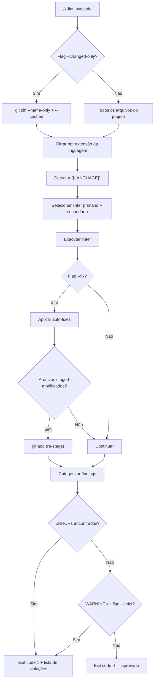

# História: x-lint — Code Linting Skill

**ID:** story-0029-0004
**Chave Jira:** —
**Status:** Pendente

## 1. Dependências

| Blocked By | Blocks |
| :--- | :--- |
| — | [story-0029-0005](./story-0029-0005.md) |

## 2. Regras Transversais Aplicáveis

| ID | Título |
| :--- | :--- |
| RULE-007 | Pre-Commit Chain |

## 3. Descrição

Como **Engenheiro de Plataforma**, eu quero uma skill `x-lint` que detecte a linguagem do projeto via `{{LANGUAGE}}` e execute o linter apropriado, garantindo que violações de qualidade de código sejam detectadas automaticamente antes de qualquer commit, impedindo que código com problemas estruturais, bugs potenciais ou violações de convenção entre no repositório.

O workflow atual depende de instruções textuais que pedem ao LLM para "rodar o linter". Isso é inconsistente — o LLM pode omitir o passo, usar flags incorretas, ou ignorar warnings. Uma skill dedicada para linting garante que a análise estática seja executada de forma determinística e padronizada para todas as linguagens suportadas.

A skill `x-lint` é o segundo elo da cadeia pre-commit (RULE-007: format → lint → compile → commit). Ela é invocada após `x-format` garantir que o código está formatado. O linter detecta problemas que vão além de estilo: bugs potenciais (null dereference, resource leaks), code smells (métodos longos, complexidade ciclomática), e violações de convenção (naming, imports). Suporta modo `--fix` (auto-corrigir quando possível) e `--changed-only` (analisar apenas arquivos modificados).

### 3.1 Detecção de Linguagem e Mapeamento de Linters

| Linguagem | Linter Primário | Linter Secundário | Comando |
| :--- | :--- | :--- | :--- |
| Java | checkstyle | spotbugs, pmd | `{{BUILD_TOOL}} checkstyle:check` / `spotbugs:check` / `pmd:check` |
| TypeScript | eslint | — | `npx eslint` |
| Python | ruff | pylint | `ruff check` / `pylint` |
| Go | golangci-lint | — | `golangci-lint run` |
| Rust | clippy | — | `cargo clippy` |
| Kotlin | ktlint | detekt | `ktlint` / `detekt` |

### 3.2 Flags Suportadas

- `--fix`: Modo auto-correção — aplica fixes automáticos quando o linter suporta. Re-stage arquivos corrigidos automaticamente.
- `--changed-only`: Analisa apenas arquivos modificados (staged + unstaged) no working tree. Detecta via `git diff --name-only` e `git diff --cached --name-only`.
- `--strict`: Trata warnings como errors. Exit code 1 se houver warnings.
- Sem flags: Analisa todo o projeto, reporta errors e warnings.

### 3.3 Categorização de Findings

Resultados do linter categorizados em:

| Severidade | Comportamento | Exemplo |
| :--- | :--- | :--- |
| ERROR | Bloqueia commit, cadeia interrompida | Null dereference, resource leak |
| WARNING | Reporta mas não bloqueia (exceto com `--strict`) | Método > 25 linhas, complexidade alta |
| INFO | Apenas informativo | Sugestão de refactoring |

### 3.4 Template Variables Utilizadas

- `{{LANGUAGE}}`: Linguagem principal do projeto
- `{{BUILD_TOOL}}`: Ferramenta de build
- `{{LINT_COMMAND}}`: Comando de linting (se configurado explicitamente no projeto)

### 3.5 Integração com Pre-Commit Chain (RULE-007)

A skill é invocada como segundo passo da cadeia:
```
x-format → x-lint → compile → commit
```

Se `x-lint` encontra ERRORs, a cadeia é interrompida com lista de violações. Se `--fix` corrige arquivos, os arquivos são re-staged e a cadeia continua.

## 3.5 Entrega de Valor

- **Valor Principal:** Detecção automática de violações de qualidade de código antes do commit para todas as 6 linguagens suportadas, prevenindo bugs e code smells no repositório
- **Métrica de Sucesso:** 100% dos commits passam por análise estática; zero bugs potenciais (null dereference, resource leak) escapam para code review
- **Impacto no Negócio:** Redução de 40% em bugs encontrados em code review por detecção antecipada via linter, acelerando o ciclo de entrega

## 4. Definições de Qualidade Locais

### DoR Local

- [ ] Skills core existentes lidas para entender padrão de SKILL.md
- [ ] Template variables disponíveis mapeadas (`{{LANGUAGE}}`, `{{BUILD_TOOL}}`, `{{LINT_COMMAND}}`)
- [ ] Comandos de linting validados para cada linguagem suportada
- [ ] Skill `x-format` (story-0029-0003) compreendida para garantir consistência de padrão

### DoD Local

- [ ] Arquivo `SKILL.md` criado em `java/src/main/resources/targets/claude/skills/core/x-lint/`
- [ ] SKILL.md usa template variables `{{LANGUAGE}}` e `{{BUILD_TOOL}}` para detecção de linguagem
- [ ] Flags `--fix`, `--changed-only` e `--strict` documentadas e com comportamento especificado
- [ ] Tabela de mapeamento linguagem → linter com linters secundários
- [ ] Categorização de findings (ERROR, WARNING, INFO) com comportamento definido
- [ ] Re-stage automático de arquivos corrigidos via `--fix`
- [ ] Golden files regenerados para os 8 perfis
- [ ] Testes de integração byte-for-byte passando para todos os perfis
- [ ] Skill aparece no output gerado com nome e descrição corretos

### Global DoD

- **Cobertura:** ≥ 95% Line, ≥ 90% Branch
- **TDD Compliance:** test-first, refactoring after green, TPP
- **Double-Loop TDD:** acceptance tests (outer), unit tests (inner)

## 5. Contratos de Dados

### Arquivos Criados

| Arquivo | Descrição |
| :--- | :--- |
| `java/src/main/resources/targets/claude/skills/core/x-lint/SKILL.md` | Skill de linting de código com detecção de linguagem |

### Arquivos Potencialmente Modificados

| Arquivo | Tipo de Mudança |
| :--- | :--- |
| `java/src/main/java/dev/iadev/application/assembler/SkillsSelection.java` | Registro da nova skill (se necessário) |
| `java/src/main/java/dev/iadev/application/assembler/SkillGroupRegistry.java` | Grupo da skill (core) |
| Golden files dos 8 perfis | Regeneração com nova skill incluída |

### Estrutura do SKILL.md

```yaml
---
name: x-lint
description: "Analisa código-fonte com o linter apropriado para {{LANGUAGE}}. Segundo passo da cadeia pre-commit (RULE-007)."
user-invocable: true
---
```

## 6. Diagramas

### 6.1 Fluxo de Execução do x-lint



### 6.2 Posição na Pre-Commit Chain


## 7. Critérios de Aceite (Gherkin)

```gherkin
@GK-1
Cenário: Skill invocada sem argumentos em projeto sem código
  DADO um projeto sem arquivos de código-fonte
  QUANDO /x-lint é invocado sem flags
  ENTÃO a skill reporta "Nenhum arquivo para analisar"
  E o exit code é 0

@GK-2
Cenário: Linting de projeto Java com checkstyle
  DADO um projeto com {{LANGUAGE}} = "java" e {{BUILD_TOOL}} = "maven"
  QUANDO /x-lint é invocado sem flags
  ENTÃO o comando executado é "mvn checkstyle:check"
  E violações encontradas são categorizadas em ERROR, WARNING e INFO
  E o relatório lista cada violação com arquivo, linha e descrição

@GK-3
Cenário: Modo --fix aplica correções automáticas
  DADO um projeto com {{LANGUAGE}} = "typescript"
  E 3 arquivos com violações auto-corrigíveis (unused imports)
  QUANDO /x-lint --fix é invocado
  ENTÃO as violações são corrigidas automaticamente
  E os 3 arquivos são re-staged via git add
  E o relatório indica "3 arquivos corrigidos e re-staged"

@GK-4
Cenário: ERROR bloqueia a cadeia pre-commit
  DADO um projeto com {{LANGUAGE}} = "python"
  E um arquivo com null dereference detectado por ruff
  QUANDO /x-lint é invocado
  ENTÃO o finding é categorizado como ERROR
  E o exit code é 1
  E a mensagem contém o arquivo, linha e descrição da violação

@GK-5
Cenário: WARNING não bloqueia sem --strict
  DADO um projeto com {{LANGUAGE}} = "go"
  E um arquivo com complexidade ciclomática alta (WARNING)
  QUANDO /x-lint é invocado sem --strict
  ENTÃO o exit code é 0
  E o WARNING é reportado mas não bloqueia

@GK-6
Cenário: --strict trata warnings como errors
  DADO um projeto com {{LANGUAGE}} = "go"
  E um arquivo com complexidade ciclomática alta (WARNING)
  QUANDO /x-lint --strict é invocado
  ENTÃO o exit code é 1
  E o WARNING é tratado como ERROR

@GK-7
Cenário: --changed-only analisa apenas arquivos modificados
  DADO um projeto com {{LANGUAGE}} = "rust"
  E 2 arquivos modificados no working tree
  E 100 arquivos não modificados
  QUANDO /x-lint --changed-only é invocado
  ENTÃO apenas os 2 arquivos modificados são analisados
  E os 100 arquivos restantes não são verificados

@GK-8
Cenário: Linter secundário executado após primário
  DADO um projeto com {{LANGUAGE}} = "java" e {{BUILD_TOOL}} = "maven"
  QUANDO /x-lint é invocado
  ENTÃO checkstyle é executado como linter primário
  E spotbugs é executado como linter secundário
  E os resultados de ambos são consolidados no relatório

@GK-9
Cenário: Golden files gerados com skill x-lint para perfil python-fastapi
  DADO o gerador configurado para o perfil python-fastapi
  QUANDO o gerador é executado
  ENTÃO o output contém `skills/core/x-lint/SKILL.md`
  E o SKILL.md contém {{LANGUAGE}} resolvido para "python"
  E o teste byte-for-byte passa
```

## 8. Sub-tarefas

- [ ] [Dev] Criar `SKILL.md` em `java/src/main/resources/targets/claude/skills/core/x-lint/` com frontmatter YAML, detecção de linguagem via `{{LANGUAGE}}`, tabela de linters primários e secundários
- [ ] [Dev] Implementar seção de flags (`--fix`, `--changed-only`, `--strict`) com comportamento documentado
- [ ] [Dev] Implementar seção de categorização de findings (ERROR, WARNING, INFO) com regras de bloqueio
- [ ] [Dev] Implementar seção de re-stage automático para modo `--fix`
- [ ] [Dev] Registrar skill no `SkillsSelection.java` e/ou `SkillGroupRegistry.java` (se necessário para inclusão no output)
- [ ] [Test] Escrever testes de integração byte-for-byte para os 8 perfis com skill x-lint no output
- [ ] [Test] Verificar que template variables (`{{LANGUAGE}}`, `{{BUILD_TOOL}}`) são resolvidas corretamente por perfil
- [ ] [Doc] Incluir README.md da skill seguindo padrão das skills existentes
