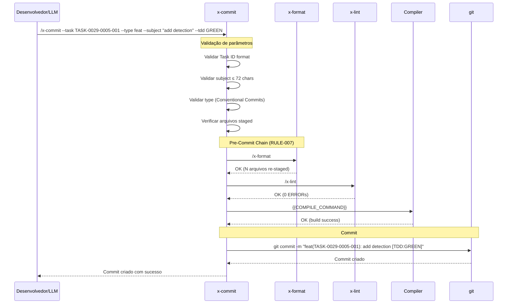
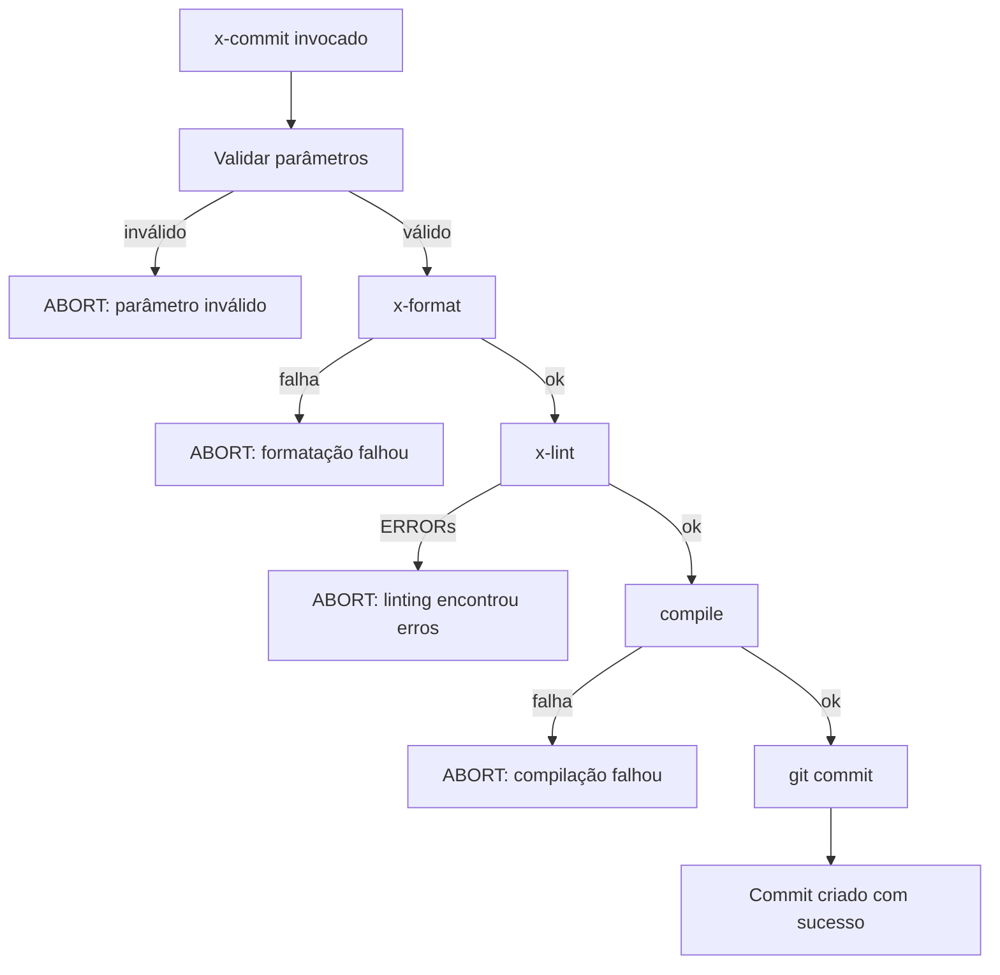

# História: x-commit — Conventional Commit Skill

**ID:** story-0029-0005
**Chave Jira:** —
**Status:** Pendente

## 1. Dependências

| Blocked By | Blocks |
| :--- | :--- |
| [story-0029-0003](./story-0029-0003.md), [story-0029-0004](./story-0029-0004.md) | [story-0029-0008](./story-0029-0008.md), [story-0029-0009](./story-0029-0009.md), [story-0029-0015](./story-0029-0015.md), [story-0029-0017](./story-0029-0017.md) |

## 2. Regras Transversais Aplicáveis

| ID | Título |
| :--- | :--- |
| RULE-007 | Pre-Commit Chain |
| RULE-008 | TDD Strict |
| RULE-016 | Conventional Commits com Task ID |

## 3. Descrição

Como **Engenheiro de Plataforma**, eu quero uma skill `x-commit` que crie commits padronizados com task ID no scope, execute a cadeia pre-commit completa (format → lint → compile) e adicione TDD tags ao subject, garantindo que cada commit seja rastreável à sua task, passe por todas as verificações de qualidade e documente explicitamente o estágio do ciclo TDD.

O workflow atual depende do `x-git-push` para commits, mas este não conhece o conceito de tasks, não executa a cadeia pre-commit automaticamente e não adiciona TDD tags. Commits são criados com scopes genéricos como `feat(auth)` em vez de `feat(TASK-0029-0001-001)`, impossibilitando rastreamento automático de quais commits pertencem a qual task. Além disso, a cadeia format → lint → compile não é executada de forma determinística antes de cada commit.

A skill `x-commit` orquestra a cadeia pre-commit completa (RULE-007) — invoca `x-format`, depois `x-lint`, depois compila, e só então cria o commit com formato Conventional Commits incluindo o task ID no scope (RULE-016) e TDD tag no subject (RULE-008). Se qualquer etapa da cadeia falhar, o commit é abortado com mensagem descritiva. A skill é o ponto central de criação de commits em todo o workflow task-centric.

### 3.1 Formato do Commit (RULE-016)

```
<type>(<TASK-XXXX-YYYY-NNN>): <subject> [TDD:TAG]

[body opcional]

[footer opcional]
```

| Campo | Regra | Exemplo |
| :--- | :--- | :--- |
| type | Conventional Commits (feat, fix, test, refactor, docs, chore, perf) | `feat` |
| scope | Task ID obrigatório no formato `TASK-XXXX-YYYY-NNN` | `TASK-0029-0005-001` |
| subject | ≤ 72 caracteres, imperativo, sem ponto final | `add formatter detection logic` |
| TDD tag | Obrigatório quando em ciclo TDD (RULE-008) | `[TDD:RED]` |

### 3.2 TDD Tags (RULE-008)

| Tag | Significado | Quando Usar |
| :--- | :--- | :--- |
| `[TDD]` | Ciclo TDD genérico | Quando tipo específico não se aplica |
| `[TDD:RED]` | Teste falha — test escrito, implementação pendente | Após escrever teste que falha |
| `[TDD:GREEN]` | Teste passa — implementação mínima feita | Após fazer teste passar |
| `[TDD:REFACTOR]` | Refactoring — sem mudança de comportamento | Após refatorar sem mudar testes |

### 3.3 Pre-Commit Chain (RULE-007)

A cadeia é executada sequencialmente antes de cada commit:

1. **x-format**: Formata código → re-stage arquivos modificados
2. **x-lint**: Analisa código → se ERRORs, aborta
3. **compile**: Executa `{{COMPILE_COMMAND}}` → se falha, aborta
4. **commit**: Cria commit com formato padronizado

Se `x-format` modifica arquivos staged, eles são re-staged automaticamente antes de prosseguir para `x-lint`. Se qualquer etapa falha, o commit é abortado e a mensagem de erro inclui qual etapa falhou e o output do comando.

### 3.4 Parâmetros da Skill

| Parâmetro | Obrigatório | Descrição |
| :--- | :--- | :--- |
| `--task` | Sim | Task ID no formato TASK-XXXX-YYYY-NNN |
| `--type` | Sim | Tipo do commit (feat, fix, test, refactor, docs, chore, perf) |
| `--subject` | Sim | Subject do commit (≤ 72 chars, imperativo) |
| `--tdd` | Não | TDD tag (RED, GREEN, REFACTOR, ou genérico TDD) |
| `--body` | Não | Body do commit (multi-linha) |
| `--skip-chain` | Não | Pula pre-commit chain (uso emergencial, emite WARNING) |
| `--amend` | Não | Amenda o último commit em vez de criar novo |

### 3.5 Validações

- Task ID deve seguir formato `TASK-XXXX-YYYY-NNN` (RULE-006)
- Subject deve ter ≤ 72 caracteres
- Subject deve estar no modo imperativo (detectar padrões: "adds" → "add", "fixed" → "fix")
- Type deve ser um dos tipos válidos de Conventional Commits
- TDD tag deve ser uma das tags válidas quando fornecida
- Working tree deve ter arquivos staged (senão, aviso e abort)

### 3.6 Template Variables Utilizadas

- `{{COMPILE_COMMAND}}`: Comando de compilação do projeto (e.g., `mvn compile`, `npm run build`)
- `{{LANGUAGE}}`: Passada para `x-format` e `x-lint`
- `{{BUILD_TOOL}}`: Passada para `x-format` e `x-lint`

## 3.5 Entrega de Valor

- **Valor Principal:** Commits padronizados com task ID no scope, rastreabilidade completa entre commit e task, e qualidade garantida pela cadeia pre-commit automática
- **Métrica de Sucesso:** 100% dos commits seguem formato Conventional Commits com Task ID; zero commits sem passar por format + lint + compile
- **Impacto no Negócio:** Rastreabilidade automática commit-to-task para changelog, auditorias e debugging; redução de commits quebrados por verificação pré-commit obrigatória

## 4. Definições de Qualidade Locais

### DoR Local

- [ ] Skills `x-format` (story-0029-0003) e `x-lint` (story-0029-0004) concluídas e disponíveis
- [ ] Formato de commit com Task ID aprovado no épico (RULE-016)
- [ ] TDD tags definidas e aprovadas no épico (RULE-008)
- [ ] Template variables `{{COMPILE_COMMAND}}` mapeada para cada perfil

### DoD Local

- [ ] Arquivo `SKILL.md` criado em `java/src/main/resources/targets/claude/skills/core/x-commit/`
- [ ] Formato de commit documentado com Task ID no scope e TDD tag no subject
- [ ] Pre-commit chain orquestrada: x-format → x-lint → compile → commit
- [ ] Validações de Task ID format, subject length, imperative mood e type implementadas
- [ ] Flag `--skip-chain` documentada com WARNING obrigatório
- [ ] Flag `--amend` documentada com comportamento especificado
- [ ] Template variables `{{COMPILE_COMMAND}}`, `{{LANGUAGE}}`, `{{BUILD_TOOL}}` utilizadas
- [ ] Golden files regenerados para os 8 perfis
- [ ] Testes de integração byte-for-byte passando para todos os perfis

### Global DoD

- **Cobertura:** ≥ 95% Line, ≥ 90% Branch
- **TDD Compliance:** test-first, refactoring after green, TPP
- **Double-Loop TDD:** acceptance tests (outer), unit tests (inner)

## 5. Contratos de Dados

### Arquivos Criados

| Arquivo | Descrição |
| :--- | :--- |
| `java/src/main/resources/targets/claude/skills/core/x-commit/SKILL.md` | Skill de commit com task ID, TDD tags e pre-commit chain |

### Arquivos Potencialmente Modificados

| Arquivo | Tipo de Mudança |
| :--- | :--- |
| `java/src/main/java/dev/iadev/application/assembler/SkillsSelection.java` | Registro da nova skill (se necessário) |
| `java/src/main/java/dev/iadev/application/assembler/SkillGroupRegistry.java` | Grupo da skill (core) |
| Golden files dos 8 perfis | Regeneração com nova skill incluída |

### Estrutura do SKILL.md

```yaml
---
name: x-commit
description: "Cria commits Conventional Commits com Task ID no scope e pre-commit chain (format → lint → compile). Ponto central de commits no workflow task-centric."
user-invocable: true
---
```

### Formato de Output do Commit

```
feat(TASK-0029-0005-001): add formatter detection logic [TDD:GREEN]

Implements language detection via {{LANGUAGE}} template variable.
Maps each language to its primary formatter with fallback support.

Refs: story-0029-0003
```

## 6. Diagramas

### 6.1 Fluxo da Pre-Commit Chain



### 6.2 Fluxo de Erro na Cadeia



## 7. Critérios de Aceite (Gherkin)

```gherkin
@GK-1
Cenário: Commit sem arquivos staged
  DADO um working tree sem arquivos staged
  QUANDO /x-commit --task TASK-0029-0005-001 --type feat --subject "add logic" é invocado
  ENTÃO a skill aborta com mensagem "Nenhum arquivo staged para commit"
  E nenhum commit é criado

@GK-2
Cenário: Commit com task ID e TDD tag
  DADO arquivos staged no working tree
  E pre-commit chain passa (format ok, lint ok, compile ok)
  QUANDO /x-commit --task TASK-0029-0005-001 --type feat --subject "add detection logic" --tdd GREEN é invocado
  ENTÃO o commit é criado com mensagem "feat(TASK-0029-0005-001): add detection logic [TDD:GREEN]"
  E o commit está no git log

@GK-3
Cenário: Task ID com formato inválido
  DADO arquivos staged no working tree
  QUANDO /x-commit --task "TASK-29-5-1" --type feat --subject "add logic" é invocado
  ENTÃO a skill aborta com mensagem "Task ID inválido — formato esperado: TASK-XXXX-YYYY-NNN"
  E nenhum commit é criado

@GK-4
Cenário: Subject excede 72 caracteres
  DADO arquivos staged no working tree
  QUANDO /x-commit --task TASK-0029-0005-001 --type feat --subject "this is a very long subject that exceeds the seventy-two character limit imposed by conventional commits" é invocado
  ENTÃO a skill aborta com mensagem "Subject excede 72 caracteres (got: 103)"
  E nenhum commit é criado

@GK-5
Cenário: Pre-commit chain falha no lint
  DADO arquivos staged com violação de linting (ERROR)
  QUANDO /x-commit --task TASK-0029-0005-001 --type feat --subject "add logic" é invocado
  ENTÃO x-format executa com sucesso
  E x-lint detecta ERRORs e retorna exit code 1
  E a skill aborta com mensagem "Pre-commit chain falhou no passo 'x-lint'"
  E nenhum commit é criado

@GK-6
Cenário: Pre-commit chain falha na compilação
  DADO arquivos staged com erro de compilação
  QUANDO /x-commit --task TASK-0029-0005-001 --type fix --subject "fix null check" é invocado
  ENTÃO x-format e x-lint passam
  E compile falha com erro
  E a skill aborta com mensagem "Pre-commit chain falhou no passo 'compile'"
  E nenhum commit é criado

@GK-7
Cenário: --skip-chain pula pre-commit mas emite WARNING
  DADO arquivos staged no working tree
  QUANDO /x-commit --task TASK-0029-0005-001 --type chore --subject "update config" --skip-chain é invocado
  ENTÃO um WARNING é emitido: "Pre-commit chain ignorada — uso emergencial"
  E o commit é criado sem executar format, lint ou compile

@GK-8
Cenário: x-format re-stage arquivos antes de x-lint
  DADO um arquivo `Service.java` staged com formatação incorreta
  QUANDO /x-commit --task TASK-0029-0005-001 --type feat --subject "add service" é invocado
  ENTÃO x-format corrige a formatação e re-stage o arquivo
  E x-lint analisa o arquivo já reformatado
  E compile verifica o código formatado
  E o commit inclui o arquivo com formatação correta

@GK-9
Cenário: Commit sem TDD tag quando não em ciclo TDD
  DADO arquivos staged no working tree
  E pre-commit chain passa
  QUANDO /x-commit --task TASK-0029-0005-001 --type docs --subject "update README" é invocado sem flag --tdd
  ENTÃO o commit é criado com mensagem "docs(TASK-0029-0005-001): update README"
  E nenhuma TDD tag é incluída no subject

@GK-10
Cenário: Golden files gerados com skill x-commit para perfil kotlin-ktor
  DADO o gerador configurado para o perfil kotlin-ktor
  QUANDO o gerador é executado
  ENTÃO o output contém `skills/core/x-commit/SKILL.md`
  E o SKILL.md contém referências a x-format e x-lint
  E o SKILL.md contém {{COMPILE_COMMAND}} como template variable
  E o teste byte-for-byte passa
```

## 8. Sub-tarefas

- [ ] [Dev] Criar `SKILL.md` em `java/src/main/resources/targets/claude/skills/core/x-commit/` com frontmatter YAML e formato de commit documentado
- [ ] [Dev] Implementar seção de pre-commit chain com orquestração sequencial (x-format → x-lint → compile → commit)
- [ ] [Dev] Implementar seção de formato de commit com Task ID no scope e TDD tags no subject
- [ ] [Dev] Implementar seção de validações (Task ID format, subject length, imperative mood, type)
- [ ] [Dev] Implementar flags (`--task`, `--type`, `--subject`, `--tdd`, `--body`, `--skip-chain`, `--amend`)
- [ ] [Dev] Registrar skill no `SkillsSelection.java` e/ou `SkillGroupRegistry.java` (se necessário para inclusão no output)
- [ ] [Test] Escrever testes de integração byte-for-byte para os 8 perfis com skill x-commit no output
- [ ] [Test] Verificar que template variables (`{{COMPILE_COMMAND}}`, `{{LANGUAGE}}`, `{{BUILD_TOOL}}`) são resolvidas corretamente por perfil
- [ ] [Doc] Incluir README.md da skill seguindo padrão das skills existentes
