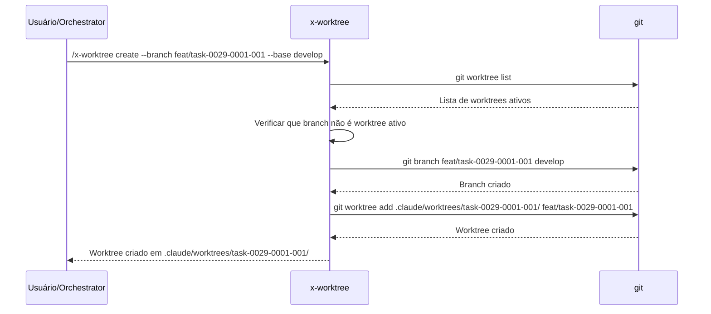
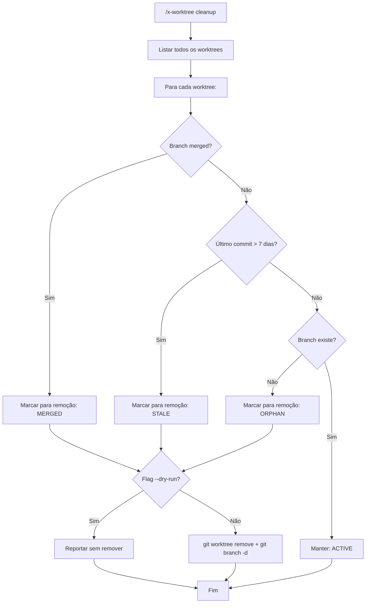
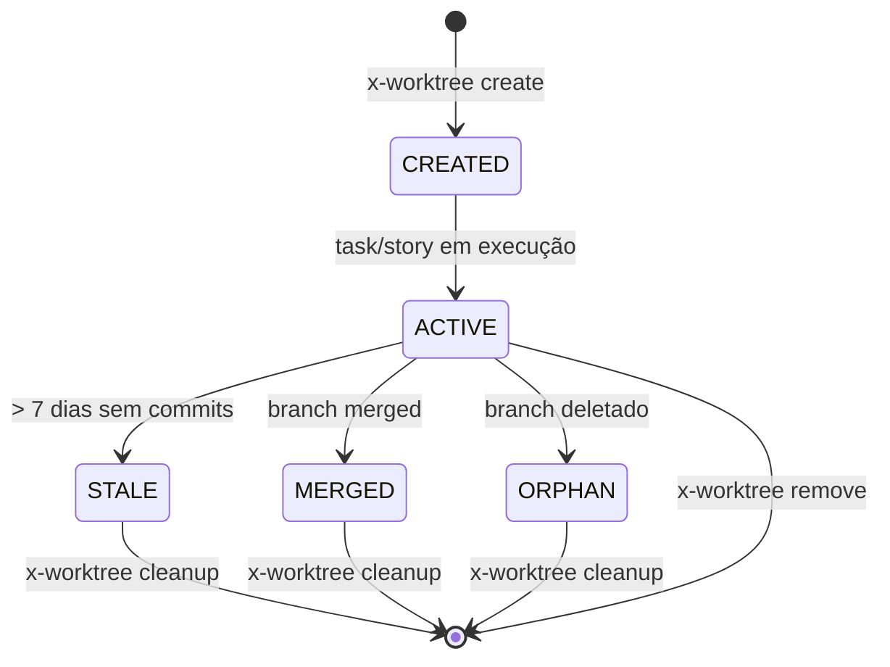

# História: x-worktree — Git Worktree Management Skill

**ID:** story-0029-0006
**Chave Jira:** —
**Status:** Pendente

## 1. Dependências

| Blocked By | Blocks |
| :--- | :--- |
| — | [story-0029-0016](./story-0029-0016.md) |

## 2. Regras Transversais Aplicáveis

| ID | Título |
| :--- | :--- |
| RULE-005 | Git Flow Compliance |
| RULE-018 | Worktree Lifecycle |

## 3. Descrição

Como **Engenheiro de Plataforma**, eu quero uma skill `x-worktree` que gerencie git worktrees para execução paralela de tasks e stories, garantindo que múltiplas tasks/stories possam ser implementadas simultaneamente em diretórios isolados sem conflitos de working tree, com cleanup automático de worktrees obsoletos.

O sistema atual (`x-dev-epic-implement`) suporta execução paralela de stories em worktrees, mas o gerenciamento é ad-hoc — worktrees são criados inline no SKILL.md do orchestrador sem uma skill dedicada. Isso causa duplicação de lógica de criação/cleanup entre `x-dev-epic-implement` e `x-dev-lifecycle`, inconsistência no naming de diretórios, e ausência de cleanup automático de worktrees órfãos (branches já merged mas diretórios ainda existentes).

A skill `x-worktree` centraliza todas as operações de worktree em um único ponto: criar, listar, remover e cleanup. Segue o padrão de naming `.claude/worktrees/{identifier}/` (RULE-018) e implementa cleanup automático baseado em três critérios: branch merged, inatividade > 7 dias, ou branch inexistente no remote. A skill é invocada pelo `x-dev-epic-implement` e `x-dev-lifecycle` em vez de gerenciar worktrees diretamente.

### 3.1 Operações Suportadas

| Operação | Comando | Descrição |
| :--- | :--- | :--- |
| `create` | `/x-worktree create --branch <name> [--base <base>]` | Cria worktree em `.claude/worktrees/{identifier}/` |
| `list` | `/x-worktree list` | Lista todos os worktrees ativos com status |
| `remove` | `/x-worktree remove --id <identifier>` | Remove worktree específico e limpa referências |
| `cleanup` | `/x-worktree cleanup [--dry-run]` | Remove worktrees obsoletos (merged/inativo/órfão) |

### 3.2 Naming Convention (RULE-018)

Worktrees são criados em `.claude/worktrees/` com naming baseado no contexto:

| Contexto | Naming Pattern | Exemplo |
| :--- | :--- | :--- |
| Task | `.claude/worktrees/task-XXXX-YYYY-NNN/` | `.claude/worktrees/task-0029-0001-001/` |
| Story | `.claude/worktrees/story-XXXX-YYYY/` | `.claude/worktrees/story-0029-0001/` |
| Custom | `.claude/worktrees/{identifier}/` | `.claude/worktrees/hotfix-auth/` |

### 3.3 Operação: create

Parâmetros:
- `--branch <name>`: Nome do branch para o worktree (obrigatório)
- `--base <base>`: Branch base para criar o novo branch (default: `develop`)
- `--id <identifier>`: Identificador do worktree (default: derivado do branch name)

Comportamento:
1. Validar que o branch não existe como worktree ativo
2. Criar branch a partir de `--base` (se não existe)
3. Executar `git worktree add .claude/worktrees/{identifier}/ {branch}`
4. Verificar que o worktree foi criado com sucesso
5. Retornar o path absoluto do worktree

### 3.4 Operação: list

Output em formato tabular:

```
| ID                    | Branch                              | Status   | Last Commit       | Age    |
| :---                  | :---                                | :---     | :---              | :---   |
| task-0029-0001-001    | feat/task-0029-0001-001-domain      | ACTIVE   | 2026-04-07 10:30  | 2h     |
| story-0029-0002       | feat/story-0029-0002-task-model     | ACTIVE   | 2026-04-07 08:00  | 4h30m  |
| task-0029-0003-002    | feat/task-0029-0003-002-lint        | STALE    | 2026-03-31 15:00  | 7d+    |
```

### 3.5 Operação: cleanup (RULE-018)

Critérios de cleanup automático:

| Critério | Condição | Ação |
| :--- | :--- | :--- |
| Branch merged | Branch do worktree já foi merged para target | Remover worktree + deletar branch local |
| Inatividade | Último commit no branch > 7 dias | Remover worktree (preservar branch) |
| Branch inexistente | Branch referenciado não existe no local nem remote | Remover worktree |

Flag `--dry-run`: Lista worktrees que seriam removidos sem executar a remoção.

### 3.6 Integração com Git Flow (RULE-005)

- Worktrees para tasks criam branches a partir de `develop` (modo manual) ou parent branch (modo `--auto-approve-pr`)
- Worktrees para hotfix criam branches a partir de `main`
- Após merge, worktrees são candidatos a cleanup automático
- Branch protection: nunca criar worktree diretamente em `main` ou `develop`

## 3.5 Entrega de Valor

- **Valor Principal:** Execução paralela de tasks e stories em worktrees isolados, eliminando conflitos de working tree e permitindo paralelismo real no workflow de desenvolvimento
- **Métrica de Sucesso:** Suporte a N worktrees paralelos sem conflitos; cleanup automático remove 100% dos worktrees obsoletos
- **Impacto no Negócio:** Redução de 50% no tempo total de execução de épicos por permitir implementação paralela de stories independentes

## 4. Definições de Qualidade Locais

### DoR Local

- [ ] Skills existentes que usam worktrees lidas (`x-dev-epic-implement`, `x-dev-lifecycle`)
- [ ] Comando `git worktree` e suas opções compreendidos
- [ ] Padrão de naming `.claude/worktrees/` aprovado no épico (RULE-018)
- [ ] Critérios de cleanup (merged, 7 dias, órfão) aprovados

### DoD Local

- [ ] Arquivo `SKILL.md` criado em `java/src/main/resources/targets/claude/skills/core/x-worktree/`
- [ ] Operações create, list, remove e cleanup documentadas com parâmetros e comportamento
- [ ] Naming convention documentada para task, story e custom contexts
- [ ] Critérios de cleanup automático documentados (merged, inatividade > 7 dias, branch inexistente)
- [ ] Flag `--dry-run` para cleanup documentada
- [ ] Integração com Git Flow (RULE-005) — branches criados a partir de `develop` ou parent
- [ ] Golden files regenerados para os 8 perfis
- [ ] Testes de integração byte-for-byte passando para todos os perfis
- [ ] Skill aparece no output gerado com nome e descrição corretos

### Global DoD

- **Cobertura:** ≥ 95% Line, ≥ 90% Branch
- **TDD Compliance:** test-first, refactoring after green, TPP
- **Double-Loop TDD:** acceptance tests (outer), unit tests (inner)

## 5. Contratos de Dados

### Arquivos Criados

| Arquivo | Descrição |
| :--- | :--- |
| `java/src/main/resources/targets/claude/skills/core/x-worktree/SKILL.md` | Skill de gerenciamento de git worktrees |

### Arquivos Potencialmente Modificados

| Arquivo | Tipo de Mudança |
| :--- | :--- |
| `java/src/main/java/dev/iadev/application/assembler/SkillsSelection.java` | Registro da nova skill (se necessário) |
| `java/src/main/java/dev/iadev/application/assembler/SkillGroupRegistry.java` | Grupo da skill (core) |
| Golden files dos 8 perfis | Regeneração com nova skill incluída |

### Estrutura do SKILL.md

```yaml
---
name: x-worktree
description: "Gerencia git worktrees para execução paralela de tasks e stories. Operações: create, list, remove, cleanup. Segue RULE-018 (Worktree Lifecycle)."
user-invocable: true
---
```

### Estrutura de Diretórios

```
.claude/
└── worktrees/
    ├── task-0029-0001-001/    # Worktree para task individual
    │   ├── .git               # Arquivo de referência ao repositório principal
    │   └── <project files>    # Cópia do projeto no branch da task
    ├── story-0029-0002/       # Worktree para story inteira
    │   └── ...
    └── hotfix-auth/           # Worktree custom
        └── ...
```

## 6. Diagramas

### 6.1 Fluxo de Operação: create



### 6.2 Fluxo de Operação: cleanup



### 6.3 Ciclo de Vida do Worktree



## 7. Critérios de Aceite (Gherkin)

```gherkin
@GK-1
Cenário: Criar worktree sem parâmetros obrigatórios
  DADO um repositório git válido
  QUANDO /x-worktree create é invocado sem --branch
  ENTÃO a skill aborta com mensagem "Parâmetro --branch é obrigatório"
  E nenhum worktree é criado

@GK-2
Cenário: Criar worktree para task com base em develop
  DADO um repositório git com branch develop
  QUANDO /x-worktree create --branch feat/task-0029-0001-001-domain --base develop é invocado
  ENTÃO o branch feat/task-0029-0001-001-domain é criado a partir de develop
  E o worktree é criado em .claude/worktrees/task-0029-0001-001-domain/
  E o path absoluto do worktree é retornado

@GK-3
Cenário: Criar worktree com branch já existente como worktree
  DADO um worktree ativo para branch feat/task-0029-0001-001-domain
  QUANDO /x-worktree create --branch feat/task-0029-0001-001-domain é invocado
  ENTÃO a skill aborta com mensagem "Branch já é um worktree ativo"
  E nenhum worktree adicional é criado

@GK-4
Cenário: Listar worktrees ativos com status
  DADO 3 worktrees ativos (1 ACTIVE, 1 STALE, 1 MERGED)
  QUANDO /x-worktree list é invocado
  ENTÃO a saída contém tabela com 3 entradas
  E cada entrada contém ID, Branch, Status, Last Commit e Age
  E o worktree com > 7 dias é marcado como STALE
  E o worktree com branch merged é marcado como MERGED

@GK-5
Cenário: Remover worktree específico
  DADO um worktree ativo com ID task-0029-0001-001
  QUANDO /x-worktree remove --id task-0029-0001-001 é invocado
  ENTÃO o diretório .claude/worktrees/task-0029-0001-001/ é removido
  E git worktree remove é executado com sucesso
  E o worktree não aparece mais na lista

@GK-6
Cenário: Cleanup com --dry-run lista sem remover
  DADO 2 worktrees obsoletos (1 MERGED, 1 STALE)
  E 1 worktree ativo
  QUANDO /x-worktree cleanup --dry-run é invocado
  ENTÃO a saída lista 2 worktrees que seriam removidos com razão (MERGED, STALE)
  E nenhum worktree é efetivamente removido
  E o worktree ativo não é listado

@GK-7
Cenário: Cleanup remove worktrees obsoletos
  DADO 1 worktree com branch merged (MERGED)
  E 1 worktree com > 7 dias sem commits (STALE)
  E 1 worktree com branch inexistente (ORPHAN)
  QUANDO /x-worktree cleanup é invocado sem --dry-run
  ENTÃO os 3 worktrees são removidos
  E git worktree remove é executado para cada um
  E branches locais de worktrees MERGED são deletados
  E o relatório indica "3 worktrees removidos (1 MERGED, 1 STALE, 1 ORPHAN)"

@GK-8
Cenário: Proteção contra criação em main ou develop
  DADO um repositório git com branches main e develop
  QUANDO /x-worktree create --branch main é invocado
  ENTÃO a skill aborta com mensagem "Não é permitido criar worktree em branch protegido (main, develop)"
  E nenhum worktree é criado

@GK-9
Cenário: Naming automático derivado do branch
  DADO um repositório git válido
  QUANDO /x-worktree create --branch feat/task-0029-0003-002-lint-rules é invocado sem --id
  ENTÃO o ID é derivado automaticamente: "task-0029-0003-002-lint-rules"
  E o worktree é criado em .claude/worktrees/task-0029-0003-002-lint-rules/

@GK-10
Cenário: Golden files gerados com skill x-worktree para perfil rust-axum
  DADO o gerador configurado para o perfil rust-axum
  QUANDO o gerador é executado
  ENTÃO o output contém `skills/core/x-worktree/SKILL.md`
  E o teste byte-for-byte passa
```

## 8. Sub-tarefas

- [ ] [Dev] Criar `SKILL.md` em `java/src/main/resources/targets/claude/skills/core/x-worktree/` com frontmatter YAML, operações (create, list, remove, cleanup) e naming convention
- [ ] [Dev] Implementar seção de operação create com validação de branch, criação de worktree e retorno de path
- [ ] [Dev] Implementar seção de operação list com output tabular e detecção de status (ACTIVE, STALE, MERGED, ORPHAN)
- [ ] [Dev] Implementar seção de operação remove com remoção de diretório e referências git
- [ ] [Dev] Implementar seção de operação cleanup com 3 critérios (merged, inatividade > 7 dias, branch inexistente) e flag `--dry-run`
- [ ] [Dev] Implementar proteção contra branches protegidos (main, develop)
- [ ] [Dev] Registrar skill no `SkillsSelection.java` e/ou `SkillGroupRegistry.java` (se necessário para inclusão no output)
- [ ] [Test] Escrever testes de integração byte-for-byte para os 8 perfis com skill x-worktree no output
- [ ] [Doc] Incluir README.md da skill seguindo padrão das skills existentes
